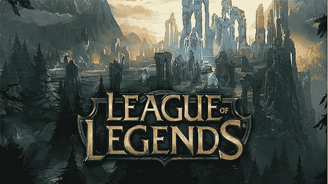
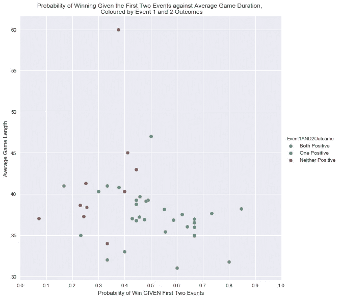
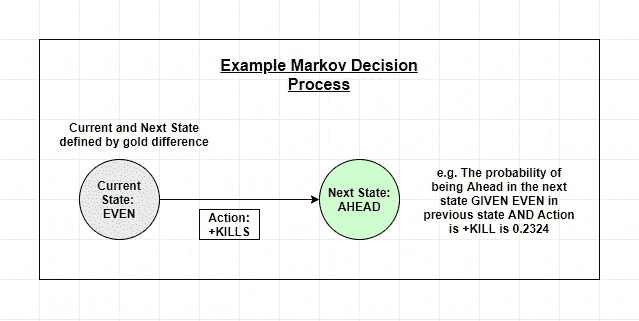
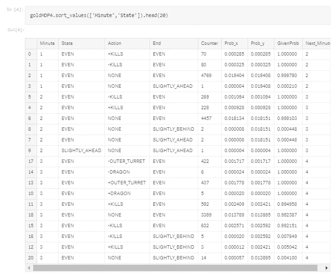
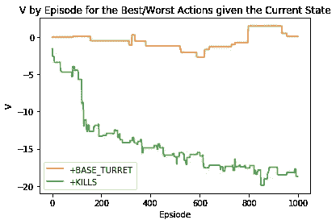
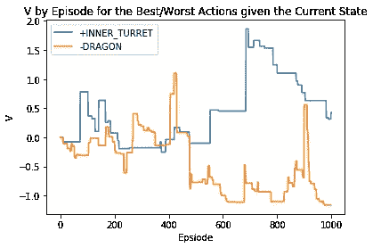
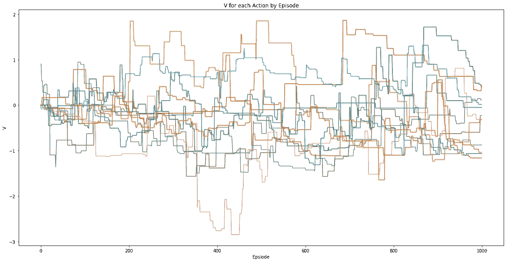
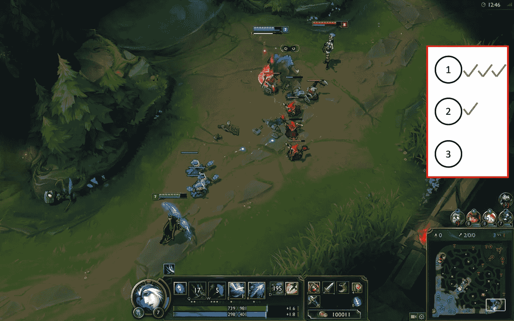

# 视频游戏中的人工智能:使用马尔可夫链、真实比赛统计和个人偏好改进英雄联盟中的决策

> 原文：<https://towardsdatascience.com/ai-in-video-games-improving-decision-making-in-league-of-legends-using-real-match-statistics-and-29ebc149b0d0?source=collection_archive---------7----------------------->

[Source](https://www.gameskinny.com/h84y3/5-pieces-of-league-of-legends-lore-that-will-change-how-you-see-your-favorite-champions)

## 这个由三部分组成的项目旨在将英雄联盟比赛建模为马尔可夫决策过程，然后应用强化学习来找到最佳决策，该决策还考虑了玩家的偏好，并超越了简单的“得分板”统计。

我在 Kaggle 上提供了每个部分，以便更好地理解数据是如何处理的，模型是如何编码的。我已经包括了前两个部分，以使我关于如何模拟环境的最终决定背后的推理更加清晰。

第一部分:[https://www . ka ggle . com/osbornep/lol-ai-model-part-1-initial-EDA-and-first-MDP](https://www.kaggle.com/osbornep/lol-ai-model-part-1-initial-eda-and-first-mdp)

第二部分:[https://www . ka ggle . com/osbornep/lol-ai-model-part-2-redesign-MDP-with-gold-diff](https://www.kaggle.com/osbornep/lol-ai-model-part-2-redesign-mdp-with-gold-diff)

第三部分:[https://www . ka ggle . com/osbornep/lol-ai-model-part-3-final-output](https://www.kaggle.com/osbornep/lol-ai-model-part-3-final-output)

这在很大程度上是一项正在进行的工作，其目的只是为了介绍一个概念，即如果在游戏中引入更复杂的机器学习方法，而不仅仅是简单的汇总统计数据，可以实现什么，如下图所示。

Source: [https://www.unrankedsmurfs.com/blog/odds-winning-league-legends](https://www.unrankedsmurfs.com/blog/odds-winning-league-legends)

# 动机和目标

英雄联盟是一个面向团队的视频游戏，其中两个团队(每个团队有 5 名球员)为目标和杀戮而竞争。获得优势使玩家变得比对手更强大(获得更好的物品和升级更快)，随着优势的增加，赢得游戏的可能性也增加。因此，我们有一系列依赖于先前事件的事件，导致一个团队摧毁另一个团队的基础并赢得比赛。

像这样被统计建模的序列并不新鲜；多年来，研究人员一直在考虑如何在体育运动中应用这一点，例如篮球([https://arxiv.org/pdf/1507.01816.pdf](https://arxiv.org/pdf/1507.01816.pdf))，在篮球比赛中，一系列的传球、运球和犯规导致一个队得分或失分。这种研究的目的是提供比简单的盒子分数(篮球或视频游戏中玩家获得的分数或得分)更详细的见解，并考虑当被建模为时间上相关的一系列事件时，团队如何表现。

以这种方式模拟事件在像英雄联盟这样的游戏中更为重要，因为通过目标和杀戮来获得物品和等级优势。例如，玩家在游戏中第一次杀死敌人就可以获得金币，金币可以用来购买更强大的物品。有了这个物品，他们就足够强大，可以获得更多的杀戮，直到他们可以带领他们的队伍取得胜利。像这样促进领先通常被称为“滚雪球”,因为玩家会逐渐获得优势，但游戏通常不是单方面的，对象和团队合作更重要。

## 这个项目的目的很简单；我们是否可以根据游戏中之前发生的情况计算下一个最佳事件，以便根据真实的比赛统计数据增加最终获胜的可能性？

然而，有许多因素导致玩家在游戏中做出决策，这些因素不容易衡量。无论收集了多少数据，玩家能够捕捉的信息量都是计算机无法探测到的(至少目前是这样！).例如，玩家可能在这个游戏中表现过度或不足，或者可能只是对他们玩的方式有偏好(通常由他们玩的角色类型来定义)。一些球员自然会更有侵略性，寻找杀戮，而另一些球员会被动地比赛，争取进球。因此，我们进一步开发了我们的模型，允许玩家根据自己的喜好调整推荐的玩法。

# 是什么让我们的模型成为‘人工智能’？

在第一部分，我们进行了一些介绍性的统计分析。例如，我们能够计算出球队在比赛中获得第一个和第二个进球的获胜概率，如下图所示。

make 有两个组件将我们的项目从简单的统计带入人工智能:

*   首先，模型在没有预先设想游戏概念的情况下学习哪些动作是最好的
*   其次，它试图学习玩家对影响模型输出的决策的偏好。

我们如何定义我们的马尔可夫决策过程并收集玩家的偏好将定义我们的模型学习什么并因此输出什么。

# 从匹配统计中预处理和创建马尔可夫决策过程

# 人工智能模型二:引入黄金差价

然后，我从我们第一次模型尝试的结果中意识到，我们没有考虑消极和积极事件对以后状态的可能性的累积影响。换句话说，无论你在那个时间点领先还是落后，当前的 MDP 概率发生的可能性是一样的。在游戏中，这根本不是真的；如果你落后了，那么杀戮，建筑和其他目标就很难获得，我们需要考虑到这一点。因此，我们在团队之间引入了 gold difference，以此来重新定义我们的状态。我们现在的目标是有一个 MDP 来定义状态，不仅是事件发生的顺序，而且是团队是否落后，甚至领先金牌。我们将黄金差价分为以下几类:

*   偶数:0–999 金币差异(每位玩家平均 0–200 金币。)
*   略微落后/领先:1，000–2，499 金的差距(每位玩家平均 200–500。)
*   落后/领先:2，500–4，999 金币差额(每位玩家平均 500–1，000 金币。)
*   非常落后/领先:5000 金差(每个玩家平均 1000+。)

我们现在还认为没有感兴趣的事件，并将其包括为“无”事件，以便每分钟至少有一个事件。这个“无”事件代表一个团队是否决定尝试拖延游戏，并帮助区分更擅长在早期游戏中获得金牌领先的团队，而不需要杀死或目标(通过杀死小兵)。然而，这样做也极大地扩展了我们的数据，因为我们现在已经添加了 7 个类别来适应可用的匹配，但是如果我们可以访问更多的正常匹配，数据量就足够了。如前所述，我们可以通过以下方式概述每个步骤:

## 预处理

1.  导入杀死，建筑，怪物和黄金差异的数据。
2.  将“地址”转换为 id 特征。
3.  删除所有与老龙的游戏。
4.  从金牌差异数据开始，按事件的分钟数、比赛 id 和像以前一样制造事件的队来聚集这些数据
5.  将杀死、怪物和建筑的数据附加(堆叠)到这个的末尾，为每个事件创建一行，并按事件发生的时间排序(平均。用于杀戮)。
6.  添加“事件编号”功能，显示每场比赛中事件的顺序。
7.  为行中的每个事件创建一个合并的“事件”特征，包括杀戮、建筑、怪物或“无”。
8.  将此转换为每场比赛一行，列现在表示每个事件。
9.  只考虑红队的观点，所以合并列，蓝色收益变成红色负收益。也为红队增加游戏长度和结果。
10.  用比赛的比赛结果替换所有空白值(即，在前面步骤中结束的比赛),这样所有行中的最后一个事件就是比赛结果。
11.  转换成 MDP，其中我们有 P( X_t | X_t-1)用于所有事件类型，在每个事件号和由 gold difference 定义的状态之间。

Markov Decision Process Output

## 用简单英语编写的 v6 型伪代码

我们模型的最终版本可以简单地总结如下:

1.  引入参数
2.  初始化开始状态、开始事件和开始行动
3.  根据首次提供的或随机出现的可能性选择行动，如 MDP 定义
4.  当行动达到赢/输时，结束剧集
5.  跟踪事件中采取的行动和最终结果(赢/输)
6.  使用更新规则根据最终结果更新所采取措施的值
7.  重复 x 集

# 引入带奖励的偏好

首先，我们调整模型代码，在回报计算中包含奖励。然后，当我们运行模型时，我们现在引入了对某些行为的偏好，而不是简单的奖励等于零。

在我们的第一个例子中，我们展示了如果我们给一个行为以积极的权重会发生什么，然后在第二个例子中，如果我们给一个行为以消极的权重会发生什么。

Output if we provide a strong POSITIVE reward for action: ‘+KILLS’

Output if we provide a strong NEGATIVE reward for action: ‘+KILLS’

# 更真实的玩家偏好

因此，让我们尝试近似模拟玩家的实际偏好。在这种情况下，我随机选择了一些奖励，以遵循两条规则:

1.  玩家不想放弃任何目标
2.  玩家优先考虑获得目标而不是杀死目标

因此，我们对杀死和丢失物品的奖励都是-0.05 的最小值，而其他的行为是随机的，在-0.05 到 0.05 之间。

Output with randomised player rewards

Output with randomised player rewards for all actions

Final output showing the value of each action given our current gold difference state and minute

# 结论和收集玩家反馈以获得奖励

我极大地简化了一些特征(比如‘杀死’并不代表实际的杀死数量),数据很可能不代表正常的比赛。然而，我希望这清楚地展示了一个有趣的概念，并鼓励讨论如何进一步发展这一概念。

首先，我将列出在实现之前需要进行的主要改进:

1.  使用更多代表整个玩家群体的数据来计算 MDP，而不仅仅是竞技比赛。
2.  提高模型的效率，使其能够在更合理的时间内进行计算。蒙特卡洛是众所周知的耗时，所以将探索更多的时间效率算法。
3.  应用更高级的参数优化来进一步改善结果。
4.  原型玩家反馈捕捉和映射，以获得更真实的奖励信号。

我们引入了对影响模型输出的奖励，但这是如何获得的呢？我们可以考虑几种方式，但根据我之前的研究，我认为最好的方式是考虑一种既考虑行动的个人质量又考虑转变质量的奖励。

这变得越来越复杂，我不会在这里介绍，但简而言之，我们希望匹配玩家的决策，其中最佳的下一个决策取决于刚刚发生的事情。例如，如果团队杀死了敌方团队的所有球员，那么他们可能会推动获得男爵。我们的模型已经考虑了事件按顺序发生的概率，所以我们也应该以同样的方式考虑玩家的决策。这个想法来自下面的研究，该研究解释了如何更详细地映射反馈([https://www . research gate . net/publication/259624959 _ DJ-MC _ A _ Reinforcement-Learning _ Agent _ for _ Music _ Playlist _ Recommendation](https://www.researchgate.net/publication/259624959_DJ-MC_A_Reinforcement-Learning_Agent_for_Music_Playlist_Recommendation))。

我们收集反馈的方式决定了我们的模型会有多成功。在我看来，这样做的最终目的是为玩家提供下一个最佳决策的实时建议。然后，玩家将能够从给定的比赛统计数据中选择前几个决定(按照成功的顺序排列)。可以在多个游戏中跟踪该玩家的选择，以进一步了解和理解该玩家的偏好。这也意味着，我们不仅可以跟踪决策的结果，还可以知道玩家试图实现的目标(例如，试图拿下塔，但却被杀了)，并为更高级的分析提供信息。

当然，像这样的想法可能会导致复杂的队友不同意，也许会使游戏变得令人兴奋。但是我认为类似这样的事情可以极大地有益于低技能水平或普通技能水平的玩家，因为玩家之间的决策很难清楚地交流。它还可以帮助识别因其行为而“有毒”的球员，因为球队将通过投票系统同意比赛，然后可以看到有毒球员是否一直通过他们的动作忽视他们的队友，而不是遵循商定的计划。

Example of Model recommendation voting system in real game setting