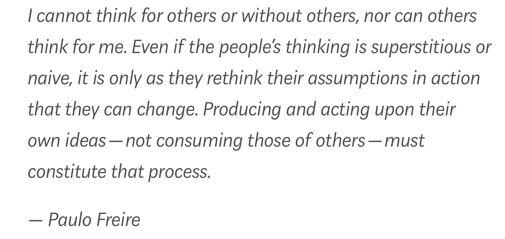
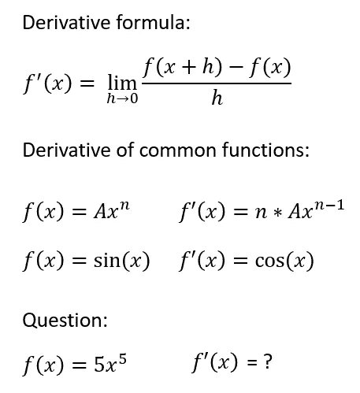
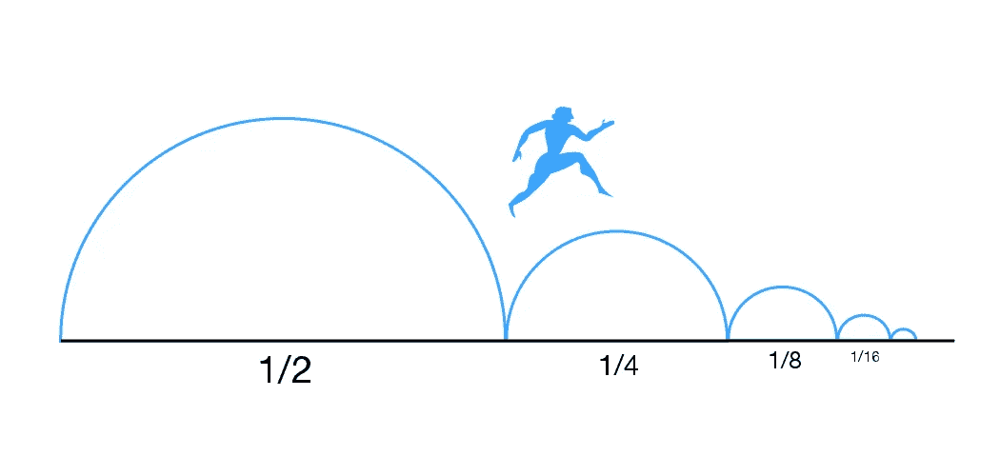

# 人工智能对人类智能的洞察

> 原文：<https://towardsdatascience.com/ai-insights-for-human-intelligence-5ce4d10d431?source=collection_archive---------6----------------------->

自从图灵设想思维机器以来，人工智能(AI)和人类智能之间的比较一直是一场激烈的辩论。

*   机器有可能像人类一样思考吗？
*   我们离智能机器占领世界还有多远？
*   人工神经网络是受大脑启发的吗？

在所有这些问题和其他问题中，重点是塑造人工智能的未来。但是我们为什么不考虑通过研究 AI 来提高人类的智力呢？我能感觉到你的怀疑，不要担心和忍耐我，这不是一个关于基因组编辑升级大脑的帖子。

人类的智力不仅仅与大脑有关，教育也是我们智力的重要组成部分，我们可以通过更好的教育来提高人类的智力。但似乎我们在训练机器方面比训练人类更成功。

对此可能有许多可能的解释。人工智能是一个数学概念，大多数时候我们可以制定一个性能指标来定义更好，而教育有经济，社会，政治和宗教成分，更好的定义变得主观。此外，在人工智能中，我们可以更自由地进行实验，以找出哪种学习方法最有效。另一方面，有许多限制(资金、时间等。)到教育领域的实验。最后，还有基准数据集，帮助世界各地的人们比较他们的机器学习方法。对于教育来说，这种普遍的比较是很难实现的。

这些挑战并不意味着我们没有希望。阿西莫夫曾经说过，“现在生活中最可悲的一面是，科学积累知识的速度快于社会积累智慧的速度。”为了改变，让我们使用我们的人工智能知识来提高人类的智能。

Components of intelligence. Can’t we improve human intelligence by using the lessons learned from AI? We cannot change the architecture but we can improve the training.

## 基于规则的方法与自学方法

人工智能有两种方法:一个基于规则的系统，其中您对算法要遵循的所有规则进行硬编码，以及一种自学方法(即机器学习)，其中您向算法显示数据，它自己学习模式、关系和转换。对于机器学习在感知任务方面优于基于规则的算法这一事实，人们有着一致的共识。换句话说，我们更喜欢展示，而不是讲述。

然而，这不是我们在人类教育方面所做的。我们讲述，口述，强加所谓的真理，而不是展示数据让学生学习自己的真理。这阻碍了学生对概念的内化。对于有限的一组问题，如重复性任务，这可能就足够了。然而，为了处理新的问题，人们需要灵活自如地融合各种想法。这只能通过理解概念的本质来实现，而不是通过记忆。

> 学生不是被要求去了解，而是被要求去记住老师所讲述的内容。
> 
> —保罗·弗莱雷

正如我们在机器学习中所做的那样，我们应该依靠人类的自我学习，换句话说，自我教育。学校应该创造一个能够激励自我教育的环境。

> …我坚信，自我教育是唯一的教育方式。学校的唯一作用是让自我教育更容易；如果做不到这一点，它什么也做不了。
> 
> —艾萨克·阿西莫夫

## 如何激发自学？

即使我们同意自我学习是前进的方向，我们如何执行它呢？人工智能研究人员已经投入了巨大的努力来研究机器学习，我们有大量的知识可以研究。

对于许多机器学习任务，我们使用一种称为梯度下降的优化算法。这其实就是机器学习的方式。理解它的基础是非常容易的。它是一种迭代算法；它一步一步地接近解决方案。它从做一个预测开始，我们给它一个反馈，告诉它离事实有多远，然后它做一个新的稍微改进的预测。这个序列一直持续下去，直到我们对预测和事实之间的差异感到满意。换句话说，学习是一个积极的一步一步的过程，算法在每一步都重新思考它的假设，并进一步改进。

Am I high from reading too much AI or does this look a lot like gradient descent?

如你所见，梯度下降可以帮助我们理解如何进行自我学习。我们还可以通过研究测试阶段来学习一些经验。

每个从事 ML 工作的人都知道，你用一个数据集(称为训练数据)训练算法，并使用不同的数据集进行测试(称为测试数据)，以便确保算法不是记忆(过度拟合)，而是实际学习。当然，训练数据和测试数据必须来自同一个分布。你不能既教数学又指望历史问题有好答案。

例如，如果你正在创建一个猫分类器，你通过展示猫 Garfield、Hello Kitty、Tigger…的图片来训练算法，并用不同的猫来测试算法:Felix、Cosmo、Figaro…如果算法可以说 Felix 是一只猫，它就已经学会了什么是真正的猫。如果算法说加菲猫是一只猫，它可能已经学会了什么是猫性，但也有可能它只是记住了加菲猫=猫的事实。所以，这个领域的每一个从业者都同意，我们不应该用训练数据来做测试。你认为这是人类学习的情况吗？

说到教育我们的孩子，更多的时候，我们用一套特定的问题来训练和测试他们。然而，生活中的问题并没有预先定义的、僵化的结构。它们不断进化。一个人只能通过内化概念而不是记忆来处理它们。因此，我们应该向学生提出开放式的问题，让他们面对不确定性，让他们自己去思考和探索。

## 可选例子:导数怎么教？

具体来说，让我们比较一下用于教授[导数](https://en.wikipedia.org/wiki/Derivative)的基于规则的方法和自学方法。请随意跳过这一部分。这里的目的是告诉你如何刺激衍生品的自学，而不是教授衍生品。

传统上讲导数是通过介绍导数公式，展示几个常见函数的导数来讲授的。然后，学生通过解决一些问题来记忆公式。这就像基于规则的人工智能方法，你硬编码算法应该遵循的规则。

The traditional way to teach derivatives. Just like rule-based approach to AI where you hard code the rules that the algorithm should follow.

让我们看看另一种方法，即自学法。就像我们在机器学习中所做的一样，这里的目标将是创造一个刺激自我学习的环境。我们不会规定任何事情，学生将自己学习。

瞬间的变化是衍生品的本质，但变化是随着时间发生的，而瞬间只是一瞬间。人们应该自己感受这种矛盾，才能抓住导数的思想。如何才能实现这一点？

你可以用[芝诺的一个悖论](https://en.wikipedia.org/wiki/Zeno%27s_paradoxes)来展开讨论:“假设你希望到达离你 1 米远的一面墙。为了达到这个目的，你首先需要走一半的路，到达中间(1/2 米)。剩下的距离也是如此。要走完剩下的 1/2 米，你首先需要到达中间点(1/4 米)。如此周而复始，你和墙之间总会有一个极小的距离。你可以靠近那堵墙，但你永远也够不着——或者你可以在无限远处够着那堵墙。在现实生活中，我们知道我们实际上可以到达墙，让我们讨论一下这里发生了什么……”

One of Zeno’s paradoxes

希望这次讨论将引导他们掌握无穷小和无穷的概念，或者至少引发对它们的感受。如果没有，你迭代直到他们做，就像我们在梯度下降。有了这种理解，我们可以要求学生谈论瞬时速度:

“平均速度是特定时间间隔内的位移。但是如何测量瞬时速度呢？瞬间意味着时间间隔为零，如果时间不流动，你就无法移动。似乎瞬时速度应该是 0/0 =未定义。对此你怎么看？”

还是那句话，经过一些迭代(5 个历元应该够了:)，他们大概会得出这样的结论:随着时间间隔趋近于零，平均速度趋近于瞬时速度，就像我们在芝诺悖论中趋近于墙一样。这实际上就是导数(位移对时间的导数就是速度)，他们在试图寻找一些问题的答案时，也达到了这一点。我们甚至可以从这个理解得出上面的等式。我并不是建议在教育中忽略这些等式，而是学生应该理解这些等式背后的动机。

我不是教授人类衍生品的专家，因此我试图给出一个衍生品自学方法的粗略大纲。这里重要的是方法，而不是衍生品。你可以把这个概念应用于任何学科。例如，要教摄影，你应该引导学生去好的网站、书籍等，而不是提供好照片的规则。让他们看到并形成自己对摄影的理解。同时，你可以为他们组织展览，分享他们的照片，并通过建设性的讨论不断改进。

如果你对学习衍生品感兴趣，请观看格兰特·桑德森的视频。这是正确教学的最好例子。在某个时候，他问了一些问题，并说“停下来思考一下”。这才是重点，一个人需要停下来反思，才能真正学到东西。

他还说，“如果感觉奇怪和矛盾，很好！你正在与微积分之父所面临的同样的冲突搏斗……”从某种意义上说，他在帮助你成为牛顿，这就是自学。

## 结论

可以说人工智能是对人类智能的模拟。如果我们不利用它的成果，那将是巨大的浪费:

*   我们应该提倡自主学习，而不是基于规则的学习。我们知道机器学习是人工智能领域的前进方向。
*   学生应该自己改进他们的假设。就像我们在梯度下降中做的那样，我们可能只是监督学习过程，在每一步给学生反馈，但不是解决方案。
*   为了确保学生是在学习而不是在记忆，我们应该让他们面对从未见过的情况。在机器学习中，我们总是用一个它从未见过的数据集来测试算法。

你可能会想，这些关于教育的见解已经众所周知，人类智能和人工智能之间的对应关系终究不是那么有用。但再想想，这里的关键是，在人工智能领域，这些见解几乎是完全一致的，你认为人类智能领域也是如此吗？我确实意识到人类和机器是不同的，不可能说两者 100%一致。然而，很明显，这两者之间有着密切的关系。让我们利用人类和机器学习之间宝贵的相似性来理解和克服我们教育孩子的方式中的挑战。

你可以在推特 [@malicannoyan](https://twitter.com/malicannoyan) 上找到我。