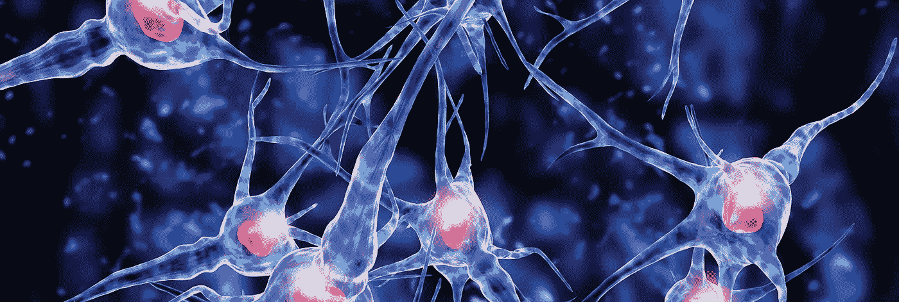

# 人工智能:像人类一样学习。

> 原文：<https://towardsdatascience.com/ai-learning-to-learn-as-humans-do-ecaec5e310c0?source=collection_archive---------11----------------------->

深度学习通过将计算机视觉、语音识别、机器翻译和自动车辆导航带到高于人类水平的性能，开启了人工智能革命。现在深度学习在 AI 中占主导地位。

监督学习(在深度学习中)是迄今为止人工智能所有工业成功的原因。它有一些明显的缺陷，限制了它的可伸缩性。根据 Yoshua Bengio 的说法，它学习那些在训练环境之外不能很好概括的表面线索。它仍然无法在多个时间尺度上很好地学习高级抽象。它仍然严重依赖于平滑可微的预测器。

现在，人工智能社区正在研究下一代技术，这种技术将使系统能够以迄今为止只有人类才能展示的方式理解世界并做出反应。无监督学习、实时学习、强大的预测模型、多时间尺度、一次性学习是需要突破的领域，以便使新一代成为现实。

神经科学一直是基于机器学习的人工神经网络的灵感和模型的来源。现在是时候加强前沿深度学习和前沿神经科学之间的联系了，因为前沿神经科学正在深入挖掘答案，前沿机器学习需要开发下一代像思维机器一样的人类。这里只有几个样品。

# 时间压缩的未来预播放——通过只闪现图案的起点来触发视觉图案的完成——发生在我们的大脑中。

“感知是由对未来事件的预期引导的。有人假设，这一过程可能是通过早期视觉皮层的模式完成来实现的，在这种情况下，只有一部分视觉输入被提供后，刺激序列才会被重新创建。”荷兰内梅亨大学唐德斯大脑、认知和行为研究所的研究人员已经用他们的实验证明了这个假设是正确的。" ***我们发现，只闪烁一个移动点序列的起点，会在初级视觉皮层(V1)中触发一个活动波，从而重建完整的刺激序列。与实际刺激序列相比，这种预期活动波在时间上被压缩，即使注意力从刺激序列转移时也存在。该预播放活动可以反映视觉序列*** 的自动预测机制他们在《自然》杂志最近的文章中写道。

# 当我们对一个被观察的人感同身受时，视觉空间精神传送到另一个人的身体发生在大脑中。

“空间隐喻经常被用来描述移情(即设身处地地为他人着想)，但很少有人研究移情和视觉空间能力之间的经验关系。有趣的是，似乎有与这两种功能相关的共享脑区；顶叶区域长期以来一直与视觉空间处理有关，最近研究移情反应的神经相关性的神经成像工作也注意到了顶叶网络的招募。范德比尔特大学的研究人员[发现](http://journals.plos.org/plosone/article?id=10.1371/journal.pone.0005864)***我们的大脑让我们真切地感受到处于另一个人的位置。他们称这种自我-他人的转变为“具身视角”。***’

# 人脑实时自动检测模式。

耶鲁大学科学家的研究“证实了这样一个结论:视觉统计学习是自动的，也不是自动的:它需要注意力来选择相关的刺激群体，但由此产生的学习是在没有意图或意识的情况下发生的。

# 人类婴儿的大脑隐含地识别熟悉的模式，并对不可预测性做出反应。

来自伦敦伯克贝克大学的一组科学家[报告](http://eprints.bbk.ac.uk/5721/):“我们让 2 个月、5 个月和 8 个月大的婴儿习惯于离散的视觉刺激序列，其顺序遵循统计上可预测的模式。

# **大脑的处理能力随着不可预测性而增强。**

**[卑尔根大学一个团队的研究结果](http://www.nature.com/articles/srep19741)揭示了:“ ***当预测基于统计学习时，与预测不匹配的事件会诱发早期的前向负波，这种不匹配反应的幅度与这种事件的概率成反比*** 。因此，我们报告了一种统计不匹配负波(sMMN ),它反映了超越听觉感觉记忆能力的过渡概率分布的统计学习**

# **一次性学习是由响应不确定性的处理能力增加触发的。**

**来自加州理工学院的一组科学家的一项研究证实了一个计算假设，即“ ***刺激和结果之间因果关系的不确定性导致学习速度的快速变化，这反过来又介导了增量学习和一次性学习*** 之间的过渡。”**