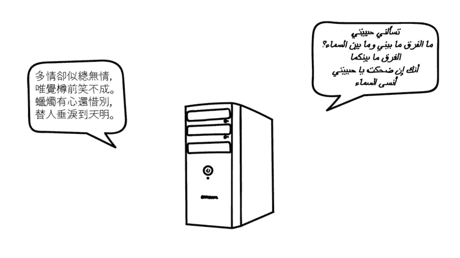
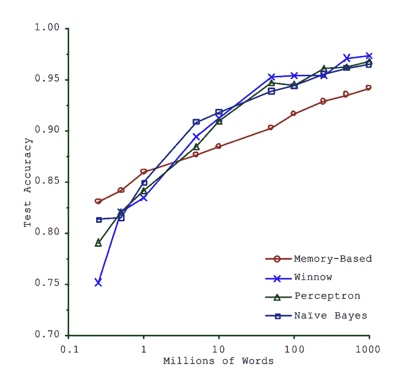

# 数据的不合理有效性

> 原文：<https://towardsdatascience.com/ai-ml-practicalities-the-unreasonable-effectiveness-of-data-c0bfd44c5057?source=collection_archive---------20----------------------->

## [AI/ML 实用性](https://towardsdatascience.com/tagged/ai-ml-practicalities)

## 数据量通常比模型选择更重要

*本文是* [*AI/ML 实用性*](/ai-ml-practicalities-bca0a47013c9) *系列的一部分。*

2006 年，美国国家科学技术研究所(NIST)举办了第五届年度机器翻译大赛。

以前的获奖者都是基于知识的系统，明确地编程来解释文档的语法和词汇，并使用对语言的类似明确理解将其转换为目标语言。

然而，那一年，谷歌凭借一个仅使用翻译文档库的自动统计分析结果将阿拉伯语和中文新闻文档翻译成英语的程序，在竞争中占据了主导地位。在 40 个竞争对手中，谷歌在 36 个类别中的 35 个类别中占据或并列第一。然而，他们的翻译程序不包含明确的语法规则或字典。事实上，开发这个程序的团队中没有人会说阿拉伯语或汉语。

这是机器学习(ML)的一个典型例子:用数据训练而不是显式编程的软件。尽管大肆宣传，但它也是 ML 强大力量的一个很好的例子，我们现在已经看到它在翻译、图像处理、搜索引擎和许多其他领域一次又一次地成功。

# 数据丰富的时代

一个很好的问题是:是什么样的技术进步让我们取得了这样的成果？

虽然几乎每一项技术进步都有一些解释:更快的计算机、更便宜的存储和理论进步，但 AI/ML 的一个具体驱动因素是数据可用性的大幅增加。在过去的 30 年里，我们比以往任何时候都更快地编目和创建数据。一个影响是显而易见的:关于事物的数据越多，可以分析的东西就越多。但是，数据的增长也产生了更深刻、更微妙的影响，这就是所谓的“数据的不合理有效性”。

# 肌肉还是大脑？

为了理解这种影响，请考虑微软在 2001 年做的一个实验。研究人员进行了一项并行测试，以评估 4 种不同的 ML 翻译方法的优点。他们用相同的输入数据从头开始训练每个模型，用从 10 万到 10 亿字的不同数据集规模进行了一系列试验。

资料来源:Banko，m .和 Brill，E. (2001)，“扩展到非常非常大的自然语言消歧语料库”

如上图所示，他们发现用于训练模型的数据集的大小远比 ML 方法的选择更重要。而且，随着数据集变大，模型之间的性能差异变得非常小。

事实上，这就是谷歌在 2006 年赢得自动翻译竞赛的原因。他们比任何人都更容易获得正确的阿拉伯语到英语和汉语到英语的翻译(即训练数据)，因为谷歌刚刚花了 8 年时间对互联网进行编目。

从实践的角度来看，关键的经验是，更多的数据几乎总是更好，而且“更多”可以用数量级来衡量。遗憾的是，我们并不总是能够选择需要处理多少数据。但是，我们总是需要考虑数据集的大小。而且，正如我将在以后的文章中提到的，通常有一些巧妙的技巧和权衡来改善这种情况。

*仅供技术人员使用，因为微软的术语已经过时:*

*   “基于记忆”的学习(又名“基于实例”的学习)记住所有的数据点，并根据最接近的数据点进行预测。本质上，它假设目标函数是局部常数。k-最近邻就是一个例子。
*   “Winnow”是感知器的早期替代公式，但没有非线性激活，只有二进制输入。这个名字来源于它能够快速消除(剔除)无用的输入，这对于计算能力有限的大型功能集非常有用。
*   感知器和朴素贝叶斯应该很熟悉。