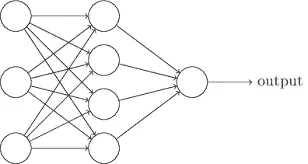

# AI 用神经网络玩沥青。

> 原文：<https://towardsdatascience.com/ai-plays-asphalt-using-neural-network-40a58c015189?source=collection_archive---------6----------------------->

## 使用 Tensorflow，我制作了一个使用卷积神经网络玩沥青的人工智能。它基于行为克隆**。**

## **什么是神经网络，它是如何工作的？**

简单地说，我们可以说神经网络是一个模仿人脑的计算机系统。类似于树突(神经元)，神经网络接受几个输入并给出单个输出，在我们的情况下，它从游戏中获取一帧图像，并预测是否按下 W，A 或 d。

A Neural Networks.

输入被传递给一个数学函数，该函数给出一个确定的输出。但这里的问题是，我们不知道函数内部的表达式(权重)一定是什么，这就是机器学习的闪光之处**。**

了解更多信息

**反向传播**

使用反向传播我们可以解决这个问题。最初，函数中的权重是随机的，但这是随着时间的推移而优化的。反向传播采用模型预测的输出和应该预测的实际输出，并稍微改变函数，使得预测的输出与神经网络中所需的输出相匹配。

Backpropagation

**卷积神经网络**

卷积神经网络(CNN)是一种特殊的神经网络，主要用于发现图像和视频中的模式。观看此视频，更好地理解这个概念。

**获取训练数据**

对于所有执行特定任务的神经网络模型，我们需要在一些数据中训练模型。这里所有需要的数据是图像的帧和该帧上相应的击键。数据存储在 CSV 文件中。

Training Data

图像被降低到灰度级并被裁剪以仅具有所需的信息作为训练数据。并且为了增加训练数据，图像被镜像，并且对于左和右图像数据，方向被反转。

**训练网络**

然后，该模型根据该数据进行训练，并使用反向传播算法随着时间的推移进行改进。最初，权重是随机的，并且来自模型的预测是相当随机的。根据我们已经提供的输出，在每次预测之后优化权重。

**链接到项目**

github:[https://github.com/Sampanna-Sharma/Self-driving-Car](https://github.com/Sampanna-Sharma/Self-driving-Car)

**灵感**

这个项目的灵感来自 Sentdex 的 python plays GTA 和 Siraj Raval 的 how to simulate self-driving car。