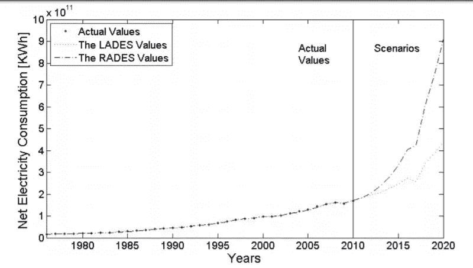

# 预测用电量的人工智能能源框架

> 原文：<https://towardsdatascience.com/ai-powered-energy-framework-for-forecasting-electricity-consumption-ebf4ecbc49f7?source=collection_archive---------14----------------------->

电是一种重要的能量形式，不能以物理方式储存，通常在需要时产生。在大多数研究中，主要目的是确保产生足够的电力来满足未来的需求。为了避免浪费或短缺，需要设计一个良好的系统来持续保持所需的电力水平。有必要估计独立因素，因为未来电量不仅基于当前净消费量，还基于独立因素。在这项研究中，提出了一个新的框架，首先使用 SARIMA(季节性自回归迭代移动平均)方法和 NARANN(非线性自回归人工神经网络)方法来估计未来的独立因素，这两种方法都称为“预测情景方法”，如下图 1 所示。

Figure 1: The flow chart of the new framework for forecasting net electricity consumption.

随后，基于这些情景，应用 LADES(LASSO-based adaptive evolutionary simulated annealing)模型和 RADES(ridge-based adaptive evolutionary simulated annealing)模型对未来净用电量进行预测。然后通过土耳其的案例研究验证了所提出的方法。实验结果表明，与以前的方法相比，我们的方法优于其他方法。最后，结果表明 NEC 可以被建模，并且它可以被用来预测未来的 NEC(见图 2)。

Figure 2: Scattering and distribution graphics of training and testing level, respectively, for the best energy model.

在现代生活中，预测对于有效应用能源政策极其重要。政府需要知道必须生产多少电力来满足能源需求和消耗。在土耳其，用于预测的 NEC(净耗电量)是从 MENR 的 MAED 模拟技术中正式获得的，预测误差很大。预测需要指导 MENR 制定最佳能源政策。

本研究的主要结论是土耳其的电力消费被建模为具有线性和二次行为的新能源模型。新能源模型的使用形式使得未来预测成为可能。我们还介绍了替代预测方法的重要性。改进了文献中假设独立因素随时间以恒定增长率增加的情景，以便通过在预测情景方法中使用 SARIMA 方法和 NARANN 方法来预测独立因素的未来值。

Figure 3: Monthly forecasting of the NEC with two scenarios between 2011 and 2020.

根据本研究中到目前为止呈现的结果和讨论，预计 NEC 将通过使用提议的方案和最佳能源模型(见上图 3)来展示该框架如何适用于未来。提出的最佳模型以 1.59%的平均 MAPE 误差率预测了土耳其 34 年的电力消费，而 MENR 预测某些年份的误差率超过 10%。这意味着土耳其政府和相关组织可以使用这一框架来预测未来的价值，以确保良好的未来规划。这些模型也可以在不同的国家使用。通过研究未来价值，可以制定新的规划策略。政策制定者可以利用这一框架来规划新的投资和确定适当的进出口额。此外，新能源模型可以通过使用不同的误差评估标准来定义(例如 SSE、MAE、MAPE 等)。)作为改进模型的目标函数。可以开发混合技术的新能源模型来进行更好的研究。

总之，在土耳其和其他国家，对能源需求预测不足经常导致电力短缺和停电。这阻碍了经济的发展，并给普通公民带来烦恼和不便。通过预测实际能源需求，这项研究中提出的模型将有助于避免这些停电，从而使土耳其能够更快地发展，并提高其公民使用电力的生活质量。

想了解更多关于这项研究的信息，请点击下面的链接。

[http://www . academia . edu/19744765/A _ new _ forecasting _ framework _ for _ volatile _ behavior _ in _ net _ electricity _ consumption _ A _ case _ study _ in _ Turkey](http://www.academia.edu/19744765/A_new_forecasting_framework_for_volatile_behavior_in_net_electricity_consumption_A_case_study_in_Turkey)