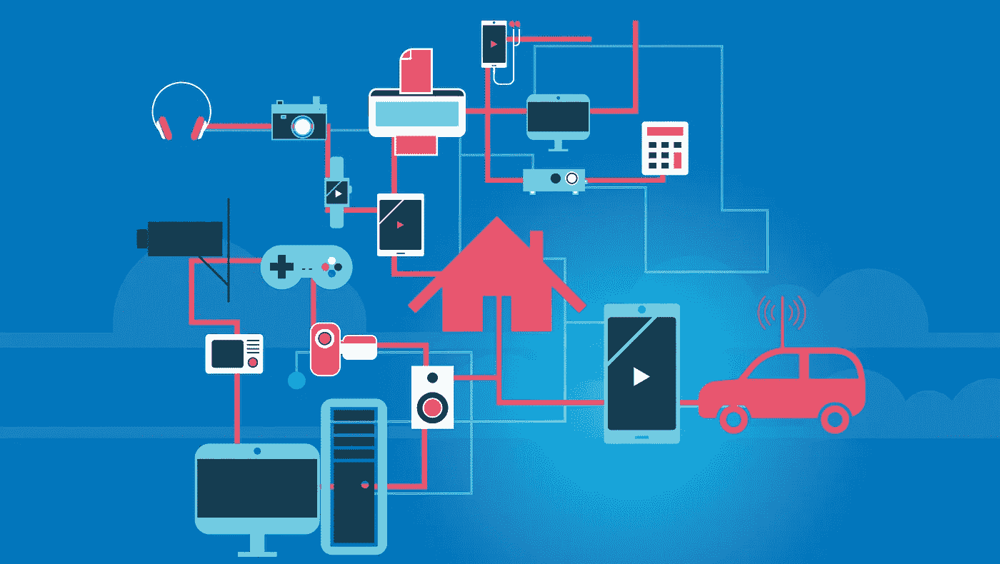

# 人工智能对 2019 年的预测

> 原文：<https://towardsdatascience.com/ai-predictions-for-2019-610b8de56aad?source=collection_archive---------21----------------------->

## 2019 年将是人工智能的分水岭

人工智能，具体来说，机器学习和深度学习，已经成为 2018 年的时尚关键词，我们不认为炒作会在未来几年内消退。从长远来看，人工智能最终将成为日常新闻，成为另一种驱动我们生活的技术，就像“互联网”、“电力”和“可燃引擎”一样。

然而在接下来的几年里，激动人心的技术突破将改变我们的生活、经营和管理社会的方式。人工智能有望带来前几次技术革命中我们做梦都想不到的变化。与过去不同，人工智能驱动的机器将做分析、规划、预测和决策的“思考”工作，为我们一直认为是为人类保留的新角色做出贡献。

我们仍然不确定人工智能是否最终会导致一个“星际迷航”般的社会，让人类自由地度过他们的生活，追求更有意义的目标。然而，许多人相信人工智能将导致大规模失业和社会动荡，最终导致天网式的人类灭绝。虽然我没有遥远未来的水晶球，但以下是我对 2019 年的预测。

# 人工智能将加速所有权社会的终结

我不再拥有我的音乐 CD 或电影 DVD，我们订阅了 Spotify 或网飞。在人们购买的日常产品中，音乐和视频可能是标志着所有权时代结束的第一批产品。今天，人工智能平台正在将每一种制造产品和服务转变为互联的“智能”产品。我们已经在交通和消费电子产品中看到了这一点——汽车、滑板车、洗衣机、咖啡机、恒温器等。

*Figure 1\. AI will accelerate the trend of subscription-based sharing of goods and services. Credit: Pinsnaper*

由从智能产品捕获的数据驱动；AI 算法和新的商业模式，结束所有权的趋势将加速所有行业、产品或服务。我们开始订阅办公空间( [WeWork](https://www.wework.com/) )、住房([漫游](https://www.roam.co/)、[普通](https://www.common.com/))、家具( [Fernish](https://fernish.co/) )、服装( [Le Tote](https://letote.com/) )甚至遛狗( [Wag](https://wagwalking.com/) )。这些趋势将加速，类似的服务将在 2019 年及以后开始支撑各行各业。

# 非科技公司将开始构建人工智能

虽然人工智能和人工智能一直是热门话题，但新闻主要是由脸书、苹果、亚马逊、网飞和谷歌(FAANG)等科技公司推动的。许多非科技企业已经创建了他们的“人工智能战略”，现在将专注于解决影响他们业务指标的现实世界问题。在花了几年时间进行数字化工作以整理数据并确定人工智能可以带来回报的机会领域后，企业将继续推进成熟的计划，从试点中学习，然后试运行到全球部署。

在这种情况下，零售商专注于建立客户参与模型，以最大化全渠道存在和销售转化。或者，客户流失预测模型将帮助他们获得客户可能会脱离并可能完全停止购物的早期信号，从而需要业务干预来防止这种情况。

受益于数字化和人工智能，企业将开始利用他们的数据产生新的收入流。建立交易和客户活动的大型数据库，并与相邻行业合作，基本上可以让任何充分了解数据和人工智能的企业开始重塑自己。例如，电信公司可以开始为客户何时可能购买新的智能手机建立模型。有了模型预测，他们可以与手机制造商合作，为客户提供高度定制的激励，以促成交易——在这个过程中为自己创造收入。

因此，我们将看到焦点从“人工智能战略”转移到“人工智能驱动的”结果，因为公司希望从他们的技术和人员投资中获得真正的商业影响。技术将变得不那么重要:商业洞察力和交付的结果将是关键。另一方面，随着人工智能的入侵，企业将开始意识到人工智能是对其流程、人员和文化转型的投资，而不仅仅是可以用来立即解决低效问题的神奇工具。

# 消费者对人工智能的理解将发生巨大转变

随着人工智能超越炒作和每日头条新闻，随着基于人工智能的设备和服务的使用激增，我们对人工智能的理解将发生转变。最初，与人工智能的日常互动将采用数字助理的形式，如聊天机器人或语音机器人以及 Alexa 等设备。随着交互和使用的增加，我们将不再把人工智能与从不撞车的自动驾驶汽车联系在一起，而是作为生产力工具和预测来帮助日常任务，让我们的生活变得更好。实用人工智能将致力于让购物变得愉快，让病人护理变得更好，让疾病检测变得更精确，让学习变得更愉快。

*Figure 2\. Consumers understanding of AI will be more nuanced: instead of expecting self driving cars that never crash, we will see AI as a everyday business tool. Credit: Pinsnaper*

另一方面，虽然人工智能在大多数情况下都能很好地工作，但我们会看到偶尔的小故障或荒谬的失败。这是因为许多“数据科学家”对人工智能的底层统计本质缺乏深刻的理解，并且缺乏实现算法的编程方法，导致了意想不到的后果。

# 人工智能将是坏演员有利可图的领域

随着越来越多的企业使用人工智能来推动他们的产品和服务，并开始依赖数据驱动的决策，整个生态系统需要时间来开发新的流程和框架来与之配合。例如，营销部门在全球部署客户流失预防措施之前，会希望进行检查和平衡，以确保不会发生“收入流失”或客户伤害。当涉及处理人类数据时，这尤其成问题，因为人工智能仍然受到“黑箱问题”的阻碍，数据科学家社区之外的大多数人，甚至一些人，似乎不理解系统在做什么。

*Figure 3\. AI driven fraud and phishing will become more common in 2019, causing significant losses to businesses and consumers. Credit: Pinsnaper*

由于新的人工智能生态系统需要时间来适应新的流程和框架，坏人将利用系统的婴儿期。在整个数字生态系统中，利用数据平台和复杂的人工智能技术，他们将加倍努力，执行全球化和高度定制的欺诈计划，导致品牌和营销人员遭受重大损失。围绕传感器篡改、数据操纵、启动以及复杂的人工智能模型驱动的欺诈和网络钓鱼攻击的许多风险将会暴露出来。

# 2019 年将是隐私支持人工智能的一年

随着企业将人工智能融入他们的系统、流程和日常业务，人工智能需要得到信任，以实现其全部潜力。人工智能的消费者会想知道它对我们的数据做了什么，当涉及到影响我们生活的问题时，它为什么以及如何做出决定。从技术角度来看，这通常很难传达。人工智能之所以有用，是因为它能够建立联系，做出对我们来说不明显甚至可能违反直觉的推断。考虑一下谷歌的 AlphaGo 击败 2016 年世界顶级围棋选手之一 Lee Sedol 的情况。没有人能理解 AlphaGo 的棋步，当比赛在观众和解说员面前进行时，人们有一种难以置信的感觉。除了让公众放心，研究和商业也将从公开中受益，公开揭露数据或算法中的偏见。

2019 年，我们将看到人们越来越重视旨在提高人工智能透明度的技术和流程，这是由通用数据保护条例( [GDPR](https://eugdpr.org/) )以及将在印度等主要经济体生效的类似措施推动的。GDPR 于 2018 年在欧洲各地投入使用，为公民提供保护，防止机器做出具有“法律或其他重大”影响的决定。企业，尤其是领先企业，通过人工智能的力量“谷歌化”其业务的驱动力，将导致他们与第三方共享数据。确保数据隐私，进而确保客户隐私，不仅是一种良好的商业实践和风险管理策略，而且很快将成为一项法律要求。

2019 年，支持隐私的人工智能技术将为支持人工智能应用提供基础，同时使用加密技术维护强大的隐私。我最喜欢的是令人兴奋的新兴安全计算技术。同态加密(HE)是一种安全计算技术，是一种加密数据的特定方式，以便第三方可以使用机器学习技术进行操作并收集有价值的见解，同时数据继续被加密，从而保护用户的隐私。

基于 HE、联邦学习(另一种由谷歌推广的分布式机器学习技术，不需要集中数据)和其他安全计算方法，我们将看到初创公司专注于在边缘实现人工智能的民主化。这里的赌注是，在未来 3 年内，超过 10 亿部智能手机将配备人工智能芯片和重要的本地计算，许多人工智能模型将能够在这些移动设备上本地运行。将计算分布在数十亿部智能手机上将大大降低开发人工智能产品的成本和时间，如超个性化推荐引擎、人工智能助手等。对于大多数企业来说。大公司和初创公司都在构建分布式、安全和支持隐私的计算框架来实现这一点。

# 摘要

2019 年将是人工智能的分水岭，届时该技术将逐渐走出炒作周期，并开始在所有类型的业务，流程，产品和服务中被广泛采用。消费者对该技术的理解将开始改变:然而，隐私仍将是企业必须解决的挑战，以确保公众广泛接受该技术。支持隐私的人工智能平台，配备人工智能芯片和重要本地计算的智能手机，将改变人工智能的分布方式。到今年年底，人工智能将提供高度个性化的内容和推荐，这将使消费者感到高兴，并会感到不自然的个性化。

***下一个故事:*** [***印度贫穷地址的影响:一年 100-140 亿美元***](/economic-impact-of-poor-addresses-in-india-10-14-billion-a-year-11cc97cb40fc)

***往期剧情:*** [***AI 对 2018 年的预测***](https://medium.com/@SantanuB/https-medium-com-santanub-ai-predictions-for-2018-e0280c899d6e)

***你好。像这样的文章需要相当多的时间和精力，所以如果你能为我鼓掌，这将让编辑们知道你喜欢它。谢谢***