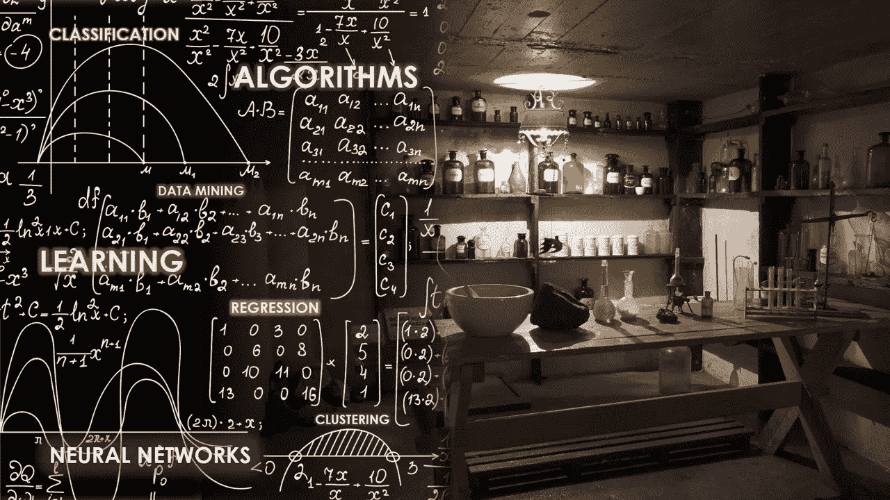

# 人工智能系列:数据科学家，现代炼金术士。

> 原文：<https://towardsdatascience.com/ai-series-data-scientists-the-modern-alchemists-1c835f515c62?source=collection_archive---------11----------------------->

> “……狭窄的螺旋楼梯通向一个更大的房间，砖墙上挂着几个火把，几乎没有照明。房间中央的两张桌子被最奇怪形状的炼金术蒸馏器完全覆盖了。一只玻璃蜜蜂正在吸入一种气味难闻、懒洋洋的蒸汽，这种蒸汽是由研钵和杵附近的一个加热的葫芦里的一种冒泡液体产生的。不同大小的铜制干馏炉、盛有白铅、硫和汞的小烧瓶以及其他蒸馏容器排列在古老的木制架子上。奇怪的光效应是由一瓶 Spiritus Vini 产生的，它反射了来自加热锅的光，硫被蒸发，将液态汞转化为黄色固体，非常类似于黄金……”

即使自从他们试图将贱金属转化为黄金已经过去了许多世纪，我们目前的科学知识在所有领域都是如此的深刻和广泛，并且强大的计算机取代了蜜蜂和葫芦，当我想到现代数据科学家将数据转化为黄金的迷人使命时，我不能不想起中世纪的炼金术士。

首先，数据科学家需要了解他们必须解决的问题的性质。在**机器学习**中，主要有 3 类问题:分类、回归和聚类。**分类任务**涉及将输入数据分配给类别标签的能力，比如“是”或“否”、“真”或“假”，或者更复杂的任务，比如通过将一张脸分配给它所属的人的名字来进行人脸识别。**回归任务**与分类任务相似，但预测涉及的是连续值而非对象类别。教授一种算法来预测与特定产品或服务相关的价格在特定情况下将如何变化是一个回归问题。**聚类问题**更接近于传统的数据挖掘任务，在传统的数据挖掘任务中，需要分析未标记的数据以发现特定的隐藏模式，从而提取强大的洞察力，就像产品推荐一样。

一旦问题清楚了，数据科学家就必须定义哪种学习策略最适合这个原因。选择取决于许多不同的因素，包括:有多少数据可用？它们是否贴有标签？是否有以前在类似数据集上训练过的算法或神经网络？在我之前的文章中，我已经介绍了最流行的学习策略:有监督的和无监督的。

如果我有大数据集的标签数据，大量的计算能力，并且我正在处理分类或回归问题，那么**监督学习**方法可能是最好的选择，而在聚类任务和没有标签数据的情况下，**非监督学习**是最好的选择。但是，随着时间的推移，出现了许多其他学习策略，如**转移学习**的情况，它利用先前在类似领域训练的现有网络，通过仅重新训练最后几个完全连接的层来微调模型，从而重新使用从应用于不同任务的监督训练周期中检测和学习的特征。

另一种方法是由**深度信念网络**或 DBNs 提供的。他们使用标准的神经网络，但实施一种完全不同的训练方法。网络不是从随机值开始，而是通过使用未标记数据集的**无监督预训练阶段**进行初始化，网络将从中学习多层特征。当预训练阶段结束时，网络的所有权重和偏差将非常接近它们的最优值，最终阶段将只包括一个简短的**监督微调会话**，具有反向传播和相对较少的标记样本。

迁移学习和 BMNs 都可以减少训练时间和对大规模标注数据集的需求。

最后，但绝对不是最不重要的，数据科学家将不得不在众多算法中决定哪种算法将提供最佳性能。

[在我的上一篇文章](https://www.linkedin.com/pulse/ai-series-deep-learning-light-version-michele-vaccaro/)中，我介绍了非常流行的神经网络，它可以有许多不同的风格:从最简单的多层感知器到卷积网络的强大架构，或者是专门处理下一个数据点依赖于前一个数据点的顺序数据的**递归神经网络**的复杂结构，比如股票预测、文本生成和语音识别。

但是神经网络和深度学习只是一组更广泛、更丰富的机器学习算法的元素，这些算法可以涵盖所有可能的问题。**回归算法**系列显然非常适合解决回归类型的问题，它提供了快速建模的算法，当要建模的关系不是非常复杂并且如果您没有大量数据时尤其有用。线性和逻辑回归算法是这个家族中最简单的算法。**顾名思义，聚类算法**在对多组对象进行分组，使同一组(称为一个聚类)中的对象彼此之间比其他组中的对象更相似时，对无监督学习任务特别有效。它是探索性数据挖掘的主要任务，也是机器学习借用的统计数据分析的常用技术。K-Means 和层次聚类是属于这个家族的流行算法。对于回归和分类任务的监督学习来说，**决策树**和**贝叶斯算法**通常是一种良好、简单且强大的方法。

这些只是数据科学家可以用来解决挑战的许多可用机器算法中的几个例子，我们将在接下来的文章中探索这些算法。

但是，尽管数据科学家可以利用现有的最佳实践和指导方针，围绕问题、数据集、学习策略和算法的组合应该用来实现最佳结果，但机器学习也确实不是一门精确的科学，它正在快速发展，而且相对较新。这就是试验新方法的艺术，通过明智地组合(通常是凭经验)不同的成分，使我们现代数据科学家的任务如此复杂和迷人，以至于看起来不可思议。

数据科学家不仅仅是知道如何用 Python 实现代码的物理学家或数学家。他或她在一个又一个用例中发展自己的能力，利用最佳实践，但经常探索解决老问题的新方法，结合不同的学习技术或链接不同类别的算法来优化数据，以提高预测质量和性能，或克服前所未见的障碍和挑战。

类似于他们的炼金术士祖先，在他们将石头变成黄金的大步中，为现代化学铺平了道路，我们的现代数据科学家，在他们从数据中提取黄金的努力中，正在为未来几代人工智能奠定基础。

*原载于*[*https://www.linkedin.com*](https://www.linkedin.com/pulse/ai-series-data-scientists-modern-alchemists-michele-vaccaro/)*。*

感谢阅读！。请随意访问我在 LinkedIn 上的简介。