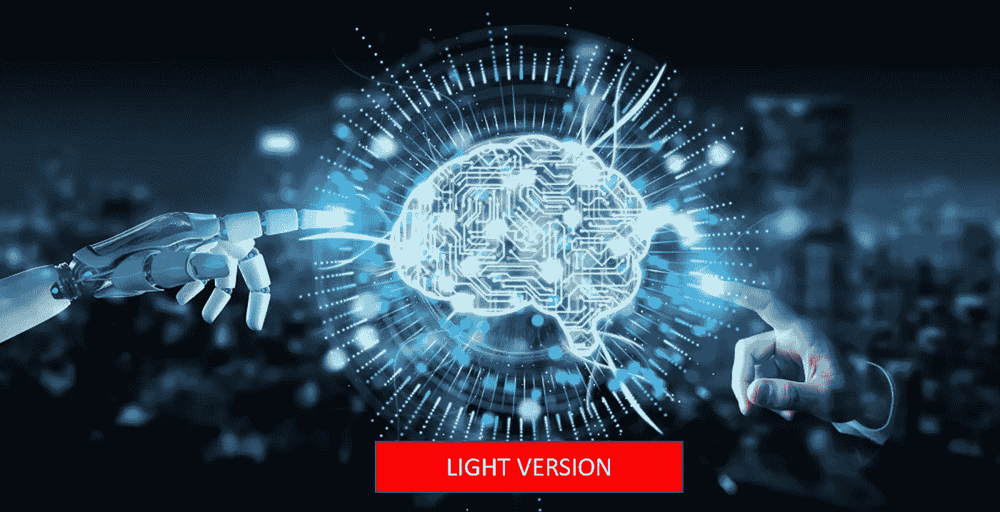

# AI 系列:深入深度学习(轻版)

> 原文：<https://towardsdatascience.com/ai-series-deep-into-deep-learning-light-version-aab9547198d7?source=collection_archive---------10----------------------->

**近距离观察深度学习的魔力**

如果你已经读过我的[上一篇文章](https://www.linkedin.com/pulse/ai-series-deep-learning-michele-vaccaro/)，那么你可以跳过这篇，然而对于那些没有或没有通过(但在经历中幸存下来)的人来说，我在这里提供了一个更短的进入深度学习和神经网络魔力的过程。

> 想象成为有史以来最大的自拍的一部分，与数百万人一起，并且能够在不到 5 秒的时间内识别特定的面孔。困难的部分将是把数百万张脸装进一张照片，而不是在几秒钟内从数百万张脸中识别出一张脸的能力。

这种能力已经成为现实，这要归功于**深度学习**，这是一种实现**人工神经网络**的机器学习技术，人工神经网络由许多高度连接的分层排列的人工节点组成，这些节点大致类似于人类生物神经元，它们如何连接以及它们如何交换信息和学习。

今天最受欢迎的神经网络类型是**卷积神经网络** (CNN)，专门从事物体识别，它从人类视觉系统中获得了额外的灵感。

**卷积神经网络如何工作。**

CNN 实现了若干层，称为隐藏层，因为它们位于输入层和输出层之间，这些层渐进地处理输入图像的每个像素，识别区别模式并创建输入数据的更高概括，以便定义和训练能够检测输入图像中的特定对象的模型。

为了隔离和识别原始图片中的特定模式(特征)，网络层实施不同的过滤器，包括**卷积**、**汇集**和各种**激活功能**。这些算法将逐步简化输入的信息，使得检测到的特征更加鲁棒，并且对位置不太敏感，从而允许原始图像中的特征发生一些移动。

由于与模拟我们生物突触的每个节点相关联的权重，原始图像中强烈表征对象的特征将被一层又一层地携带，而在确定对象的过程中不变的元素将失去权重并最终消失。

在该过程的最后，卷积网络实现了一个或多个称为**全连接层**的附加层，其中与每个已识别特征相关联的值按顺序列在一个长数组中，每个值都成为一个投票，决定特定模式预测我们在原始图像中寻找的对象的存在程度。

为了做出可靠的预测，深度学习和底层神经网络需要一个漫长的训练过程，在这个过程中，系统必须学习如何自主识别一个对象。为了实现这一点，该过程将需要一个巨大的训练图像数据集，该数据集包含它将从中学习的对象，一个训练周期接一个训练周期，辨别该对象的所有特征。

然后，一组高度区分的特征将确定一个健壮的和通用的模型，用于对以前从未见过的图像进行未来的定性预测。与我们生物大脑中发生的类似，学习过程将通过调整与每个神经元相关的权重值来加强具有区别特征的神经元之间的连接。

大多数深度学习用例都实现了一种称为**监督学习**的方法，其目标是找到一个函数，将一组标记输入映射到它们的正确输出。一个例子是分类任务，其中输入是字母的图像，正确的输出是字母的名称。它被称为监督学习，因为算法从训练数据集学习的过程可以被认为是教师监督学习过程。我们知道正确的答案；该算法迭代地对训练数据进行预测，并由教师进行校正。

一旦开始向神经网络提供训练图像，对对象所代表的内容的初始预测质量将会非常差，但随着时间的推移会有所改善，因为网络的输出会与正确答案应该是什么进行比较，并且差异或误差会用于调整整个网络中的权重值，稍微向上或稍微向下。

> 当预测和正确答案之间的误差达到其最小值时，训练将停止，因此在网络中没有进一步的重大调整。

然后，该网络将在同一物体的新图像上进行测试，以验证学习的模型是否足够可靠，能够正确分类图像中从未见过的物体……包括你的数百万人自拍中的所有人脸！

最初发表于 https://www.linkedin.com。