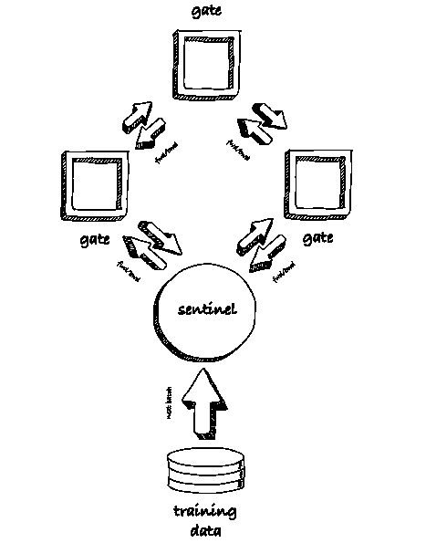
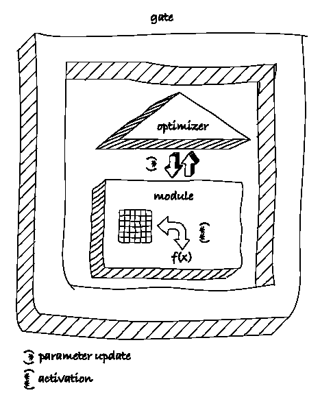

# Akkordeon:神经网络的演员模型

> 原文：<https://towardsdatascience.com/akkordeon-actor-model-of-a-neural-network-ff748096a5a3?source=collection_archive---------18----------------------->

# 介绍

这个问题我琢磨了很久:有没有可能实现一个神经网络作为演员模型？我终于开发了一个实现，我觉得有必要写一篇关于它的文章。

本文的重点是探索一种思想以及如何实现它，而不是将这种实现与其他框架和实现进行比较。我甚至不确定这是不是个好主意。但是这是可以做到的，正如我希望在下面的内容中所展示的。

源代码在 github 上:[https://github.com/botkop/akkordeon/tree/medium](https://github.com/botkop/akkordeon/tree/medium)

# TLDR；

我为神经网络的并行训练开发了两个角色模型。第一种，我称之为“触发器”，为每种消息类型交换状态，其中消息类型是向前传递、向后传递和验证(或测试)之一，并且只能处理符合其状态的消息。第二个，昵称为“轮子”，能够在任何给定的时刻处理所有类型的消息。它训练用于测试触发器场景的相同网络，速度快 2 倍，并且使用 2 倍多的资源。

# 演员模型

actor 模型是一个用于并发计算的系统。

参与者模型中的参与者是独立的单元，可以有状态。

参与者的状态是私有的:参与者不与其他参与者共享内存。

演员之间的交流是通过消息传递的。消息以异步方式发送，到达接收方参与者的邮箱，在那里按先进先出的顺序进行处理。

尽管参与者邮箱中的消息是一个接一个处理的，但参与者之间的消息是异步发送的。这意味着不同参与者中的计算同时运行。

Actor 系统可以部署在单台机器上，也可以部署在集群中。这允许水平和垂直缩放，允许计算资源的最佳使用。

# 神经网络

简单地说:

神经网络是一种试图定义未知函数的计算。我们有一个输入 x 和一个已知的输出 y，但我们不知道如何从 x 到 y。让我们尝试一下:我们用 x 和一组随机数(权重)对 x 进行一些计算(激活)，然后看看它与想要的输出 y 相比如何。这就是所谓的前向传递。显然，结果不会很好。

接下来，我们引入一种方法来衡量我们的结果有多错误(损失函数)，并在预期输出的方向上稍微调整一下权重(导数)。这是反向传递，调整权重被称为优化。

我们反复这样做，直到我们发现结果令人满意。这叫‘训练’。

我们可以尝试通过增加更多的权重和前向函数来改进网络。这些是层层叠叠的，一个接一个。在正向传递中，正向结果从一层传递到下一层，在反向传递中，调整从下一层传递到上一层。

多于一层的网络称为深度网络。

尽管我们可能永远也找不到我们想要的确切函数，但是只要有足够的数据和训练，我们可以计算出几乎总是能产生好结果的东西。希望当我们把它应用到一个从未见过的 x 上时，它能给我们一个未知 y 的好预测。

总而言之:

神经网络由层组成，在训练过程中，通过输入变量的激活向前遍历，通过损失函数计算的导数向后遍历。随后通过优化函数，例如随机梯度下降，用导数更新层的参数。

# 神经网络和演员模型

神经网络有许多活动的部分，我们可能会发现一些计算可以同时运行。

让我们从定义一个参与者模型开始，其中每一层都作为一个独立的参与者运行。

让我们也称这个层为一个演员的大门。它更好地反映了演员的独立性，我喜欢这个术语，因为它是安德烈·卡帕西在他关于 CS231n 反向传播的精彩讲座中创造的。

在正向传递中，激活作为消息从一个门发送到下一个门。在反向传递中，导数作为消息被发送到前一个门。到目前为止，没什么新发现。然而，每个门独立于网络的其余部分运行的事实，允许一些新奇的东西。

首先，优化(用下一个门的后向梯度或损失函数更新一个门的参数)可以异步完成，即。同时，前一个门正在处理该门新到达的梯度。

第二，不需要为了执行验证或测试过程而停止训练过程。所有可以同时运行。

第三，如果可用的话，不需要等待由网络的其余部分以及最终损失函数计算的梯度来开始处理下一批输入数据的前向传递。

想到的另一件事是，门可以任意复杂，每个门本身组成一个完整的神经网络。因为门是参与者，所以它们可以垂直和水平缩放。在一台机器中，gates 将在所有可用的 CPU/GPU 上执行。Gates 可以很容易地部署在不同的机器上进行水平扩展。单个机器和/或集群上所有资源的最佳使用可以避免昂贵 GPU 的成本。

# 履行

我们如何实现这一点？

我会用 [Scorch](https://github.com/botkop/scorch) ，一个用 Scala 写的神经网络框架。它有一个非常像 [PyTorch](https://pytorch.org/) 的编程接口。因为它是用 Scala 编写的，所以它允许与演员建模工具箱 [Akka](https://akka.io/) 集成。

让我们看看它是如何一起工作的，然后我会解释细节。

# 体系结构

这仅仅显示了训练阶段，但是其他阶段，比如验证和测试，都是类似的，而且更简单，因为没有反向传播。

有 3 个组件。

*   Gates: actors，每个 actors 由一个模块和一个优化器组成。这些类似于传统网的层。
*   哨兵:也是一个行动者，负责向关口提供数据(输入)和计算/评估输出的损失。
*   主程序，定义演员系统、网络、数据加载器，并开始训练。

sentinel 只有一个，它从训练数据集中读取一批数据，并将其作为消息转发给网络中的第一个网关。这个门执行其转发功能，并将结果发送到下一个门。依此类推，直到最后一个门，它将结果转发回哨兵。

哨兵接收转发信息，这是现在网络的最终结果，并与预期的结果进行比较。它会计算损失，并将带有导数的反向消息发送到最后一个门。该门计算其函数的局部梯度，并将其作为反向消息发送给之前的门。然后，它更新其权重(优化)。如此下去，直到反向信息再次到达哨兵。

然后哨兵读取下一批数据。诸如此类。

# 两种情况

我开发了两个场景，我称之为人字拖和轮子场景。

在触发器场景中，所有参与者(哨兵和门)的状态在向前和向后处理状态之间交换。当转发消息到达某个参与者时，该参与者对其进行处理，并转换到向后状态。反之亦然，当一个反向消息到达参与者时，它会转换到正向状态。这种情况的缺点是，它在同一时间只能处于一种状态，因此只能处理当前状态允许的消息。

wheels 场景通过只有一个状态来解决这个问题，它处理所有类型的消息。这允许高度并发的模型，其中正向传播、反向传播和验证都同时运行。该场景依赖于参与者模型定义，即参与者邮箱中的消息按顺序处理。当演员需要跟踪前向通道激活时，为了计算后向通道中的梯度，简单的队列数据结构足以满足这一需求。

# 盖茨

门类似于层。不同之处在于，每个门都是一个参与者，它有自己的优化器，而在传统网络中，整个网络只有一个优化器。然而，在功能上没有区别，因为优化器不在层/门之间共享数据。

因此，门由一个模块和它自己的优化器组成。

“模块”是 Scorch(和 PyTorch)术语，指带有数据或参数(也称为重量)和转发功能的容器。forward 函数接受一个输入，使用权重执行计算，并产生一个可微分的输出。

模块还可以包含其他模块，允许将它们嵌套在一个树形结构中。

例如:

这个模块，由另一个模块(线性，一个完全连接的层)组成。它将通过[全连接层](https://leonardoaraujosantos.gitbooks.io/artificial-inteligence/content/fc_layer.html)传递其输入，然后是 [relu](https://en.wikipedia.org/wiki/Rectifier_(neural_networks)) 函数。请注意，模块可以根据您的需要变得非常复杂。你可以把卷积，池化，批处理，辍学，…等等放在那里。

## 盖茨和触发器场景

在触发器场景中，门有两种状态:正向状态和反向状态。

在转发状态下，门接受来自前一个门或哨兵的转发消息，通过转发功能运行消息内容，并将结果传递给下一个门或哨兵。

然后它切换到向后状态。

在反向状态下，它接受来自下一个门或哨兵的反向消息。

该消息包含上述激活的梯度。该门计算局部梯度，并依次将这些梯度作为反向消息传递给前一层。

一旦这个反向消息被发送，优化器使用诸如梯度下降或 Adam 之类的函数用梯度更新门的权重。

然后，它交换回转发状态，并等待下一条转发消息到达。

上面代码中的 wire 对象包含指向下一个和上一个参与者的指针，或者是另一个门，或者是哨兵。

## 盖茨和轮子的场景

在 Wheels 实现中，gate 只有一个状态，处理所有的消息类型。

因为这个场景的目标是能够同时执行向前和向后过程，所以我们需要跟踪向前过程中的激活，以便我们可以在向后过程中使用它们进行梯度计算。我使用一个列表来做这件事，这个列表充当一个队列。在正向传递中，输入变量和结果一起被添加到列表中。

在向后传递中，弹出列表的第一个元素，并用于梯度计算。反向消息的梯度和激活列表的第一个元素被保证属于一起，因为在 actors 中，消息被顺序处理，并且我们的网络由一条线(每个节点正好 1 个父节点，正好 1 个子节点)组成，而不是树或图。

# 哨兵

哨兵做了几件事:

*   为培训和验证提供数据
*   计算并报告培训和验证期间的损失和准确性
*   触发培训和验证的向前传递
*   训练时触发向后传球

## 哨兵和触发器场景

sentinel 有 3 种状态:起点、终点和验证。

在 Startpoint 状态下，它接受开始和反向消息。

开始消息指示新的训练时期的开始。

反向消息意味着最新的正向消息已经循环了一整圈，并且系统准备好接受新的一批训练数据。否则将忽略反向消息。

在这两种情况下，哨兵然后转发下一批训练到第一个门。

然后状态改变到终点。

在端点状态下，它接受转发消息。这些包含最新训练批次的网络结果，因此执行损失函数，并且梯度与反向消息一起反向传播到网络的最后一个门。

sentinel 试图从数据加载器中检索下一批训练数据。如果这是可能的，状态将变为 start point，为其提供批处理。

如果到达训练数据集的结尾，并且不可能检索下一批，则它进行一些时期结束管理，并且状态变为验证。

在验证状态下，它成批地将验证数据发送到第一个关口，第一个关口对其执行转发，并将其转发到下一个关口，直到验证消息返回 sentinel。哨兵累计损失和准确性，并报告平均值。

然后，它向自己发送一个开始消息，并将状态转换为转发。

## 哨兵和轮子的场景

在 wheels 场景中，除了一些变量之外，我们没有状态来跟踪验证分数以及训练和验证损失。

当收到开始消息时，它请求数据提供者向第一个门一个接一个地发送多个训练批次。这些消息将由正向传递一个接一个地处理，而不需要等待每个消息的反向传递。反向消息将按照正向消息的顺序到达。有可能在下一个前向消息之前处理一个后向消息，但这不是问题，因为网关使用队列来跟踪消息。

开始消息还触发通过网络发送第一批验证。因此，第一个时期的验证结果将是几乎未经训练的网络的验证结果。

但是重要的是要理解，这允许训练和验证同时运行，并且所有类型的消息(转发、反向和验证)都由网络同时处理。

# 关于 MNIST 的结果

训练样本数量:60000

测试样本数量:10000

运行一个简单的网络，该网络有 3 个完全连接的层，大小分别为 784x50、50x20 和 20x10。，每个之后是 relu 非线性和随机梯度下降优化。

硬件:2.3 GHz 英特尔酷睿 i7(四核，带超线程技术)。没有 GPU。

## 触发器

在 10 个时期后给出+96%的准确度。平均 CPU 使用率约为 150%。平均历元持续时间(包括验证):18 秒。

## 车轮

培训的并发级别设置为 4，验证的并发级别设置为 1。平均 CPU 使用率约为 300%。精度堪比触发器。平均历元持续时间(包括验证):8 秒。

# 结论

在本文中，我演示了如何在 actor 模型中实现神经网络，以及如何同时运行神经网络训练的不同阶段。

我讨论了两种场景，一种是状态切换，在给定时刻只允许处理一种消息类型，另一种是允许同时处理所有消息类型。后者的速度是同等精度的两倍多。

# 资源

## 源代码

*   [https://github.com/botkop/akkordeon/tree/medium](https://github.com/botkop/akkordeon/tree/medium)

## 演员模型

*   [10 分钟内的演员模特](https://www.brianstorti.com/the-actor-model/)
*   [维基百科](https://en.wikipedia.org/wiki/Actor_model)

## 神经网络

*   [修补神经网络](https://playground.tensorflow.org/)
*   [上下文相关深度神经网络的流水线反向传播](http://citeseerx.ist.psu.edu/viewdoc/download?doi=10.1.1.649.218&rep=rep1&type=pdf)