# 用卷积自动编码器对齐手写数字

> 原文：<https://towardsdatascience.com/aligning-hand-written-digits-with-convolutional-autoencoders-99128b83af8b?source=collection_archive---------6----------------------->

Photo by [Chris Ried](https://unsplash.com/photos/ieic5Tq8YMk?utm_source=unsplash&utm_medium=referral&utm_content=creditCopyText) on [Unsplash](https://unsplash.com/search/photos/python-programming?utm_source=unsplash&utm_medium=referral&utm_content=creditCopyText)

自动编码器是广泛使用的神经网络的无监督应用，其原始目的是发现数据集的潜在低维状态空间，但它们也能够解决其他问题，如图像去噪、增强或着色。

在这篇文章中，我想分享我对卷积自动编码器的实验，我训练它将 MNIST 数据集中随机旋转的手写数字对齐到它们的原始位置。请注意，这篇文章不是用来介绍自动编码器的，而是一个应用的展示和不同解码架构的比较。在接下来的部分中，我将展示一个案例，该案例强化了具有卷积层的上采样块比去卷积层性能更好的共识，并且还展示了卷积层与全连接层的组合在简单自动编码器和仅具有卷积层的卷积自动编码器上都具有优势。

如果您已经熟悉卷积自动编码器和上采样技术，可以跳过下一节，如果不熟悉，我推荐您阅读它和相关文章。

# 介绍

自动编码器背后的主要思想是将输入减少到具有更少维度的潜在状态空间中，然后尝试从该表示中重构输入。第一部分称为编码，第二步是解码阶段。通过减少代表数据的变量数量，我们迫使模型学习如何只保留有意义的信息，从这些信息中输入是可重构的。它也可以被视为一种压缩技术。

下面这个帖子是我推荐的一个很棒的介绍:

 [## 自动编码器—深度学习比特#1

### 特色:数据压缩，图像重建和分割(附实例！)

hackernoon.com](https://hackernoon.com/autoencoders-deep-learning-bits-1-11731e200694) 

如果您也对实现感兴趣，下一篇文章是基于第一个链接编写的，但它也包括 Tensorflow 中的详细实现:

 [## 自动编码器-TF 中的介绍和实现。

### 简介和概念:

towardsdatascience.com](/autoencoders-introduction-and-implementation-3f40483b0a85) 

这个实现的一个有趣部分是上采样的使用。由于内核的重叠，反转卷积层可能相当具有挑战性。大多数深度学习框架都包括反卷积层(有人称之为转置卷积层)，它只是一个反向卷积层。尽管这些层在重建输入时直观上有意义，但它们也有产生棋盘假象的缺点。为了解决这个问题，它们已经被上采样和简单卷积层所取代。以下两个链接的帖子都是对这个问题的详细解释。

 [## 去卷积和棋盘伪影

### 当我们仔细观察神经网络生成的图像时，我们经常会看到一种奇怪的棋盘图案…

蒸馏. pub](https://distill.pub/2016/deconv-checkerboard/)  [## 转置卷积上采样

### 如果你听说过转置卷积，并对它的实际含义感到困惑，这篇文章是为…

towardsdatascience.com](/up-sampling-with-transposed-convolution-9ae4f2df52d0) 

# 该项目

正如我前面提到的，我使用了 MNIST 数据集，并将每张图像旋转了某个随机角度。模型的任务是将它们重新排列成原始状态。在实验过程中，我比较了以下架构；

*   一个简单的自动编码器，有三个隐藏层，我用它作为基准
*   一种卷积自动编码器，仅由编码器中的卷积层和解码器中的转置卷积层组成
*   另一种卷积模型，在编码器部分使用卷积块和最大池，在解码器中使用卷积层的上采样
*   最后一个模型是卷积层和全连接层的组合

所有模型都在具有相同超参数的相同数据集上训练，并且在瓶颈层中具有 256 个变量。

## 基线模型

首先，让我们看看基线自动编码器，它具有以下结构。

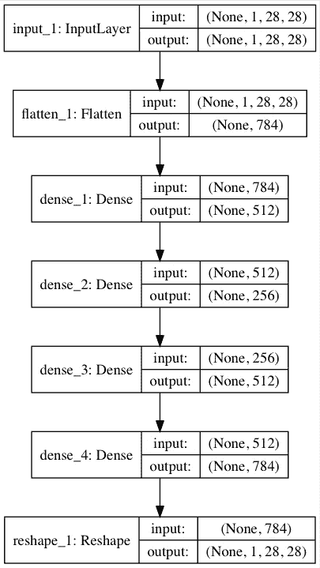

Architecture of the Baseline Model

我在训练中使用了均方误差，最佳模型在训练数据上达到了 0.0158，在验证数据上达到了 0.0208，正如预期的那样，在测试数据上达到了 0.0214。下图是测试数据集中的一个示例，显示了模型如何成功地重新排列数字 4。

From left to right: input image, target image and the image predicted by the model

该模型意识到图像显示的是数字 4，并将其旋转回原来的位置。预测仍然是一个明显的数字 4，然而，边缘有点模糊，顶部两条线之间的差距几乎消失了，这可能是低维瓶颈的结果。总的来说，该模型能够完成任务并产生可接受的结果，但是，它在一些输入方面存在问题。所有模型中最具挑战性的一张图片如下。

中间的真实图像清楚地显示了数字 4，然而，由于长的水平线，旋转后的图像有点像数字 5。该模型努力识别数字，最终得到一个水平质量，它显示的是数字 5 而不是数字 4。

## 具有转置卷积的卷积自动编码器

第二种模型是卷积自动编码器，它只包括卷积层和解卷积层。在编码器中，输入数据通过 12 个具有 3×3 内核的卷积层，滤波器大小从 4 开始增加到 16。由于卷积层没有填充，并且步长大小为 1，瓶颈的大小为 16x4x4，这意味着瓶颈中的变量数量与基线模型的数量相匹配。解码器利用转置卷积层来反映这种架构。仅使用卷积层可能看起来不寻常，但在这种情况下，目标是比较技术，而不是实现出色的结果。

就度量标准而言，这种架构无法接近基准模型。训练 MSE 损失为 0.0412，验证损失为 0.0409，测试损失为 0.0407。较大的损失可能是由于可训练参数的尺寸较小。使用卷积层将基准测试中的参数数量从大约 100 万减少到只有 23000 个。

在许多情况下，如上面的数字 9 所示，模型能够解决问题并预测与所需输出匹配的可识别数字，但一般来说，它无法生成更好性能所需的如此精细和狭窄的线条，并且生成模糊的图像，其数字难以识别，如下所示。

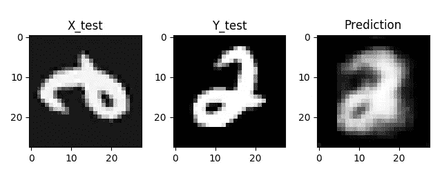

这种效果可以归因于去卷积层，因为除了边缘之外的每个像素都是作为重叠滤波器的总和而生成的。这个模型在上面考虑的复杂例子中表现得更差，不仅产生了模糊的输出，而且产生了一个类似于数字 3 而不是期望的数字 4 的数字。

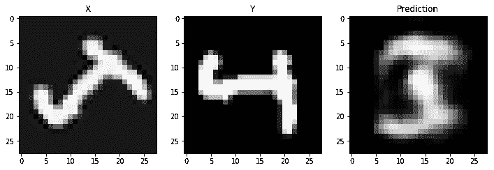

## 带上采样的卷积自动编码器

我考虑的下一个架构是具有卷积层、最大池层和上采样层的卷积自动编码器。

Architecture of the Convolutional Autoencoder with Upsampling

在训练指标方面，它获得了比基准模型稍大的 MSE 值；0.0293 关于训练，0.0293 关于验证，0.0297 关于测试数据集。但与之前的模型类似，更差的分数也带来了好处，该模型的规模不到基准的三分之一，只有 2.9 万个可训练参数，但它的表现仍然可以接受。此外，度量的狭窄分布表明，它在没有额外正则化的情况下概括得很好。

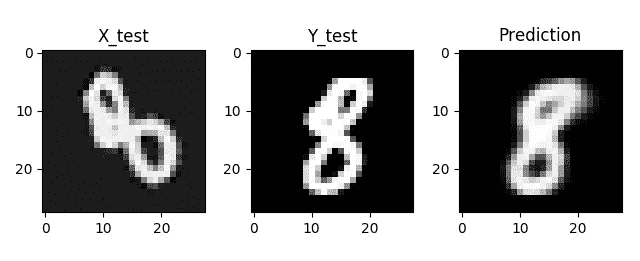

在上面的图片上，我们可以看到它仍然能够识别数字并重新排列它。它仍然稍微模糊了边缘，但没有以前的模型那么多。在这种情况下，它甚至删除了顶部循环中不重要的部分。

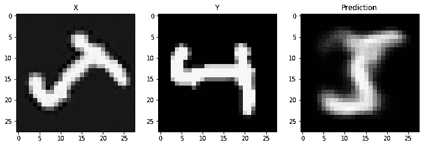

这个模型也不能识别之前讨论的硬例子，但是它比之前的模型更简单。它的输出部分类似于数字 5，这表明它在识别数字和重建数字时有问题。

## 组合模型

在看到上采样提供了更好的结果和更精确的输出后，我制作了另一个架构，它以下面的方式组合了上采样模型中的块和完全连接的层。

Architecture of the Combined model

卷积层和池层成功地取代了基准测试的第一个密集层，并产生了迄今为止最好的模型，只有 40 万个可训练参数，这仍然远远少于基准测试的大约一百万个参数。它在训练数据上实现了 0.0151 MSE 损失，在验证数据上实现了 0.0151 MSE 损失，在测试数据上实现了 0.0151 MSE 损失。它生成的情节也比以前的好。

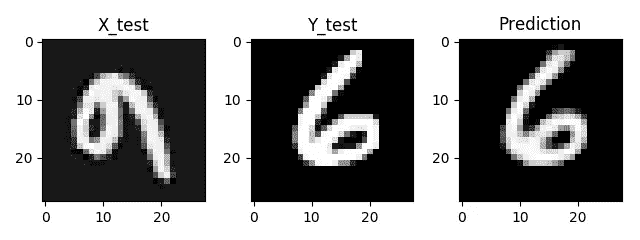

通过混合这两种类型的图层，模型能够生成更精细的线条和更模糊的图像，但重建仍然不完美，如下图所示。

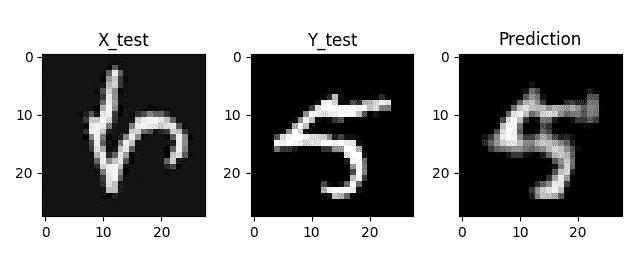

这个硬例子的问题在这个模型的输出上更加明显。

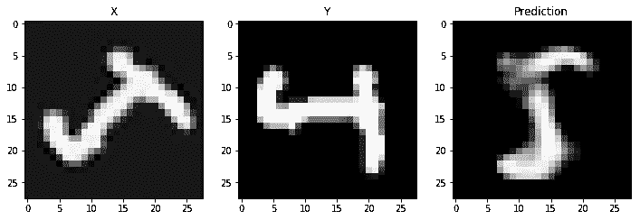

显然，该模型试图重新排列输入的数字，就好像它是数字 5 一样，这加强了这样一种假设，即该模型在这个例子中遇到了困难，因为这个数字是不可识别的。

# 评论

即使我使用 MSE 作为性能的度量，关于任务本身的一个有趣的评论是，在某些情况下，高 MSE 并不意味着错误的输出。例如，以下预测是由组合模型做出的。

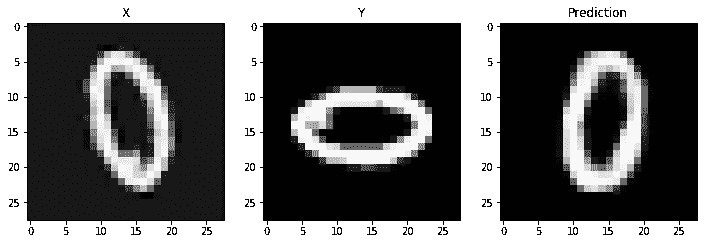

预测图像是基于输入图像预期的绘制得很好的零，但是目标图像上的数字不是以常规方式书写的，因此预测 MSE 误差很高。自然，我们不能通过神经网络来了解这些信息。此外，我之前预计模型会混淆数字 6 和数字 9，反之亦然，但输出图像显示这种情况只是偶尔发生。例如，下图显示了来自验证数据集的 upsamplig 模型的输出之一，该模型已被很好地识别，并且除了尾部模糊之外，被重构为正常的数字 9。

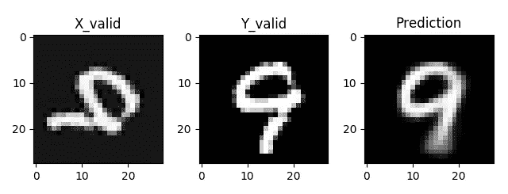

另一方面，我用来演示数据集中的困难样本的问题似乎是一个更大挑战的一部分，因为许多模型在一些情况下很难将数字 4 旋转回来。特别是，具有转置卷积层的模型很难解决这个问题，并生成了如下图像。

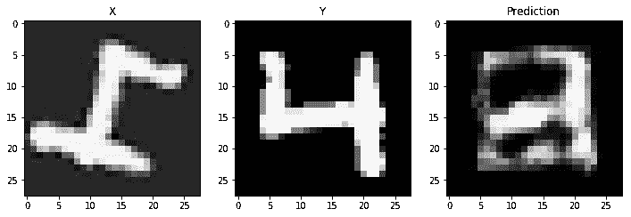

但是，其他模型也没有什么不同。例如，基线模型犯了以下错误。

令人惊讶的是，旋转数字 4 产生的图像与数字 5 甚至数字 2 有更多的相似之处。

# 结论

正如该项目所示，仔细选择模型不一定会提高其性能，但它有助于构建最简单的合适模型，从而减少过度拟合的可能性，正如我们在训练指标的较小分布中看到的那样。一般来说，使用简单的自动编码器似乎是一个合适的选择，因为它以令人满意的方式解决了这个问题，但在指标中可以观察到过度拟合的痕迹，并且它的大小明显大于其他模型。我们可以尝试通过减少中间层的节点数量或简单地省略它们来简化这个模型，但是，如果我们仍然保持 256 个大瓶颈，可实现的最低参数数量大约是 40 万个。此外，额外的正则化技术可能有助于泛化，但这似乎是不必要的，因为具有上采样层的卷积自动编码器能够在网络小十倍以上的情况下实现几乎同样好的结果。这两种类型的层的组合最终以合理的架构提供了最佳的性能。

在这篇文章中，我只挑选了一些图片来展示这些架构的性能。在链接的 Github 存储库中可以找到更多图片的更详细的评估，其中也包括 Keras 中的实现。

[https://github.com/pasztorb/Rotational_CAD](https://github.com/pasztorb/Rotational_CAD)