# 所有 ICML 甘斯/生成论文

> 原文：<https://towardsdatascience.com/all-icml-gans-generative-papers-2018-62b4521bf92?source=collection_archive---------6----------------------->

我去了斯德哥尔摩和 ICML(7 月 10 日至 15 日),理解了 academese，所以你不必这样做！域自适应，3D GANs，使用 GANs 的数据输入等等。

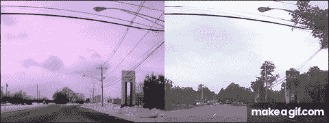

Adversarial Domain adaptation based on CycleGAN — such as CyCADA — are an interesting way to use synthetic or augmented data to help training with e.g. autonomous cars.

然而，严肃地说，我非常尊重 ICML 研究人员展示的所有令人惊叹的工作。我不可能接近他们的工作水平，所以他们推动了这个领域的发展，这是值得称赞的！

总的来说，ICML 是一次令人敬畏的经历。但这篇文章不是关于我的想法、印象或经历。该行业正在慢慢渗透到学术会议中——不管你认为这是不是一件好事——我想我可以更进一步，展示一下在这次会议上出现的从业者观点中最有趣的结果。

这意味着，如果我看不出这些学术贡献如何适用于那些最终目标并不是首先要发表论文的人，我会对一些学术贡献打折扣。这也意味着我将会使用更容易理解的语言，而不会进入任何给定的论文。我会试着用一种更容易理解的方式来表达，这也意味着我会不时地贡献一些你们可能不同意的观点和想法。我的希望是，这将是有用的，特别是对该领域的新来者，给他们一些我在准备这次会议时读过的大约 50 篇论文的背景。

很多时候，解释会变得又快又脏，因为事实上并不是每一篇论文都是严格意义上的生成性对抗网络。所以开始了。

作为我在 [Mudano](http://mudano.com/) 培训预算的一部分，我选择去 ICML，一个机器学习领域排名前三的会议。这是一次非常丰富和独特的经历。但为了从会议中获得最大收益，我决定跟踪我遇到的大多数论文。然后这些按照它们在会议中出现的时间顺序呈现。我不包括周六和周日，这两天主要是关于研讨会。[1]

11 日星期三

# [放射杆](http://medianetlab.ee.ucla.edu/papers/ICML_RadialGAN.pdf)

GANs 的承诺一直部分在于半监督学习和数据增强。这项工作基本上允许我们利用来自几个来源的多个数据集来获得更好的性能，即使一些数据集质量不高或与手头的任务无关。这是通过首先将数据集转换到某个共享的潜在空间，然后将该空间转换回手头任务的目标域来完成的。

我的想法:我真的很喜欢这篇论文。在工业上可能非常有用。也很清晰的呈现出来。我的一个同事对这种潜力感到非常兴奋。如果适用于你的问题，这篇论文真的可以改变游戏规则。

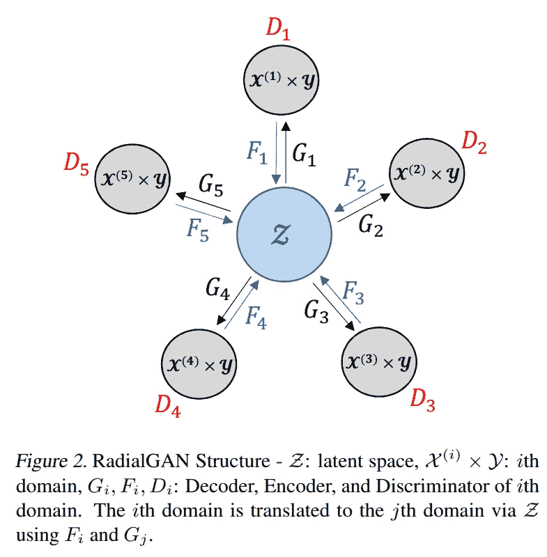

# [发现深度生成和判别模型的可解释表示](http://mlg.eng.cam.ac.uk/adrian/ICML18-Discovering.pdf)

这基本上是一种人在回路中的主动学习方式，确保我们能够最(人)有意义地解释潜在空间。潜在地降低了准确性，但是允许我们说潜在空间的哪个维度正在影响什么属性。

我的想法:潜在的有趣，因为经常计算潜在空间如何转化为生成的样本是很重要的。陈述不是很清楚。

# [GANS 的哪些训练方法确实趋同？](https://avg.is.tuebingen.mpg.de/publications/meschedericml2018)

在这篇论文中，Lars 等人提出了一种方法——从一个玩具例子开始——在整个训练过程中对 GANs 施加特定等级的梯度惩罚。他们显示的结果与最先进的(SOTA) [2]相匹配，甚至与旧的架构相匹配。作者进一步证明了 GAN 的纳什均衡附近的局部稳定性的一些有趣的性质。代码也可以在上面的链接中找到。

我的想法:相当令人印象深刻的壮举。这种技术相当复杂，但是花时间去理解可能是值得的。其他人也有类似的想法。但在这种情况下，结果是不言自明的。PGGAN-质量结果，无需渐进增长！

These images were generated by pretty standard GAN without progressive growing, just using the techniques from Lars et al.

# [卡方生成对抗网络](http://proceedings.mlr.press/v80/tao18b/tao18b.pdf)

到目前为止，这项工作连接了三个不相连的 GANs 方法—见下图。

我的想法:我对这项工作的看法是，这可能是一个重要的理论，但对从业者的用途可能有限。充分解释什么是[力矩匹配偏差](https://arxiv.org/abs/1705.08584)超出了这篇文章的范围。我们可以将 IPM 简化为简单地提取产生的和真实的分布与[推土机距离](https://en.wikipedia.org/wiki/Earth_mover%27s_distance)的差异，f-GANs 基于[f-divergence](https://theintelligenceofinformation.files.wordpress.com/2017/01/fganpapertable1.jpg?w=700)。

对于从业者来说似乎有点太复杂了。

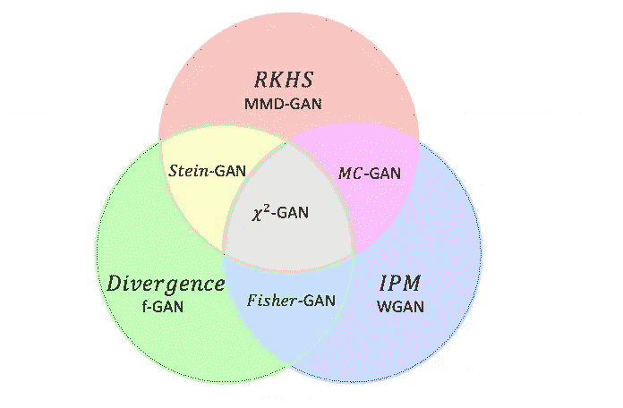

# [基于分类的 GAN 分布协变量偏移研究](https://core.ac.uk/display/129356887)

这是一个很酷的检测模式崩溃的研究。这通常是有意义的，尤其是对于试图发现培训问题的学者。这意味着我们现在终于可以开始讨论这些缺失模式和间隙的影响了。

我的想法:我认为有一个一致的/独特的基准来评估培训质量是有价值的。但是有一些我更喜欢的度量标准，但是这可能是一个整体。

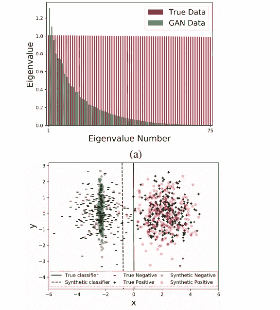

# [NETGAN:通过随机漫步生成图形](http://proceedings.mlr.press/v80/bojchevski18a/bojchevski18a.pdf)

想法:通常有趣的工作表明，GANs 可以用于生成更复杂的图形。根据链路预测精度达到了现有技术水平。

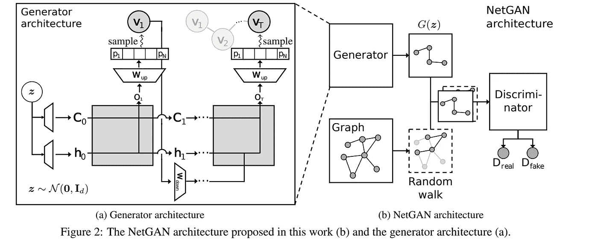

12 日星期四

# [几何分数:一种比较生成性对抗网络的方法](http://proceedings.mlr.press/v80/khrulkov18a/khrulkov18a.pdf)

这项工作表明，使用拓扑分析，我们可以构建一个通用度量来评估我们已经设法覆盖了多少原始数据集。使用一个近似值，我们可以计算出在我们生成的数据集中有多少差异。

想法:我真的对这项工作感到兴奋，因为它允许我们评估任何领域的 GANs，并检查它的模式崩溃。到目前为止，通用的评估方法完全缺失。也许有一天我们甚至会看到质量的衡量标准。

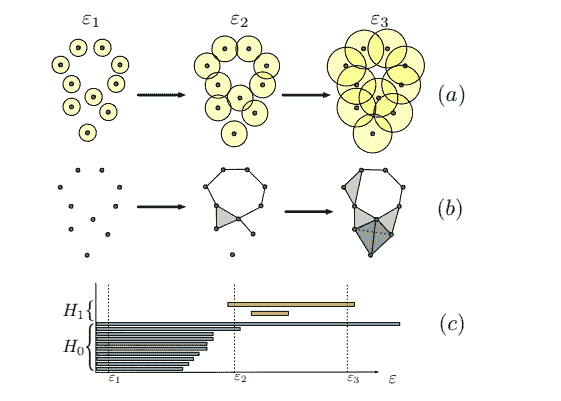

# [优化生成网络的潜在空间](http://proceedings.mlr.press/v80/bojanowski18a/bojanowski18a.pdf)

本文偏离了典型的 GAN 设置，而是着手创建一个能够生成更好样本的模型。这里，我们集中讨论模式崩溃和生成不相同但足够相似的样本的问题。

想法:我对这篇论文有一种复杂的感觉。一方面，我认为这次演讲出人意料地固执己见——对学术界来说是不寻常的——我不同意很多陈述。另一方面，非正式的海报讨论真的很好，也提供了很多信息。在这次讨论中，一位研究人员提出了一个有趣的观点，即模式崩溃是 GANs 工作的原因。这是一个有趣的论断，我很想知道这是否是真的。关于这篇论文有趣的事情是，当我研究它的时候，我发现它差点被 ICLR 拒绝，所以作者重新发表到 ICML。

# [采用局部坐标编码的对抗学习](http://proceedings.mlr.press/v80/cao18a/cao18a.pdf)

本文试图解决与上一篇论文相似的问题，但使潜在空间更加复杂。演示不是很清楚，但要点是探索流形假设，即存在从一些低维潜在空间到复杂流形(如图像)的映射。所有的 GANs 最终都依赖于这个假设，但是如果你考虑一下这个映射，你能从这么低的空间表现所有的图像似乎有点奇怪。出于某种原因，本文无法与现有技术方法相比。

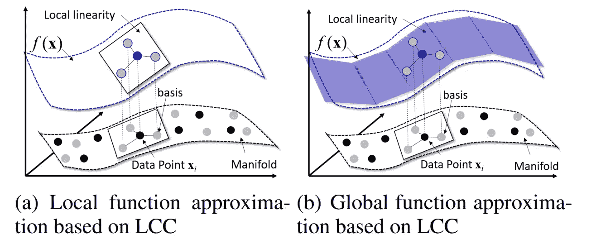

# [3D 点云的学习表示和生成模型](http://proceedings.mlr.press/v80/achlioptas18a/achlioptas18a.pdf)

谁不爱 3D 点云？太棒了。在本文中，作者创建了一个更强大的模型来生成通用对象的三维点云。虽然还有很多工作要做，但它看起来棒极了。

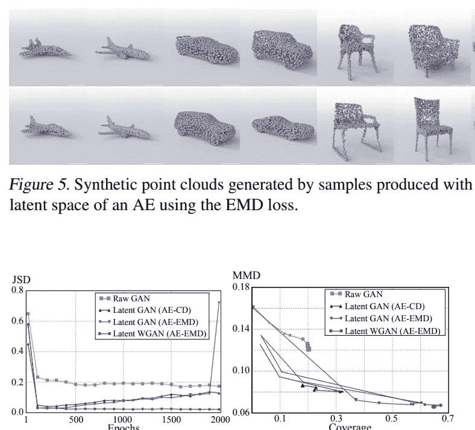

# [对立学习下的意象翻译理论分析](http://proceedings.mlr.press/v80/pan18c/pan18c.pdf)

本文分析了成对翻译 GANs，并指出成对图像到图像翻译的损失本质上有两个组成部分。确保图像正确的身份损失，以及确保图像清晰的对抗性损失。

想法:有趣的理论工作，但可能还不适合从业者。报纸上也没有照片，所以这里至少有一张模糊的(抱歉！)来自海报环节。

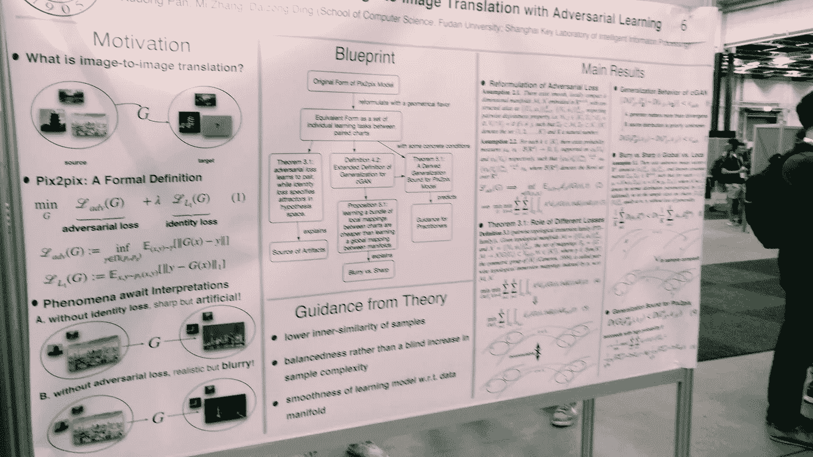

# [生成对抗模型的复合功能梯度学习](http://proceedings.mlr.press/v80/johnson18a/johnson18a.pdf)

想法:这篇文章介绍了一个更复杂的训练机制，看起来在理论上是有支持的，但是接下来创建了一个近似的版本，在训练过程中添加了一个 if 语句，这对我来说有点特别的味道。结果超越了艺术的状态，但是我通常喜欢增加较少复杂性的方法。

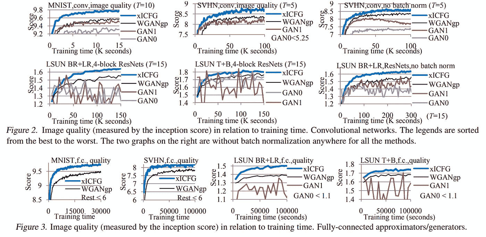

# [缓和的敌对网络](http://proceedings.mlr.press/v80/sajjadi18a/sajjadi18a.pdf)

这篇论文背后的高层次思想很有趣。与 PGGAN 相似，作者认为 GAN 从一开始就面临的问题有点太难了。因此，作者创建了一个网络，将图像变形一点，这样生成器就更容易工作了。一个腐朽的版本，胜过最先进的。

# [使用代表性特征改进生成性对抗网络的训练](http://proceedings.mlr.press/v80/bang18a/bang18a.pdf)

本文主要是将生成的图像的自动编码版本连接起来，作为帮助传递给鉴别器。作者的海报非常清晰地描述了该建筑，但不幸的是，这些图片似乎已经从我的手机中消失了。

他们的结果比最先进的要好，但也差不了多少，所以我不确定这是否真的是一个突破。

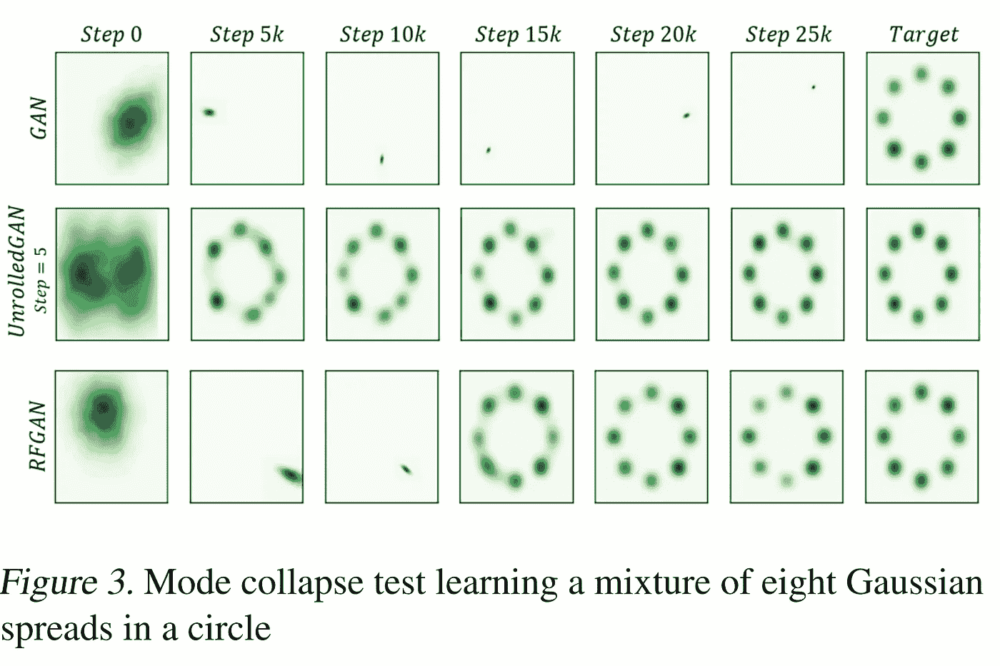

# [精确的 GAN WASSERSTEIN 距离的两步计算](http://proceedings.mlr.press/v80/liu18d/liu18d.pdf)

本文引入线性规划来计算 Wasserstein 距离的精确值，然后用它来改进训练。Wasserstein 距离的问题是，当你考虑到即使是简单的点云的组合有多复杂时，计算精确的距离似乎也很复杂。本文实现了这一点，并超越了现有技术水平

本文用作基准的数据集既简单又有限(MNIST，CIFAR-10)，所以我很想看看这种方法在 Celeb-A HQ 或 IMAGENET-1000 上的表现如何。

# [发电机调节与 GAN 性能有因果关系吗？](https://arxiv.org/abs/1802.08768)

和其他一些论文一样，我几年前就读过这篇论文了，但是作者做了很好的工作，简明扼要地总结了结果，尤其是对海报而言。基本上，它们使用雅可比箝位来抑制生成器更新，从而实现更稳定的训练。性能没有实质性的提升，但是稳定性的提升是值得的。

作为一个从业者，如果你有 GAN 稳定性的问题，这是可以尝试的论文。

# [GAIN:使用生成式对抗网络的缺失数据插补](http://proceedings.mlr.press/v80/yoon18a/yoon18a.pdf)

这篇论文可能是从业者最感兴趣的论文之一，因为它处理了一个我们很多人都会遇到的问题——缺失数据。它创建了一个带有提示机制的 GAN 设置，基本上可以智能地推断出缺失值以匹配分布。我们知道 GANs 擅长创建合成分布。提示机制是必要的，因为鉴别器的问题太难了——有许多部分缺失/真实数据的组合有效排列使得这变得难以处理。

我已经向我的一些同事推荐了这篇论文。说够了。

# [具有有限查询和信息的黑盒对抗性攻击](http://proceedings.mlr.press/v80/ilyas18a/ilyas18a.pdf)

这是为数不多的现实对抗性攻击论文之一。技术上不涉及 GAN /生成模型——我猜除了干扰——但非常有趣，做对抗性攻击的现实方式。

我仍然不认为深度学习模型足够广泛，也不认为对它们有足够的信任会造成任何真正的伤害，但这篇论文[讨论了真正的问题。](https://www.youtube.com/watch?v=kgTocVLNvYI)

# [一阶生成敌对网络](http://proceedings.mlr.press/v80/seward18a/seward18a.pdf)

本文背后的思想是，在梯度惩罚(如 WGAN-GP)的情况下，不是针对 WGAN 损失进行优化，然后添加惩罚，而是直接针对损失进行优化。作者表示，当针对损失进行优化，然后添加惩罚时，会出现病态情况，使得生成的分布本身不太接近目标分布。海报周围有一些非正式的拷问(不是我)/证据，但我不会让作者这样做，哈哈。

# [利用强化对抗学习合成图像程序](https://deepmind.com/blog/learning-to-generate-images/gans/)

在这里，我不是链接这篇论文本身，而是链接 DeepMind 的一篇出色的博客文章，这篇文章很好地解释了这篇论文。TL；甘博士使用类似 Photoshop 的 API 生成笔触，很好地学习了任意绘制。

# [MAGAN:对齐生物歧管](http://proceedings.mlr.press/v80/amodio18a/amodio18a.pdf)

好的，所以我现在很确定 MAGAN 代表多种排列 GAN(虽然在演示中没有提到)，但当我第一次看到一个美国人介绍它时，我认为它有一些政治内涵，哈哈。这种 GAN 基本上通过增加对应损失来确保我们总是以相同的对应来对齐两个流形(而不是像其他算法那样随机对齐)。

有趣的花絮，在演讲后的一个“问题”中，有人声称已经有一家报纸在做这件事了。作者不知道这篇论文。你的想法？

# [对抗性事件时间建模](http://proceedings.mlr.press/v80/chapfuwa18a/chapfuwa18a.pdf)

在与 GAIN 论文类似的领域，除了现在专注于时间序列，并基本上获得了某些事件的时间分布的更好的概率分布(基本上能够自动推断),例如医院环境中的并发症。

可能对处理时间序列的人非常有用。

# [苏铁:周期一致的对抗性领域适应](http://proceedings.mlr.press/v80/hoffman18a/hoffman18a.pdf)

这篇论文讨论了一个问题，这个问题是很多从业者反复发现的:我们的模型不能一般化(原谅这个笑话)。通常，您可能会采用一个模型，例如在 ImageNet 上训练的模型，部署它，然后发现它表现很差。因为现实世界比 ImageNet 复杂得多，即使我们只关心 ImageNet 类。CyCADA 扩展了 CycleGAN，基本上能够使用正确的语义进行域到域的翻译，从而有可能在安全、可扩展的计算机生成环境中构建例如自动驾驶汽车，然后将 ML 系统翻译到现实世界中。

真有意思！一定会尝试。

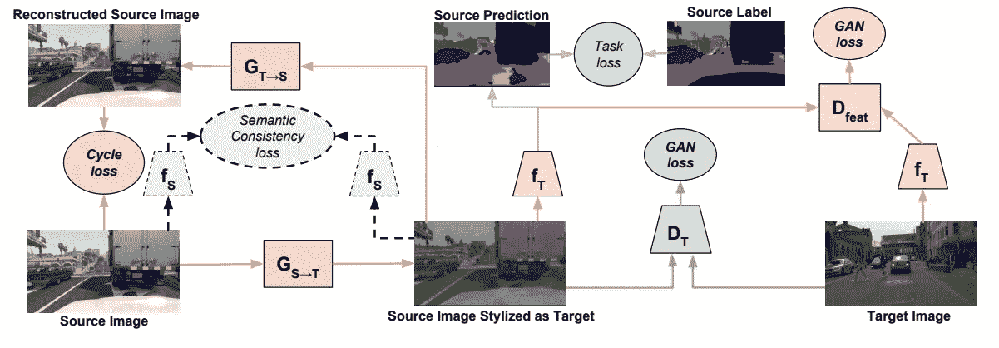

# [用于生成建模的自回归分位数网络](http://proceedings.mlr.press/v80/ostrovski18a/ostrovski18a.pdf)

所以从技术上讲，这篇论文没有什么内容。“只是”自回归模型，但它们取得的结果可与 GANs 的最新技术水平相媲美。非常令人印象深刻的工作，但与每个自回归模型一样，这种设置将难以扩展。演讲结束后，作者提议使用自动编码器来扩大规模，但这带来了一系列其他挑战。

有趣的方法，但类似的(尽管质量较低)作品已经出现，从未超过 32x32 像素的限制，这里也是如此。在这个问题解决之前(许多人已经尝试过了)，不确定这是否真的是可扩展的；另外请注意，甘已经在 1024x1024。

# [用于 GAN 训练的混合批次和对称鉴别器](http://proceedings.mlr.press/v80/lucas18a/lucas18a.pdf)

与常规 GAN 不同，本文使用混合批次的真实和合成数据来使鉴别器更好。正如作者在总结中所说的“一个简单的架构技巧使得有可能可证明地将批处理的所有函数恢复为一个无序集”。

我真的很喜欢这篇论文，因为它是一个优雅的想法，而且摘要实际上总结了这篇论文。这是否会成为主流框架还有待观察，但是我认为作者引用其他架构的方式有点奇怪(他们都来自一篇论文)。

# [JOINTGAN:利用生成对抗网的多领域联合分布学习](http://proceedings.mlr.press/v80/pu18a/pu18a.pdf)

在这里，作者有一个类似于 CycleGAN 的架构，但不是单独推断条件分布，而是联合学习每个域的边际概率分布。我们从产生 X 的噪声开始，然后在从边缘产生 Y 时以 X 为条件。

我发现演示有点不清楚，但结果似乎真的很有趣。文本生成似乎真的令人印象深刻，但作者说这实际上是由自动编码器从 GAN 生成的潜在空间中完成的。

# [AUGMENTED CYCLEGAN:从未配对数据中学习多对多映射](http://proceedings.mlr.press/v80/almahairi18a/almahairi18a.pdf)

通过在第一代和第二代中注入潜在空间，这是对标准形式的 CycleGAN 的一个非常好的扩展。回想一下，周期一致性损失是用 diff(X1，X2)来度量的，其中 X1 -> Y -> X2。基本上，作者给了我们额外的变量来创建具有特定质量的样本。例如，如果我们在 Y 域中有一只鞋的轮廓，我们可以在 X 域中生成一个样本，其中同一类型的鞋是蓝色或橙色或我们选择的任何颜色。

如果你喜欢 CycleGAN，但想更多地控制翻译，你会喜欢这个。

# [论 GAN 动力学中一级近似的局限性](http://proceedings.mlr.press/v80/li18d/li18d.pdf)

这是一篇纯理论论文，主要只是在简单例子的层面上进行推理。关键是解释为什么多次鉴别器更新可能是有意义的。本文将它发挥到极致，在最佳鉴别器的情况下，显示出良好的收敛性。但除此之外，目前从业者可能不感兴趣。

ICML 的生成性对抗性网络论文到此结束。我希望你觉得这很有用，如果你想让我在 12 月去的地方制作《来自日本》(或者写一篇关于如何充分利用会议的文章),请告诉我。

感谢凯伦·特里普勒和[米哈伊·尔玛柳克](https://dawn.cs.stanford.edu/benchmark/)的想法和评论！

**想加入对话吗？详见******或推特**[**@ langrjakub**](https://twitter.com/langrjakub)**！我也正在写一本关于** [**生成性对抗网络的书，你可以在这里查看**](https://www.manning.com/books/gans-in-action?a_aid=gans-action&a_bid=fd02700a) **。****

**[1]我去了可重复的机器学习，这应该是大多数机器学习从业者所熟悉的。但是如果有兴趣的话，我也可以读一下。**

**[2] SOTA 只是意味着在这个基准上打破以前最好的学术成绩。例如， [DAWNBench](https://dawn.cs.stanford.edu/benchmark/) 是目前在 Imagenet 上达到 93%分类准确率的最先进的存储库。**