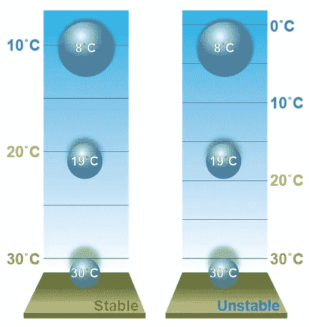
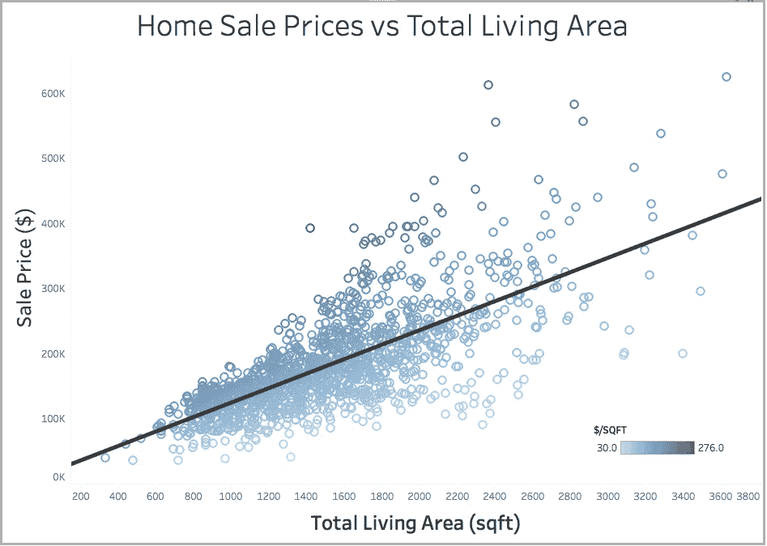
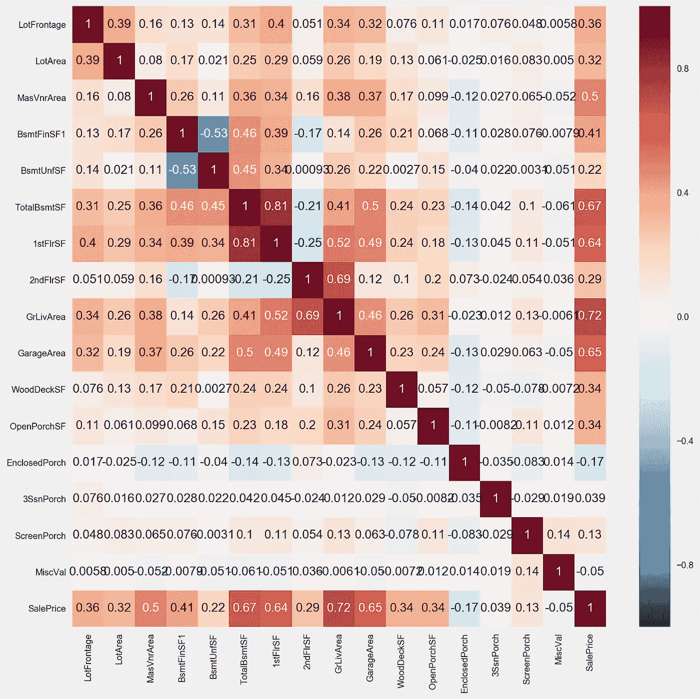

# 所有模型都是错误的:第 3 周数据科学沉浸式

> 原文：<https://towardsdatascience.com/all-models-are-wrong-week-3-data-science-immersive-41dad7cc50d9?source=collection_archive---------3----------------------->

## 机器学习中的模型选择和我第一次 Kaggle 比赛的结果。

著名统计学家乔治·博克斯提出了一个经常被引用的观点:“所有的模型都是错误的。”根据我创建和解释金融模型的经验，我不得不同意。模型是一种有缺陷的尝试，试图用简单的术语描述一种复杂的关系，同时在此过程中做出许多假设。然而，模型也是有用的。他们有能力让我们的生活变得更好。

天气预报是模型力量的一个很好的例子。气象学家从气象气球上收集数据，这些气球被释放到大气的不同层次，并报告观测结果，如空气密度、压力、湿度和温度。这些气球数据被输入到一个预测模型中，这个模型的核心使用了“空气包裹”的简单概念。空气包可以被认为是一个盒子或气泡，其行为符合流体动力学定律。该模型使用这些定律来计算电流梯度的估计值(环境温度、压力等的差异)。)影响气团，然后将梯度的变化率扩展到我们所依赖的 7 天预报中。

Visualization of Air Parcels — [http://www.srh.noaa.gov](http://www.srh.noaa.gov)

天气预报模型是否给了我们大气未来(甚至当前)状态的完整知识？不，大气是混乱和动荡的，模型只是近似大块空气的行为，让气象学家充满信心地说，“一个低压系统正在移动，这可能意味着本周末会下雨。”虽然这些天气模型确实有点复杂，但重点是这些模型——现实的简化版本——可以让我们处理生活中的决定——比如是否推迟周六的野餐。

数据科学中一个反复出现的主题是，我们试图选择一个模型(或几个模型)来满足我们的目的。最常用的预测机器学习模型之一是线性回归。为了形成一个线性回归模型，我们手工挑选了一些变量或“特征”，其中每个特征都被假设对最终值“目标”有一个可量化的(标量)直接影响从单一线性关系开始，特性的递增与目标的成比例增加或减少相关联。这种关系可以是积极的——你的房子每增加一平方英尺就会增加它的增值——也可以是消极的——每增加一项信用活动就会降低你的总体信用评分。

Simple Linear Regression with One Feature (Living Area) and One Target Variable (Sale Price)

单一线性关系的概念然后扩展到多变量关系，其中我们结合(添加)每个增量变量的影响来计算最终的目标值。在此过程中，我们将通过权衡每个变量的影响来测试和调整我们的计算，并添加一个常数项来调整基本情况。一个重要的注意事项是，在线性回归中，目标始终是通过扩展从以前实例中学习到的关系来计算新实例的预测值。

数据科学家必须能够识别线性回归是模型的正确选择的情况。如房价和信用评分示例所示，线性回归很容易推广并应用于各种数据集。然而，只有当数据集满足一些基本要求时，它才是合适的。这些要求包括目标预测必须是连续的，每个特征应该独立于其他特征，并且每个特征必须与目标具有近似线性的关系。

本周，我应用我的线性回归知识，开发了一个预测模型，参加了爱荷华州埃姆斯市房屋价格数据集的 Kaggle 竞赛，链接如下:[https://www . ka ggle . com/c/house-prices-advanced-Regression-techniques](https://www.kaggle.com/c/house-prices-advanced-regression-techniques)。在这篇文章的剩余部分，我将概述这个挑战，描述我的方法，并分析我的结果。

概述:

Kaggle.com 提供了 2006 年至 2010 年间售出的 1500 套房屋的“训练”数据集。对于训练集中的每一笔房屋销售，我们都会得到销售价格，以及其他 79 条可能影响销售价格的潜在信息。这里是这些特征的一个例子:总的宜居平方英尺，以平方英尺为单位的地段大小，卧室数量，建造年份，砖石饰面类型，地下室装修类型，等等。

对于这个练习，我所有的工作都是在 Jupyter 笔记本上，使用 Python、Pandas 和 Scikit-Learn 库。要了解更多细节，请查看我的公共 GitHub 上的 Jupiter 笔记本“Ames-Submit.ipynb”文件:https://github.com/eversdyk/kaggle-linreg-ames-housing。

第一步:数据探索。

在将数据导入我的 jupyter 笔记本之前，我花了大约一个小时阅读数据集作者的文档，让我对每个功能的可能值以及它们如何影响销售价格有了一个很好的概述。然后我拉了拉。csv 训练文件到我笔记本上的熊猫数据框中，并进行一些探索性分析。在此期间，我发现许多列都有需要处理的空值。我还做了一个功能相关性的快速热图，让我了解影响销售价格的驱动功能。

Continuous Variables Correlation Heat Map

步骤 2:清理测试数据。

首先，我重新排列了 79 个特征，按照变量类型对它们进行分组:连续型、离散型、有序型和分类型。接下来，我检查了每个变量的空值，并适当地填充了它们。对于数值，我用该列的平均值填充了少量缺失的点。对于其他人，我根据其他专栏进行了猜测。例如，在缺少的“车库建造”年份中填入房屋建造的年份。缺失的类别值大多用众数或该类别中出现频率最高的值来填充。对于最后两个清理步骤，我为分类变量创建了‘dummy’布尔列，最后对所有列的值进行规范化，使它们保持在-1 和 1 之间。这种归一化是保持每个要素的最终系数或权重更加平衡的好方法。

第三步:创建一个模型并检查它是否有效。

最初，我尝试了一个简单的线性回归模型，我使用 KFolds 方法对其进行了 10 次训练和拟合。这种 KFold 策略是一种将数据分解成块以进行快速训练和预测的常用方法，它减少了训练数据中异常值的影响。快速检查我的 R 平方值显示，这是…完全胡说八道。R 平方度量是由给定模型解释的响应数据可变性比率的度量。它预计位于 0%到 100%的范围内，其中 0%意味着你的模型不会比平均响应值的随机猜测更好，而 100%意味着你的模型每次都会完美地确定每个家庭的正确销售价格。我的值是一个非常小的数字，接近于零，这意味着我需要做更多的工作来找到一个有用的模型。

第四步:改进模型，或者尝试另一种技术。

幸运的是，本周我们学习了一种叫做“套索”的技术顾名思义，套索法通过关注变量的一个更小的子集来简化线性回归。简而言之，Lasso 会将冗余要素的权重强制为零，从而消除一些会影响线性回归近似的共线性问题。这一次，R 平方得分显示销售价格预测接近 90%，这意味着我们的模型非常好，解释了测试数据中 90%的可变性。使用 Scikit-Learn 的一个名为 GridSearch 的特性，我还对 Lasso 最重要的参数——惩罚值 alpha——做了一些调整。这让我的分数提高到了 91%左右。在这一点上，我有足够的信心根据我还没有接触过的测试数据做出一些预测。

第五步:查看模型是否对测试数据有效，并将结果提交给 Kaggle。

到目前为止，我只处理过训练数据。训练数据包含特征(售出的每套房屋的 79 个变量)和响应(其销售价格)。现在是使用测试数据验证我的模型的时候了。测试数据集包含埃姆斯市销售的 1000 多个新房屋实例的信息(相同的 79 个特征)，这次没有列出销售价格。我获取了这些新数据，并完全按照之前清理训练数据的方式对其进行了转换:组织特征，填充它们的空值，创建虚拟变量，并对所有值进行规范化。由于该模型之前已经与定型数据相匹配，因此它可以为测试数据集中的每个观察值预测销售价格。模型做出了它的预测，我给了他们一个快速的视力测试，以确保他们在正确的范围内。然后，我将预测的销售价格上传到 Kaggle 进行评分。

我的预测结果是用均方根误差法评分的，这是一种衡量我的预测与实际有多接近的方法。值越低越好，我的分数低到足以让我在排名中接近中间。对我的第一场比赛来说还不错！

我仍然不熟悉数据科学和机器学习模型，但第一次比赛是一次宝贵的经历，让我磨练了我的技能。我对我的过程很满意，尽管我会第一个指出我在清理和组织数据时可以做出的改进，比如编写函数来处理批量清理操作，或者以不同的方式填充空值。代替使用套索方法，我可以使用脊或弹性网方法来惩罚系数。我还希望有其他更复杂的连续值预测模型，我还没有学会。

所有的模型在技术上可能都是错的，但是它们可以让我们非常接近解决方案。作为一名数据科学家，我的工作是为每种情况找到合适的模型。