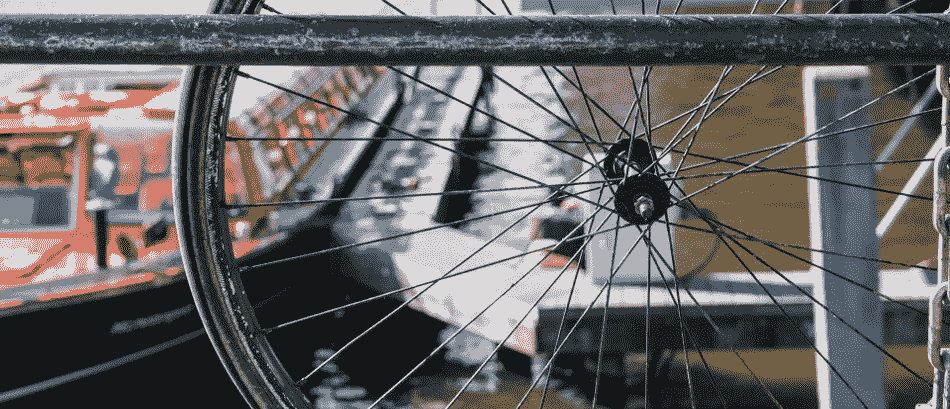
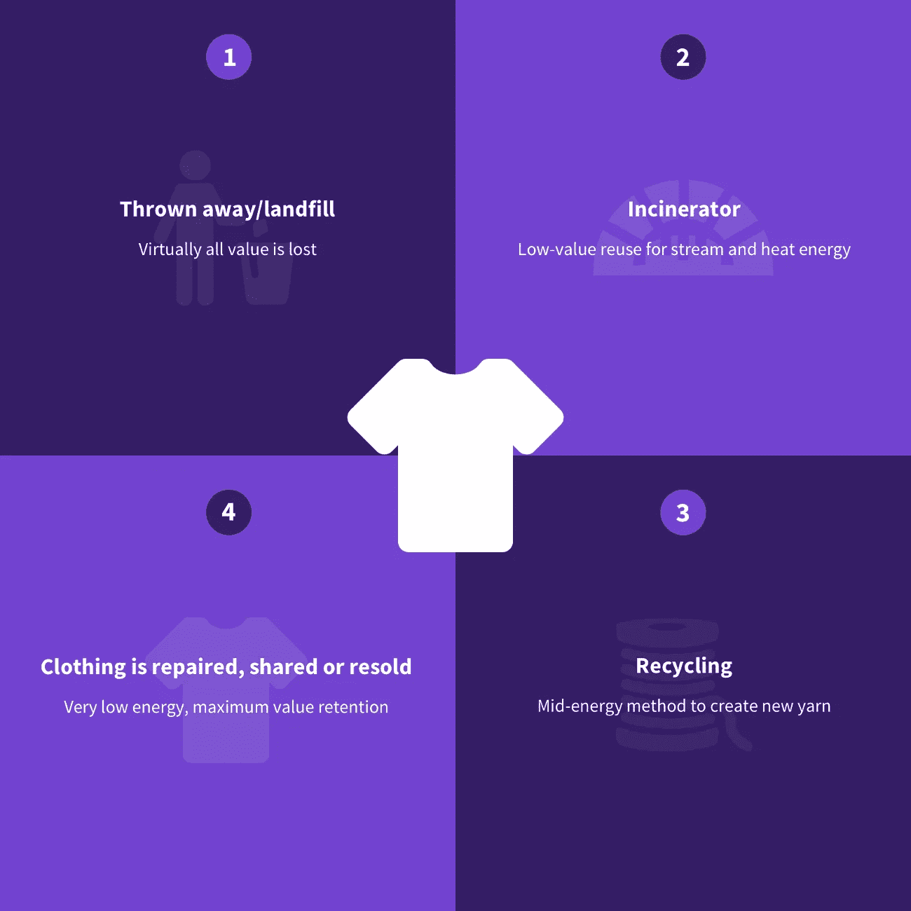
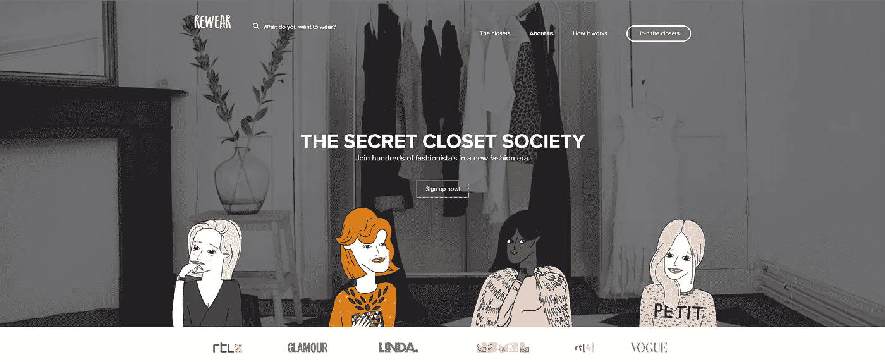
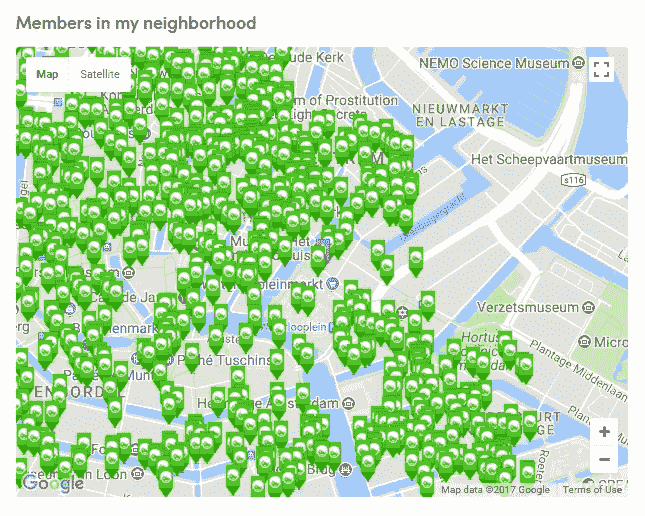
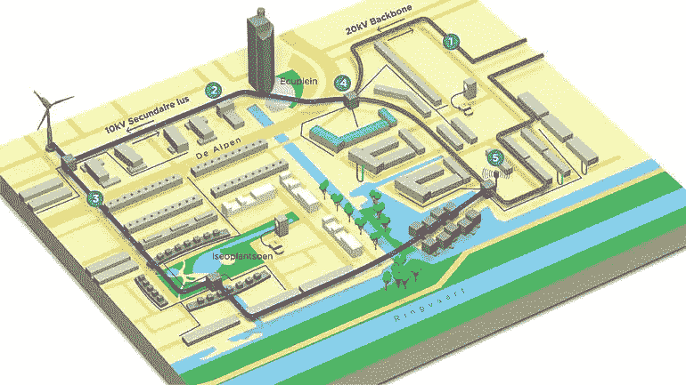
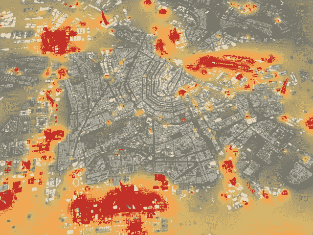
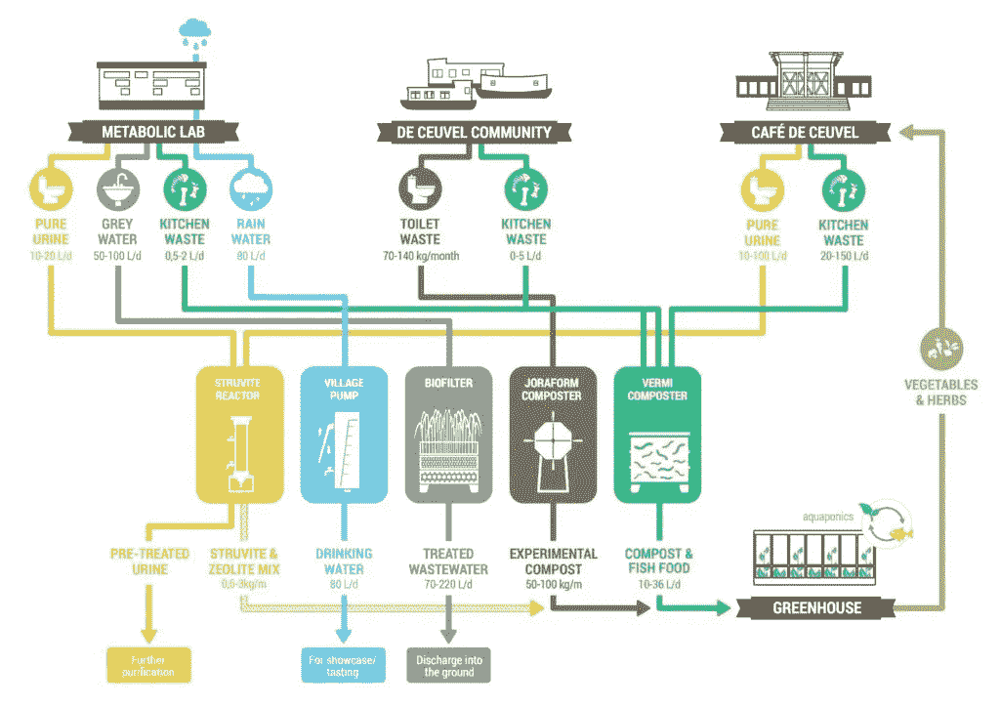
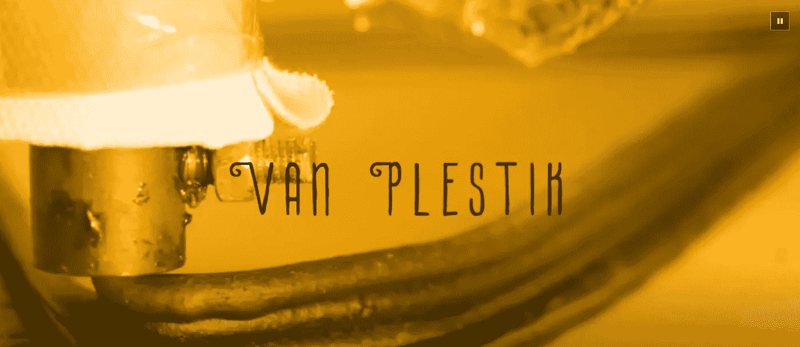

# 阿姆斯特丹的环境救星:循环经济

> 原文：<https://towardsdatascience.com/amsterdams-environmental-saviour-the-circular-economy-c83200222e61?source=collection_archive---------4----------------------->

# 对于这座高科技城市来说，节能减排是不够的

原材料是一种有限的资源。随着依赖这些资源的行业数量的增加(如智能手机和平板电脑的金属)，消费者的数量也在增加。在未来的几十年里，我们不仅将开始耗尽这些材料，而且其提取和制造过程往往对工人、公民和环境有害。

从长远来看，依赖原材料在经济上是不可行的。随着库存的减少，资源市场变得越来越不稳定。世界上每个国家都交易自己的原材料，所以如果这些环节中的一个环节无法再交付，整个供应链都会受到影响。到 2050 年，荷兰政府希望荷兰完全依靠可再利用的原材料。**所以阿姆斯特丹市正在试验一个解决方案:循环经济。**

# 什么是循环经济？

目前的系统是线性的。我们获取资源，制造产品，然后在完成后处理掉它们。**循环经济旨在封闭循环，以尽可能保留更多价值的方式对废物进行再利用、再利用或回收**。这包括减少制造过程中的热力学熵，并尽可能避免向下循环。如果你用一件旧棉布衬衫作为例子:

# 重复使用圆圈

*   维修和维护以延长产品的寿命
*   重用和再分发(转售/共享)
*   翻新、翻新和再制造
*   回收部分或全部材料

制造商必须提前考虑，创造易于拆卸和重复使用的产品——所以在这种情况下，考虑纯棉而不是混纺。另一个想法是公司租赁产品而不是出售。所以租赁洗衣机给你的公司会负责维护和修理。然后，当机器达到其寿命的尽头时，他们将收集它并重新使用这些材料，而不是必须挖掘新的材料。**随着数据科学、存储能力和机器学习的进步，这些物流系统正开始成为现实。**

荷兰银行 ABN·AMRO 刚刚在其总部阿姆斯特丹开设了荷兰的第一座圆形建筑。几乎所有使用的材料都是可回收的，当建筑最终被拆除时，它可以很容易地拆卸，所有材料都可以重复使用。Circl 大楼拥有循环解决方案，如由员工的旧粗斜纹棉布牛仔裤制成的隔热材料、拆除办公楼的窗框和屋顶上的 500 块太阳能电池板。

# 有什么好处？

# 环境的

*   通过重复使用物品，从产品转向服务(非物质化)，生产的产品会更少。从而减少制造业的排放和污染物
*   任何产生的排放都将被重新利用。二氧化碳可以用来在温室中种植农产品，培养藻类来制造燃料，甚至可以被矿化。冰岛的一个研究小组发现，将二氧化碳溶解在水中，并与包括玄武岩在内的混合物一起注入地球，95%的二氧化碳将在两年内矿化为方解石
*   废品被重新利用。有机/生物废物可用于牲畜饲料、沼气甚至生物塑料
*   仅在荷兰，循环方法就可以减少 8%的二氧化碳排放，减少 2180 千米的土地使用，减少 7 亿立方米的水消耗，减少 25%的原材料进口

# 商业

*   可持续性优先于利润，因此公司的寿命得以延长
*   循环经济确保优化能源消耗，减少浪费。这两者都有助于提高生产效率，从而节省资金
*   回收材料意味着公司不必购买新的资源，从而避免市场价格波动和库存减少
*   通过采取更环保的方法改善与政府和消费者的关系

# 经济的

*   将经济从有限的线性系统中分离出来
*   与提取原材料相比，资源节约高达 70%
*   循环系统创新和数据科学中的新经济
*   一个新的劳动密集型的回收和维修就业市场
*   减少生态足迹
*   在荷兰，循环经济可以为政府带来 73 亿€，并创造 54，000 个新的工作岗位

(数据来自艾伦·麦克阿瑟基金会和循环合作)

# 阿姆斯特丹的合作经济

在我们的[智慧城市文章](https://www.eli5.io/blog/8-years-on-amsterdam-is-still-leading-the-way-as-a-smart-city)中，我们谈到了城市的协作性质。阿姆斯特丹分享城市的一项研究证实了这一点，84%的居民表现出分享的动机。**从产品中获取最大价值是创造循环经济的第一步**。由于出色的 ICT 结构，该市 90%的地方都可以上网，因此阿姆斯特丹的初创公司一直在与市政当局合作，创建居民可以相互分享的应用程序和平台。

# 重新穿上

一个在线社区平台，由我们 Eli5 的创始人设计。用户可以将他们的设计师衣柜出租给其他时尚人士，这样衣服就能得到最大限度的利用。此外，用户可以通过租金来减轻对银行账户的打击。

# 皮尔比

超过 20%的二氧化碳排放来自耐用消费品。平均而言，这些资产的使用寿命只有 10%。Peerby 是一款为分享这些物品而制作的应用。用户可以拯救环境，节省购买物品的时间，节省购买昂贵物品的费用，并结识许多友好的人。该平台几乎涵盖了你能想到的任何物品。从汽车、自行车和旅行用汽车；到聚会的凉亭、烤肉架和折叠椅。

# 闭环——将废物转化为材料

显然，共享经济首先没有产品来共享是行不通的。生产这些产品仍然会导致二氧化碳排放、有毒污染和其他形式的废物。阿姆斯特丹经济委员会的目标是通过将废物流与企业联系起来，来结束这一循环。

# 区域热网

许多制造过程会产生热量，这些热量通常作为废物通过水或空气处理掉。阿姆斯特丹经济委员会已经召集了 32 个政府机构、能源公司和热能生产商来将热能输送到家庭。

在阿姆斯特丹的 Houthaven 区，一所新的学校和住宅楼将使用该网络供暖，并使用 IJ 河的水进行冷却。**与使用传统锅炉和空调系统的公寓相比，社区中的每个家庭排放的二氧化碳将减少 80%。**

Sanquin 血库已经与 Waternet(阿姆斯特丹自来水公司)建立了联系，在冬季也可以使用饮用水的冷能。这将最初储存为热能，用于 Sanquins 制药过程。他们期望在最初几年提取 20，000 千兆焦耳的能量。人们还期望家庭能够节省金钱和能源，因为这一过程提高了饮用水的温度，用户在家中加热水所需的能源将会减少。

# 智能电网

智能电网是阿姆斯特丹最初的智能城市计划之一，其重点是储存和回收剩余能源。与欧盟的城市禅项目合作，太阳能电池板被安装在整个城市，以收集全天的能量。然而，一旦他们的电池达到最大容量，就没有更多的电可以储存，宝贵的日光就浪费了。增加产能需要在基础设施上进行昂贵的投资。

在该市组织的黑客马拉松 Appsterdam 上，获胜的解决方案是使用电动汽车电池作为存储。这就产生了一个临时的“虚拟发电厂”,同时政府建造了一个更大的储存库。智能电网还将允许太阳能电池板所有者使用智能电表平台将多余的能量卖回给供应商。所以每个太阳能电池板都被充分利用，总有地方可以储存产生的能量。

信用:阿姆斯特丹智能城市

# PUMA —城市采矿

PUMA 是来自莱顿大学、代尔夫特理工大学、Waag 协会和代谢的研究人员的合作项目。该研究项目旨在发展城市矿山的理念，并绘制阿姆斯特丹地质图，以显示某些金属(如铜)的存在。PUMA 团队希望创建一个城市建筑及其材料构成的数据库，因此未来有可能开采这些资源。

鸣谢:Waag 社会生活实验室

# 别克斯洛特汉姆

作为 2016 年欧洲创新之都奖的获得者，阿姆斯特丹经常被描述为“活实验室”。北面的 Buiksloterham 是以用户为中心的开放式创新生态系统的最佳范例。

Buiksloterham 以前是许多制造企业的所在地，包括一家飞机制造厂、石油实验室和造船厂，在 2008 年经济危机之前一直被指定为私人开发项目。由于无力自行出资建设，该市向希望自建环保住宅的可持续企业和居民开放了该地区。中央车站对面的滨水区现在布满了初创企业、循环企业和新住宅。

# 德塞韦尔

De Ceuvel 建在一个旧造船厂的旧址上，几乎完全是圆形的。这片土地已经被严重污染，所以选择了在 10 年租期结束时能够自然解毒的植物。

与此同时，办公室工作区建在高架平台上，使用不再使用的升级船屋。还有一个咖啡馆和餐厅，由重新利用的木材和回收船及其他零碎材料制成的户外座椅建成(当夏天到来时)。还有:

*   堆肥厕所，因为受污染的土地阻止挖掘污水系统
*   热交换器，收集 60%离开办公室船只的热量，并进行再循环
*   水生植物过滤器，用于处理废水
*   每年产生 36，000 千瓦时电力的太阳能电池板
*   鸟粪石反应器，从有机废物中制造肥料
*   和一个生产鱼和蔬菜的水培温室

信用: [deceuvel.nl](http://deceuvel.nl/)

# 阿姆斯特丹的下一站是哪里？

欧盟、荷兰政府和阿姆斯特丹市政当局都实施了鼓励循环经济创新的计划和激励措施。例如，van Plestik 是一家位于 Buiksloterham 社区的公司。他们创造了一种 3D 打印机，可以使用混合和不纯的塑料将废物升级为家具和其他产品。当你考虑到传统的 3D 打印机必须使用塑料，必须提炼回近乎纯粹的“原始”形式时，这是一个重要的里程碑。在帮助下，这家初创公司在短短几个月内的旅程是这样的:

*   创作者从 2016 年初开始，通过与 3D 打印和城市建设专家 Hogeschool van Amsterdam 和 CRE8 合作，研究用回收塑料打印
*   到那年 5 月，该项目入围了由欧盟主要的气候创新倡议组织举办的气候启动平台竞赛。该计划为他们提供了一个为期 4 天的研讨会流程，专家可以帮助他们加快业务发展
*   2016 年 9 月，他们被选为驻阿姆斯特丹创业计划的成员，并获得了为期 5 个月的每周培训，以发展他们的公司

van Plestik 现在已经建造了他们的第一台工作打印机，并在 2017 年 6 月赢得了“阿姆斯特丹，让你的城市”奖，以进一步发展他们的循环回收项目。

信用: [vanplestik.nl](http://vanplestik.nl/)

Amsterdam Economic Board 的下一阶段是建立一个循环数据平台，将所有的研究、业务和已经创建的系统结合在一起，类似于智能城市的[城市数据平台。其主要目的是存储阿姆斯特丹的资源和垃圾流数据，以确保该城市能够最有效地利用每一种资源。**该平台还将成为企业和公民收集和分享数据、讨论可持续发展战略以及为那些希望减少环境影响和实施循环战略的人提供建议的地方。**](https://www.eli5.io/blog/8-years-on-amsterdam-is-still-leading-the-way-as-a-smart-city)

这方面的一个例子是阿姆斯特丹的一家名为因斯图克的餐厅，这家餐厅使用了原本会被浪费掉的食物。它依赖于 Albert Heijn 超市的废物流，但希望通过该平台找到其他供应商。

循环数据平台的最终目标是为每一种材料提供通行证，这样原材料的供应就不会流失到垃圾填埋场和其他低价值的废物处理方法中。与此同时，阿姆斯特丹市政府将继续举办循环创造挑战等活动，以鼓励持续创新，实现完整的循环经济。