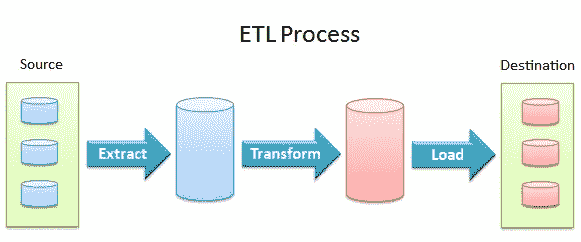
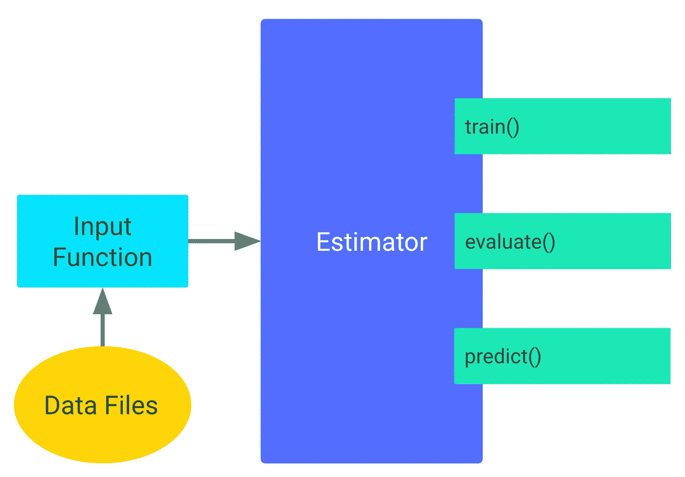
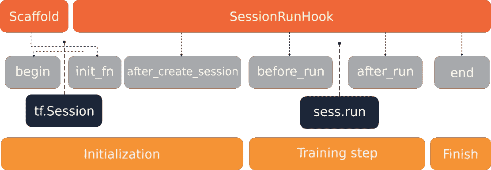

# 张量流估计类的一个高级例子

> 原文：<https://towardsdatascience.com/an-advanced-example-of-tensorflow-estimators-part-1-3-c9ffba3bff03?source=collection_archive---------1----------------------->

## 通过代码和对一些隐藏特性的深入研究。

tensor flow API 1.3 版中引入了估计器，用于抽象和简化训练、评估和预测。如果你以前没有使用过估算器，我建议从阅读这篇[文章](https://medium.com/learning-machine-learning/introduction-to-tensorflow-estimators-part-1-39f9eb666bc7)开始，熟悉一下，因为我不会涵盖使用估算器的所有基础知识。相反，我希望去神秘化和澄清一些更详细的方面，使用估值器和从现有的代码库切换到估值器。

## 为什么要使用估值器？

任何长期使用 Tensorflow 的人都会知道，像现在这样设置和使用 Tensorflow 需要花费大量时间。现在有许多简化开发的库，比如 slim、tflearn 等等。这通常会将定义网络所需的代码从多个文件和类减少到单个函数。他们还简化了培训和评估的管理，并在很小程度上扩展了数据准备和加载。Tensorflow 的估计类不会改变网络定义的任何内容，但它简化和抽象了管理训练、评估和预测。由于它的低级优化、有用的抽象和来自核心 Tensorflow 开发团队的支持，它从其他库中脱颖而出。


Visualization of the different API levels

这是一个很长的故事，简而言之，估算器运行和实现起来更快，更简单(一旦你习惯了)，并且得到很好的支持。

## 文章结构

本文将使用我的一个 GitHub 项目 [SqueezeNext-Tensorflow](https://github.com/Timen/squeezenext-tensorflow) 中的例子来分析估计器的一些特性。该项目中实现的网络来自于 2018 年发布的一篇名为“ [SqueezeNext](https://arxiv.org/pdf/1803.10615.pdf) ”的论文。由于采用了一种新颖的可分离卷积方法，这种网络非常轻便和快速。研究人员发布了一个 [caffe](https://github.com/amirgholami/SqueezeNext) 版本，但为了便于使用可用的 Tensorflow 库进行实验，我在 Tensorflow 中重新创建了论文中的算法。

**文章使用以下结构设置:**

*   设置评估器
*   使用估算器和数据集加载数据
*   定义预测、训练和评估模式
*   会话挂钩和脚手架
*   预言；预测；预告

# 设置评估器

为了为某个培训和评估花名册设置评估者，最好先了解评估者设置如何工作。要构造 Estimator 类的实例，可以使用以下调用:

```
classifier = tf.estimator.Estimator(model_dir=model_dir,
                                    model_fn=model_fn,
                                    params=params)
```

在这个调用中,“model_dir”是估计器应该存储和加载检查点和事件文件的文件夹的路径。“model_fn”参数是一个按以下顺序使用特征、标签、模式和参数的函数:

```
def model_fn(features, labels, mode, params):
```

当估计器执行用于训练、评估或预测的模型函数时，它将总是提供那些参数。要素参数包含一个张量字典，其中包含要输入到网络的要素，标注参数包含一个张量字典，其中包含要用于训练的标注。这两个参数由输入 fn 产生，这将在后面解释。第三个参数 mode 描述“model_fn”是否被调用用于训练、评估或预测。最后一个参数 params 是一个简单的字典，它可以包含 python 变量，并且可以在网络定义过程中使用(考虑学习速率计划的总步骤等)。).

## 培训和评估示例

既然 Estimator 对象已经初始化，就可以用它来开始训练和评估网络。下面是 [train.py](https://github.com/Timen/squeezenext-tensorflow/blob/master/train.py) 的摘录，它实现了上面的指令来创建一个估计器对象，然后开始训练和评估。

From: [https://github.com/Timen/squeezenext-tensorflow/blob/master/train.py](https://github.com/Timen/squeezenext-tensorflow/blob/master/train.py)

这段代码首先为 params 设置配置字典，并使用它和“model_fn”一起构造一个估计器对象。然后它创建一个“ *TrainSpec* ”，带有“输入 _fn”和模型应该训练的“最大 _ 步数”。做类似的事情来创建“ *EvalSpec* ”，其中“步骤”是每次评估的步骤数，“throttle_secs”定义每次评估之间的间隔(以秒为单位)。“*TF . estimator . train _ and _ evaluate*”用于使用 Estimator 对象“ *TrainSpec* ”和“ *EvalSpec* ”启动训练和评估花名册。最后，在训练结束后，再次显式调用评估。

# 使用估算器和数据集加载数据

在我看来，关于估算器最好的事情是，你可以很容易地将它们与数据集类结合起来。在评估器和数据集类结合之前，很难从 GPU 异步地在 CPU 上预取和处理示例。理论上，CPU 上的预取和处理将确保在 GPU 完成处理前一批样本的任何时候，内存中都会有一批准备好的样本，实际上这说起来容易做起来难。仅将获取和处理步骤分配给 CPU 的问题是，除非它与 GPU 上的模型处理并行完成，否则 GPU 仍然必须等待 CPU 从存储磁盘获取数据并进行处理，然后才能开始处理下一批数据。很长一段时间以来，queuerunners、使用 python 线程的异步预取和其他解决方案都被提出，以我的经验来看，没有一个能够完美而高效地工作。

但是使用 Estimator 类并将其与 Dataset 类结合起来非常简单、干净，并且可以与 GPU 并行工作。它允许 CPU 获取、预处理和终止一批示例，以便总是有新的一批为 GPU 准备好。使用这种方法，我看到在训练期间 GPU 的利用率接近 100%，对于小模型(<10MB) increase 4 fold.

## Dataset Class

The Tensorflow Dataset class is designed as an [E.T.L](https://en.wikipedia.org/wiki/Extract,_transform,_load) )每秒的全局步数。process，代表提取、转换和加载。这些步骤将很快被定义，但是本指南将只解释如何将 tfrecords 与 Dataset 类结合使用。对于其他格式(csv、numpy 等。)这个页面有很好的[报道](https://www.tensorflow.org/guide/datasets)，但是我建议使用 tfrecords，因为它们提供更好的[性能](https://www.tensorflow.org/performance/performance_guide)，并且更容易与 Tensorflow 开发管道集成。



From: [http://blog.appliedinformaticsinc.com/etl-extract-transform-and-load-process-concept/](http://blog.appliedinformaticsinc.com/etl-extract-transform-and-load-process-concept/)

整个 E.T.L .过程可以使用 Dataset 类实现，只需 7 行代码，如下所示。一开始看起来可能很复杂，但请继续阅读，了解每一行功能的详细解释。

From: [https://github.com/Timen/squeezenext-tensorflow/blob/master/dataloader.py](https://github.com/Timen/squeezenext-tensorflow/blob/master/dataloader.py)

**摘录**

数据集输入管道的第一步是将 tfrecords 中的数据加载到内存中。这从使用 glob 模式(例如“)生成可用的 tfrecords 列表开始。/数据集/训练-*。tfrecords”和 Dataset 类的 list_files 函数。parallel_interleave 函数应用于文件列表，确保并行提取数据，如这里的[所述](https://www.tensorflow.org/performance/datasets_performance)。最后，使用合并的混洗和重复函数从 tfrecords 中预取一定数量的样本并混洗它们。一旦读取了每个 tfrecord 的最后一个示例，repeat 通过从头开始重复来确保总是有可用的示例。

```
files = tf.data.Dataset.list_files(glob_pattern, shuffle=True)dataset = files.apply(tf.contrib.data.parallel_interleave(
                          lambda filename:
                          tf.data.TFRecordDataset(filename),
                          cycle_length=threads*2)
                      )dataset = dataset.apply(tf.contrib.data.shuffle_and_repeat
                         (32*self.batch_size))
```

**变身**

现在，数据在存储器中可用，下一步是将其转换，最好转换成不需要任何进一步处理的东西，以便馈送到神经网络输入。要做到这一点，需要调用数据集的 map 函数，如下所示，其中“map_func”是应用于 CPU 上每个单独示例的函数，“num_parallel_calls”是要使用的“map_func”的并行调用次数。

```
threads = multiprocessing.cpu_count()dataset = dataset.map(map_func=lambda example:
                           _parse_function(example, self.image_size,
                                self.num_classes,training=training),
                            num_parallel_calls=threads)
```

在这种情况下,“map_func”是如下所示的解析函数，该函数处理来自 tfrecords(使用此 [repo](https://github.com/tensorflow/models/tree/master/research/inception/inception/data) 创建)的示例，并输出包含分别代表特征和标签的张量的字典元组。注意使用 lambda 函数将 python 变量从示例中单独传递给 parse 函数，因为示例是来自 tfrecord 的未解析数据，由 Dataset 类提供。

From: [https://github.com/Timen/squeezenext-tensorflow/blob/master/dataloader.py](https://github.com/Timen/squeezenext-tensorflow/blob/master/dataloader.py)

请记住，这个解析函数一次只处理一个示例，如 tf.parse_single_example 调用所示，但是会并行处理多次。为了防止遇到任何 CPU 瓶颈，保持解析函数快速运行是很重要的，关于如何做到这一点的一些提示可以在[这里](https://www.tensorflow.org/performance/performance_guide)找到。然后，所有单独处理的样本被分批并准备处理。

```
dataset = dataset.batch(batch_size=self.batch_size)
```

**加载**

ETL 过程的最后一步是将批量示例加载到加速器(GPU)上，准备进行处理。在数据集类中，这是通过预取来实现的，预取是通过调用数据集的预取函数来完成的。

```
dataset = dataset.prefetch(buffer_size=self.batch_size)
```

预取将生产者(CPU 上的数据集对象)与消费者(GPU)分开，这允许它们并行运行以提高吞吐量。

**输入功能**

一旦完整定义并实现了整个 E.T.L .过程，就可以通过初始化迭代器并使用下面的代码行获取下一个示例来创建“input_fn ”:

```
input_fn = dataset.make_one_shot_iterator().get_next()
```

该输入函数被估计器用作模型函数的输入。

# 定义预测、训练和评估模式

快速提醒一下，评估者在训练、评估和预测期间调用的模型函数应该接受前面解释的以下参数:

```
def model_fn(features, labels, mode, params):
```

在这种情况下，要素和标注由数据集类提供，参数主要用于网络初始化期间使用的超参数，但模式(类型为“tf.estimator.ModeKeys”)决定了模型将要执行的操作。每种模式都用于为特定目的建立模型，可用的模式有预测、训练和评估。



From: [https://k-d-w.org/blog/103/denoising-autoencoder-as-tensorflow-estimator](https://k-d-w.org/blog/103/denoising-autoencoder-as-tensorflow-estimator)

可以通过调用估算器对象的相应函数(如上所示)来使用不同的模式，即:“预测”、“训练”和“评估”。每个模式的代码路径必须返回一个带有该模式所需字段的“估计规格”,例如，当模式为预测模式时，它必须返回一个包括预测字段的“估计规格”:

```
return tf.estimator.EstimatorSpec(mode, predictions=predictions)
```

**预测**

最基本的模式是预测模式"*TF . estimator . mode keys . predict*"，顾名思义就是使用 Estimator 对象对数据进行预测。在这种模式下,“EstimatorSpec”需要一个将要执行的张量字典，其结果将作为 numpy 值提供给 python。

From: [https://github.com/Timen/squeezenext-tensorflow/blob/master/squeezenext_model.py](https://github.com/Timen/squeezenext-tensorflow/blob/master/squeezenext_model.py)

在这段摘录中，您可以看到预测字典设置用于生成经典图像分类结果。if 语句确保该代码路径仅在执行 Estimator 对象的 predict 函数时执行。张量字典作为预测参数与模式一起传递给“EstimatorSpec”。首先定义预测代码路径是明智的，因为它是最简单的，并且因为大部分代码也用于训练和评估，所以它可以在早期显示问题。

**列车**

为了在"*TF . estimator . mode keys . train*"模式中训练模型，有必要创建一个所谓的" train_op ",该 op 是一个张量，当执行时执行反向传播以更新模型。简单地说，它是优化器的最小化功能，比如 [AdamOptimizer](https://www.tensorflow.org/api_docs/python/tf/train/AdamOptimizer) 。“train_op”和标量损失张量是创建用于训练的“EstimatorSpec”所需的最小参数。下面你可以看到一个这样做的例子。

From: [https://github.com/Timen/squeezenext-tensorflow/blob/master/squeezenext_model.py](https://github.com/Timen/squeezenext-tensorflow/blob/master/squeezenext_model.py)

请注意非必需的参数“training_hooks”和“scaffold ”,这些将在后面进一步解释，但简而言之，它们用于向模型和培训会话的设置和拆除添加功能。

**评估**

模型函数中需要代码路径的最后一个模式是“*TF . estimator . mode keys . eval*”。为了执行评估，最重要的是度量字典，它应该被构造为元组字典，其中元组的第一个元素是包含实际度量值的张量，第二个元素是更新度量值的张量。更新操作对于确保整个验证集的可靠度量计算是必要的。因为通常不可能在一个批次中评估整个验证集，所以必须使用多个批次。为了防止由于每批差异而在度量值中产生噪声，使用更新操作来保持所有批的运行平均值(或收集所有结果)。此设置可确保在整个验证集中计算指标值，而不是在单个批次中计算。

From: [https://github.com/Timen/squeezenext-tensorflow/blob/master/squeezenext_model.py](https://github.com/Timen/squeezenext-tensorflow/blob/master/squeezenext_model.py)

在上面的示例中，只有“loss”和“eval_metric_ops”是必需的参数，第三个参数“evaluation_hooks”用于执行“tf.summary”操作，因为在运行评估者评估函数时不会自动执行这些操作。在本例中,“evaluation_hooks”用于存储来自验证集的图像，以便使用 Tensorboard 显示。为了实现这一点，使用“tf.summary.image”操作来初始化具有与“model_dir”相同的输出目录的“SummarySaverHook ”,并将其传递(封装在 iterable 中)给“EstimatorSpec”。

# 切换到估计类

既然我解释了使用 Estimator 类的优点以及如何使用它，我希望您对开始在 Tensorflow 项目中使用 Estimator 感到兴奋。然而，从现有的代码库切换到估计器并不一定简单。由于 Estimator 类在训练期间抽象掉了大部分的初始化和执行，任何定制的初始化和执行循环都不再是使用“ *tf 的实现。Session* 和“ *sess.run()* ”。这可能是拥有大量代码的人不过渡到估算者类的原因，因为没有简单直接的过渡途径。虽然本文不是一个过渡指南，但我将阐明一些初始化和执行的新过程。这将有望填补官方[教程](https://www.tensorflow.org/guide/estimators)留下的一些空白。

## 脚手架和会话脱钩

影响初始化和执行循环的主要工具是“Scaffold”对象和“SessionRunHook”对象。“脚手架”用于模型的自定义首次初始化，并且只能用于在训练模式下构建“估计规格”。另一方面,“SessionRunHook”可用于为每种执行模式构建“EstimatorSpec ”,并在每次调用 train、evaluate 或 predict 时使用。“Scaffold”和“SessionRunHook”都提供了 Estimator 类在使用过程中调用的某些函数。下面你可以看到一条时间线，显示在初始化和训练过程中调用哪个函数以及何时调用。这也说明了引擎盖下的估计器还是用“ *tf。会话*和*会话*。



Function execution timeline executed by the Estimator of the Scaffold and SessionRunHook classes.

**脚手架**

在构造用于训练的“EstimatorSpec”时，可以将一个[脚手架](https://www.tensorflow.org/versions/r1.8/api_docs/python/tf/train/Scaffold)作为脚手架参数传递。在 scaffold 中，您可以指定在初始化的不同阶段要调用的许多不同操作。然而，现在我们将把重点放在“ *init_fn* ”参数上，因为其他参数更多地是针对分布式设置的，本系列将不会涉及。在图形完成之后，但在第一次调用“ *sess.run* ”之前，调用“ *init_fn* ”，它只使用一次，因此非常适合自定义变量初始化。一个很好的例子是，如果您想要使用预训练网络进行微调，并且想要选择性地恢复哪些变量。

From: [https://github.com/Timen/squeezenext-tensorflow/blob/master/tools/fine_tune.py](https://github.com/Timen/squeezenext-tensorflow/blob/master/tools/fine_tune.py)

上面你可以看到一个实现的例子，该函数检查微调检查点的存在，并使用 slim 创建一个初始化函数，该函数过滤" *scope_name* "变量。然后，该函数被封装在估计器期望的函数格式中，该格式消耗“支架”对象本身和一个“ *tf”。会话*对象。在“ *init_fn* ”内，会话用于运行“ *initializer_fn* ”。

```
# setup fine tune scaffold
scaffold = tf.train.Scaffold(init_op=None,
     init_fn=tools.fine_tune.init_weights(params["fine_tune_ckpt"]))# create estimator training spec
return tf.estimator.EstimatorSpec(tf.estimator.ModeKeys.TRAIN,
                                loss=loss,
                                train_op=train_op,scaffold=scaffold)
```

这个" *init_fn* "然后可以作为一个参数传递，以构建一个" Scaffold "对象，如上所示。这个“脚手架”对象用于构建列车模式的“估计规格”。虽然这是一个相对简单的示例(也可以通过[“WarmStartSettings”](https://www.tensorflow.org/versions/r1.8/api_docs/python/tf/estimator/WarmStartSettings)实现)，但它可以轻松扩展为更高级的一次性初始化功能。

**会话脱钩**

如前面的时间线所示，“[session unhook](https://www.tensorflow.org/api_docs/python/tf/train/SessionRunHook)”类可用于改变训练、评估或预测循环的某些部分。这是通过使用一个叫做[挂钩](https://en.wikipedia.org/wiki/Hooking)的概念来完成的，我不会详细说明挂钩到底是什么，因为在这种情况下，它是不言自明的。但是使用“SessionRunHook”与使用脚手架略有不同。它不是用一个或多个函数作为参数来初始化“SessionRunHook”对象，而是被用作一个超类。然后，可以重写方法“ *begin* ”、“ *after_create_session* ”、“ *before_run* ”、“ *after_run* ”和“ *end* ”，以扩展功能。以下摘录显示了如何覆盖“ *begin* ”功能。

From: [https://github.com/Timen/squeezenext-tensorflow/blob/master/tools/stats.py](https://github.com/Timen/squeezenext-tensorflow/blob/master/tools/stats.py)

请记住" *begin* "函数不获取任何参数，但每个挂钩略有不同，请参考[这里的](https://www.tensorflow.org/api_docs/python/tf/train/SessionRunHook)来检查哪些参数被传递给了哪个函数。现在，用户可以通过调用扩展的 begin 方法创建一个“SessionRunHook ”:

```
stats_hook = tools.stats.ModelStats("squeezenext",
                                    params["model_dir"],
                                    self.batch_size)
```

然后，在构建用于训练、评估和预测的“EstimatorSpec”时，可以通过将该对象传递给相应的参数“training_hooks”、“evaluation_hooks”和“prediction_hooks”来使用该对象。请注意，每个参数都以钩子结尾，它们需要一个包含一个或多个钩子的 iterable，所以请始终将钩子封装在 iterable 中。

## 预言；预测；预告

培训和评估已被广泛涵盖，但预测尚未得到充分解释。这主要是因为预测是 3 种(训练、评估、预测)估计模式中最容易的，但是仍然会遇到一些陷阱。我在前面解释了如何为预测设置一个“EstimatorSpec ”,但没有解释如何使用它。下面是一个小例子，展示了如何使用估计量进行预测。

From: [https://github.com/Timen/squeezenext-tensorflow/blob/master/predict.py](https://github.com/Timen/squeezenext-tensorflow/blob/master/predict.py)

对于预测来说，生成/使用 tfrecords 没有意义，因此使用了“ *numpy_input_fn* ”。向" *x* "参数传递一个包含特征的 numpy 数组字典，在本例中是一个图像。

> 注意:根据您是否在训练期间预处理" *input_fn* "中的图像，您可能需要在这里执行相同的预处理，或者在传递到" numpy_input_fn "之前在 numpy 中执行，或者在 Tensorflow 中执行。

使用 numpy 输入函数设置，一个简单的预测调用就足以创建一个预测。上例中的"*预测*"变量实际上并不包含结果，相反，它是 generator 类的一个对象，要得到实际的结果，你需要迭代它。这个迭代将启动 Tensorflow 执行并产生实际结果。

## 结束语

我希望我能够揭开张量流估值器的一些未被记录的特性的神秘面纱，并填补官方教程留下的空白。这篇文章中的所有代码都来自这个 [github repo](https://github.com/Timen/squeezenext-tensorflow) ，所以请前往那里查看与 Datasets 类结合使用的估计器的示例。如果你还有任何问题，请留下来，我会尽力回答你。