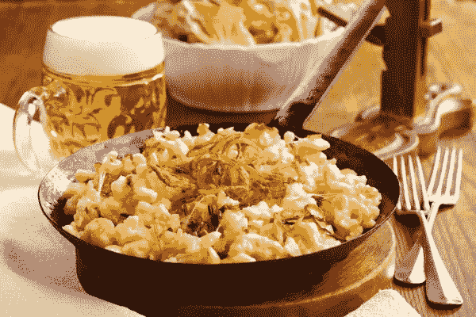
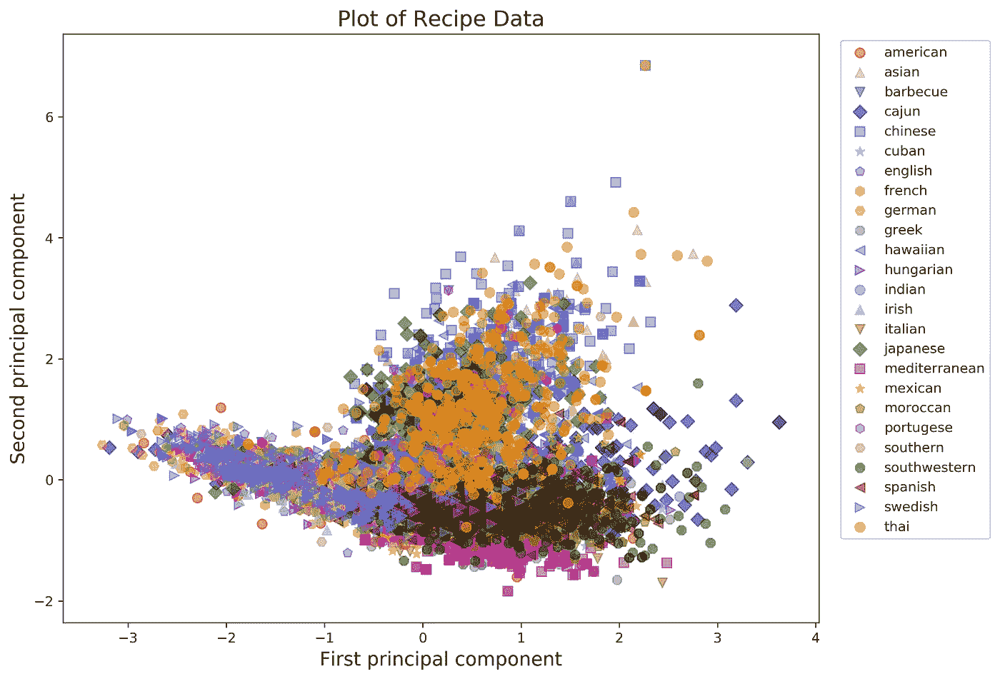
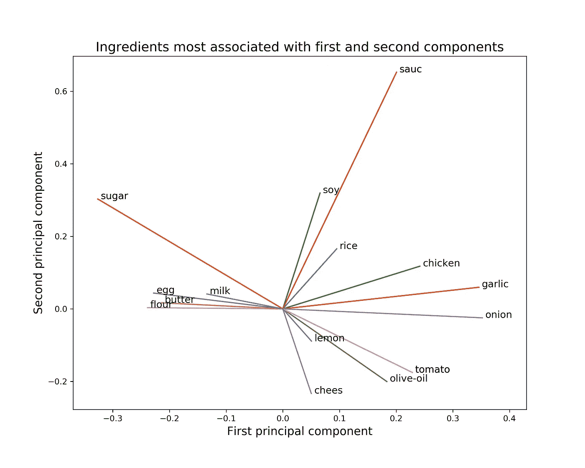
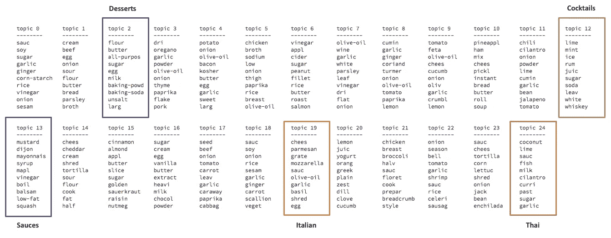

# 通过无监督学习检验国际美食

> 原文：<https://towardsdatascience.com/an-examination-of-international-cuisines-through-unsupervised-learning-93c8b56d1ea0?source=collection_archive---------4----------------------->

Typical Tyrolean Käsespätzle (Image courtesy: [https://austria-forum.org/](https://austria-forum.org/))

像很多人一样，我也是一个美食迷。我非常幸运，在一个吃饭都是从零开始的家庭长大。我妈妈做饭，因为她从德国移民到美国，我接触了很多美味的德国菜肴。我最喜欢的一些包括 sespä tzle，Semmelknö del 和 Sauerbraten。虽然我从来不敢说我有妈妈的烹饪天赋，但我确实非常享受从零开始做一顿饭的过程，当然也和我自己的家人分享这顿饭。

以此作为我的背景故事，我认为开展一个涉及世界各地食谱的数据科学项目会非常有趣。我想看看我是否能了解世界各地不同烹饪之间的关系。为了探索这个话题，我收集了代表 25 种不同烹饪类型的 12，000 多种不同食谱的数据。然后，我进行自然语言处理(NLP ),将文本数据转换成可以输入机器学习算法的格式。最后，我进行了主成分分析(PCA)和主题建模，以获得数据的洞察力。

# 数据收集

我在这个项目中使用的食谱数据来自 [Yummly](https://www.yummly.com/) 。我被授予了他们 API 的学生许可证(谢谢，美味！)，这让我可以直接从 ipython 笔记本上查询和搜索食谱。Yummly 支持基于菜肴类型进行搜索。以下是支持的菜系列表:

*   美国、意大利、亚洲、墨西哥、南方和灵魂食物、法国、西南、烧烤、印度、中国、卡津和克里奥尔、英国、地中海、希腊、西班牙、德国、泰国、摩洛哥、爱尔兰、日本、古巴、夏威夷、瑞典、匈牙利、葡萄牙

我总共下载了 25 种受支持菜系的大约 500 种食谱。这导致了大约 12，500 种不同食谱。对于数据收集，我使用 Requests 库读入数据，并使用内置的 JSON 编码器将 JSON 数据转换成 python 字典。然后，将数据转换成熊猫数据框架相对简单。下面显示了数据框中几个选定行的屏幕截图。

Selected rows of the Yummly recipe DataFrame

对于我的分析，我只使用了对应于**美食**和**配料**的列。所有其他列都被忽略。

# 文本数据处理和机器学习工作流

由于数据只包含文本，因此有必要使用 NLP 技术实现一些预处理步骤。这些步骤如下:

*   复合某些成分(如橄榄油、玉米淀粉)
*   将成分拆分成单词列表的标记化
*   删除停用词和其他频繁出现的词(例如，盐、胡椒、水)
*   通过去掉单词的复数形式和其他后缀来词干化
*   单词包处理创建一个稀疏矩阵，该矩阵包含成分列表中的所有单词以及它们出现的频率

我用来实现前面步骤列表的工具包括 sklearn 中的 TfidfVectorizer 和 CountVectorizer。其中一些步骤，比如断字和停用词移除，需要我编写自己的代码来实现，因为这些步骤对于这个特定的用例来说更加独特。鼓励读者查看我为这个项目准备的 [Github repo](https://github.com/bwsturm/metis_bootcamp/tree/master/Week7/fletcher) 来了解更多信息。

我重点研究的机器学习算法都是无监督学习算法。我做了 k-Means 聚类，看看我是否可以根据菜系类型将食谱聚类在一起，但是聚类对我的分析没有太大帮助，因为不清楚不同的聚类代表什么。相反，我将注意力集中在主成分分析(PCA)和潜在狄利克雷分配(LDA)上，我将在结果部分进一步讨论。

# 结果

为了能够可视化我的数据，我实施了降维，以便将特征空间从 1982 维(对应于我的数据集中不同成分的数量)减少到 2 维。这一步是使用主成分分析完成的，我保留了前两个主成分。然后，我针对第一个和第二个主成分为每个配方创建了一个散点图，如下所示。

A scatter plot consisting of all 12,492 recipes along the first and second principal components.

当在这个二维主成分空间中绘制所有食谱时，我没有学到很多东西，因为许多数据点是重叠的，所以很难在数据中看到任何结构。然而，通过根据菜系对食谱进行分组，并取前两个主成分的质心值，我可以在数据中看到一些有趣的结构。下图显示了这种情况。

A plot of the centroid values for each of the different cuisines along the first and second principal components. Group (A) is associated with Asian cuisines, (B) consists of Japanese and Hawaiian cuisines, (C) and (D) are European and American cuisines, respectively. Group (E) is a mixed bag of cuisines from all over the world including Cuban, Mexican, Indian, and Spanish.

上面的情节提供了一些关于不同菜系之间关系的有趣见解。我们可以观察到质心值倾向于根据相似的烹饪类型对食谱进行分组。例如，图 2 中的组(A)由中国、泰国和亚洲食物组成，它们都可以归类为亚洲食物。组(B)包括日本和夏威夷菜肴。这两种菜系都非常强调鱼，所以它们紧密地组合在一起是有道理的。(C)组完全由欧洲美食组成，如瑞典、法国和德国，而不远处的(D)组主要由北美美食组成。这些包括南方风味、烧烤风味和传统美国风味。最后,( E)组是世界各地许多不同美食的大杂烩。这包括古巴、墨西哥、印度、西班牙和西南部。当我想到这些美食时，我会想到大而大胆的味道，所以这些美食紧密地组合在一起是完全合理的。

读者可能会问，哪些特征(即成分)与第一和第二主成分联系最紧密？这可以在下图中看到。

A plot demonstrating the ingredients most strongly associated with the first and second principal components.

该图为两个主要成分中的每一个提供了主要特征的视觉表示。鸡肉、大蒜、洋葱和番茄等配料与第一部分的正向有很强的关联。这些风味与西班牙菜或印度菜有着紧密的联系。另一方面，鸡蛋、黄油、面粉、牛奶和糖沿着分量一的负方向具有很强的关联性。这些是法国菜或英国菜中常见的配料。同样，大豆、酱油和大米与第二部分的正方向有很强的关联。这些配料在亚洲菜肴中很常见。最后，奶酪、柠檬、橄榄油和西红柿与分量二的负方向有很强的关联。这些口味在意大利和希腊菜肴中很常见。该图有助于解释上图的结构，即当沿着第一和第二主成分作图时，为什么某些菜系在特定区域聚集在一起。

最后，我还运行了一个 LDA 模型，以便进行主题建模(见下文)。我很好奇，想看看是否有可能根据不同的食材所属的菜系来区分它们。我将主题数量指定为 25，因为我知道在我的数据集中有 25 种不同的菜系。然而，LDA 的结果有点混乱。在某些情况下，LDA 主题是特定的美食，如意大利菜或泰国菜。然而，有些主题是不同种类的菜肴，如甜点、酱汁，甚至鸡尾酒。虽然这个结果不是我想要的，但现在回想起来，它确实非常有意义。LDA 是一种机器学习技术，它可以识别频繁出现的单词组。因此，在超过 12，000 个食谱的语料库中，与烹饪类型相比，基于菜肴类型(即甜点、汤、沙拉或酱)的单词组可能有更强的关联。

**Results from LDA topic modeling.**

# 结束语

我在探索食谱数据集的过程中获得了很多乐趣，因为我真的很喜欢将我对食物的热爱与我在数据科学中获得的新技能结合起来。人们也可以为这种类型的分析做一个强有力的商业案例，因为这些信息可以用来向 Yummly 平台的用户提供食谱建议。例如，真正喜欢烧烤食物的人也可能真正喜欢葡萄牙菜，因为当沿着第一和第二主成分绘制它们的质心时，这两种菜类型重叠。在没有研究数据的情况下，我无法预见这样的关系。

然而，重要的是要披露，这篇博客中使用的数据并非没有缺陷。例如，Yummly 基本上是一个从许多其他食谱网站或博客上收集食谱的网站，所有这些网站都是英文的。因此，这些食谱中的许多可能是美国人对其他烹饪类型的吸收。我敢肯定，我的意大利朋友会说，像 [this](https://www.yummly.com/recipe/Teena_s-Spicy-Pesto-Chicken-And-Pasta-Allrecipes) 这样结合了鸡肉和香蒜酱的食谱“不是意大利的！”，尽管 Yummly 把这个食谱贴上了意大利的标签。处理这个问题的更好的方法可能是找到他们母语的食谱，并使用一些先进的翻译算法将它们翻译成英语。然而，由于成分可能因特定地理区域而异，这也可能导致意想不到的问题。例如，某些配料可能没有英语对等词(例如，意大利帕尔玛火腿、帕尔玛意大利干酪)，因此这些配料将总是与意大利菜肴联系在一起。这可能会导致不同类型的菜肴之间的相似性减少，但我认为这仍然是值得探索的。

非常感谢你阅读我的博文。如果你想为这个项目探索我的代码，你可以在下面的 [Github repo](https://github.com/bwsturm/metis_bootcamp/tree/master/Week7/fletcher) 找到它。此外，反馈将非常感谢，所以请随时联系我或给我一个“鼓掌”，如果你喜欢这篇文章。