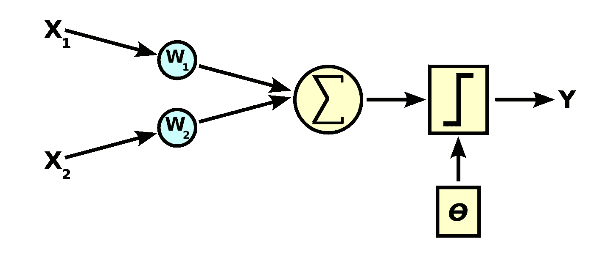
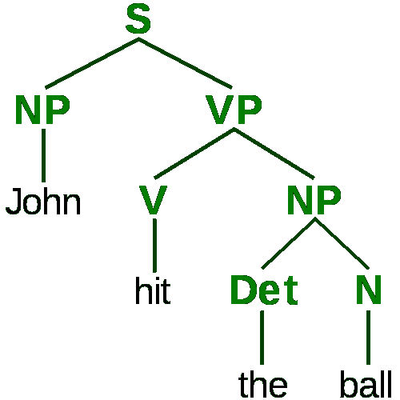
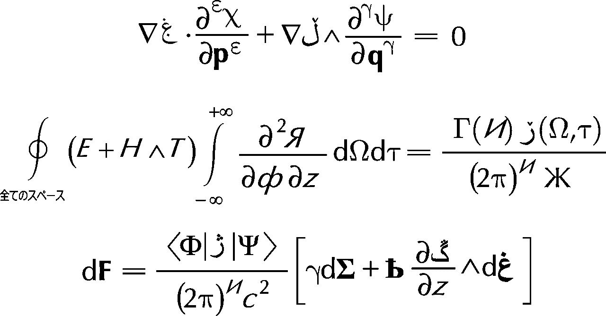
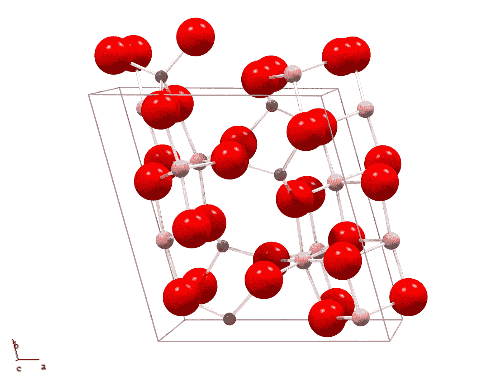

# 彼得·沃斯访谈

> 原文：<https://towardsdatascience.com/an-interview-with-peter-voss-5ada85651ec1?source=collection_archive---------3----------------------->

*人工通用智能* (AGI)是一个新兴领域，旨在建造“思考机器”；即智能堪比人脑的通用系统。目前被贴上‘人工智能’标签的很大程度上是狭义的自动化知识工作，缺乏动物智能中所见的灵活性和适应性。对 AGI 的追求始于基础层面，提出关于认知模型、知识获取、通过理性做出选择、以适应性和直觉的方式思考和构想世界的基本问题。

## 南加州 AGI 研究员彼得·沃斯访谈。

彼得的第一份职业和爱好是电子工程。25 岁时，他创办了自己的第一家公司 Electronic Designs，在 7 年内上市，成为一家拥有 400 名员工的软件/硬件解决方案公司。Peter 设计了该公司的 ERP 套件，包括其第四代数据库和编程语言。在担任首席执行官/董事长期间，以及通过开发和销售 ERP 软件，他获得了财务和管理方面的丰富专业知识。

从公司退休后，Peter 花了几年时间研究与高级人工智能相关的各种主题:这些主题包括认知心理学、心理测量学、认识论、神经网络和计算机科学的其他方面。2002 年，他创办了自适应人工智能公司(a2i2)，这是一家专注于开发 AGI(人工通用智能)的 R&D 公司，2008 年，他分拆出 SmartAction，一家利用 a2i2 智能引擎的商业公司。

在过去的 4 年里，他的重点已经转移回进一步开发智能代理技术。为此，他成立了 AGI 创新公司，这是一家 10 人的技术开发公司，致力于在深度自然语言理解、适应性对话管理和上下文推理方面取得进一步突破。

彼得经常撰写和介绍各种哲学话题，包括理性伦理、自由意志和人造思想；并深深卷入未来主义和激进的生命延续。

[https://commons.wikimedia.org](https://commons.wikimedia.org)

***你相信【狭义】“AI”领域正在走向第三个“冬天”吗？***

不，一点也不——尽管有“狭义人工智能”的限制，但在许多领域都取得了实际成果，我没有看到整体进展有任何放缓。人工智能会一直存在，而且只会变得更好，成为经济中更大的一部分。

然而，当前人工智能技术的几个关键方面[将不会达到预期](https://www.technologyreview.com/s/603945/is-artificial-intelligence-stuck-in-a-rut/ )，并将引起一些投资者的反弹。

特别是，我预计，由于“长尾”问题，像全自动(最后一英里)汽车这样的雄心勃勃的项目将比承诺的时间长得多。其次，大数据、统计方法本身不会提供用户期望的那种自然语言能力——它们没有深刻的理解，记忆非常有限(如果有的话)，不能进行实时、交互式、一次性或无监督的学习，并且它们不能推理或解释它们的信念和行为。

> 新的方法，如高度集成的认知架构，需要满足这些要求。

***‘狭义 AI’大部分是由一些数学结构和张量上的运算组成，用软件驱动模型训练和数据对其进行‘调优’。当你提到“认知架构”时，这些似乎是根本不同类型的机器，你能进一步阐述吗？***

是的，[认知架构](https://medium.com/p/ea18127a4d1d/edit)通常涵盖了自主代理的全部需求，包括输入、输出、焦点选择&记忆、学习、推理、目标、元认知。

另一方面，机器学习/深度学习(ML/DL)通常只在相当封闭的环境中提供特定的功能，如对象识别、分类、字幕或优化。专家和其他逻辑系统只执行预定义的计算集合。

这些非认知架构方法的不同之处还在于，有一个(漫长的)培训、编码或设置周期，随后是基本上“只读”的部署——这些系统通常在执行过程中不学习*。*

然而，应用认知架构本身并不足以实现真正的智能。为了真正有效，*认知组件也需要深度整合* -它们需要紧密耦合。知识表征必须充分整合知识和技能，而知识和技能又需要与短时记忆、语境、推理等整合。等等。这个事实被我的理论模型和实际实现经验所证实

大多数认知体系结构是高度模块化和不同的，因此不满足这个关键的需求。

两个主要原因是:a)工程师更喜欢高度模块化的设计，b)各种认知组件是不同计算机科学部门的专业知识表示是一个独立于推理和 NLU 的学科。

***你和 AGI 的其他人已经断言‘狭义人工智能’不能进化成 AGI 系统，人工智能社区的其他人正在寻找仅用‘人工智能’就能实现一般智能的‘大方程’，给出足够大量的数据。你为什么认为这是站不住脚的？***

狭义人工智能，根据定义，是为解决特定问题而优化的。我不知道有任何方法可以将狭义人工智能结合起来，以概括它们的认知技能——它们没有兼容的架构或知识表示。此外，它们本质上并不是为了提供智能所需的全面[集成核心功能](https://medium.com/intuitionmachine/agi-checklist-30297a4f5c1f )而设计的。

***你把推进 AGI 的困难归因于什么？(从你的直接经验和总体研究领域来看)为什么从事这方面工作的人相对较少？***

从理论/学术的角度来看，很少有广为接受的、可行的类人一般智力理论。事实上，人们更经常听到的是‘我们并不真正知道什么是智能’。除了这个障碍，优秀的软件工程师很少是好的认知心理学家——这是设计真正认知系统的基本要求。第三，商业压力几乎总是更喜欢直接狭隘的设计，而不是更困难、更 AGI 式的方法——它们需要一种罕见的有远见、更长远的观点。

还有其他几个因素阻止了 AGI 得到更多的爱——目前所有这些因素结合起来阻止了深度学习所享受的积极势头。

当然，也有许多困难的技术问题需要克服，但我不认为这些是不可克服的，只要有正确的理论和重点，加上足够的资源。

[https://commons.wikimedia.org](https://commons.wikimedia.org)

***你一直专注于用机器对语言进行推理的解决方案。人们认为语言理解是一种相对较高水平的认知技能。在语言层面之下存在着更多的基础认知。在处理语言的水平之下，AGI 目前可展示的能力是什么？***

我真的不能代表其他 AGI 系统，但我不知道任何活跃的 AGI 项目在一般的“动物智能”方面取得了有意义的(公开)进展——通常是(虚拟)机器人。和语言一样，几乎所有这样的项目都使用狭隘的人工智能方法。

我们系统的核心功能包括概念学习、知识表示、消歧、推理以及一些模式识别和动作序列。然而，我们目前的目标不是开发语言领域之外的内容。

鼠标级别的感知和敏捷很难；它们需要强大的计算能力和昂贵的尖端机器人技术，或者复杂的、通常不可用的模拟环境。

> 我们认为 NLP 是通向高级智能的更直接、更可行的途径。

***在你与亚当福特*** ***的*** [***访谈中，你说“个人助理”很可能是 AGI 的最初形式，随着技术的进步，它将“做得越来越多”。出于需要，目前大多数“虚拟代理”都在回路中使用人类。你认为人类在 AGI 系统的工作中(在商业解决方案中)有作用吗？***](https://youtu.be/4W_vtlSjNk0)

这完全取决于应用程序:对于高价值的礼宾服务，可能是这样的。对于下一代“Siri”，不太可能。

请记住，目前的助手真的很笨:没有记忆或推理，只有浅层解析，没有对话支持等。一旦他们有了一点“大脑”(按照我们的方法)，他们在没有人参与的情况下将会变得更加有用。需要实时人工支持的系统不太容易扩展。

自然，所有的个人助理系统都会有人在后台做 QA 和额外的训练/调整。

***您对 NLP 的兴趣是否与实时语音界面密切相关，或者您的工作是否同样对异步消息应用感兴趣？你认为人类在这些形式中会发挥更大的作用吗？***

同等地。然而，我想强调的是，实时操作和学习是真正智能行为的绝对要求。能够实时操作的智能系统(即，具有存储器和一些任务管理能力)通常能够异步操作。

另外，我想澄清一下，人在回路中实际上有两种完全不同的形式:

*   一个人(静静地)在后台，检查并潜在地覆盖人工智能
*   人工智能助手的用户，对要执行的全部任务承担(一些)责任。当然，这是“助手”的默认模式——被助手承担最终责任。

[https://commons.wikimedia.org](https://commons.wikimedia.org)

诺姆·乔姆斯基认为我们无法创造出理解语言的机器，因为“我们没有人类语言如何运作的方程式”。你似乎不同意，乔姆斯基缺少什么？

我们不能建造飞行器，因为我们没有鸟类飞行的方程式。也许他不理解'[理解](https://chatbotslife.com/understanding-understanding-9dcc15759b5b )'(抱歉这么刻薄，但这确实是一个糟糕的论点)。

***在《机器、幽灵和理解的限度》中，乔姆斯基详述了‘理解’的科学史。为了避免陷入这个‘手提箱单词’，让我们将目标陈述改为‘像人一样使用语言的机器’。乔姆斯基的观点是，机器(软件)是基于等式来行动的，而我们没有关于人们如何使用语言的等式，除了表面的方式(单词模式)。你认为对 AGI 和 NLP 的追求是把语言分解成方程式，还是根本不同的东西？***

首先，我不认为“方程式”是看待编程的恰当方式。有时术语[非算法](http://www.thefreedictionary.com/algorithmic)被用来描述复杂的计算。

其次，正如我之前提到的，要解决 AGI 或 NLP 问题，我们真的需要能够从认知/心理/认识论的角度来看待问题。

理解(上下文)概念的作用是这里的关键。语言理解需要将单词和句子映射到概念，但还需要做更多的工作，包括激活和使用联想、短期和长期记忆、上下文和目标。

> 认为软件是基于方程的观点，并不比认为人类的认知是基于蛋白质的作用更有用。

***你相信人类水平的 AGI 在未来 10 年内是可能的，只要有足够的资源。其他人认为这将需要更长的时间。你已经说过，实现 AGI 不需要“基本的新技术”，而是“巧妙结合现有技术，完善现有算法”。达到人类水平的 AGI 所需要的最重要的里程碑是什么？***

*   有一个可行的认知/智力理论
*   构建实现所有必需核心组件的开发框架
*   在适当的实际应用中展示能力(不一定是商业的)
*   迭代更高的认知功能

***AGI 开发人员/研究人员如何在系统发展的任何给定阶段测量他们系统的认知能力？***

您沿着两个轴进行度量:范围(这里粗略地概括了一下[)和能力(它能够处理的复杂程度)。](https://medium.com/intuitionmachine/agi-checklist-30297a4f5c1f )

一个关键要求是两个维度都由一个单一的集成系统服务。此外，系统必须具有可扩展的架构结构和能力，以涵盖所有范围需求和不断增长的能力。

在我们的项目中，我们不断地运行回归测试，以确保当我们扩展系统时，所有先前的功能仍然工作(沿着两个维度)。我们通过系统覆盖更大部分的范围和增加其能力来衡量进展。

例如，实现歧义消除或目标导向行为(新范围)，或提高解析/理解/推理能力，使其能够处理:

“猫是动物”…“猫是动物吗？”

能够理解和回答复杂的问题:

“Verallia 生产玻璃瓶和玻璃瓶，是法国香槟和干邑行业的主要供应商，去年的销售额为 23.9 亿欧元，营业收入为 2.3 亿欧元。”

> 使用真实世界的文本和对话实例进行测试对于开发实用的 AGI 至关重要。

[https://commons.wikimedia.org](https://commons.wikimedia.org)

***假设一个 AGI 不是单一的结构而是不同组件的组合。马文·明斯基认为，人造大脑将由许多系统组成，就像生物大脑一样。你认为 AGI 系统的主要组成部分是什么？***

我真的不认为 AGI 是一个“思想的社会”。根据一个人如何划分功能，他可能想要分离输入处理、输出激活、知识和技能编码、推理和元认知。

在我们当前以 NLP 为中心的系统中，解析、共指消解和 NLG (NL 生成)是相对独立的，但这更多是为了开发方便，而不是基础。

事实上，我想强调的是，为了有效的认知，所有的功能都必须高度集成——这是当前认知架构很少能满足的要求。

在今天为数不多的 AGI 研究人员中，大多数似乎都在研究人类水平的智能。为什么不从低于人类水平的一般智力开始呢？蜜蜂有大约 100 万个神经元，相当聪明:它能在三维空间导航，实现目标，交流等等....这(简单得多的智能)难道不是人工认知更合理的起点吗？

我过去正是这么想的:我们 AGI 发展项目的前三年(始于 2002 年)专注于创造动物智能。如上所述，动物级别的感知和灵巧真的很难，而且计算量很大。在机器人和自动驾驶汽车领域，有许多资金充足的团队在研究这些问题(或至少是相关的问题)。

我们只是决定通过 NLP 开发 AGI 是一个更快、更便宜的途径，并且在这个过程中提供了更多的商业化可能性。我们的 NLP/AGI 引擎的早期版本为一家成功的公司 www。SmartAction.ai，我们看到了许多其他以 NLP 为重点的 proto-agi 的可能性。

术语“原始 AGI”是什么意思？

AGI 的早期版本——即一个尚未达到全面的、人类水平的认知能力的系统，但其特定的、固有的架构和设计能够涵盖一般智能的要求。没有一个狭义的 AI 设计满足这些要求。

在“更多的商业化可能性”和对 AGI 的追求之间似乎有一条不确定的界线，前者不可避免地会给捷径和/或性能带来压力。作为一个既生产研究产品又生产商业产品的人，你如何平衡这些力量？

好不容易！

非常重要的一点是，企业的负责人应该理解在商业化过程中积极坚持 AGI 哲学的长期优势。对我们来说幸运的是，我们已经发展到了 AGI 复杂性和功能性的水平，通常商业目标实际上最好通过通用智能机制来实现，例如，教导系统比硬编码特定需求更容易、更好。

随着我们向人类水平的能力迈进，这将变得更加容易——在这里，普遍性压倒性地成为一种资产而不是一种负担: **AGI 逃逸速度！**