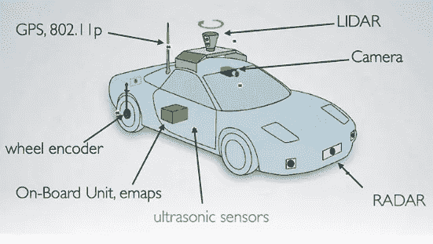
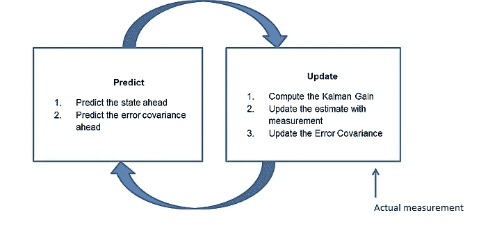
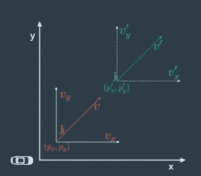

# 自动驾驶车辆卡尔曼滤波器介绍

> 原文：<https://towardsdatascience.com/an-intro-to-kalman-filters-for-autonomous-vehicles-f43dd2e2004b?source=collection_archive---------3----------------------->

我最近完成了自动驾驶汽车纳米学位项目 的[**Udacity Term2，我想分享一下我对**“卡尔曼滤波器”**遇到的一个有趣而又酷的话题的看法。希望这个博客能让你清楚地了解它是什么。享受学习:)**](https://in.udacity.com/course/self-driving-car-engineer-nanodegree--nd013)

自主车辆由各种设备组成，通过这些设备收集数据并执行动作。下图显示了车辆中使用的几个重要部件的位置。

Components of an Autonomous Vehicle [[Image Source](https://www.safaribooksonline.com/library/view/ros-programming-building/9781788627436/0e75a78b-7321-4ad7-ac95-cd31ec084503.xhtml)]

卡尔曼滤波器使用的数据来自**激光雷达**和**雷达**。所以现在我们只关注这两个设备。

# 为什么要用卡尔曼滤波器？

我们可以使用卡尔曼滤波器做出一个有根据的猜测，在我们对某个动态系统有不确定信息的任何地方，系统下一步会做什么。在自主车辆的情况下，卡尔曼滤波器可以用于基于我们的车辆接收的数据来预测我们的自主车辆前方的车辆将要采取的下一组行动。这是一个使用两步预测和更新的迭代过程。

由于以下因素，它最适合这些类型的操作:

*   它只根据前一个状态预测下一个状态，**不需要历史数据**
*   **计算速度非常快**非常适合实时问题
*   即使环境中出现大量噪声/误差/不确定性，使用 [**高斯分布**](https://en.wikipedia.org/wiki/Normal_distribution) ，卡尔曼滤波器**也会给出一个好的结果。**

我将向您概述所有这些是如何工作的，随后是一个示例，它将帮助您理解背后的数学原理。

# 卡尔曼滤波器是如何工作的？

卡尔曼滤波是一个迭代过程，遵循两步预测和更新

Flow chart of the Iterative process

**预测:**

在该步骤中，卡尔曼滤波器从初始值预测新值，然后根据系统中存在的各种过程噪声预测我们预测中的不确定性/误差/方差。

在自动驾驶汽车过程中，噪声可以通过一个简单的例子来理解，即一辆汽车在我们的汽车前面行驶。我们的模型将假设汽车以恒定的速度移动，因为加速度为零，但实际上它会有加速度，即它的速度会不时波动。汽车加速度的这种变化是不确定性/误差/方差，我们利用过程噪声将其引入系统。

**更新:**

在此步骤中，我们从系统设备中获取**实际测量值**。在自主车辆情况下，这些设备可以是雷达或激光雷达。然后，我们计算预测值和测量值之间的差值，并通过计算**卡尔曼增益来决定保留哪个值，即预测值还是测量值。**基于由卡尔曼增益做出的决定，我们计算新的值和新的不确定性/误差/方差。

来自更新步骤的该输出再次被反馈到预测步骤，并且该过程继续，直到预测值和测量值之间的差趋向于转换为零。该计算值将是卡尔曼滤波器进行的预测/有根据的猜测。

***卡尔曼增益:*** *它决定了我们的预测值或测量值是否接近实际值。它的值范围从 0 到 1。如果其值接近 0，则意味着预测值接近实际值，或者如果其值接近 1，则意味着最终测量值接近实际值。其值的范围从 0 到 1，因为它使用了预测值和测量值的不确定性/误差，并由如下所示的简单公式表示。*

**K =预测误差/(预测误差+测量误差)**

# 卡尔曼滤波器在无人驾驶汽车中的实现

在这方面，我们将根据目前掌握的信息，尝试理解卡尔曼滤波器是如何用于自动驾驶汽车的。

让我们假设一个 2D 环境，其中有一辆汽车和一个行人经过，如下所示:

2D representaion of car and pedestrian [[Image Source](https://classroom.udacity.com/nanodegrees/nd013-connect/parts/7dc7c9b7-2884-4e43-bf15-2d1e1a121081/modules/0a2d977a-aa96-485f-bfcb-f1f715d299bf/lessons/f56ac07d-1b94-40ab-bbbf-6bfe36a80f47/concepts/1ac6e0ac-1809-4864-b58f-870d6bda9b25)]

p_x 和 p_y 确定 2D 位置，v_x 和 v_y 确定行人的 2D 速度。这可以表示为 **x = (p_x，p_y，v_x，v_y)** 。我们必须预测行人的 2D 位置(p _ x’，p _ y’)和 2D 速度(v _ x’，v _ y’)**即 x’**

**由于状态向量仅模拟位置和速度，我们还需要不确定性/噪声，以便模拟加速度，这由过程协方差矩阵 **P.** 完成**

****预测步骤**:使用以下公式计算预测值**x′**和预测误差**P′**也称为过程协方差矩阵:**

> ****x′= f . x+b .μ+ν****
> 
> ****p′=fpfᵀ+q****

*****F :*** *状态转移矩阵***

**它用于将状态向量矩阵从一种形式转换为另一种形式。即假设车辆的状态由位置 p 和速度 v 给出，并且在时间 t 没有加速。**

**X = [p，v]**

**在一个特定时间之后，比如说 t+1，新的状态向量 X’将是**

**p ' = p+v *δt**

**v'=v**

**在矩阵中，这可以显示如下:**

****

**x’ = F*x**

**那么 F 矩阵将由下式给出:**

****

****B:** 控制输入矩阵**

**它决定了由于外力(纵向或横向力)和内力(重力、摩擦力等)引起的控制输入矢量 **μ** 的变化。).在自动驾驶汽车的背景下，我们无法对外力建模，因为它会因地区而异，也无法对内力建模，因为它会因汽车型号的不同而异。所以大多数情况下 **B.μ=0。****

****v:** 过程噪音/不确定性**

**它只是确定系统中可能存在的随机噪声。添加它是为了使预测位准确。**

****问:**过程噪音/运动噪音**

**当预测位置时，它给出了物体位置的不确定性。该模型假设时间间隔之间的速度是恒定的，但实际上我们知道物体的速度会因加速度而变化。该模型通过过程噪声包括了这种不确定性。**

****更新步骤:**快速回顾在更新步骤中，我们执行以下操作:**

***第一步*:求实测值与预测值的差值**

***第二步:*计算卡尔曼增益**

***步骤 3:* 根据卡尔曼增益的结果计算新的 **x** 和 **P** 。**

**现在我们将看到这些步骤的数学实现**

**第一步:**

****y = z—h . x′****

****z:** 实测数据**

**这是来自传感器的实际数据。**

****H:** 状态转移矩阵**

**和 F 一样，我们用 H 来转换状态向量。但是在这里，我们用它来丢弃状态向量中我们不需要的信息。例如，对于雷达进行的测量，我们只需要关注车辆的位置，而不需要担心速度，因为雷达只擅长确定速度的位置。在这种情况下，对于包含车辆位置和速度的状态向量，H 矩阵为:**

****

**第二步:**

> ****s =hp′hᵀ+r
> k =p′hᵀs⁻****

****R:** 测量噪音**

**测量噪声是指传感器测量中的不确定性，它意味着设备本身有噪声并且不是 100%精确的，因此这些噪声测量值是由设备本身的制造商提供的，不需要改变。**

****S:** 总误差**

**它是预测误差加上测量误差的总和。正如我们在上面的卡尔曼增益公式中看到的，我们需要总误差，所以这里用 s 表示。**

****K:** 卡尔曼增益**

**我们通过前面给出的简单公式来计算卡尔曼增益。唯一的问题是，在矩阵中我们不能除法，所以这里我们取 **S⁻。****

**第三步:**

> ****x = x′+k . y
> P =(I-KH)P′****

**最后，我们更新状态向量和协方差矩阵，并继续下一个预测步骤以获得其他值。**

# **卡尔曼滤波器有问题**

**卡尔曼滤波器中使用所有这些函数都是线性的，因为它们在方程中不包括任何角度参数，因此我们可以将这些线性函数直接馈送给高斯分布，以获得高斯分布均值和方差。但是在现实生活中，大多数问题都是非线性的。由于这个原因，我们不能直接将这个非线性函数提供给高斯分布，因为这将导致非高斯分布，并且我们不能再对其应用卡尔曼滤波器。使用[扩展卡尔曼滤波器](https://en.wikipedia.org/wiki/Extended_Kalman_filter)解决了卡尔曼滤波器中的非线性问题。**

**你可以通过阅读拉姆齐·法拉格尔的这篇论文[来了解更多关于卡尔曼滤波器的知识，这篇论文是基于卡尔曼滤波器，通过简单直观的推导](https://www.cl.cam.ac.uk/~rmf25/papers/Understanding%20the%20Basis%20of%20the%20Kalman%20Filter.pdf)**