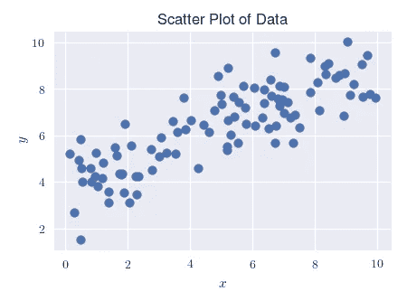
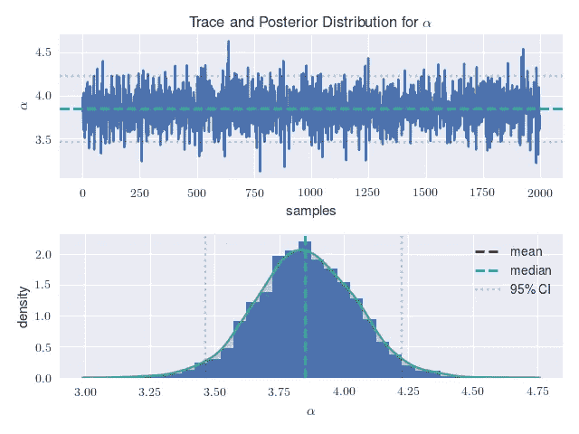
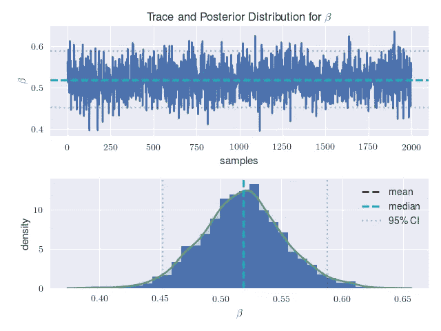
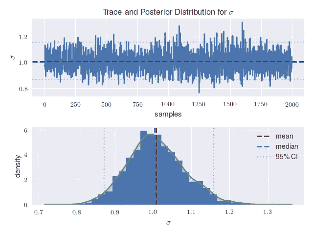

# PyStan 中的贝叶斯推理介绍

> 原文：<https://towardsdatascience.com/an-introduction-to-bayesian-inference-in-pystan-c27078e58d53?source=collection_archive---------4----------------------->

## 使用 Python 和 Stan 演示贝叶斯工作流


# 介绍

数据科学中贝叶斯方法的许多优点很少被低估。与 20 世纪定义统计学的相对陈旧的频率主义传统不同，贝叶斯方法通过将数据驱动的可能性与对世界的先验信念相结合，更紧密地匹配人类大脑的推理。这种方法在[强化学习](https://people.eecs.berkeley.edu/~avivt/BRLS_journal.pdf)中得到了卓有成效的应用，努力将其融入深度学习是[当前研究的热点领域](https://alexgkendall.com/computer_vision/bayesian_deep_learning_for_safe_ai/)。事实上，[认为贝叶斯统计是两个统计学派中更基础的，并且应该是第一次向学生介绍这门学科时首选的统计学图片。](https://link.springer.com/chapter/10.1007/978-94-010-1436-6_6)

由于来自贝叶斯推理的预测是*概率分布*而不是点估计，这允许量化所作出的推理中的不确定性，这通常是机器学习方法所作出的预测所缺少的。

尽管将贝叶斯方法纳入机器学习有明确的动机，但在实际实现它们时存在计算挑战。通常，分析计算所需的分布是不实际的，而使用随机抽样方法，如[马尔可夫链蒙特卡罗](https://jeremykun.com/2015/04/06/markov-chain-monte-carlo-without-all-the-bullshit/) (MCMC)。以透明和有效的方式实现 MCMC 方法的一种方式是通过概率编程语言 [Stan](http://mc-stan.org) 。

在本文中，我将提供一些关于贝叶斯推理和 MCMC 的背景知识，然后演示一个简单的例子，其中 Stan 用于通过 Stan 的 Python 接口 [PyStan](http://mc-stan.org/users/interfaces/pystan) 对生成的数据集执行推理。

## 贝叶斯定理

贝叶斯推理的关键在于[贝叶斯定理](https://en.wikipedia.org/wiki/Bayes%27_theorem)，它是由托马斯·贝叶斯牧师在 18 世纪发现的。这是基于概率论的一个基本结果，你可能以前见过:


左边的东西是我们的后验概率，这是我们感兴趣的分布。在右边，我们有可能性，它取决于我们的模型和数据，乘以先验，代表我们预先存在的信念，并除以边际可能性，使分布正常化。

这个定理可以用来得出许多违反直觉的结果，尽管如此，这些结果仍然是正确的。举个例子，当测试人群严重倾斜时，药物测试中的[假阳性](https://en.wikipedia.org/wiki/Bayes'_theorem#Drug_testing)要高得多。我将继续与 Stan 讨论推理，而不是详细介绍贝叶斯统计的基础知识。威廉·科尔森有一些很好的材料来理解贝叶斯定理[背后的直觉。](/bayes-rule-applied-75965e4482ff)

# 推动 Stan 的使用

贝叶斯推断是*难*。根据统计学家唐·贝里的说法，其原因是:

> "从思考困难的意义上来说，贝叶斯推理是困难的."—唐·贝里

好吧。我想他在这里的意思是，使用贝叶斯方法进行推理的数学开销很小，所以困难来自概念上的困难，而不是任何技术或方法上的抽象。但更具体地说，贝叶斯推理很难，因为*解积分很难*。

上面的 P(B)包含了模型参数可能取的所有值的积分。幸运的是，我们并没有完全不知所措，因为通过从中抽取样本，并创建这些采样值的直方图作为所需的后验分布，可以构建后验分布的近似值。

## MCMC 方法

在生成这些样本时，我们需要一个方法框架来管理采样器应该如何在参数空间中移动。一个流行的选择是马尔可夫链蒙特卡罗。MCMC 是一类结合了两个强大概念的方法:马尔可夫链和蒙特卡罗抽样。

[马尔可夫链](http://setosa.io/ev/markov-chains/)是以“无记忆”方式随时间演化的随机过程，被称为*马尔可夫属性*。Markov 属性意味着 Markov 链的状态转移到另一个状态的概率仅取决于系统的最近*状态，而不是其整个历史。*

另一方面，蒙特卡罗抽样涉及通过重复随机抽样来解决确定性问题。这样做的标准方式是使用 [Metropolis-Hastings](https://twiecki.github.io/blog/2015/11/10/mcmc-sampling/) 算法。

相反，Stan 使用一种称为哈密顿蒙特卡罗(HMC)的最先进的算法来生成这些样本，该算法通过融入许多物理学理论思想来构建 Metropolis-Hastings 算法。实际上，默认情况下，它实现了一个名为[不掉头采样器](https://arxiv.org/pdf/1111.4246.pdf) (NUTS)的 HMC 版本。

很容易陷入这些方法的概念复杂性中，所以如果您在这个阶段还没有完全掌握，请不要担心；只要记住我们是随机生成样本，并根据一些概率规则接受或拒绝这些样本。

Stan 是一种概率编程语言，由 T2 的 Andrew Gelman 公司开发，主要在哥伦比亚大学。如果你觉得这个名字很奇怪，它是以核物理学家和蒙特卡罗方法之父[斯坦尼斯劳·乌拉姆](https://en.wikipedia.org/wiki/Stanislaw_Ulam)的名字命名的。

虽然它非常有用，但 Stan 的学习曲线相对较陡，而且互联网上也没有足够多的介绍性材料来证明这一点。语法本身大部分是从 Java/C 借用的，但是也有 R、Python、Julia 甚至 MATLAB 的库。对，没错，*甚至 MATLAB* 。因此，无论你的规划是什么，都可能有适合你的东西。

我选择的语言是 Python，所以我将使用 PyStan。像 Stan 的其他部分一样，PyStan 的代码是开源的，可以在这个 [GitHub 库](https://github.com/stan-dev/pystan)中找到，并且[文档](https://pystan.readthedocs.io/en/latest/)相当全面。斯坦的流行替代者，你们中的一些人可能很熟悉，是 PyMc 和 Edward，尽管我对他们没有太多的经验。Stan 的好处在于，你可以简单地在你的模型中指定分布，然后你就开始了，已经朝着你即将到来的推论奖金前进了。斯坦真正闪光的地方是在非常高维的问题中，在那里你可以推断出大量的预测因子。

然而，在本文中，我将保持事情的简单性，将我们的模型限制为简单的单变量线性回归，允许更多地关注 Stan 工作流。我们将实现的模型是


其中我们有截距α和梯度β，我们的数据分布在这条直线上，具有标准差σ的高斯噪声。

# 让我们建立一个模型

现在我们已经了解了一些背景知识，让我们来实现一些我们已经讨论过的内容。首先，你需要[安装](https://pystan.readthedocs.io/en/latest/windows.html) PyStan，你可以这样做:

```
pip install pystan
```

让我们从导入相关的包开始，并设置 numpy 种子以实现可再现性。接下来，我们将通过指定线性回归的模型来开始我们的 Stan 脚本。这个模型是用 Stan 编写的，并被赋给一个名为`model`的 string 类型的变量。这是脚本中唯一需要用 Stan 编写的部分，推理本身将用 Python 完成。

这个模型的代码来自 Stan [参考手册](http://mc-stan.org/users/documentation/)第三章中的第一个示例模型，如果您正在进行任何类型的贝叶斯推理，这是一本推荐的读物。

Stan 模型至少需要三个块，分别用于数据、参数和模型。数据块指定将用于采样的数据的类型和维度，参数块指定相关参数。分布语句放在模型块中，在我们的例子中，它是一条带有附加高斯噪声的直线。尽管此处未包括，但也可以指定转换后的数据和转换后的参数块，以及函数和生成量的块。

请注意，在参数块中，我们将 sigma 的下限指定为 0，因为高斯噪声的幅度不可能为负。这是一个关于参数`sigma`的**先验**的例子，更详细的先验可以添加到模型块中。

还要注意，我们没有给我们的`alpha`和`beta`参数添加任何先验，尽管可以在模型块中随意试验添加先验，看看它们如何影响后验估计。

## 数据生成

在这里，我们将指定我们的参数的“基本事实”值，我们的目标是使用 Stan 再现这些值，并使用 numpy 从这些参数生成数据，确保添加高斯噪声。

我们可以绘制这些数据来了解我们在处理什么。



现在我们可以使用 PyStan 模型进行推理。数据需要在 Python 字典中运行采样器，并且我们在 Stan 模型的数据块中指定的每个元素都需要一个键。

然后，在对模型进行采样之前，需要对其进行编译，不过也可以加载一个预编译的模型，这可以通过本文附带的 GitHub 存储库中的这个脚本来完成。这种设置允许我们更改我们想要生成评估的数据，而不必重新编译模型。

## 抽样

在采样方法中，有许多可以指定的参数。`iter`是指将从每个马尔可夫链中产生的样本总数，`chains`是将从其中组合样本以形成后验分布的链的数量。因为潜在的马尔可夫过程是随机的，所以在参数空间的不同位置初始化更多的链是有利的，尽管添加更多的链会增加采样所需的时间。

`warmup`，也称为“老化”，是从每个链的开始将被丢弃的样本量，因为早期的样本将在马尔可夫链还没有机会达到平衡时被抽取。

默认情况下，这是`iter`的一半，因此对于每个链，我们将获得 1000 个样本，并丢弃前 500 个。有了 4 条链，我们总共会有 2000 个样本。

`thin`指定保留样本的采样间隔。因此，如果`thin`等于 3，则每三个样本保留一个，其余的丢弃。这对于减轻连续样本之间的相关性影响是必要的。这里它被设置为 1，所以每个样本都被保留。最后，`seed`被指定为允许再现性。

# 诊断学

一旦采样完成，就可以打印 fit 对象来检查推理的结果。在这里，我们可以看到两个回归参数的汇总统计数据，以及模型中的高斯噪声。

此外，我们可以看到称为`lp__`的量的相同统计数据，根据 [Stan 手册](http://mc-stan.org/users/documentation/)它是达到常数的对数后验密度。检查`lp__`是否已经收敛可以让我们更加确信整个采样过程已经收敛，但是这个值本身并不是特别重要。


The printed fit upon completion of sampling in Stan.

除了平均值和分位数信息，每个参数还有另外两列，`n_eff`和`Rhat`。`n_eff`是[的有效样本量](https://en.wikipedia.org/wiki/Effective_sample_size)，由于样本之间的相关性，它可以显著低于生成的样本的名义数量。如上所述，可以通过细化马尔可夫链来减轻[自相关](https://en.wikipedia.org/wiki/Autocorrelation)的影响。

`Rhat`是 [Gelman-Rubin](http://digitalassets.lib.berkeley.edu/sdtr/ucb/text/307.pdf) 收敛统计量，一种马尔可夫链收敛的度量，对应于方差减少的比例因子，如果允许采样永远继续，则可以观察到方差减少。因此，如果`Rhat`约为 1，无论你继续迭代多长时间，你都不会看到采样方差减少，因此马尔可夫链很可能(但不保证)已经收敛。

我们可以将这种拟合输出投射到 pandas 数据框架中，以使我们的分析更容易，从而允许更好地访问相关的汇总统计数据。上面的 fit 对象有一个 plot 方法，但这可能有点混乱，而且似乎已被弃用。相反，我们可以提取每个参数的采样值序列，称为“轨迹”,我们可以将它与相应的后验分布一起绘制，用于诊断目的。

## 绘制我们的回归线

既然我们已经从拟合的模型中提取了相关的信息，我们可以看一下绘制线性回归的结果。为了从推断参数的不确定性中了解我们在回归线中可以预期看到的分布类型，我们也可以绘制潜在的回归线，其参数从我们的后验中取样。


关于用于生成该图的代码的更多细节，您可以查看 [GitHub](https://github.com/mwestt/An-Introduction-to-Bayesian-Inference-in-PyStan/blob/master/PyStan_plotting.py) 上的脚本。

## 绘制后验概率图

除了将我们的分析局限于汇总统计数据，我们还可以更详细地查看我们之前提取的每个参数的一系列采样值。这将允许更深入地了解采样过程，并且是执行 fit 诊断的重要部分。

这里我定义了一个函数，它绘制了给定参数的轨迹和后验分布。对感兴趣的参数调用该函数，我们可以生成所需的图。



从上面的轨迹图中，我们可以看到通过参数空间的运动类似于随机行走，这表明潜在的马尔可夫链已经如我们所希望的那样达到收敛。我们也可以看一下`beta`和`sigma`的对应图。



从后验分布图中我们可以看出，基本事实总体上非常接近我们分布的模式，并且在 95%的[可信区间](https://en.wikipedia.org/wiki/Credible_interval)内。由于数据中的噪声，在后验峰值和基础事实之间存在一些偏差。贝叶斯方法的便利之处在于，估计中的不确定性在这些后验分布中被捕获，并且可以通过提供更有洞察力的先验来改进。

# 结论

我们已经看到了如何在 Stan 中编写模型，如何使用 PyStan 中生成的数据执行采样，以及如何检查采样过程的输出。贝叶斯推理可能非常强大，还有许多 Stan 的特性有待探索。我希望这个例子是有用的，并且您可以在执行自己的采样和推断时使用其中的一些材料。

*我的第一篇技术博客就这样结束了。请随意留下任何反馈，并确保查看* [*GitHub 资源库*](https://github.com/mwestt/An-Introduction-to-Bayesian-Inference-in-PyStan) *以执行您自己的推断并制作您自己的情节。感谢阅读！*