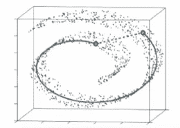
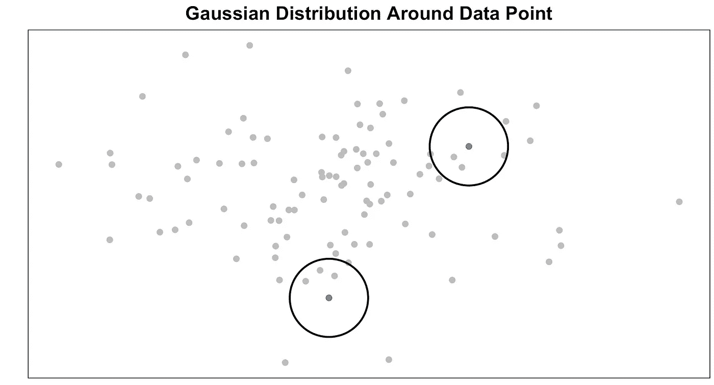
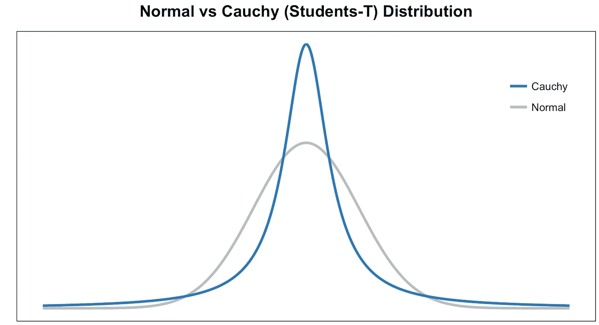
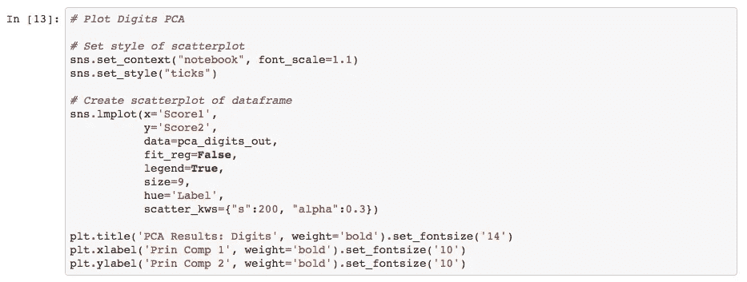
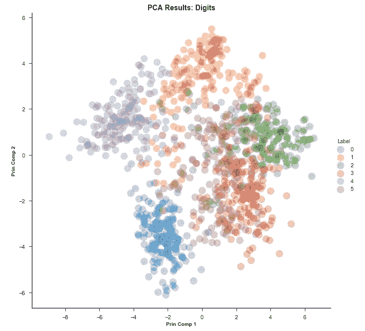
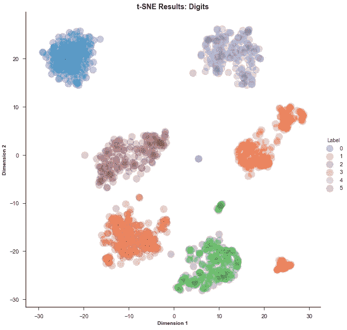
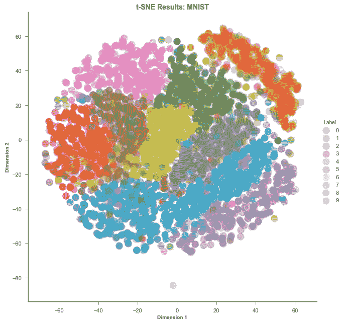

# 用 Python 例子介绍 t-SNE

> 原文：<https://towardsdatascience.com/an-introduction-to-t-sne-with-python-example-5a3a293108d1?source=collection_archive---------0----------------------->

**简介**

我一直对学习充满热情，并认为自己是一个终身学习者。作为一名数据科学家，在 SAS 工作让我能够学习和尝试我们定期向客户发布的新算法和功能。通常，算法在技术上并不新，但对我来说是新的，这让我觉得很有趣。

最近，我有机会了解更多关于 t 分布随机邻居嵌入(t-SNE)的知识。在这篇文章中，我将给出 t-SNE 算法的一个高层次的概述。我还将分享一些示例 python 代码，其中我将对数字和 MNIST 数据集使用 t-SNE。

**什么是 SNE 霸王龙？**

t-分布式随机邻居嵌入(t-SNE)是一种[无监督的非线性技术](https://blogs.sas.com/content/subconsciousmusings/2017/04/12/machine-learning-algorithm-use/)，主要用于数据探索和可视化高维数据。更简单地说，t-SNE 给你一种感觉或直觉，告诉你数据是如何在高维空间中排列的。它是由劳伦斯·范德·马滕斯和杰弗里·辛顿在 2008 年开发的。

**t-SNE vs PCA**

如果你熟悉[主成分分析](https://blogs.sas.com/content/iml/2017/08/09/robust-principal-components-sas.html) (PCA)，那么和我一样，你可能想知道 PCA 和 t-SNE 之间的区别。首先要注意的是，PCA 是在 1933 年开发的，而 t-SNE 是在 2008 年开发的。自 1933 年以来，数据科学领域发生了很多变化，主要是在计算和数据规模方面。第二，PCA 是一种线性降维技术，它寻求最大化方差并保持大的成对距离。换句话说，不同的事物最终会相距甚远。这可能导致较差的可视化，尤其是在处理非线性流形结构时。把流形结构想象成任何几何形状，比如:圆柱形、球形、曲线形等等。

t-SNE 不同于 PCA，它只保留小的成对距离或局部相似性，而 PCA 关心的是保留大的成对距离以最大化方差。劳伦斯使用图 1 [1]中的瑞士滚动数据集很好地说明了 PCA 和 t-SNE 方法。您可以看到，由于这个玩具数据集(流形)的非线性和保留大距离，PCA 将错误地保留数据的结构。

Figure 1 — Swiss Roll Dataset. Preserve small distance with t-SNE (solid line) vs maximizing variance PCA [1]

**t-SNE 的工作原理**

现在我们知道了为什么我们可能使用 SNE 霸王龙而不是 PCA，让我们讨论一下 SNE 霸王龙是如何工作的。t-SNE 算法计算高维空间和低维空间中的实例对之间的相似性度量。然后，它尝试使用成本函数来优化这两个相似性度量。让我们把它分成 3 个基本步骤。

1.步骤 1，度量高维空间中的点之间的相似性。想象一下散布在 2D 空间中的一堆数据点(图 2)。对于每个数据点(xi ),我们将在该点上以高斯分布为中心。然后，我们测量高斯分布下所有点的密度(xj)。然后对所有点进行重正化。这给了我们所有点的一组概率(Pij)。这些概率与相似性成正比。这意味着，如果数据点 x1 和 x2 在这个高斯圆下有相等的值，那么它们的比例和相似性是相等的，因此你在这个高维空间的结构中有局部相似性。高斯分布或圆可以使用所谓的困惑进行操作，这将影响分布的方差(圆的大小)以及最近邻的数量。困惑的正常范围在 5 到 50 之间[2]。

Figure 2 — Measuring pairwise similarities in the high-dimensional space

2.第 2 步与第 1 步类似，但不是使用高斯分布，而是使用一个自由度的学生 t 分布，也称为柯西分布(图 3)。这给了我们低维空间中的第二组概率(Qij)。正如你所看到的，学生 t 分布比正态分布有更重的尾部。厚重的尾部可以更好地模拟相距较远的距离。

Figure 3 — Normal vs Student t-distribution

3.最后一步是，我们希望这些来自低维空间(Qij)的概率集尽可能好地反映高维空间(Pij)的概率集。我们希望这两个映射结构相似。我们使用 Kullback-Liebler 散度(KL)来度量二维空间的概率分布之间的差异。我不会过多地讨论 KL，只知道它是一种不对称的方法，可以有效地比较大的 Pij 和 Qij 值。最后，我们使用梯度下降来最小化我们的 KL 成本函数。

**t-SNE 的使用案例**

现在你知道了 t-SNE 是如何工作的，让我们快速讨论一下它在哪里使用。Laurens van der Maaten 在他的视频演示中展示了许多例子[1]。他提到了 t-SNE 在气候研究、计算机安全、生物信息学、癌症研究等领域的应用。t-SNE 可以用于高维数据，然后这些维度的输出成为其他分类模型的输入。

此外，t-SNE 可以用来调查，学习，或评估分割。很多时候，我们在建模之前选择分段的数量，或者在结果之后迭代。t-SNE 常常能在数据中显示出清晰的分离。这可以在使用您的分段模型选择聚类数之前使用，或者在评估您的分段实际上是否成立之后使用。然而，t-SNE 不是一种聚类方法，因为它不像 PCA 那样保留输入，并且值可能经常在运行之间改变，所以它纯粹是为了探索。

**代码示例**

下面是一些 python 代码(下图带有 GitHub 的链接)，在这里你可以看到 PCA 和 t-SNE 在数字和 MNIST 数据集上的可视化比较。我选择这两个数据集是因为维度的不同，因此结果也不同。我还在代码中展示了一项技术，您可以在运行 t-SNE 之前运行 PCA。这样做可以减少计算量，你通常会减少到 30 维左右，然后运行 t-SNE。

我使用 python 并调用 [SAS 库](http://go.documentation.sas.com/?cdcId=pgmcdc&cdcVersion=8.11&docsetId=allprodsactions&docsetTarget=actionSetsByName.htm&locale=en)来运行这个。它可能看起来与你习惯的略有不同，你可以在下面的图片中看到。我用 Seaborn 来做我的视觉效果，我认为这很棒，但是用 t-SNE 你可能会得到非常紧凑的集群，需要放大。如果您需要放大或操纵绘图对象，另一个可视化工具(如 Plotly)可能会更好。此外，假设您使用 Matplotlib，那么在绘图之前进行简单的`%matplotlib notebook`调用也是可行的。

在 GitHub 查看完整的笔记本，这样你就可以看到中间的所有步骤并获得代码:

*步骤 1——加载 Python 库。创建到 SAS 服务器的连接(称为“CAS”，它是一个分布式内存引擎)。加载 CAS 动作集(把它们想象成库)。读入数据并查看形状。*

第 2 步——到目前为止，我仍然在我的本地机器上工作。我将把这些数据加载到我提到的 CAS 服务器中。这有助于我利用分布式环境并提高性能效率。然后我对数字和 MNIST 数据进行主成分分析。

*第 3 步——可视化两位数和 MNIST 的 PCA 结果*

PCA actually does a decent job on the Digits dataset and finding structure

As you can see PCA on the MNIST dataset has a ‘crowding’ issue

*步骤 4——现在让我们尝试与上面相同的步骤，但是使用 t-SNE 算法*

*现在是 MNIST 数据集…*

**结论**

我希望你喜欢这个概述和 t-SNE 算法的例子。我发现 t-SNE 是一个非常有趣和有用的可视化工具，因为几乎所有我处理过的数据都是高维的。我会把我发现的超级有用的资源贴在下面。对我来说，最好的资源是劳伦斯的 YouTube 视频。差不多 1 个小时，有点长，但是解释得很好，我找到了最清晰的详细解释。

**我发现有用的其他资源:**

1.t-SNE vs PCA:[https://www . quora . com/What-advantages-the-t-SNE 算法优于 PCA](https://www.quora.com/What-advantages-does-the-t-SNE-algorithm-have-over-PCA)

2.kull back-Liebler Divergence:[https://en . Wikipedia . org/wiki/kull back % E2 % 80% 93 lei bler _ Divergence](https://en.wikipedia.org/wiki/Kullback%E2%80%93Leibler_divergence)

3.t-SNE 维基百科:[https://en . Wikipedia . org/wiki/T-distributed _ random _ neighbor _ embedding](https://en.wikipedia.org/wiki/T-distributed_stochastic_neighbor_embedding)

4.t-SNE 演练:[https://www . analyticsvidhya . com/blog/2017/01/t-SNE-implementation-r-python/](https://www.analyticsvidhya.com/blog/2017/01/t-sne-implementation-r-python/)

5.好的超参数信息:[https://distill.pub/2016/misread-tsne/](https://distill.pub/2016/misread-tsne/)

6.劳伦·范德·马腾的 GitHub 页面:[https://lvdmaaten.github.io/tsne/](https://lvdmaaten.github.io/tsne/)

7.t-SNE 动作集和信用的 SAS 开发者: [Jorge Silva](http://linkedin.com/in/jorge-silva-13b3401a)

**参考文献**

1.YouTube。(2013 年 11 月 6 日)。使用 t-SNE[视频文件]可视化数据。从 https://www.youtube.com/watch?v=RJVL80Gg3lA[取回](https://www.youtube.com/watch?v=RJVL80Gg3lA)

2.范德马滕和辛顿。使用 t-SNE 可视化高维数据。机器学习研究杂志 9(十一月):2579–2605，2008。