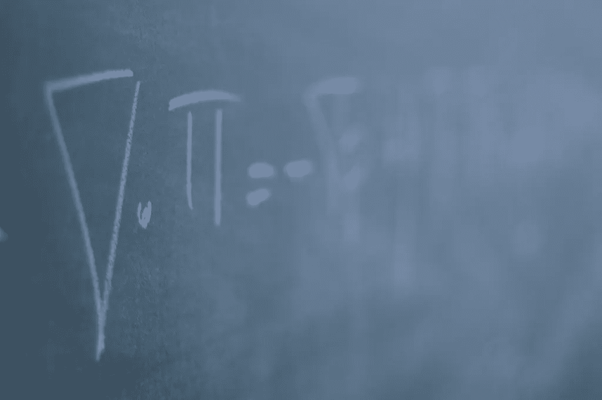
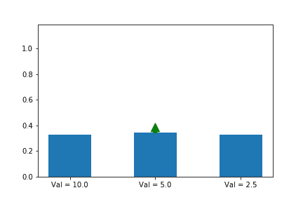
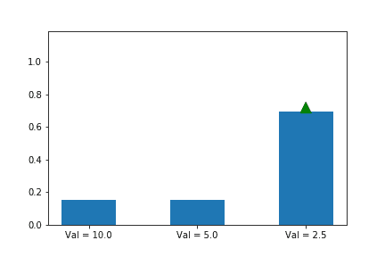
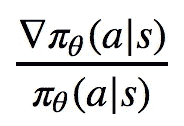
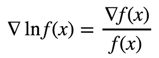
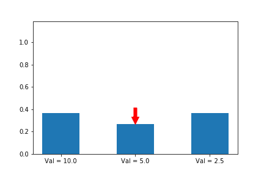

# 政策梯度的直观解释

> 原文：<https://towardsdatascience.com/an-intuitive-explanation-of-policy-gradient-part-1-reinforce-aa4392cbfd3c?source=collection_archive---------6----------------------->



Source: [https://hiveminer.com/User/Julian%20Veron](https://hiveminer.com/User/Julian%20Veron)

这是一系列教程的第 1 部分，我希望有 2 或 3 部分。下一部分将讨论 A2C，如果时间允许，我希望能完成一部分关于各种形式的政策外政策梯度的讨论。

这些帖子的笔记本可以在[git repo](https://github.com/AdrienLE/intuitive_policy_gradient)中找到。

# 介绍

## 政策梯度的问题

当今一些最成功的强化学习算法，从 A3C 到 TRPO 再到 PPO，都属于**策略梯度**算法家族，通常更具体地说属于**演员兼评论家**家族。显然，作为一个 RL 爱好者，你应该对策略梯度方法有一个很好的理解，这就是为什么有这么多教程试图描述它们。

然而，如果你曾经试图遵循这些教程中的一个，你可能会面临一个如下的等式:


或者相关的更新规则:


或者甚至损失函数:


很有可能伴随着一个非常笨拙的解释，一大堆复杂的数学，或者根本没有解释。

的确，我最喜欢的一些关于强化学习的教程对此感到内疚。雅罗米鲁的[让我们做一个 A3C](jaromiru.com/2017/02/16/lets-make-an-a3c-theory) 声明:

> 期望中的第二项，∇θlogπ(a|s，告诉我们在状态 s 中采取行动 a 的概率上升的方向。简单的说，如何让这种背景下的行动更有概率。

而 Arthur Juliani 在[用 Tensorflow 进行简单强化学习](https://medium.com/@awjuliani/super-simple-reinforcement-learning-tutorial-part-1-fd544fab149)中指出:

> *直观地说，这个损失函数允许我们增加产生正回报的行动的权重，减少产生负回报的行动的权重。*

这两种解释都不能令人满意。具体来说，他们完全无法解释这些公式中神秘的对数函数的存在。如果你只记住了他们的直观解释，你就不能自己写下损失函数。这是不对的。

令人惊讶的是，实际上**有**对这个公式的完美直观的解释！然而，据我所知，这种直觉的唯一清晰表述隐藏在萨顿&巴尔托的[强化学习:导论](http://incompleteideas.net/book/the-book-2nd.html)第 13 章第 3 节。

一旦我向你详细描述了它，你将能够解释对数函数的存在，并且你应该能够从基本原理写下公式。事实上，你也可以想出你自己的变种政策梯度！

在这篇文章中，我将假设你已经对强化学习有了一些基本的概念，特别是你熟悉 Q-Learning，理想情况下，熟悉 dqn。

如果你还不熟悉 Q-Learning，我建议你至少阅读一下 DQN 众多优秀教程中的一本。一些建议:

*   [用深度强化学习打败雅达利](https://becominghuman.ai/lets-build-an-atari-ai-part-0-intro-to-rl-9b2c5336e0ec)靠你的真心
*   [让我们做一个由雅罗密鲁创作的 DQN](https://jaromiru.com/2016/09/27/lets-make-a-dqn-theory/)
*   [亚瑟·朱利安尼用张量流进行简单强化学习](https://medium.com/emergent-future/simple-reinforcement-learning-with-tensorflow-part-0-q-learning-with-tables-and-neural-networks-d195264329d0)

## 激励政策梯度

在继续之前，让我们了解一下策略梯度方法相对于 Q-Learning 的一些优势，作为尝试真正理解策略梯度的额外动力:

*   Q-Learning 隐含的策略是确定性的。这意味着 Q-Learning 不能学习随机策略，这在某些环境下是有用的。这也意味着我们需要创建自己的探索策略，因为遵循策略不会执行任何探索。我们通常在ϵ-greedy 探索中这样做，这可能是非常低效的。
*   在 Q-Learning 中没有直接的方法来处理连续的动作。在策略梯度中，处理连续动作相对容易。
*   顾名思义，在政策梯度中，我们遵循政策本身的梯度，这意味着我们在不断改进政策。相比之下，在 Q-Learning 中，我们改进了对不同行动的价值的估计，这只是隐含地改进了策略。你可能会认为直接改善政策会更有效，事实也的确如此。

总的来说，在玩雅达利游戏这样的现代任务中，政策梯度方法经常击败基于价值的方法，如 DQNs。

# 解释政策梯度

## 简单的政策梯度上升

尽管本文旨在提供关于政策梯度的直觉，从而避免过于数学化，但我们的目标仍然是解释一个等式，因此我们需要使用一些数学符号，我将根据需要在整篇文章中介绍。让我们从第一个基本符号开始:

字母π将象征一项政策。我们称之为πθ(a|s)在状态 s 下采取行动 a 的概率，θ代表我们政策的参数(我们神经网络的权重)。

我们的目标是将θ更新为使ωθ成为最优策略的值。因为θ会变化，所以我们将使用符号θt 来表示迭代 t 时的θ。我们希望找出从θt 到θt+1 的更新规则，以便最终达到最佳策略。

通常，对于离散动作空间，ωθ将是具有 **softmax** 输出单元的神经网络，因此输出可以被认为是采取每个动作的概率。

显然，如果动作 a∫是最优动作，我们希望ωθ(a∫| s)尽可能接近 1。

为此，我们可以简单地对πθ(a∑| s)执行梯度*上升*，因此在每次迭代中，我们以如下方式更新θ:


我们可以将梯度∇πθt(a∗|s 视为“移动θt 的方向，以便*最快地增加*ωθt(a∑| s)的值”。请注意，我们确实在使用梯度*上升*，因为我们想要*增加* a 值，而不是*减少*a 值，这在深度学习中是常见的。

因此，看待这一更新的一种方式是，我们在我们的政策中不断“推动”更多的行动 a*，这确实是我们想要的。

在下面的例子中，我们知道第一个动作是最好的动作，所以我们对它运行梯度上升。对于这个运行的例子，我们将假设单个状态 s，以便更容易绘制策略的演变。在本系列后面介绍 A2C 时，我们将推广到多个状态。


上面的 gif 显示了我们算法的结果。每个条形的高度是我们算法运行时采取每个动作的概率，箭头显示了我们每次迭代所遵循的梯度。在这种情况下，我们只在第一个动作上应用渐变，它恰好具有最大的值(10)，这就是为什么它是唯一一个以其他动作为代价增加的动作。

## 权衡梯度

当然，在实践中，我们不会知道哪一个行动是最好的…毕竟这是我们首先要解决的问题！

回到“推动”的比喻，如果我们不知道哪个行动是最优的，我们可能会“推动”次优的行动，我们的政策将永远不会收敛。

一种解决方案是“推动”行动，其方式与我们对这些行动的价值的猜测成比例。这些猜测可能是高度近似的，但只要它们在现实中有所依据，更多的整体推动将发生在最优行动 a *上。这样就保证了我们的策略最终会收敛到 a∑= 1！

我们称我们对状态 s Q̂ (s，a)中动作 a 的值的猜测为。事实上，这与我们从 Q-Learning 中了解到的 Q 函数非常相似，尽管有一个微妙而重要的区别，这将使学习变得更容易，我们将在后面学习。现在，让我们假设这个 Q 函数是给定的。

我们得到下面的梯度上升更新，我们现在可以依次应用于每个动作，而不仅仅是最佳动作:


让我们使用不同行动的 Q 值的嘈杂版本(行动 a 为 10，行动 b 为 5，行动 c 为 2.5)来衡量我们对模拟策略梯度的更新，这一次，我们将随机更新每个不同的可能行动，因为我们假设我们不知道哪一个是最好的。正如我们所看到的，第一个动作最终仍然获胜，即使我们对值的估计(如箭头的长度所示)在迭代中变化很大。



# 政策修正

当然，在实践中，我们的代理人不会随机选择一致的行动，这是我们到目前为止隐含的假设。相反，我们将遵循我们正在努力培养的政策ρθ！这被称为培训**政策**。我们可能希望进行政策培训有两个原因:

*   即使在训练中，我们也积累了更多的奖励，这是我们在某些情况下可能看重的东西。
*   它允许我们探索状态空间中更有希望的区域，而不是纯粹随机地探索，而是更接近我们当前对最优行动的猜测。

然而，这给我们当前的训练算法带来了一个问题:尽管我们将更强烈地“推动”具有更好值的动作，但我们也将更经常地“推动”*那些碰巧一开始就具有更高ωθ值的动作(这可能由于偶然或错误的初始化而发生)！尽管这些行为是不好的，但最终可能会赢得通往顶峰的竞赛。*

*让我们通过使用相同的更新规则来说明这种现象，但是根据概率而不是统一地对动作进行采样:*

****

*在这里我们可以看到，第三个动作，尽管比其他两个动作的值低，但最终还是赢了，因为它的初始化值要高得多。*

*这意味着我们需要对更有可能被更频繁地采取的行动进行补偿。我们如何做到这一点？简单:我们*用我们的更新除以行动的概率。这样，如果一个动作比另一个动作更有可能被采取 4 倍，我们将有 4 倍多的梯度更新，但每个将会小 4 倍。**

*这为我们提供了以下更新规则:*

**

*让我们来试试:*

****

*我们现在看到，尽管行动 3 一开始有很大优势，但行动 1 最终胜出，因为当它的概率较小时，它的更新要大得多。这正是我们想要的行为！*

# *基础加固*

*我们现在已经解释完了政策梯度背后的直觉！这篇文章的其余部分只是简单地填写一些细节。这是一个重大的成就，你应该为自己理解到这一步而感到自豪！*

> *“但是，等一下”，你说，“我以为你会告诉我们如何理解神秘的更新规则*

**

> *但是我们的更新规则看起来完全不同！"*

*是的，的确我们的更新规则看起来不同，但实际上本质上是一样的！提醒一下，我们规则的关键点是*

**

*虽然我们试图解释的规则包含*

**

*下一节将解释 Â和 Q̂之间的区别，但现在可以说两者都工作得很好，但使用 Â只是一种优化。*

*因此，剩下的唯一区别是*

**

*和*

**

*其实这两种表达是等价的！这是由于链式法则和 log x 的导数是 1/x 的事实，你们可能从微积分中知道。所以一般来说我们有:*

**

*所以现在你知道政策梯度更新中神秘日志功能的由来了吧！那么，为什么人们使用对数函数的形式，而不是更直观的除以π(s|a)的形式呢？我认为这有两个原因:*

1.  *它模糊了政策梯度背后的直觉，从而让你看起来更理解它。*
2.  *当进行梯度下降时，可以将更新表示为损失函数，如我们在开始时看到的方程 L=−Â (s，a)logπθ(s|a )(将 Â(s,a)inside 作为损失函数是好的，因为它相对于θ是常数)。这样你就可以使用你最喜欢的深度学习库来训练你的策略(我们很快就会看到怎么做！).*

*至此，您已经理解了强化算法的基本形式，正如您所料，它代表“奖励增量=非负因子×补偿强化×特征合格性”……(是的，我是认真的，参见[原文](http://www-anw.cs.umass.edu/~barto/courses/cs687/williams92simple.pdf))。加强是基本的策略梯度算法，几乎所有你可能听说过的高级策略梯度算法都基于它。*

## *优势功能和基线*

*现在剩下的最后一件要解释的事情，正如承诺的那样，是 Q̂和 Â.之间的区别你应该已经从 Q-Learning 中熟悉了 Q:Q(s，a)是通过在状态 s 采取行动 a，然后在其后遵循我们的政策π而获得的值(确切地说是累积贴现回报)。*

*请注意，可能的情况是，遵循任何行动都会给我们带来累积奖励，比如说，至少 100，但一些行动会比其他行动更好，因此 Q 可能等于，比如说，行动 a 为 101，行动 b 为 102，行动 c 为 100。正如您所猜测的，这意味着我们更新的几乎所有权重都不会告诉我们当前行动是否更好，这是有问题的。*

*你可能也熟悉 V(s)函数，它简单地给出了从状态 s 开始一直遵循策略的值。在上面的例子中，V(s)将大于 100，因为所有 Q(s，a)都大于 100。*

*通过从 Q(s，A)中减去 V(s)，我们得到了*优势函数* A(s，A)。这个函数告诉我们，在一个状态下采取行动与按照策略行动相比，是好是坏。在上面的例子中，它将从所有动作的 Q 值中减去额外的 100，提供更多的信噪比。*

*在本教程中，我总是写 Q̂或 Â，在 q 和 a 上面加上一个“帽子”，以强调我们不是在使用“真实的”q 或 a，而是对它们的估计。如何获得这些估计值将是本系列下一篇文章的主题。*

*事实证明，如果我们从 Q̂(s,a 中减去**任何**函数，只要该函数不依赖于动作，强化仍然可以很好地工作。当然，基于我们之前的直觉，这是有意义的，因为唯一重要的是我们在具有更高 Q 值的动作上更努力地“推动”*，减去任何不依赖于该动作的值将保留我们在各种动作上推动的努力程度的排名。**

**这意味着用 Â函数代替 Q̂函数是完全允许的。事实上，由于上述原因，并且还因为它应该减少梯度更新的方差，所以它被广泛推荐。请注意，Â并不一定是代替 Q̂的最佳函数，但在实践中，它通常工作得相当好。**

**让我们看看在我们的模拟中使用 Â做了什么:**

********

**输出:**

```
**Running using A function
Done in 48 iterations
Variance of A gradients: 31.384320255389287
Running using Q function
Done in 30 iterations
Variance of Q gradients: 31.813126235495847**
```

**不幸的是，这里的影响并不显著:方差最终会稍微降低，但是收敛的时间会更长。也就是说，我在比较两者之间相同的学习率，使用优势函数应该会让您使用更高的学习率，而不会发散。此外，这是一个玩具的例子，使用优势函数的好处已经在实践中广泛证明了更大的问题。可悲的是，这是本教程中的一个例子，你必须相信我的话，有些东西工作得很好。**

# **结论**

**您现在对基本的政策梯度有了全面直观的理解。然而，您可能想知道如何在实践中使用它们:如何用神经网络表示策略？首先，你是如何得到你的 Â估值的？在实践中，还有哪些其他的技巧可以使这种方法奏效？**

**我们将在第 2 部分中很快了解所有这些，这将解释 A2C 算法。**