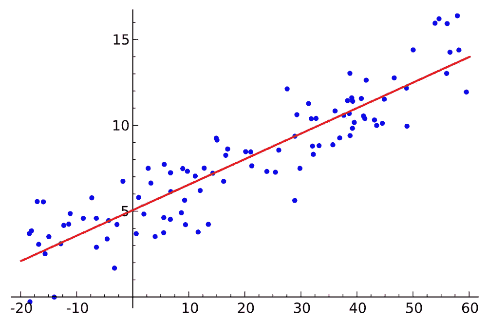
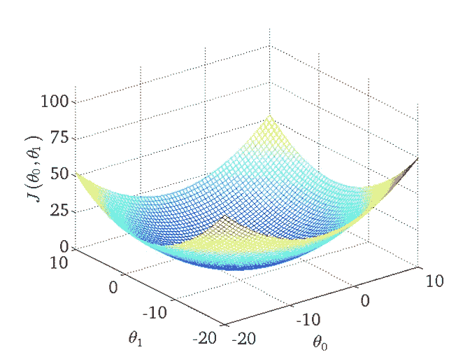
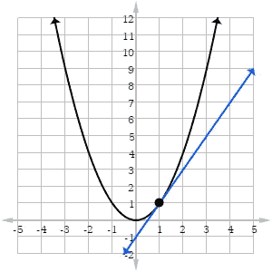
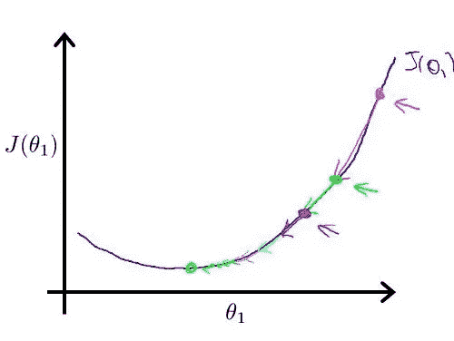
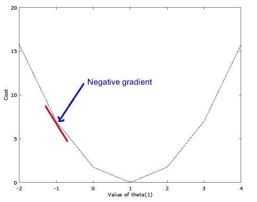
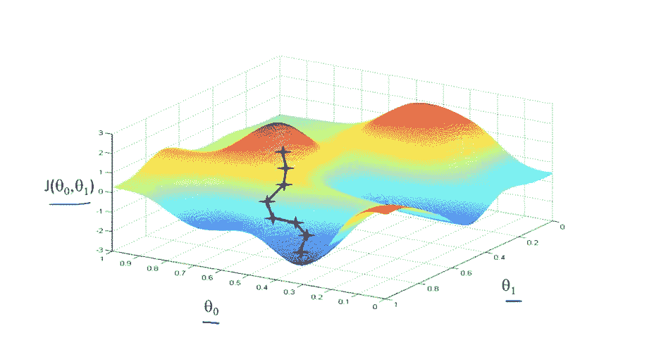
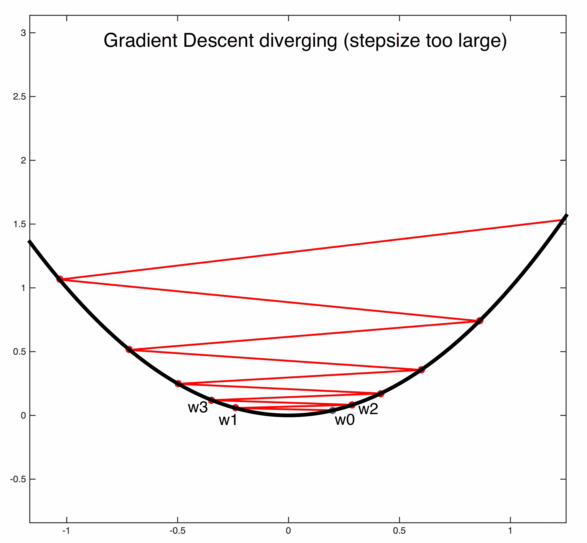

# 非数学家监督学习综合入门指南

> 原文：<https://towardsdatascience.com/an-involved-introduction-to-supervised-learning-for-the-common-human-6338d9559748?source=collection_archive---------17----------------------->

## 洞察具有自学能力的计算机

人工智能:一个对人类发动战争的机器人部落。技术启示录。公元 3000 年。

不完全是。下面是更准确的介绍。

**人工智能(A.I.):** 电脑创作的画作。与机器进行有意义的对话。自动驾驶汽车。甚至，令我们痛苦的是，高度个性化的、有针对性的广告。

这些只是人工智能大规模创新应用的一小部分。

欢迎来到智能机时代。人工智能已经降临到我们头上，幸运的是，*它不打算终结人类。当大多数人讨论人工智能时，他们指的是机器学习，通常缩写为 M.L .，这是计算机智能行业内最大的领域。在本指南中，我将专门讨论机器学习及其内部运作，特别是线性回归:一种监督学习的普通形式。*

在接下来的教导中，描述和解释了多个数学模型；记住，这些计算都是在机器内部进行的。

**目录:**

*   监督学习——概述
*   监督学习的注释
*   线性回归预测模型
*   用成本函数评估模型
*   梯度和导数导论
*   梯度下降:监督 M.L .模型如何学习
*   总结

准备好学习了吗？如果是这样，带上手电筒——我们正在进入人工智能的洞穴！

## **监督学习——概述**

在处理一个复杂的主题时，主题的坚实基础非常重要。在深入研究机器学习的机制之前，让我们先了解一下机器学习在做什么。

当我们教计算机做一些事情时，比如识别物体的照片，或者预测明天的房价，我们使用的是监督学习。*监督学习是一种方法，在这种方法中，我们为机器提供数据，将数据分类成示例，并为这些数据提供正确的输出*。*机器自我调整，直到获得可接受的预测精度。*

## **对*的注释*用于监督学习**

让我们通过例子来学习。

假设我们想教我们的计算机预测房价。我们将首先给我们的机器提供该地区其他房屋的价格，以及每所房屋的信息(大小、卧室数量、楼层数量)。

这些大量的信息被称为**训练集**。我们为任何一个给定的房屋提供的数据被称为**训练示例**。这由 **x(i)** 表示，意味着与房子(I)相关的数据(x(2) =训练示例 2)。

包含在训练示例中的每个不同的信息位被称为一个**特征**。在表示住房属性的数据中，房子的大小可能是一个特征，楼层数和卧室数也是一个特征。

每个训练示例以相同的顺序包含相同的功能，这意味着我们在训练集中获得关于每个房屋或示例的相同信息。

特征由 j 表示。也就是说， **x(i)j** 是示例 I 的特征 n

在这种情况下，给定房屋的价格将是期望产量或**标签**。这由 **y(i)** 表示，表示房子(I)的正确输出(y(2) =示例 2 的正确输出)。

*注意:* Medium 不支持下标和上标。x(i)j 一般写成 x *上标* (i)，*下标* j. y(i)应该是 y *上标* (i)。

## **线性回归预测模型(假设)**

这一切都很好，但是我们仍然不知道计算机实际上是如何得出它的输出的。

线性回归是最基本的机器学习模型之一，当然也是学习的必备工具。尽管如此，它在大规模应用中使用非常频繁。象征性地，这是该模型的常见表示:

*满足假设。别害怕，他不咬人。*

我会为你打破僵局。

**hθ(x)** 简单地表示假设函数。它说输出的值根据输入 x 而变化，也就是说，根据括号内的值 x 进行预测，意思是 **hθ(x(i))** 象征假设对例 x(i)所做的预测。

你看到的时髦希腊符号(θ——这些家伙)是θ值，更专业的说法是**参数**。这些数字可以是正数，也可以是负数。

来自数据集的每个特征 k 与来自假设的参数 k 相关联。你很快就会明白我说的“相关联”是什么意思。然而，由于惯例，θ0 没有各自的特征。现在，不要太在意θ0。只知道它叫偏置单元。

*注:*上图假设只有一个特征(x)和两个参数(θ0 和θ1)。在实际的监督学习应用中，通常有非常大量的参数和特征。

现在所有的部分都准备好了，让我们来看一下预测过程！当我们为我们的假设提供一个训练示例时，每个特征都乘以其各自的θ值。输出是这些乘积的总和，加上偏置单元。

为了澄清，让我们回到我们的房价例子。假设我们使用的是培训示例 1。我们的例子将只使用一个特征来解释:房子的平方英尺大小。这将由 x(1)1 表示，表示训练示例 1 的特征 1，并且将等于 2，500(平方英尺)。假设我们的假设认为，每平方英尺为房屋增值 50 美元，该地区的房价起价为 20 万美元。θ(0)的值为 200，000，θ(1)的值为 50。

让我们来看看这是为什么。

我们知道，预测是通过将偏差单位与特征及其各自参数的乘积相加而形成的。

当我们将 x(1)1(2500 平方英尺)乘以θ(1)(相关参数为 50 美元/平方英尺)时，我们得到的值为 125000 美元。通过这个乘法，对于每平方英尺(x(1)1)，增加了 50 美元的价值(θ(1))。我们将该产品添加到我们的偏差单位$200，000 ( θ(0)代表当地平均起始房价)中，得到最终产值$325，000！

在机器学习的实际应用中，会有 10 到 10，000 个特征。与要素关联的每个θ值将具有正权重或负权重，从而影响每个要素影响最终输出的方式。

哇！这是使用线性回归模型预测值的过程。

在继续之前，看一下如果将预测用图表表示出来，它会是什么样子:

Linear regression hypothesis

这是一个假设，它已经被一个特征的数据所拟合。x 轴显示每个训练示例的该特性的值。y 轴测量该示例的期望输出值。在上图中，θ0 的值为 5，θ1 的值约为 1/7。可以看到，θ0 是 y 轴截距，θ1 是模型的斜率。

我们用来预测房价的模型也可以用同样的方式绘制。

## **用成本函数评估模型**

好了，现在我们明白了什么是监督学习，以及线性回归模型如何根据它们的训练样本进行预测。但是学习是在哪里进行的呢！？

别担心，我们很快就会到达那里。在我们这样做之前，我们必须了解如何衡量我们假设的有效性。*具体地说，我们需要一个数字表示，特别是一个函数，来证明我们的参数θ与我们的数据有多吻合。*这将向我们展示我们的模型做出预测的准确性。

*进入成本函数。*

它就在那里，光彩夺目！平方误差成本函数！

被恐吓？不要这样。你很快就会对这里发生的事情有一个清晰的印象。

正如我们的假设一样，我们有一个函数句柄: **J(θ)** 。它用来表示函数及其输出值。因此，当你看到 J(θ)时，回想一下你正在处理的是成本函数(有时称为损失函数)，或者与之相关的输出。

在机器学习中，字母 **m** 是训练样本的数量。如果我们有 5000 套房子的数据，m = 5,000。

我们最新的希腊朋友**西格玛**(**σ**)怎么样？这个家伙表示一个求和项，它在一个迭代器上循环并对一个指定的项求和。σ下面的小等式 i = 1 显示了迭代器的初始值，以及变量(I)。(I)表示求和循环中的当前迭代。σ以上是 m，即终值。

那是一个非常抽象的定义。用简单的英语来说，*变量 I 取 1 到 m 之间的每一个值。对于这个循环的每一个阶段，我们将 sigma 右边的值加到一个运行总和上。*

σ右边的表达式是什么？！

**(hθ(x(i)) - y(i))** 称为平方误差项。它的内容应该看起来很熟悉。对于每次迭代，平方误差项使用假设来预测使用示例 x(i)的输出，并从中减去该示例 y(i)的期望输出。这就是 x(i)和 y(i)之间的差异或误差。然后，该值被提升到 2 的幂。因此平方误差。

因为它是求和，其中(I)取 1 和训练样本数量之间的所有值，所以我们对整个数据集完成这个计算。*随着算法的进行，所有平方误差被一个接一个地加在一起。*一旦求和完成，假设的所有误差的总和已经计算出来。

最后，我们将总误差乘以 **1/2m** ，得到成本函数的输出。除以 2m，结果是模型平均误差的一半。除以 2m 而不是 m 应该被认为是另一种机器学习惯例。这背后有数学上的原因，但是解释超出了本文的范围。

给定成本函数上的任何坐标，可以提取以下信息:
自变量的所有值(θ值)，以及那些参数的成本。成本是因变量。

这个*总结了*关于成本函数的知识。让我们来看看它的几个图像。

Cost function for data with two parameters

请注意成本函数是如何抛物线化的，因为它是二次函数。同样重要的是，要看到 y 轴上显示的成本随着θ值的变化而变化。

Another cost function, but for only one parameter

损失函数的另一种变化如上图所示。它测量的是只包含一个参数的假设，因此是一个二维的可视化。

对于每个θ值，空间维度被添加到函数中。由于这个原因，我们不能绘制任何处理包含两个以上特征的数据的损失表示(第三维是 y 轴上的成本)。记住这一点可能对你的视觉学习者有所帮助。

成本函数经常采用奇特的形状和奇怪的形式。除了数学和视觉上的有趣，损失函数在机器的实际学习过程中也起着至关重要的作用。以下部分将概述这一关键特征。

## **梯度和导数介绍**

导数是微积分的基础之一。我知道微积分会让很多人产生恐惧。请不要逃避。

就像我们已经讨论过的所有内容一样，我将以简单而有条理的方式解释这个概念。

下面是什么**导数**是一句话:*表示函数和该函数在任意点的斜率之间的关系的表达式，给定自变量。*

x 的导数是 2x。这意味着在函数 x 上的值为 x 时，该点的斜率为 2 * x。

知道了这一点，我们就可以理解导数代表了瞬时变化率，因为它们揭示了函数上某一点的斜率，而不是两个独立点之间的斜率。

当我们计算一个导数时，通过将独立变量代入导数方程，其输出就是函数上该点的斜率。由于这个原因，导数可以画为图形的切线。

A tangent line to x², at x = 1\. The derivative being 2x, the slope of the tangent is 2 * 1.

**关于衍生品需要注意的三件事:**

1.  它们有一个量级(大的表示陡坡，小的表示缓坡)。
2.  它们有一个方向(正或负)。
3.  导数指向函数求值点的最陡变化方向。

请记住这一点，因为这对下一节很重要。

那么梯度呢？

函数的**梯度**就像导数一样，代表函数上任意给定点的斜率。然而，梯度可以应用于多元函数。

*梯度本质上是一系列导数，每一个导数代表图形一维的斜率。这些导数，每一个都表示多元函数中一个变量的变化率，叫做偏导数。当偏导数组合成一个方向单位(向量)时，它们就被称为梯度。*

向量格式的梯度可以用以下格式表示:
【3；-4;5]
这将是三维图形的梯度。此处提供的信息如下:

*   在这个坐标上，x 平面的斜率是+3
*   y 平面在这个坐标上的斜率是-4
*   该坐标处 z 平面的斜率为+5

Partial derivative visualization

上面是一个三维函数的偏导数。下图展示了偏导数所代表的含义:函数一维的变化率。

这就是你所需要知道的关于梯度和导数的全部，来理解机器是如何学习的！

从一个方程中提取导数和梯度可能是相当密集的，通常需要整个教科书来解释。因此，不幸的是，在这篇文章中，您将无法深入了解推导。我只是要求你在我变出一个衍生物的时候相信我的话。

此外，如果你没有理解最后一部分的所有内容，也不要担心。最重要的是，梯度代表函数的斜率。偏导数告诉我们关于所述函数的一个变量(或维度)的斜率。

## **梯度下降:有监督的核磁共振模型如何学习**

我非常强烈地感觉到，你已经攻克了机器学习最难的部分。也就是说，把你的脑袋缠在外国符号上，学习假设是如何形成和评估的。如果你理解了前面每个主题的基本概念，理解梯度下降就相对容易了。

话虽如此，我们还是开始吧。

梯度下降的目标是最小化成本函数。这意味着我们要为我们的模型确定最低的成本，因为这样做可以找到误差幅度最小的假设。该值将被表示为函数的最低点，因为图的高度描述了损失。

如果要根据假设来表示这一点，我们需要一个模型来最小化所有数据点和函数本身之间的垂直差异之和，因为误差是根据预测输出与实际输出计算的，并在 y 轴上测量。

Minimizing the distance on the y-axis between the function and data points minimizes the cost.

通常用于解释梯度下降的类比如下:

你站在山顶，周围是山谷。你想通过最有效的路线到达离你很近的最低海拔。你环顾四周，朝最陡的下坡方向迈出一步。你重复这个过程，直到你在一个谷底。

山丘和山谷象征着成本函数。下坡时采取的步骤代表梯度下降的过程。

在该算法中，所述步骤通过递增地改变随机初始化的θ值来实现，以更好地表示训练数据。一旦模型符合数据，它应该能够推广到它还没有见过的例子，并根据新的信息提供合理准确的预测。

下面是梯度下降的公式。再次强调，不要感到不知所措。我将详细介绍它的内部工作原理。

算法说:对于 0 到 n(参数个数)之间的 j 的每一个值，设θ(j)等于θ(j)减去代价函数在当前坐标对θ(j)的偏导数，乘以一个值α。重复，直到成本最小化。

这可能是一句话中包含的大量信息。我明白了。继续读下去，我会澄清。

正如我们所知，导数指向函数中变化最大的方向，导数的值是计算坐标处直线的斜率。通过取导数的负值，我们得到与最陡变化方向相反的方向。这个方向是我们调整θ值的方向。这样做的原因很快就会变得明显。

对于每一个参数θ，我们通过所述参数的负偏导数的比例值来调整θ。我说缩放，是因为在执行减法之前，我们将导数乘以变量α。我将很快解释阿尔法的重要性。这改变了θ，使得它更接近其自身的值，这允许成本函数具有最小值。θ的一次变化称为一个步长。

本质上，如果θ太大，就会倒向最小值的右边。偏导数将是正的。当我们从参数中减去导数值时，会导致θ变小，更接近所需的最小值。

当θ太小时也是一样。当一个参数需要变大时，它位于最小值的左边，这就产生了负导数。减去负数会导致加法，这正是这种情况下所需要的。

让我们仔细看看:

θ的第一个值由成本函数上的紫色点表示。θ开始时过大。如您所见，该值导致损失非常高。该点的斜率相当陡，并且具有很大的正值。这个导数乘以某个小整数α，然后从θ中减去。在减法中，偏导数的大小和方向起着至关重要的作用。斜率为正时，θ(1)变小。斜率较陡或较大时，θ(1)会发生显著变化，这是合适的，因为θ距离其目标值非常远。

随着这一过程的重复，θ(1)接近损耗最小值，函数的斜率降低。由于增量的大小基于斜率，因此步长会变小。最终，变化变得无穷小，只是起到微调的作用。这个方便的细节允许梯度下降以避免超过最小值，并为参数提供非常精确和合适的值。

让我们看看这个过程如何影响太小的θ值。

上面，我们可以看到导数的值在θ(1) = -1 处小于零，因为切线的斜率在该点为负。在这种情况下，我们将反复从θ(1)中减去这个负值，慢慢增加它的值，直到它实现函数的最小化。

这个算法的另一个有趣的特点是，在任何函数的最小值，斜率是 0。这很重要，因为它告诉我们，在收敛时，当采取步骤时，θ值将不再改变。(θ(1) - 0 = θ(1)).

在多元成本函数中，我们一次更新所有的θ值，因此我们朝着最小值的增量步骤类似于梯度，如下所示:

上面，我们看到了成本函数 J(θ)。黑线显示了随着θ值的调整，梯度下降所采取的运动。记住这个过程和二维函数的过程是一样的。它只是对θ(0)和θ(1)同时执行，这是导致下降以梯度的形式出现的原因。

现在让我们回顾一下这个过程是如何用数学方法表示的。这里再一次给出了可供参考的算法:

我们已经知道θ(j)代表什么。

:=符号表示我们将变量设置为等于操作符另一端指定的值。x := 3 意味着我们设 x 等于 3。

你听说的那个阿尔法怎么样了？∝是α。∝就是所谓的超参数。这意味着它不是模型用来进行预测的值之一，而是对我们的最终模型有影响的变量。

Alpha 修改学习率，或梯度下降的增量大小。如果α取大值，梯度下降算法可以更快地收敛(达到最小值)。如果它很小，梯度下降需要更多的迭代来产生精确的模型。

所以越大越好？

嗯，没有。
如果∝太大，梯度下降可能会超过所需的最小值。如果是这种情况，算法就会出现分歧，这意味着成本越来越高。另一方面，如果α太小，可能需要数千甚至数百万的增量来实现准确的假设。

Gradient descent diverging due to an overly large value for alpha

∝有一个非常好的位置。然而，找到它是非常复杂的，模型分析需要一篇文章。现在，你应该想象找到α的最好方法是通过计算试验。
常用值介于 0.001 和 10 之间。

梯度下降方程的最后部分是成本函数相对于θ(j)的导数项。这是公式中求和项右边的部分。

下面是关于某个参数θ(j)的导数的计算方法:

对于参数θ(j):
使用(I)作为迭代器循环通过每个训练示例，从该示例的假设输出 x(i)中减去期望输出 y(i)。这个差值乘以特征 x(i)j(与θ(j)相关的特征)。这个乘积被加到一个累计和中。

*注意:*偏差单位没有任何相关特征，这意味着在计算偏导数时，我们不将误差(x(I)-y(I))乘以 x(i)j 的值。

求和完成后，我们将所得值除以训练示例的总数。这为我们提供了关于θ(j)的偏导数。

在同时更新所有参数之前，我们对每个参数θ重复导数计算。

现在，再读一遍梯度下降的解释:

算法说:对于 0 到 n(参数个数)之间的每个值 j，设θ(j)等于θ(j)减去代价函数在当前坐标对θ(j)的偏导数，乘以值α。重复，直到成本最小化。

我相信这一点更容易理解。

恭喜你！这就是梯度下降——最常见的机器学习算法。现在你对它有了彻底的了解。

## **一份总结**

这是线性回归:

我们有一个数据集 X，包含训练示例 x(i)和标签 y(i)。每个例子具有特征 x(i)1 到 x(i)j，j 是特征的总数。这些特征各自提供独特的信息。

假设 hθ(x)对数据进行预测。它包含与每个特征相关联的θ值，以及偏差单位θ0，总共 j + 1 个参数。此模型通过将训练示例的每个特征与其相应参数的乘积相加，并将偏差单位添加到此总和中，来创建预测输出。

成本函数衡量假设的准确性。通过降低成本，我们获得了更精确的模型。

梯度下降可以通过基于θ值相对于成本函数的偏导数改变θ值来实现这种最小化。通过在损失函数的当前坐标处取负斜率，每个参数逐渐向图表上的最小值移动。重复这一过程，直到达到收敛。

然后，模型能够接受新数据作为输入，并产生准确的输出。

这就是线性回归。你明白吗！太神奇了！

看到我们每天都被人工智能包围，令人震惊的是很少有人理解它在做什么。这项技术发展极其迅速，这一次无知不是福。理解我们周围的世界是人类的天性。重要的是要看到什么样的进步将很快成为主流。

你现在对机器学习的专业领域有了一些了解。让我们最后看一下我们眼中的人工智能是什么:

**人工智能(A.I.):** 预测模型。平方误差成本函数。梯度下降算法。

## **出发前**

*   在 Linkedin 上与我联系，有任何问题请随时联系我
*   查看吴恩达在 Coursera 上的机器学习课程，这是一个很好的、深入的机器学习入门课程
*   记住学习需要时间！对学习新的东西感到兴奋，而不是对不理解的东西感到沮丧。