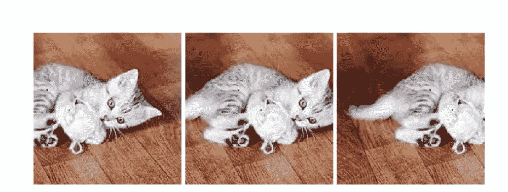
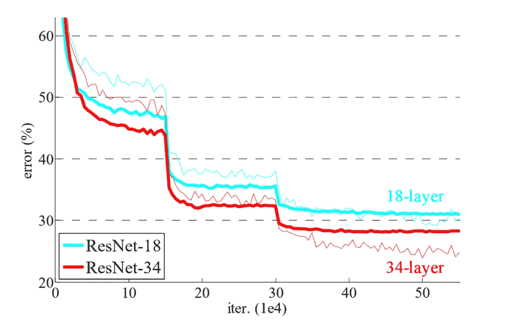
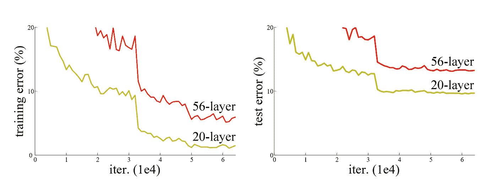
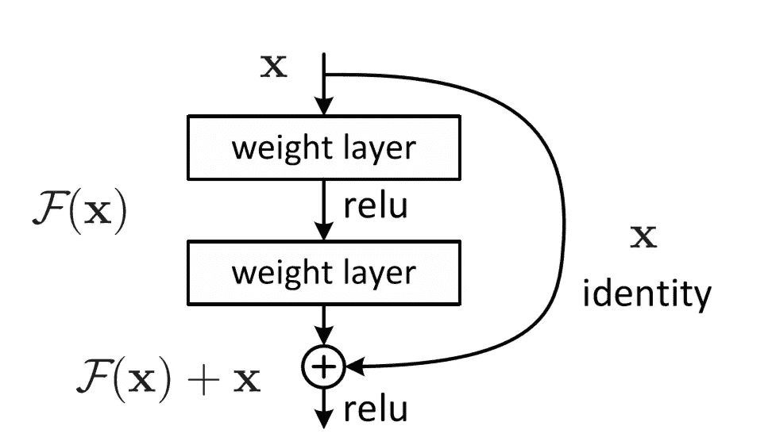
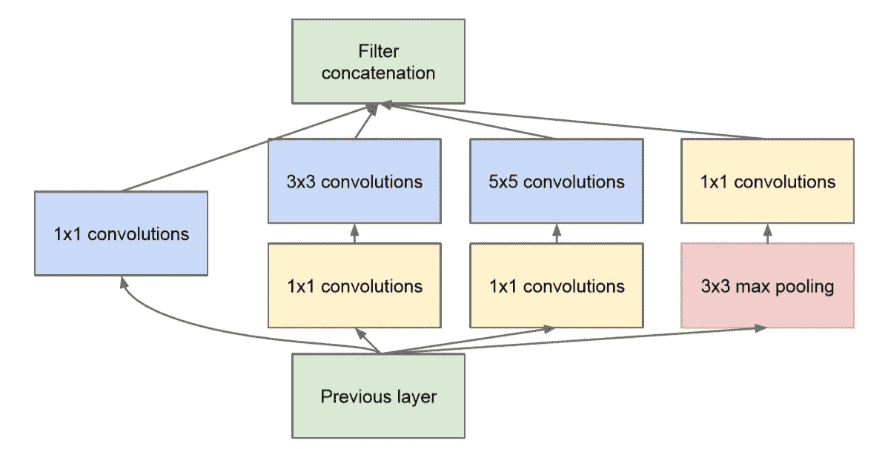
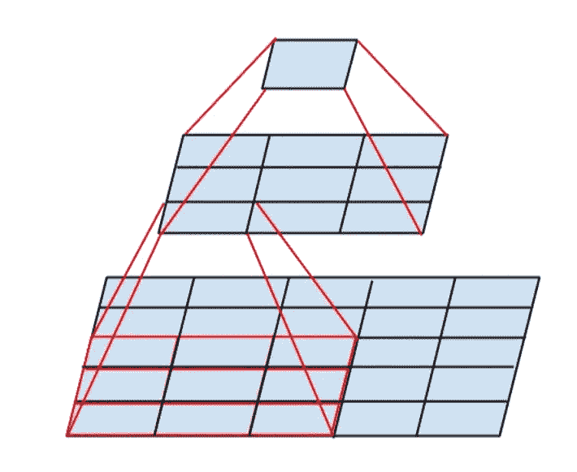
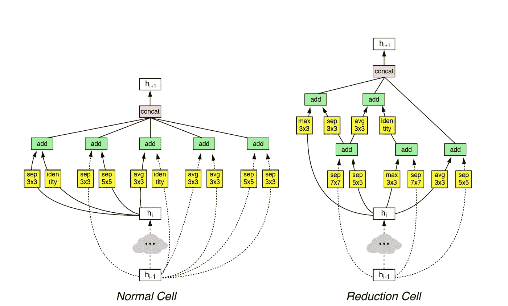

# 深入研究图像分类

> 原文：<https://towardsdatascience.com/an-overview-of-image-classification-networks-3fb4ff6fa61b?source=collection_archive---------4----------------------->

了解用于图像分类的不同网络架构是一项艰巨的任务。在这篇博文中，我将讨论目前在 [keras 包](https://keras.io/applications/)中可用的主要架构。我将按时间顺序浏览这些架构，并试图从从业者的角度讨论它们的优缺点。

## 关键概念

尽管计算机视觉领域的不同研究人员倾向于遵循不同的实践，但总体而言，在设置实验时，您可以看到以下趋势。我讨论了如何对图像进行预处理，使用什么类型的数据增强，优化机制和最终层的实现。

*预处理*
通常，在训练集上计算平均像素值，并从图像中减去。请注意，在将这些模型与 keras 一起使用时，将这一点考虑在内非常重要。Keras 为每个计算机视觉模型提供了不同的“预处理”功能。

*数据扩充*
影像分类研究数据集通常非常庞大。然而，数据扩充经常被用来提高泛化性能。通常，使用随机裁剪重新缩放的图像以及随机水平裁剪和随机 RGB 颜色和亮度偏移。存在不同的重新缩放和裁剪图像的方案(即单尺度对多尺度训练)。测试期间的多作物评估也经常使用，尽管计算成本更高且性能改善有限。请注意，随机缩放和裁剪的目标是了解每个对象在不同比例和位置下的重要特征。Keras 没有实现所有这些现成的数据扩充技术，但是它们可以通过 ImageDataGenerator 模块的预处理功能轻松实现。安德鲁·霍华德的数据扩充[技术](https://arxiv.org/ftp/arxiv/papers/1312/1312.5402.pdf)更深入地解释了关键方法。

An example of different crops of the same picture (Image taken from Andrew Howard’s paper).

*训练机制*带动量的 SGD 或 RMSProp 经常被用作优化技术。学习率方案通常相当简单，要么在验证损失或准确度开始稳定时降低学习率，要么在固定间隔降低学习率。使用 keras 中的“ReduceLROnPlateau”回调，您可以很容易地模仿这种行为。

An example of the training procedure where the LR is reduced then a plateauing loss is noticed.

*最后一层*
传统上，图像分类网络的最后一层是全连通层。这些层是大量的参数猪，因为你需要 NxM 个参数从 N 到 M 个隐藏层节点。如今，这些层已经被需要更少参数和计算时间的平均或最大池层所取代。在 keras 中微调预训练网络时，考虑这一点以限制添加的参数数量是很重要的。

## VGGNet

最初由卡伦·西蒙扬和安德鲁·齐泽曼于 2014 年发表， [VGGNet](https://arxiv.org/pdf/1409.1556.pdf) 表明，堆叠多层是计算机视觉良好性能的关键组成部分。他们公布的网络包含 16 或 19 层，主要由小型 3×3 卷积和 2×2 汇集操作组成。

作者的主要贡献是表明堆叠多个**小**滤波器而不合并可以增加网络的代表性深度，同时限制参数的数量。通过堆叠例如三个 3×3 conv。代替使用单一的 7×7 层，克服了几个限制。首先，组合三个非线性函数而不是单个非线性函数，这使得决策函数更具区分性和表达性。第二，参数的数量减少了 81%,而感受野保持不变。因此，使用较小的滤波器也可以作为正则化器，提高不同卷积滤波器的效率。

VGGNet 的缺点是评估起来比浅层网络更昂贵，并且使用更多的内存和参数(140M)。这些参数中的许多可以归因于第一个完全连接的层。已经表明，可以移除这些层而不会降低性能，同时显著减少必要参数的数量。VGG 在 keras 上提供 16 层和 19 层两种预训练重量。

## 雷斯内特

ResNet 体系结构是由何等人开发的，试图训练具有更大深度的网络。作者指出，增加网络深度会导致更高的训练损失，这表明由于梯度问题(爆炸/消失梯度)而存在潜在的训练收敛问题。

Although the space of potential functions of a 20-layer network is encapsulated within the space of a 56-layer network, with convential gradient descent, it is not possible to achieve the same results. (Image taken from the ResNet paper)

他们的主要贡献是在神经网络体系结构中增加了跳跃连接，使用批量标准化并在网络末端移除完全连接的层。

With a skip connection, the input x of a convolutional layer is added to the output. As a result, the network must only learn ‘residual’ features and existing learned features are easily retained (Image taken from the ResNet paper).

跳过连接是基于这样一种思想，即只要神经网络模型能够将信息从前一层“正确地”传播到下一层，它就应该能够“无限地”深入。在没有通过更深入来聚集附加信息的情况下，具有跳跃连接的卷积层可以充当身份函数。通过向网络添加跳跃连接，卷积层的默认功能变成了识别功能。滤波器学习到的任何新信息都可以从基本表示中减去或添加到基本表示中，因此更容易优化残差映射。跳过连接不会增加参数的数量，但是会导致更稳定的训练和显著的性能提升，因为可以获得更深的网络(例如，深度为 34、50、101 和 152 的网络)。请注意，1x1 卷积用于将图层输入映射到其输出！

除了跳跃连接之外，在每次卷积之后和每次激活之前使用批量归一化。最后，完全连接的层被移除，取而代之的是使用平均池层来减少参数的数量。由于更深的网络而增加的卷积层的抽象能力减少了对完全连接的层的需求。

## 谷歌网

谷歌网的论文与雷斯网的论文几乎同时发表，但引入了不同的改进。前两篇论文着重于增加分类网络的表示深度。
然而，使用 GoogLeNet，作者仍然试图扩大网络规模(多达 22 层),但同时他们的目标是减少参数数量和所需的计算能力。最初的 Inception 架构由谷歌发布，专注于在大数据场景和移动设置中应用 CNN。该架构是完全卷积的，由初始模块组成。这些模块的目标是通过构建由多个构建块组成的复杂滤波器(例如，网络中的网络—初始)来提高卷积滤波器的学习能力和抽象能力。

An example of an Inception module. The 1x1 convolutions are performed to reduce the dimensions of input/output (Image taken from the GoogLeNet paper).

除了初始模块，作者还使用辅助分类器来促进更稳定和更好的收敛。辅助分类器的思想是使用几种不同的图像表示来执行分类(黄框)。因此，在模型的不同层计算梯度，然后可以用于优化训练。

A visual representation of the GoogLeNet architecture. The yellow boxes indicate the presence of auxiliary classifiers.

## Inceptionv3

Inceptionv3 架构结合了几项创新。在 Inceptionv3 中，主要关注的是重用 GoogLeNet 和 VGGNet 的一些原始想法，即使用 Inception 模块，并用一系列较小的卷积更有效地表达大型过滤器。除了小卷积之外，作者还试验了非对称卷积(例如，用 nx1 和 1xn 代替 nxn，而不是多个 2x2 和 3x3 滤波器)。

An example of a 3x3 filter followed by a 1x1 filter, effectively replacing a 5x5 filter (Image taken from the Inceptionv3 paper).

作者通过执行批量标准化和标签平滑改进了网络的正则化。标签平滑是给每个类分配一些权重的做法，而不是给地面真实标签分配全部权重。由于网络在训练标签上的过度拟合会更少，它应该能够更好地概括，这与使用 L2 正则化是类似的做法。

投入了大量精力来确保该模型在高分辨率和低分辨率图像上都表现良好，这是通过分析不同比例的图像表示的初始模块来实现的。因此，当初始网络用于对象检测框架时，它们在分类小的和低分辨率的对象时表现良好。

## 纳斯网

我将讨论的最后一个图像分类架构是 [NASNet](https://arxiv.org/pdf/1707.07012.pdf) ，它是使用神经架构搜索(NAS)框架构建的。NAS 的目标是使用数据驱动的智能方法来构建网络架构，而不是直觉和实验。虽然框架的细节我就不赘述了，但大致思路还是说明了。
在初始文件中，显示了“单元”中过滤器的复杂组合可以显著改善结果。NAS 框架将这种单元的构建定义为优化过程，然后堆叠最佳单元的多个副本来构建大型网络。

最终，构建两个不同的单元并用于训练完整的模型。

## 结果

下表摘自 [Keras](https://keras.io/applications/) ，它很好地概括了我所讨论的不同网络的结果。请注意，VGG 以其大量的参数脱颖而出，而 Resnet50 和 Inceptionv3 以其令人印象深刻的网络深度脱颖而出。在撰写本文时，NASnet(不在表中)在 ImageNet 上以 82.7%的前 1 名和 96.2%的前 5 名准确率实现了最佳性能。

# 问题

如果你有任何问题，我很乐意在评论中阅读。如果你想收到我博客文章的更新，请在 [Medium](https://medium.com/@lars.hulstaert) 或 [Twitter](https://twitter.com/LarsHulstaert) 上关注我！