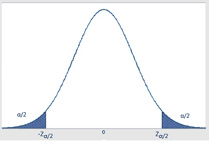

# 解决多重比较问题的方法概述

> 原文：<https://towardsdatascience.com/an-overview-of-methods-to-address-the-multiple-comparison-problem-310427b3ba92?source=collection_archive---------2----------------------->

作为数据科学家，我们处于独特的地位，可以在更大的背景下评估变量之间的关系，并最终用统计数据讲述故事。

简而言之，我们使用[假设检验](https://en.wikipedia.org/wiki/Statistical_hypothesis_testing)来证明关于我们数据的一些假设。

这是一个相当简单的过程，直到我们想同时测试一组假设。在这篇文章中，我将回顾进行这种多重比较的问题以及如何相应地解决它们。

我们如何首先开始调查我们对一种情况的信念？嗯，我们可以用现有的数据进行所谓的假设检验，以评估我们的主张。

让我们考虑一下目前正在开发的药物 A。我们感兴趣的是，与安慰剂(一种没有治疗效果的“糖丸”)相比，药物 A 是否真正改善了患者的自测疼痛。


Does Drug A actually improve pain more than just the act of taking a drug?

我们如何明显地测量和确定“效果”？仅仅假定药物 A 比安慰剂好是不够的。我们希望在现有数据的基础上，通过具体的测量来实现这一点。出于本例的目的，让我们假设患者使用从 0 到 10 的数值范围报告疼痛。我们可以收集疼痛分数，然后比较[两组](https://en.wikipedia.org/wiki/Randomized_controlled_trial)的平均分数:实验组(服用药物 A)和对照组(服用安慰剂)。值得注意的是，每一组都旨在[代表](https://stats.stackexchange.com/questions/16847/what-exactly-does-representative-sample-refer-to)更广泛的患者群体。

对于我们的假设检验，我们必须指定以下内容:

*   零假设:我们寻求反驳的东西，通常是“现状”(即没有影响或差异)。这里，我们的零假设是药物 A 和安慰剂在改善自我报告的疼痛方面没有差异(手段相同)。
*   替代假设:我们的利益效应，或者无效假设的对立面。我们会说，我们的替代假设是，药物 A 和安慰剂在改善自我报告的疼痛方面存在差异(手段不一样)。
*   显著性水平(α):假设假设为真，错误拒绝零假设的概率(假阳性)。这总是在每一个假设检验的开始就被确立。

其中，α可能与多重比较问题最相关。重要的是首先要彻底了解α在假设检验中是如何使用的。

如果我们发现两组的平均疼痛评分有差异，这真的有什么意义吗？我们可以定义界限，允许我们确定任何观察到的差异是否极端到足以反映实际的影响/关系，或者更可能是由于偶然。

因为我们有每个患者的疼痛评分，所以我们可以描述每个组的评分分布。对于这个例子，我们会说，对于两个组，数据大致呈正态分布。

每一个假设检验都是基于所讨论的总体的某种类型的分布。任何给定的分布都以平均值(μ)为中心，并以数据的分布(标准差，σ)为特征。大多数假设检验及其假设都基于正态或高斯分布。


Gaussian (normal) distribution

如上所述，对于我们的患者群体，99.7%的数据应落在平均值的 3 个标准差内。利用这个分布，我们可以确定一个给定的观察值离平均值有多少标准偏差。观察值离平均值越远，就越不寻常。

更专业地说，平均值的标准偏差数可以用一个 [z 值](https://en.wikipedia.org/wiki/Standard_score)来表示。我们使用 z 分数作为一种标准化我们观察到的情况的方法，计算如下:


z-score formula

利用[中心极限定理](https://en.wikipedia.org/wiki/Central_limit_theorem)，我们可以假设数据是正态分布的。

然后，我们可以计算数据的检验统计量。我们需要将这个测试统计数据与某个阈值进行比较。如果我们的检验统计量超过了这个阈值，那么我们的发现就具有统计学意义，而不太可能仅仅是由于偶然。

我们使用预先确定的显著性水平(α)来定义阈值。

通常，α被设置为 0.05，尽管这可能因研究领域而异。这是什么意思？这意味着如果你发现了一个效应，你愿意有 95%的信心认为你的结果在统计学上是显著的，并且有 5%的可能性是由于偶然因素。

我们可以再看看我们的标准正态分布，我们用它来通知我们所有的计算。



α定义高斯曲线的拒绝区域。极端结果存在于曲线的末端，离平均值最远。选择拒绝区域，使得当零假设为真时，它包含检验统计量的概率等于α。

因为我们的假设只说明了药物 A 和安慰剂之间的差异，所以我们从两个方向检验了这种关系:药物 A 可能比安慰剂好，也可能比安慰剂差。因此，这是一个[双尾](https://stats.idre.ucla.edu/other/mult-pkg/faq/general/faq-what-are-the-differences-between-one-tailed-and-two-tailed-tests/)假设检验，我们观察高斯曲线的两端。我们在两个尾部之间平均分配α，因此每个尾部将包含 0.025。

在这里， [p 值](https://www.statsdirect.com/help/basics/p_values.htm)指导我们的决策。如果零假设为真，p 值是至少与样本数据中观察到的结果一样极端的效应的概率。如果检验统计量落在拒绝区域内，那么 p 值将小于α。我们可以说，与安慰剂相比，我们有 95%的信心认为药物 A 显著减少了患者自我报告的疼痛。有 5%的可能性，观察到的效果是由于偶然。因此，我们*拒绝*零假设。

我们希望从一开始就确定α，因为我们希望控制错误拒绝零假设的概率，或者从一开始就控制我们的 1 型错误。这对于单个假设检验来说相当简单。

但是如果我们想测试多个假设呢？在 AB 测试中，您可能会遇到这种情况，当您想要相互比较一个位点的多个变体，或者在药物测试中治疗的多个症状时。你需要多个零假设，每个“变异”一个。

每个假设都有一个单独的α*，代表该特定测试的 1 类错误率。随着假设数量的增加，测试集的总α也会增加，因为单个α*会累积。对于α=0.05 水平的单一假设检验，1 型错误率仅为 5%。只有 5%的机会错误地拒绝零假设。然而，对于 2 个假设检验，总α变为 0.10。错误地拒绝至少一个无效假设的概率是 0.10。随着每次新比较的增加，总α值迅速增加:

```
Overall α ≤ 1-(1-α*)
```

现在，为什么不仅仅局限于一个单一的测试，避免这种混乱的复杂性呢？效率和实际考虑可能需要多次比较。假设我们对药物 A 如何减轻疼痛、减少头痛的发生率**、**等感兴趣。基于多项临床上有意义的测量，进行一系列测试来了解药物 A 的总体疗效是有意义的。

所以，我们想控制我们的 1 型错误。我们可以用两种不同的方法来解决这个问题。

1.  控制总体α(也称为家族误差率或 [FWER](https://en.wikipedia.org/wiki/Family-wise_error_rate) )，这将影响每次测试的α*。也就是说，我们正在控制使*至少出现一次*错误发现的总体概率。Bonferroni 和 Sidak 校正全部控制 FWER。
2.  控制[错误发现率](https://en.wikipedia.org/wiki/False_discovery_rate) (FDR)。当 FWER 控制发生 1 型错误*的概率时*，这些程序允许 1 型错误(假阳性)，但控制这些假阳性相对于真阳性的比例。这是通过调整与每个单独测试相关的 p 值来决定是否拒绝来实现的。因为这将导致更高的类型 1 错误率，所以它具有更高的[功率](https://en.wikipedia.org/wiki/Power_(statistics))。这为真正的发现提供了更高的可能性。FDR 的步进程序控制。

下面，我将提供一个多重比较可用校正程序的简要概述。

**Bonferroni 校正** Bonferroni 校正是最保守的校正，也可能是最直接的方法。简单的用α除以测试次数( *m* )。

但是经过多次测试，α*会变得很小。这降低了功率，这意味着我们不太可能做出任何真正的发现。

**西达克校正** α* = 1-(1-α)^(1/*m*

**霍尔姆的降压程序** Bonferroni 修正的更新，此程序更强大。霍尔姆的程序不是控制 FMER，而是控制[错误发现率](https://en.wikipedia.org/wiki/False_discovery_rate) (FDR)，并在进行所有假设检验并在集合中找到相关的αp 值后执行。

降压过程最好用一个例子来说明。假设我们有三个假设，每个假设都有相关的 p 值:

H1:0.025
H2:0.003
H3:0.01

步骤 1:从最小到最大排列 p 值

H2:0.003
H3:0.01
H1:0.025

第二步:对排名第一(最小)的 p 值使用 Holm-Bonferroni 公式

```
α* = α/(n-rank+1)
```

α* = 0.05/(3–1+1) = 0.0167

步骤 3:将排名第一的 p 值与步骤 2 中计算的α*进行比较

0.003 < 0.0167

因为 H2 的 p 值小于计算出的α*，我们可以拒绝 H2。

移动到下一个等级 p 值并重复步骤 2–3，计算其各自等级的α*并将其与该 p 值进行比较。继续直到你到达第一个未被拒绝的假设。那么你将无法拒绝以下所有假设。

Hochberg 的升压程序
比 Holm 的降压程序更强大，Hochberg 的升压程序也试图控制 FDR，并遵循类似的程序，只是 p 值从最大到最小排列。

对于每个分级 p 值，将其与为其各自等级计算的α*进行比较(公式与 Holm 的程序相同)。测试继续进行，直到你到达第一个未被拒绝的假设。那么你将无法拒绝以下所有假设。

出于这篇博文的目的，我将只简要地提及另外两种众所周知的纠正方法，它们比这篇博文所能容纳的要复杂一些。

**图基的程序** [图基的程序](https://en.wikipedia.org/wiki/Tukey%27s_range_test)是单步多重比较测试，仅适用于您对所有可能的均值对进行比较的情况；它同时这样做。它本质上是一个校正 FWER 的 [t 测试](https://en.wikipedia.org/wiki/Student%27s_t-test)。

**邓尼特校正** [邓尼特校正](https://en.wikipedia.org/wiki/Dunnett%27s_test)类似于图基的程序，除了它涉及每个平均值与单个控制平均值的比较。

这两个程序都使用了 [ANOVA 测试](http://www.statisticshowto.com/probability-and-statistics/hypothesis-testing/anova/)，该测试允许您测试多个组，以查看任何组之间是否有显著差异(零假设:μ1 = μ2=…=μk)。然后，Tukey 的程序或 Dunnet 的校正可以让您识别哪些对显著不同。

当然，进行多重比较并不简单。然而，我希望这篇文章有助于阐明我们作为数据科学家的选择，以减少错误的结论，同时有足够的灵活性做出一些正确的结论。