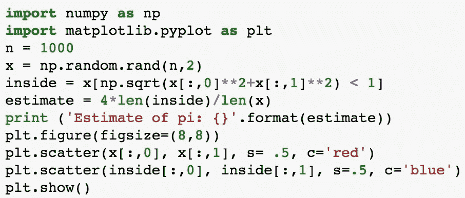
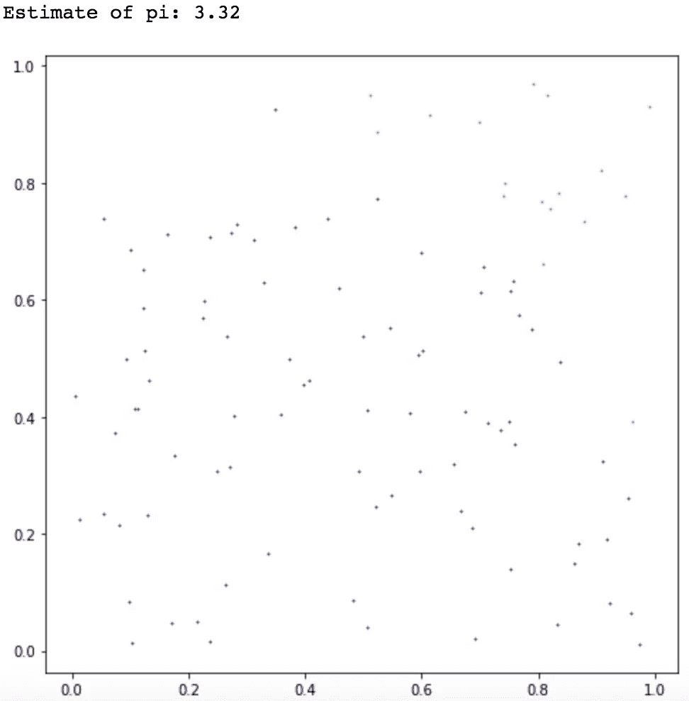
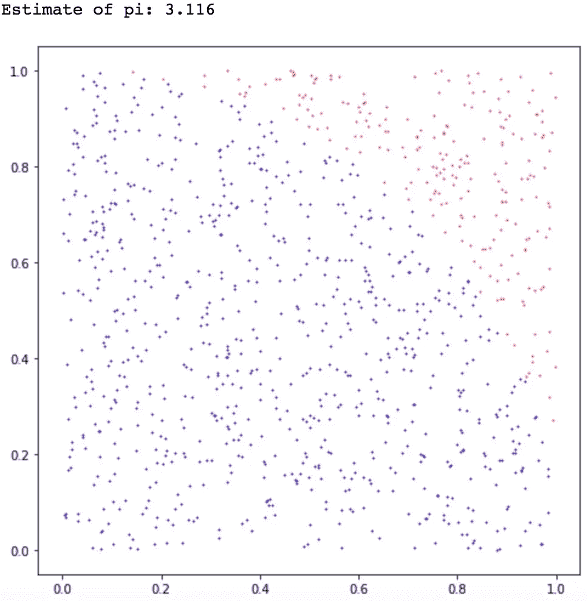
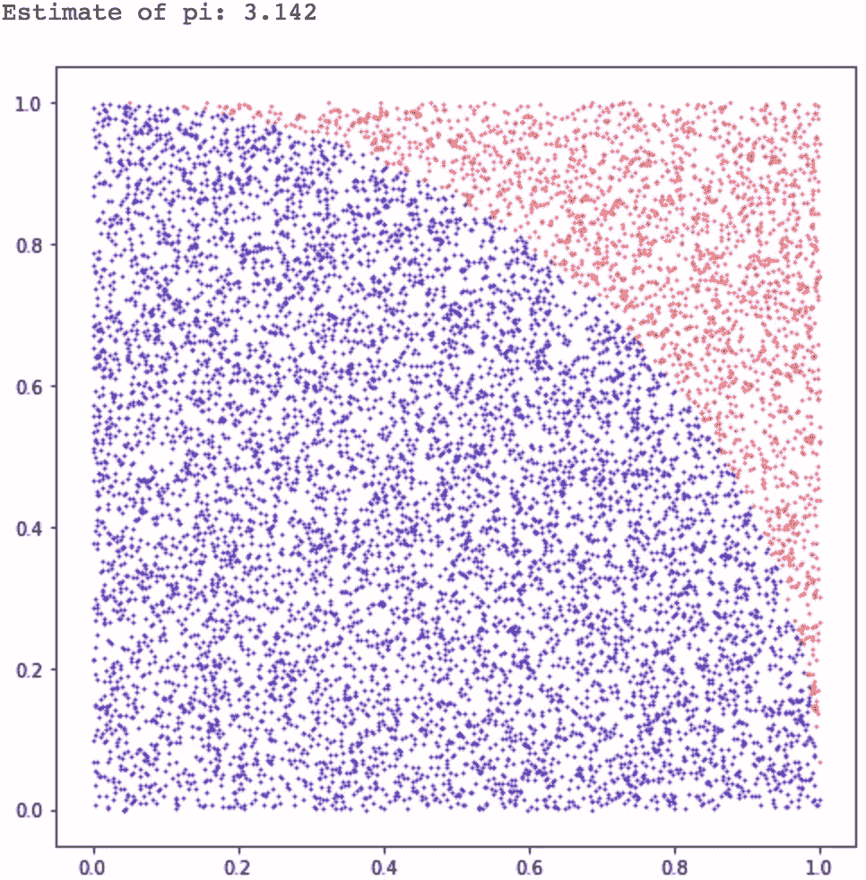

# 蒙特卡罗方法综述

> 原文：<https://towardsdatascience.com/an-overview-of-monte-carlo-methods-675384eb1694?source=collection_archive---------1----------------------->

蒙特卡罗(MC)方法是计算算法的一个子集，它使用重复随机采样的过程来对未知参数进行数值估计。它们允许对涉及许多随机变量的复杂情况进行建模，并评估风险的影响。MC 的用途非常广泛，并在物理学、博弈论和金融领域导致了许多突破性的发现。蒙特卡洛方法的范围很广，但它们都有一个共同点，即它们都依赖随机数生成来解决确定性问题。我希望概述一下 MC 的一些基本原理，也许会让你对它们可能的应用感到兴奋。


source: mathworks.com

这个概念是由数学家斯坦尼斯劳·乌拉姆发明的，他发明了这些方法，作为他对曼哈顿计划的贡献的一部分。他使用随机抽样和推断统计的工具来模拟结果的可能性，最初应用于纸牌游戏(蒙特卡洛纸牌游戏)。后来，乌拉姆与合作者约翰·冯·诺依曼合作，利用新开发的计算机技术进行模拟，以更好地了解与核项目相关的风险。你可以想象，现代计算技术允许我们用大量随机参数来模拟更复杂的系统，就像我们在日常生活中遇到的许多场景一样。然而，在我们考虑复杂系统之前，让我们先讨论一个简单的例子；二十一点的游戏。

如果我们想知道得到 21 点(一张 a 和一张 10 值的牌)的概率，我们可以简单地计算这种情况下可能的手牌数量，然后除以可能的牌组合总数来得到概率(如果你想知道的话，大约是 1/21)。但是现在想象一下，我们的样本空间很难计算，例如，我们的一副牌有数千张，而不是只有 52 张，或者更好的是，我们甚至不知道有多少张牌。还有一种方法可以求出这个概率。


Photo by [Kay](https://unsplash.com/@kaysha?utm_source=medium&utm_medium=referral) on [Unsplash](https://unsplash.com?utm_source=medium&utm_medium=referral)

我们可以蹲在桌子旁玩一百场游戏，一边玩一边记录结果。我们可能得到 19 次、20 次甚至 28 次 21 点，并使用这些值中的任何一个来分配概率。看起来这是一个很糟糕的评估我们在赌场赔率的方法，但是希望我们只是玩着玩着。如果我们再来一次，玩一千次，一万次，几百万次，大数定律说:

> “随着同分布、随机生成的变量数量的增加，它们的样本均值[接近它们的理论均值](https://www.britannica.com/science/mean)。”

除了是统计学最重要的定律之一，这也是蒙特卡罗模拟的基础，允许我们通过统计试验的方法建立随机模型。让我们看看我最喜欢的(可能也是最简单的)MC 估计的例子。

# 圆周率的蒙特卡罗估计

正如我们在文法学校几何课上所学的那样，圆周率是一个常数，它表示圆的周长与直径之比。它是无理数，这意味着它有无限个没有模式的数字。如果我告诉你，我们可以通过玩一个简单的飞镖游戏来估算任意位数的圆周率，你会相信吗？当然有一定的不确定性，毕竟我们是在玩一场碰运气的游戏！让我们编写一个简短的 python 脚本来看看如何实现。



如你所见，我们在一个盒子里随机生成点，并计算嵌入圆内的点数。为了简单起见，我们只看一下我们的飞镖靶的上象限，半径为 R，安装在一块同样宽度的正方形木头上。如果我们投掷 100 个飞镖，并计算成功击中镖靶的飞镖数量，我们可能会得到以下图形。



如果你在想:“为什么我们这么不擅长这个？”你问对了问题。对于这个例子，我们的飞镖位置必须是*均匀分布在整个区域，所以我们在这里肯定不会赢太多游戏。从我们游戏的设置来看，飞镖击中棋盘的概率会是π/4。随着我们继续玩下去，当 n->**∞**时，我们接近这个真实值(感谢伯努利！).我们可以看到，当 n 增加 10 个数量级时，这种情况会发生在下面。*

********

*Plots for n= one, ten, and one-hundred-thousand, and finally one million points.*

*你可能会说:这很好，但我已经知道圆周率是 3.14159…而现实世界中有什么是均匀分布的呢？不要担心，因为当使用 MC 方法来建模更高维度的系统时，我们将需要对各种随机变量进行采样，用不同的概率分布来更准确地表示我们的模型中参数的影响。我能用这个做些什么真实的事情呢？*

# *高能物理学*

*蒙特卡洛的一个主要应用是粒子物理领域，它与我的心灵息息相关。在量子(非常小的尺度)世界中，事物不容易被观察到，在粒子加速器的碰撞点尤其如此。MC 方法允许物理学家根据标准模型和以前实验中确定的参数来模拟这些事件。像 LHC 这样的大规模项目已经产生了大量的数据，所以在我们开始随机抽样之前，N 就已经很大了。所以 MC 的一个小用处是探索物质本身的基本结构。*

# *金融*

*如果这对你来说还不够令人兴奋，MC 在金融工程中被广泛用于股票市场预测。这具有直观的意义，因为市场难以建模，具有难以置信的高维度，并且有大量数据可供采样。风险的重要性是金融分析师使用 MC 方法的另一个重要因素。蒙特卡罗在这个领域的一个相对直接的应用是投资组合优化。我强烈推荐[这篇关于这个主题的博客文章](https://medium.com/python-data/effient-frontier-in-python-34b0c3043314)，它详细阐述了如何为这种类型的分析编写代码，但总结起来:*

*当选择股票投资组合时，你可能愿意根据你的目标承担不同程度的风险。但是，不管你是否愿意接受风险，你都可以通过蒙特卡罗方法找到股票的最佳组合和比例，从而最大化投资组合的单位波动率收益。利用历史数据，人们可以生成成千上万不同比率的股票组合，以观察在这段时间内每只股票的相对表现。然后，人们可以使用一种称为夏普比率的指标(一种在给定风险的情况下衡量投资回报表现的指标)来选择最佳配置。)*

*如果财富和知识的承诺不足以激起你的兴趣，马尔可夫链蒙特卡罗方法为训练深度学习算法提供了一个强大的工具。数据科学家和机器学习工程师可以使用这些技术来做各种奇怪而奇妙的事情。如果你有兴趣阅读更多关于蒙特卡洛的资料，我推荐以下资源:*

*初学者:【http://www.statisticshowto.com/monte-carlo-simulation/ *

*[](https://academo.org/demos/estimating-pi-monte-carlo/) [## 用蒙特卡罗方法估算圆周率

### 如何使用蒙特卡罗方法估计圆周率的值——生成大量随机点，看看有多少…

academo.org](https://academo.org/demos/estimating-pi-monte-carlo/) 

中级:【http://mathforum.org/library/drmath/view/51909.html】T4

```
"Algorithms like these, which use random numbers to approximate 
deterministic outcomes, are called Monte Carlo methods, after the 
famous casino city where random numbers produce a deterministic 
outcome (the house wins the gambler's money)."
- Doctor Jubal, The Math Forum
```

高级:[http://farside . ph . ute xas . edu/teaching/329/lections/node 109 . html](http://farside.ph.utexas.edu/teaching/329/lectures/node109.html)

[https://www . coursera . org/lecture/Bayesian-methods-in-machine-learning/Bayesian-neural-networks-HI8ta](https://www.coursera.org/lecture/bayesian-methods-in-machine-learning/bayesian-neural-networks-HI8ta)*