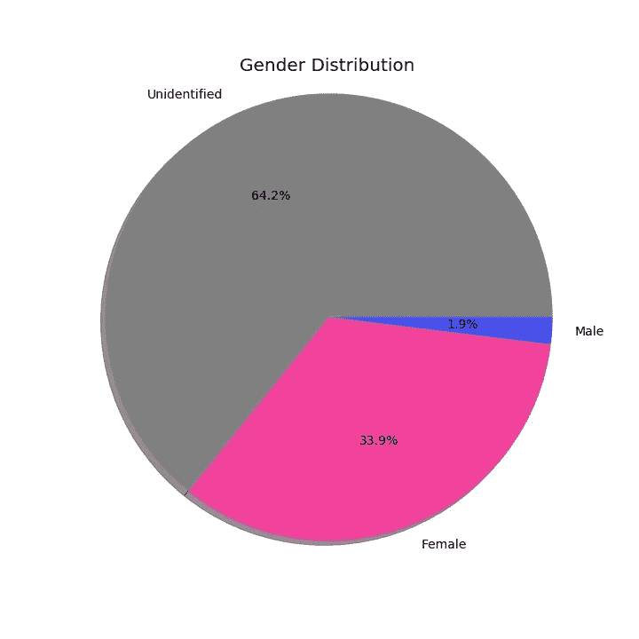
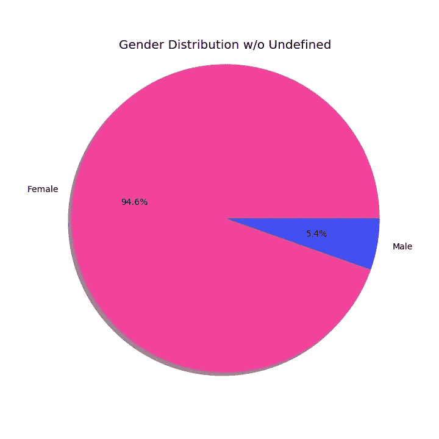
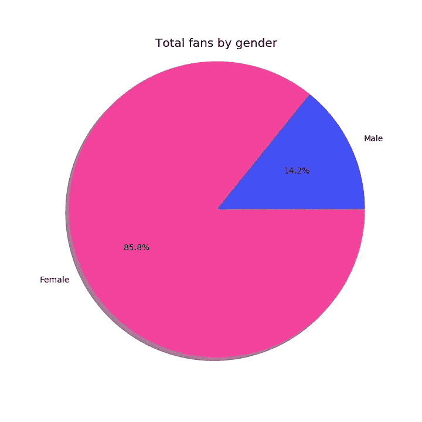
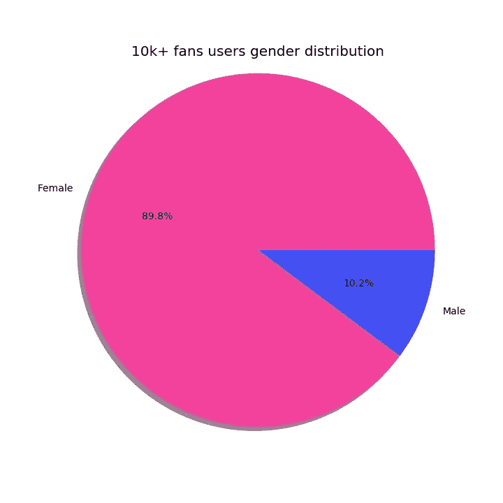
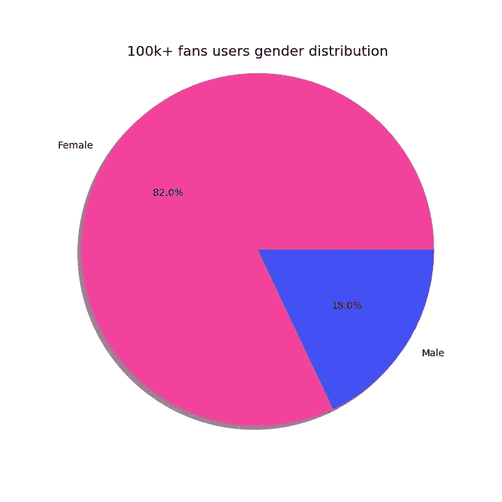
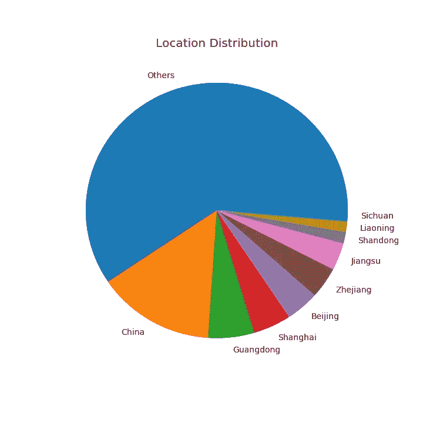
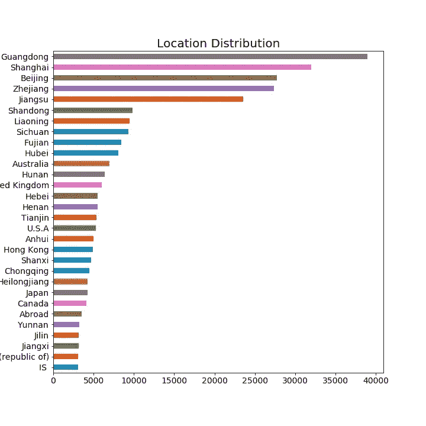
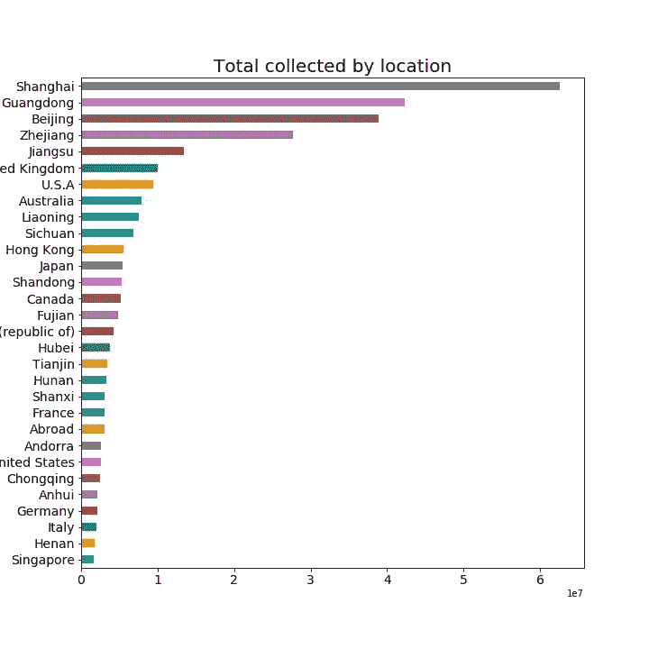
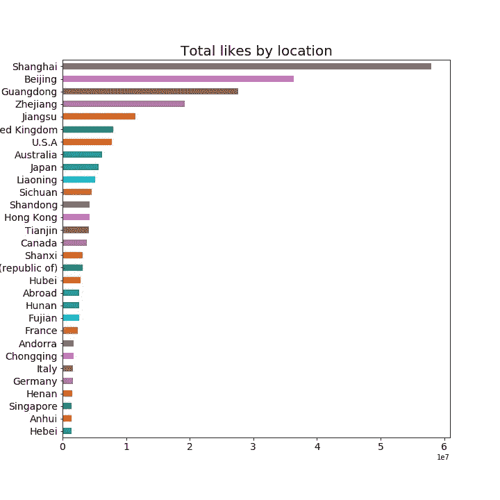

# 浅析中国新兴社交媒体——红宝书

> 原文：<https://towardsdatascience.com/analysis-of-the-emerging-chinese-social-media-the-little-red-book-ad7edd05459e?source=collection_archive---------11----------------------->

红宝书([https://www.xiaohongshu.com](https://www.xiaohongshu.com/))已经成为中国发展最快的社交媒体之一。与流行的微信和微博不同，红皮书专注于美容和时尚细分市场，尽管我们确实看到自其早期阶段以来，内容多样化，进入了一般生活方式类别。由于该公司尚未上市，因此几乎没有公开数据。为了了解该平台，我构建了一个爬虫来获取概要信息，并根据爬取的信息进行数据分析。

**如何获取数据？**
红皮书有一个在网络客户端提供内容的网站。尽管初始主页可供我们抓取的内容有限，但我们可以识别出指向其用户个人资料页面的链接。从那里，我们可以跟进评论者的个人资料以及更多的帖子来继续爬行。我将有一个关于技术细节的单独文章。

**数据大小**
红皮书有非常严格的反爬虫机制来阻挡爬虫，所以 IP 轮换是获取大规模数据的必须。在 4 天的时间里，我从平台上抓取了 899，519 个个人资料。虽然这只是代表了红皮书庞大用户数据库中的一小部分，但所有这些用户都至少在平台上产生了一些活动(要么是写帖子，要么是创建版块，要么是评论别人的帖子)。因此，这个数据集可以用来识别红皮书最活跃的用户群的特征。

**指标解释**
红皮书为用户提供了三种参与内容的方式。用户可以喜欢内容，“收集”内容或对内容进行评论。“喜欢”的功能类似于脸书的大拇指按钮，而“收集”意味着将一段内容保存在应用程序的书签系统下，以供进一步参考。一般来说，人们会在感兴趣时喜欢某个内容，并在帖子可以用于进一步参考时“收集”该内容，包括那些稍后重新访问的有用提示和他们最终可能想要购买的产品。第三个指标是“评论”，提供帖子的交互性。不幸的是，Redbook 没有提供一种简单的方法来跟踪评论数量的聚集，所以这个字段不会包含在本文中。

朱庇特笔记本可以在[https://github.com/Gravellent/redbook_analysis](https://github.com/Gravellent/redbook_analysis)找到

**谁是红皮书上最有影响力的用户？**

> The top 10 users (excluding the official accounts) are:
> 范冰冰
> 林允 Jelly
> 张韶涵
> Ritatawang
> 时髦小姐姐
> 凌听雨
> 江疏影
> Irene 林恩如
> 欧阳娜娜 Nana
> 美七是我

Although celebrities have been keen on joining this emerging platform, there is a good mix of internet KOLs and true celebrities. Specifically, Ritatawang and 美七是我 did not have much influence before they joined Redbook.

**红皮书上的男性用户？**

红皮书的一个主要特点是它的用户主要是女性。我们的数据显示，只有 2%的用户是男性。超过 60%的用户没有表明自己是男是女，但是经过一些人工检查后，似乎不明身份的用户跟那些在注册时选择性别的用户有相似的特征。

除去身份不明的，女性贡献了 95%的用户群。这与我们的预期相似，因为平台上生成的大多数内容都是面向女性的，以各种美容产品和时尚相关的内容为特色。

然而，现在说女性是社交电子商务操场上的唯一玩家还为时过早。虽然男性用户仅占用户总数的 5%,但他们对女性用户的影响力更大。在计算每个性别产生的总点赞数后，我们看到男性用户贡献了总点赞数的 8%。在收集的帖子中，男性占 5.9%，略低于总点赞数的比例，但仍高于其人口比例。对这种差距的一种解释是，红皮书上男性的内容通常被认为是“有趣的”，但读者不一定想以后再看这些内容。另一方面，女性内容创作者可以提供有用的信息和进一步的参考

从影响力的角度来看，男性的影响力甚至更大。男性用户在平台上的平均粉丝数要高得多。男性的平均粉丝数超过 2400 人，远远超过女性的 842 人。

有趣的是，中位数和四分位数分析显示了相反的结果。男性用户的粉丝数量中位数为 5，而女性用户的粉丝数量中位数为 11。75%的四分位数结果还表明，大多数男性的活动范围小于女性。那么为什么男性的平均分要高很多呢？

查了粉丝数 1 万+和 10 万+的用户性别分布，原因就清楚了。有一群顶级男 kol，他们在平台上处理的粉丝往往超过 10 万。那些人有很大的影响力，扭曲了统计数据。另一方面，对于少数非 kol 的男性用户，他们与社区的互动并不强烈。

**红皮书用户在哪里？**

Redbook is known for its high conversion rate to sales. The users on the platform tend to have a strong interest in purchasing high-end beauty and fashion product. Many people refer to the platform as a “种草平台”, which basically means people search for products that interest them and “initiate” the desire to own them eventually. Many of the products discussed on the platform are from major international brands, so the viewers usually process high purchasing power. So where are these users? It’s common knowledge that the majority of the higher-income group locate in Beijing, Shanghai, Shenzhen, and Guangdong. Would the user group fit this demographic?

Again, we start out with analyzing all the data for user location. Since Redbook default a user’s location to “Others”, we see that only 40% of its users input meaningful location information. On top of that, some users stop inputting more information after “China”. For this purpose of this analysis, we will only look at the those who identify themselves in provinces or cities.

用户数量排名前五的省份是广东、上海、北京、浙江和江苏，占整个用户群的 30%以上。红皮书的总部设在上海，说明上海都市圈是其主要的用户群。(注:上海、浙江和江苏可以被认为是一个拥有几个高调城市的大都市圈)广东省的 GDP 总量最高，拥有中国最大的两个城市广州和深圳，因此它是用户最多的省份并不奇怪。

虽然从数量分布来看，广东是第一大省，但从地理上分析其用户群也需要考虑用户的质量。也就是说，我们需要看看用户能产生多少参与度。在用户点赞和收藏方面，上海遥遥领先。由于该公司是在这座城市成立的，他们的许多种子用户来自该地区是可以理解的。我们发现的另一个有趣的趋势是，有一群红皮书 kol 生活在国外，并产生良好的影响。澳大利亚、美国和英国都位列前十。考虑到这些国家的 kol 数量较少，居住在中国以外的用户平均比居住在国内的用户具有更高的影响力。

**限制**
由于数据不包含整个用户数据库，所以对于所有用户的分布可能是不准确的。此外，对于性别和位置分布分析，由于超过一半的用户没有输入信息，因此很难估计如何将结论推广到整个用户组。此外，由于用户自己输入信息，他们中的一些人可能会使用不准确的信息进行注册(例如，声称他们住在船上，而他们并不在船上)。

**结论**
平台上最有影响力的用户包括名人和 Redbook 自己的 kol
广东的用户数量最多，但上海的用户产生的影响力最大。
·在美国、英国和澳大利亚有大量用户，他们比其他用户群显示出更强的影响力。