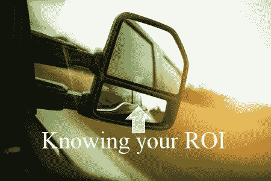

# 分析师:停止衡量其他一切，开始衡量你的数据项目的价值！！！

> 原文：<https://towardsdatascience.com/analysts-stop-measuring-everything-else-and-start-measuring-the-value-of-your-data-projects-b32de66950?source=collection_archive---------9----------------------->

# TL；速度三角形定位法(dead reckoning)

衡量你的项目的商业价值是非常简单的，并且有很多好处，但是似乎没有人想到要这么做。因此，这里有一种方法。

我有幸在数据和分析领域工作了 5 年——在两家财富 500 强企业，现在在一家初创公司。

我帮助组织聚会，我参加过多次会议，我看过很多在线课程，我向独角兽学习，并和它们一起工作…

基于所有这些经验，我认为分析学作为一门学科，在如何衡量投资回报(ROI)方面有一个 T2 盲点(T3)。具有讽刺意味的是，it **纠结于如何衡量其他一切！**

Running an Analytics project without an ROI measure is like merging a semi-trailer without checking your mirrors. Measuring your project’s ROI is easy to do, and saves you (and others) grief.

这一点在最近的悉尼人工智能和机器学习峰会[上的一个关于“做出关于自动化的正确决策”的小组中得到了强调。非常聪明、多才多艺的人花了 **40 分钟**讨论选择问题时所有的技术问题，但甚至没有花一秒钟考虑如何评估解决问题的商业价值——以及你的项目是否值得这个成本。](http://www.aisummitaustralia.com.au/)

我明白了——分析师或数据科学家更愿意调整模型，而不是编造商业案例。但是展示你工作的价值非常简单，这是与高级管理层建立信任并为下一个项目争取更多资源的关键。

因此，为了回报我在这个主题上得到的所有帮助，本文包含了我计算数据项目商业价值的方法。

我已经把这个方法分解成了一个等式、一些理论和一些简单的例子。我们希望这些例子能够证明这种方法是多么容易实践，以及这种方法如何能够适应范围极其广泛的项目。我非常乐意在评论中对你的例子进行抨击——出于时间的考虑，我只举了两个例子，但我每天都这样做，而且我确实在盯着一张大约 140 个商业价值计算的表格，我用它来证明我的存在。

最后，这种想法很有卖点。它曾为甲骨文公司直接向企业销售数十万美元的合同。在 Salesforce，它帮助我获得了数十万美元的预算。它在 [Jayride](https://www.jayride.com/) 工作…摸木头！这对你有用——或者你可以把我烧死。

# 方程式:

V = (S + M + R + O) — C

# 因素:

V =商业价值

储蓄的钱

M =钱 M 阿德

风险降低

O = **O** 机会被抓住

C =项目总成本 **C**

# 理论:

数据科学、BI 或任何东西分析是企业内部的一项职能。一个业务职能通过省钱、赚钱、降低风险或帮助抓住机会向管理层展示价值。

净商业价值就是所有这些因素的总和，减去项目的成本。你也可以除以项目的成本，给出一个“投资回报”比率，这个比率可以被管理层(和你自己)与其他计划进行比较。

你如何衡量所有这些因素？

对于节省的金钱来说，这非常简单——估算一下你为某人节省了多少时间，并知道一小时人工服务的平均价值。一个很好的经验法则是每小时 50 美元——所以节省了 x 个小时，你就节省了 50 倍的钱。

对于金钱(M ),这很简单——你在你的项目(b)之前，对你所帮助的东西的收益表现进行基准测试，然后在你的项目(a)之后，衡量你所帮助的东西的收益表现。绩效之间的差异，M = a-b，是你的项目赚的钱。如果你正在创造一种全新的赚钱方式，你就不必担心标杆管理(即 M = a)。 [Avinish Kaushik 在这里为这种测量提供了一种全面的方法](https://www.kaushik.net/avinash/calculate-return-on-analytics-investment/)。

对于 **R** isk Reduced (R)，你估计最坏情况成本(w)，在你的项目(s)之前发生的概率，以及在你的项目(t)之后发生的概率。由于风险是成本和概率的倍数，因此降低的风险就是两者之差，即 R = w(s-t)。

**O**O 抓住的机会(O)就是 **R** isk 减少的倒数——您衡量的是最佳情况下的收益(y——为 yay！…我快没信了)，在你的项目之前发生这种情况的概率(h)，在你的项目之后发生这种情况的概率(e)。O = y(e — h)。

**Pro tip:** 不要在估算用于降低风险或抓住机会的概率时混淆视听！通常，来自主题专家的粗略估计就足够了。还有*如果你真的必须深入研究*，找一个精算师，或者看看道格拉斯·哈伯德的《应用信息经济学》(你可以在这里得到[关于少犯错的精彩概述，或者](https://www.kaushik.net/avinash/calculate-return-on-analytics-investment/)[买他的书](https://www.amazon.com/How-Measure-Anything-Intangibles-Business/dp/0470539399/))。

最后，成本就是项目材料清单的总成本。不要忘记估计你的时间成本。永远要知道你的业务成本，并确保你所做的事情比这更有价值！

# 示例:

1.  你在做一个恶心的仪表盘！

这个仪表板将帮助管理人员每月节省 10 个小时(x)的电子表格处理时间。

此外，这种可见性将有助于降低人们过度抱怨您的人力资源系统的风险，从 50% (s)降低到 10% (t)，最坏情况下每月成本为 2000 美元(基于历史记录)。

这将花费你一天的工作量——或者大约 8 个小时。

在这个花瓶里，V =(S+R-C)/C =(10 * 50+2000 *(0.5–0.1)-8 * 50)= 900 美元/月

恶心！

A sick dashboard. Credit — [https://databear.com/portfolio-items/power-bi-sick-leave-dashboard/](https://databear.com/portfolio-items/power-bi-sick-leave-dashboard/)

2.你在建立一个很棒的模型！

该模式旨在帮助您的客户支持团队致电高风险客户并保持他们的满意度，并且有机会节省业务，最好的情况是每月节省 10000 美元的资源。客户支持团队目前在交叉销售中每月收入 3000 美元，你认为在你锁定目标后可能会更多。这将花费你大约一周的时间来交付，你和你的团队估计在模型完成后这种收益的可能性大约是 50%，而在模型完成前是 0%。

所以 V = M+O-C = 0+10000 *(0.5–0)-40 * 50 =每月 3000+。

大概不止这些，所以别忘了衡量项目后赚的钱。

太棒了。

I didn’t know this was a thing. Credit — [https://en.wikipedia.org/wiki/Apache_Groovy](https://en.wikipedia.org/wiki/Apache_Groovy)

# 概括起来

衡量你的项目的商业价值是非常简单的，并且有很多好处，但是似乎没有人想到要这么做。我已经给了你一个方法去做——那就去做吧。

P.S .特别感谢 [Verge Labs](https://www.vergelabs.ai/) 的好心人，他们为我找到了一张悉尼人工智能和机器学习峰会的门票——这是一个伟大的事件！