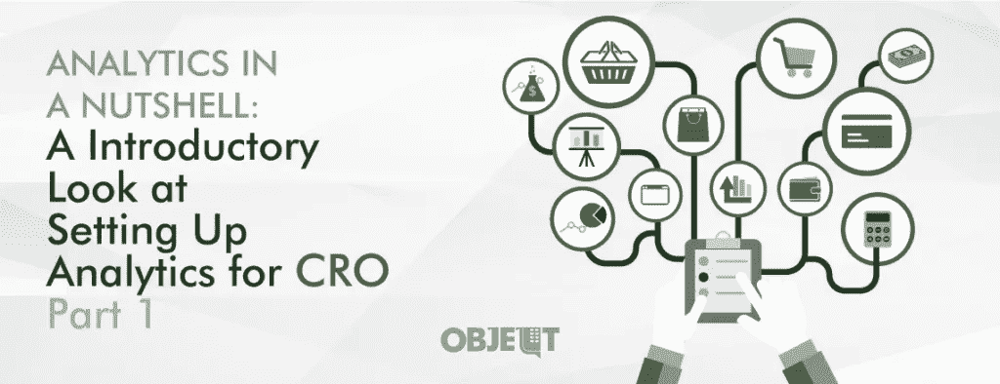
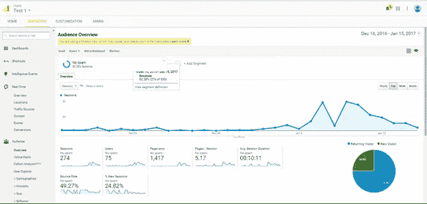
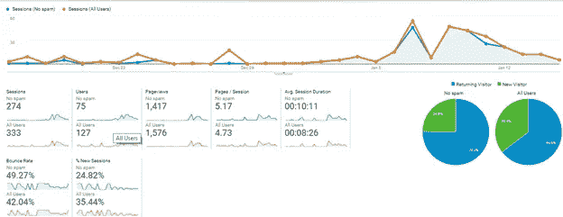
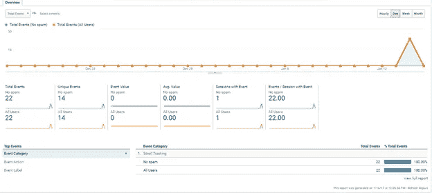

# 简而言之的分析:为 CRO 设置谷歌分析的介绍

> 原文：<https://towardsdatascience.com/analytics-in-a-nutshell-an-introductory-look-at-setting-up-google-analytics-for-cro-43858f83e0e7?source=collection_archive---------1----------------------->

Image created by Objeqt.com

你如何改进某事？任何事。任何过程，任何行动。你从了解你的基线开始。你今天可以做 10 个俯卧撑，但是经过一个月的每日俯卧撑，你会做得更多。为电子商务商店设置 CRO 谷歌分析是一种通过设置基线和跟踪指标来进行测量/跟踪的方法，以便进行改进。

**“你不能改进你不能测量的东西”**是一些人的说法。

**“有度量才有管理”**同样如此。

分析只是一种通过设定基线和跟踪改善(或缺乏改善)的指标来衡量的方法。但是当你看谷歌分析仪表板时，突然之间这个简单的概念变得难以置信的复杂。

你需要为你的电子商务网站追踪的转换优化只会使它变得更加复杂。你需要准确及时的数据，而且是大量的数据。

你需要什么样的数据？research XL(conversion XL 使用)将他们的研究领域分为四个主要类别:

*   技术的
*   探索法
*   数量的
*   定性的

Web analytics 是用来衡量 ***量化数据*** 的主要工具，比如你网站的访问量、转换率以及新访客或回头客的数量。定量数据都是关于硬数字的，这就是为什么你需要用定性或启发式研究来补充这些信息，这些研究更具描述性(它们依赖于客户调查和反馈)，但也更容易产生偏见和误解。

由于定量数据是由计算机程序实时收集的，因此您可以相对确定您没有遗漏任何东西— **前提是分析工具配置正确**。

这就是问题所在。你必须配置你的分析程序，包括谷歌分析，以确保收集所有你需要的信息。

配置是 CRO 工作的很大一部分。我们称之为“分析健康检查”，通常将它作为一项服务来提供，以确定客户的分析工具是否正常工作并准确跟踪一切。

在这一点上，我们并没有把重点放在一组数据上，尽管我们稍后会这样做。现在，我们正试图收集尽可能多的数据，从中提取见解，只有在您定制分析程序的现成设置时，您才能做到这一点。

# 网络分析如何工作

当每个人与内容互动时，Web analytics 会实时记录每个访问者的每个行为。

有许多分析工具可以做到这一点，都有类似的功能，但谷歌分析是最常用的工具，超过 70%的市场使用。

每个分析工具的工作原理都是在网站的每个页面上留下一小段 JavaScript 代码。这段代码被称为“跟踪代码”或“片段”，它收集用户行为数据并将其发送回分析程序，分析程序以可读的形式向您呈现数据。

One of the overview screens in Google Analytics

Google Analytics 之所以受欢迎，不仅仅是因为它是免费的(至少在基本形式上是这样)，还因为它不断更新，完全可定制，并且有一个大型社区可以创建免费的定制服务。由于 Google Analytics 足以满足几乎所有用途，它不仅成为首选工具，而且成为分析工具的行业标准。这是那种容易学但很难掌握的东西。非定制版本可供每个人使用，并且非常简单明了，但是真正的数据深度只有在您定制之后才变得可用。你基本上是把普通的菜刀变成了瑞士军刀。

最简单地说，在你可以依靠谷歌分析给你所需的信息来了解你的网站现在做得如何，以及如何改进它之前，你必须教 GA 一些技巧:

*   你想让它跟踪什么
*   如何跟踪它
*   如何举报

# 跟踪什么:基本指标

指标是数字分析的基础。Google Analytics 中的常见指标有:

*   会议
*   独特的访问者
*   现场时间
*   浏览的页数…

还有很多。

还有我们所说的“维度”，比如位置、页面、语言、性别、产品类别等等。有些指标实际上是两个指标的组合，比如“每页的会话数”或“每页的访问者数”您还可以创建自定义指标。

一旦以度量标准报告了行动，我们就可以从中得出一些结论。

一个很好的起点是简单地统计实际上与任何给定内容互动的访问者的数量。这很好地表明了内容的受欢迎程度。

然而，如果用户点击进入，几秒钟后又点击退出，那么打开一个页面就没有任何意义。这就是所谓的反弹。你希望你的跳出率低。如果很高，意味着访问者没有找到他们希望找到的东西。

我们还可以比较某些类型的操作或内容，以获得更多见解，如找出哪些类型的内容比其他内容更能吸引访问者，或者网站的哪些部分可能会遇到可用性问题。我们还可以比较不同部分游客的行为；例如，不同国家的访问者如何与网站互动。

得出结论的第三种方法是寻找相关性。你在寻找一些东西，比如一部分访问者如何与网站互动，或者什么样的互动顺序通常会导致转化。你可以根据访问者的最大平均订单价值来选择一个类别，然后观察他们与网站的互动情况，从而很好地转化。然后你就可以利用这些信息来优化你的网站——从本质上来说，就是找到调整用户体验的方法，让他们走上与你的成功客户相同的道路。

收集这些数据是 cro 开始创建假设进行测试的方式，这导致了转换的优化。

# 如何跟踪:细分和事件

包括谷歌分析在内的任何网络分析工具的最佳特性之一就是细分的能力。细分可以让你根据许多特征选择不同类别的访问者——他们来自哪里，他们在寻找什么，他们买了多少，等等。

Sample of a segmented report in Google Analytics

# 事件跟踪

通过一些定制，任何分析工具都可以跟踪你网站上的单个事件。这将释放更多的数据财富，并允许你利用它来获得更多关于你的访问者与网站互动方式的见解。通过使用事件跟踪，可以跟踪网站上的任何活动，从点击单个链接到播放视频和下载文件。

An example of event goal in Google Analytics

目标和转化等分析类别基于“页面视图”思维模式。事件跟踪则不同，它更关注用户体验。在谷歌分析中，事件基本上是互动，比如下载 PDF 或电子书，播放嵌入的视频，点击外部链接或行动号召(CTA)按钮。

虽然事件跟踪需要定制和额外的 JavaScript 代码，但使用标记管理器实现和维护相对容易。

# 目标

您的分析工具也可以跟踪您的现场目标——如果您对其进行配置的话。目标是你希望你的用户做的具体的动作，比如浏览某些网页，或者看一个视频，或者在一个页面上花一定的时间。一些最常用的目标是“目的地目标”，它让你检查访问者是否真的到达了你定义为目标的网页。一个例子是“感谢页面”,表示用户在你的网站上完成了购买。

# 如何报道:谷歌分析中的电子商务

Google Analytics 具有完全可定制的电子商务跟踪功能，可与您的电子商务平台集成，并允许您在 Google Analytics 中查看网站的表现，以收入的形式显示。您可以看到正在销售的产品数量、每位客户的平均收入、客户的购物行为以及其他高度相关和可操作的数据。这也是一个可定制的功能。

# 是的，这只是为 CRO 设置谷歌分析的一个快速概述！

正如你所看到的，数字分析是任何电子商务商店几乎不可或缺的工具。虽然理论上没有网络分析也可以经营网络商店，但这并不是长期成功或增长的秘诀。

无论你选择什么样的网络分析工具，它都将开启一个充满机遇的新世界，不仅能让你洞察网络商店的表现，还能洞察访问者的想法。学习掌握谷歌分析，你将改善你的网站，并迫使更多的现有访客成为客户。

分析是增加网上商店收入的关键，也可能是最具成本效益的方法。

## 这篇文章最初发布在 [Objeqt](https://www.objeqt.com/) 上。访客很棒，顾客更好。是时候将流量转化为收入了。