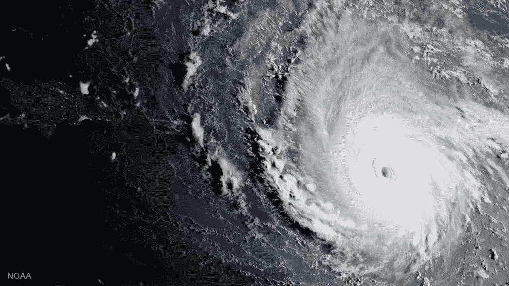
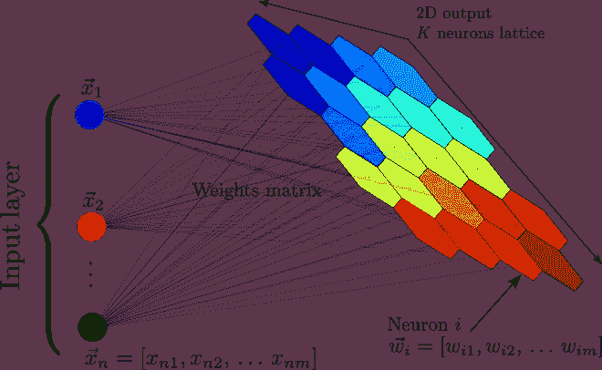
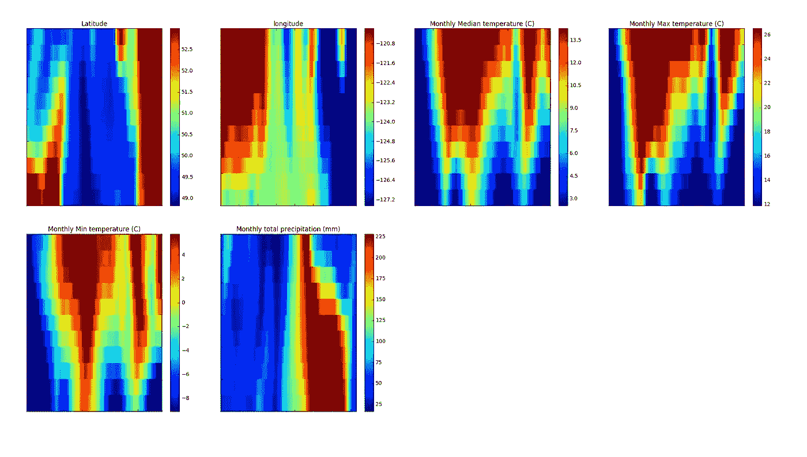
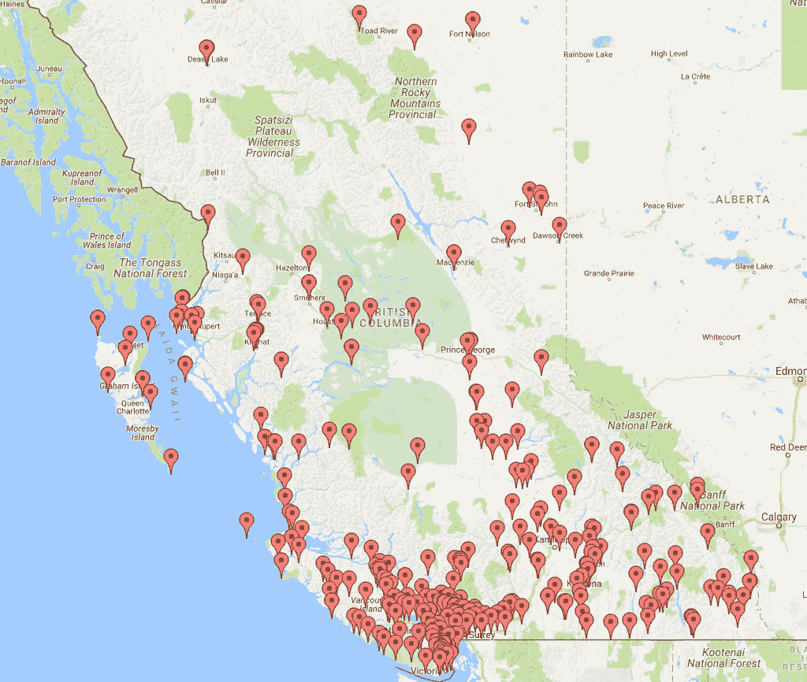
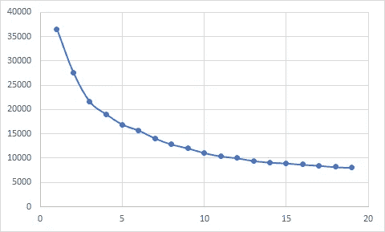
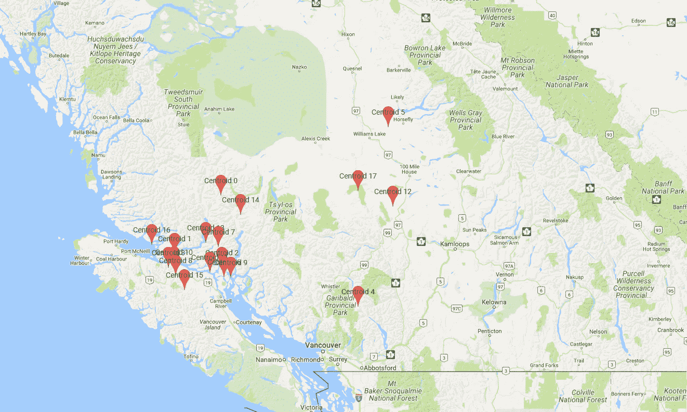

# 用自组织地图分析气候模式

> 原文：<https://towardsdatascience.com/analyzing-climate-patterns-with-self-organizing-maps-soms-8d4ef322705b?source=collection_archive---------5----------------------->



# 亮点:

在本文中，我们将了解:

*   自组织映射(SOM ),以及它如何用于维数减少和无监督学习
*   解释用于探索性数据分析的训练 SOM 的可视化
*   SOMs 在加拿大不列颠哥伦比亚省气候模式聚类中的应用

链接到我的其他文章:

1.  [张量流和自定义损失函数](/custom-tensorflow-loss-functions-for-advanced-machine-learning-f13cdd1d188a)
2.  [随机森林](/decision-trees-and-random-forests-for-classification-and-regression-pt-1-dbb65a458df)
3.  [Softmax 分类](/the-softmax-function-neural-net-outputs-as-probabilities-and-ensemble-classifiers-9bd94d75932)

# 简介:

当我第一次开始学习神经网络时，我偶然发现了这个被称为 Kohonen 图的奇怪发明，或者在文学中更常见的称为自组织图或 SOM。这个神经网络受人类大脑皮层的感觉激活模式的启发，使用简单的启发式方法进行无监督训练，能够发现高维数据中隐藏的非线性结构。最近我看到一些气候学家写的有趣的文章，他们使用 SOMs 分析和预测天气和气候(这是一项众所周知的困难任务)，我想我应该与你分享这项有趣的无人监管的技术。

# 自组织地图:

基本上，SOM 是离散的平面神经元网格，即隐藏层，有时称为 Kohnen 层，由输入层提供信息:



Overview of the SOM neural network

每个隐藏层神经元都有几个“邻居”神经元(单个单元的邻居的最大直接数量可以是六个，如上面的六边形网格，或者四个正方形网格)。我们将每个神经元与其邻居之间的“距离”定义为每个神经元的输入到隐藏层权重之间的欧几里德距离。每个隐藏神经元的输入-隐藏层权重有时也被称为**码本向量**。我们定义的距离在以后会变得很重要，因为它对原始数据集的低维信息进行了编码。在上图中，每个隐藏层神经元都有一个带有 ***n*** 分量的权重向量(即输入与隐藏层紧密相连)。

那么我们如何训练这个网络呢？训练过程实际上非常简单，不涉及梯度计算:

1.  将隐藏神经元权重初始化为小的随机值，或者使用 PCA 权重初始化
2.  将数据行***x****进给到输入层*
3.  *遍历隐藏层中的每个神经元，找到最佳匹配单元(BMU)，即与数据行 ***x* ᵢ** 具有最小欧氏距离或度量的神经元*
4.  *对 BMU 及其相邻神经元应用权重更新。使用邻域函数φ来计算 BMU 的相邻神经元*
5.  *收缩邻域函数φ*
6.  *重复步骤 2 至 5，直到达到迭代极限或收敛(所有神经元和所有数据之间的平均码本向量距离小于某个阈值)*

*上述算法被称为竞争学习，在精神上与其他基于启发式的算法(如遗传算法和粒子群方法)非常相似。[此处提供了该算法的完整描述](https://en.wikipedia.org/wiki/Self-organizing_map#Algorithm)。SOM 的基本思想是“填充”底层数据的空间，如下图所示:*

**

*Training the SOM to ‘fill’ the dataset*

*与类似神经元数量的前馈网络上的反向传播相比，竞争学习算法通常更快，但如果 SOM 网格非常大(10⁴或更多神经元)，则可能会变慢。*

*SOMs 属于一类叫做[非线性维度缩减(NLDR)](https://en.wikipedia.org/wiki/Nonlinear_dimensionality_reduction) 的技术。维数约简技术(主成分分析，t-SNE 等。)通常用于可视化和解释，以及变量选择。som 更适合前一种应用，合适的 som 可以被进一步分析，以获得低维的可视化和可解释的结果，呈现给你的老板、scrum master、营销团队或你的另一半。此外，诸如 K-means 的聚类技术可以应用于拟合的 SOM 网格，并且从该网格可以获得输入的鲁棒聚类。通常，SOM 上的 K-means 比常规 K-means 执行得好得多，并且有时可以发现隐藏的非线性交互模式。现在让我们研究一些气候数据，看看 SOM 能做些什么。*

*下面的代码示例使用的原始 SOMPY repo 可从这里获得。SOMPY 对于 Python 来说是一个很好的入门包，但是如果你也精通 R，请查看一下 [kohonen 包](https://cran.r-project.org/web/packages/kohonen/index.html)，它有一些非常好的可视化工具([也可以在这里看到](https://www.r-bloggers.com/self-organising-maps-for-customer-segmentation-using-r/)关于使用 kohonen 包进行 R 的教程)。*

*[**报告包含以下任务的 SOMPY 代码的所有修改和气候数据。**](https://github.com/hhl60492/SOMPY_robust_clustering) 运行代码的 main.py 脚本文件在[https://github . com/hhl 60492/SOMPY _ robust _ clustering/tree/master/SOMPY/examples](https://github.com/hhl60492/SOMPY_robust_clustering/tree/master/sompy/examples)。*

# *气候数据分析:*

*从[http://climate . weather . GC . ca/prods _ servs/cdn _ climate _ summary _ e . html](http://climate.weather.gc.ca/prods_servs/cdn_climate_summary_e.html)收集加拿大不列颠哥伦比亚省 2009 年 1 月至 2017 年 12 月的历史气候数据(月度汇总)。每个 CSV 文件包含气候数据的每月摘要(如月平均温度、月最低/最高温度、月降雨量)以及记录数据的气象站的纬度和经度。每个唯一的气象站给出一个单行，每个 CSV 中大约有 300 个气象站。*

*现在我们保持简单，使用纬度、经度、中间温度、最高温度、最低温度和降雨量。这些列被提取并强制转换为浮点类型。包含任何 nan 的行被删除。SOMPY 通过计算数据矩阵的特征值来自动计算 SOM 网格的大小。*

*对 20621 行数据的训练耗时约 5 秒。首先要注意的可视化是**组件平面**热图。*

**

*Component plane heatmaps for each feature that was fed to the SOM.*

*每个热图代表 SOM 网格学习到的单个特征或数据列的强度。请注意，热图是离散化的，每个子图中的每个“块”都是唯一的神经元，神经元在所有子图中都具有相同的位置，即纬度子图左上方的块是经度子图和月中值温度子图中的相同神经元，依此类推。通常，不同分量平面中的相似热图表示特征的相关性，相异表示可忽略的相关性，反转表示反相关性。另请注意，拟合的 SOM 将代表整个年份范围内一年中所有月份的特征，即 9 年平均值，因为提供了 9 年中 1 月至 12 月的连续数据。利用前面的事实和经纬度信息，我们可以看到:*

*   *月最高温度出现在不同的纬度和经度，包括纬度。北纬 49 度以上。120–124 W；这是靠近美加边境的一大片公元前南部地区，包括温哥华岛的南端、温哥华市区、弗雷泽山谷，一直延伸到奥肯那根*
*   *后者。北纬 49 度以上。西经 120-124°的地区也有最多的降水。*
*   *纬度和经度分量平面热图中各区域的大小表明，在北纬 49-50°和西经 123-124°区域有大量的气象站，那里的人口密度最高(每个 CSV 文件中所有气象站的纬度和经度的下列图表似乎证实了这一观察结果)*

*(注意:为了验证地理位置，最好实际提取 lat。而且长。来自 Python 中拟合的 SOM 的数据，并用它们标记其他组件平面热图中的细胞/神经元。)*

**

*Location of weather monitoring stations in BC. Seems nobody cares about the weather in Spatsizi Plateau*

*   *月中值温度与月最高温度相关，在较小程度上与月中值温度相关。*
*   *降水量似乎与月平均气温和最高气温呈反相关关系(作为当地人，我可以证实，当天气炎热时，我们的降雨量会少得多，反之亦然——太平洋西北部的气候是这样的，在晚秋、冬季和春季气温较低时会有大量降水，而在夏季气温较高时很少或没有降水)。*

*我们可以做的下一个可视化叫做 U 矩阵。U-matrix 也是一个热图，但可以像我们的 SOM 网格中的地形图(显示一个区域的海拔等高线的地图)一样进行解释。U 矩阵中的“山丘”代表相邻之间的大距离，反之亦然。*

**

*Note: The number of neurons and grid layout in the U-matrix and the component plane heatmaps are the same. The component plane plots were stretched veritcally due to matplotlib.*

*U 矩阵让我们了解了 SOM 网格的景观，以及神经元的邻域。它帮助我们直观地看到 SOM 网格本身中有哪些潜在的聚类，这是对我们将要在网格上运行的 K-means 聚类结果的一个很好的完整性检查。由于 K-means 在最佳聚类数上有点幼稚，我们将使用结合误差平方和(SSE)的“肘”方法来找到最佳聚类数*。SSE 计算的算法如下:**

1.  **对于 ***k*** = 2 到 ***k_end*** :**
2.  **计算数据集 X 上的 K 均值**
3.  **对于每个集群 ***n*** :**
4.  **计算*L2****-*-**簇*n 和簇 ***n*** 的质心之间的向量差的范数，并将其加到总数***【SSE】***中***

**SSEs vs . different***k***的结果图如下所示**

****

**通过找到上图一阶差分的最大值的指数，加 1，可以解析地找到肘点。不幸的是，K-means 算法不是太健壮，并且对于不同的运行给出不同的肘曲线，所以在许多引导样本上引导和重复肘/SSE 图分析将给出最佳*的更好的估计。所有这样做的代码在下面的要点中，在 **SOMFactory** 类(在 sompy.py 中)中的 cluster()方法被修改以实现上述内容。***

***对于这个特定的 SOM，在 20 个引导样本上平均的 SSEs 的一阶差的最大值是 17，因此最优的 ***k*** 应该是 18。重复这些运行可以为现在的最优 ***k*** 提供一致的结果，这很好。用这个 ***k*** 运行最终的 K-均值给出以下聚类:***

****

**SOM K-means clustering result.**

**这有点类似于 U-matrix 图，所以我们离 SOM 网格的真正聚类并不太远。**

**在我们穿上夹克回家之前，还有几件事要做。让我们看看每个聚类质心的特征(K-表示质心代表一个聚类中的平均特征)，预测哪个气象站属于哪个聚类，并将聚类的气象站放在地图上。我们使用 gmplot 和 Google Maps API 进行地图叠加。**顺便说一句，gmplot 已经过时了，需要一些补丁来使它与当前的谷歌地图 API 兼容，你还需要一个有效的谷歌地图 API 密钥来访问该 API。**[gmplot 代码修改的要点在这里](https://gist.github.com/hhl60492/120362483890db9df622020eaea7c92e)。**

```
**Centroid 0[  51.38661738 -125.27254198    7.51493849   16.8132888    -1.17574106
   67.95416645]
Centroid 1[  50.61259827 -126.25917862    6.32184038   14.17993615   -1.63282112
  340.64034668]
Centroid 2[  50.42396495 -125.2544494     7.2744194    16.09718498   -1.19140013
  222.65626168]
Centroid 3[  50.42534148 -126.39001822    6.72726471   14.53652612   -1.31210139
  507.65982791]
Centroid 4[  49.89467361 -122.37195052   16.63158605   29.73554202    5.95873865
   28.06162618]
Centroid 5[  52.27917741 -121.73550782   -3.83946568    8.19646576  -19.93363911
   45.30064963]
Centroid 6[  50.2945556  -125.21241436    9.15306962   18.32174182    0.93638661
  119.43331396]
Centroid 7[  50.70282538 -125.32884059    8.00965749   17.614526     -0.77992491
  151.77106456]
Centroid 8[  50.31580334 -126.23307623    6.5871719    14.64225657   -1.44068436
  660.70782628]
Centroid 9[  50.28874072 -125.06866063    7.49467144   16.55379438   -0.84254229
  251.73801799]
Centroid 10[  50.4262205  -126.2629756     6.58541814   14.36302394   -1.36671652
  399.90931304]
Centroid 11[  50.35982435 -125.51021147    6.32659523   14.73932271   -1.89873252
  294.050496  ]
Centroid 12[  51.24356927 -121.64231971    6.18712464   18.67948989   -5.48058692
   36.06758652]
Centroid 13[  50.75675998 -125.60116426    7.48408728   16.37144962   -0.95604598
  190.18377378]
Centroid 14[  51.1337961  -124.85444455    7.9966279    17.1295218    -0.56629512
   94.65084155]
Centroid 15[  50.12150383 -126.04955706    6.7603695    14.43437023   -1.13385479
  461.59884165]
Centroid 16[  50.72982522 -126.73419985    6.88866959   14.84315741   -1.12018377
  586.45036101]
Centroid 17[  51.44904147 -122.37356247   12.74453517   26.10130055    1.58123601
   50.9674971 ]**
```

**每个质心的分量对应于一年中所有月份的纬度、经度、中间温度、最高温度、最低温度和总降水量。**

****

**Cluster centroids map overlay.**

**你可以在这里玩玩交互式质心图:[https://github . com/hhl 60492/SOMPY _ robust _ clustering/blob/master/SOMPY/examples/centroids _ map . html](https://github.com/hhl60492/SOMPY_robust_clustering/blob/master/sompy/examples/centroids_map.html)(下载到你的机器上，用浏览器打开)。**

**可以进一步分析 SOM，并在地图上叠加每个气象站所属的聚类(一种方法是对 2009 年至 2017 年所有气象站的数据进行平均，或者重新拟合 SOM 的年度或月度数据，以查看相应的年度和月度模式。同样，不幸的是，气象站的位置存在严重的分布偏差，因此要考虑的一些其他特征将是，例如，具有较少地理偏差的大气压力测量、雷达数据或物理高程数据。**

**要了解气候学家如何在他们的模型中使用 som，请看:[http://online library . Wiley . com/doi/10.1029/2009 JD 011706/full](http://onlinelibrary.wiley.com/doi/10.1029/2009JD011706/full)**

# **结论:**

**我们已经看到了 SOMs 如何用于数据可视化，发现数据中的相关性和模式，以及执行数据的聚类。要提取更复杂的模式，您可以向 SOM 提供更多的输入特征，或者在某个维度(如时间)上划分特征。另一件要注意的事情是:运行 K-means 聚类应该使用自举集成来完成，并且聚类标签应该与类似于[匈牙利算法](http://software.clapper.org/munkres/)的东西相匹配，以便找到稳定、一致的聚类。不管怎样，玩得开心点。**