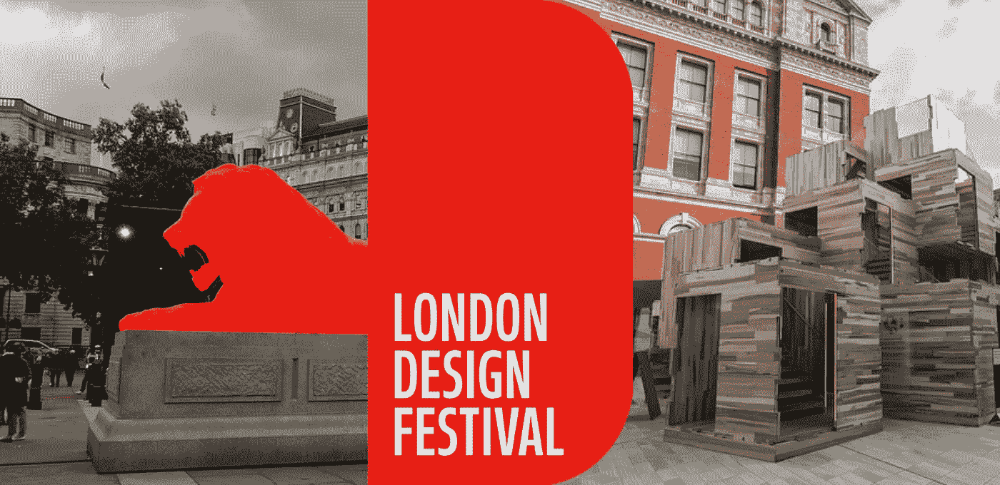
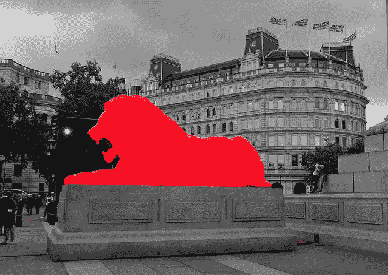
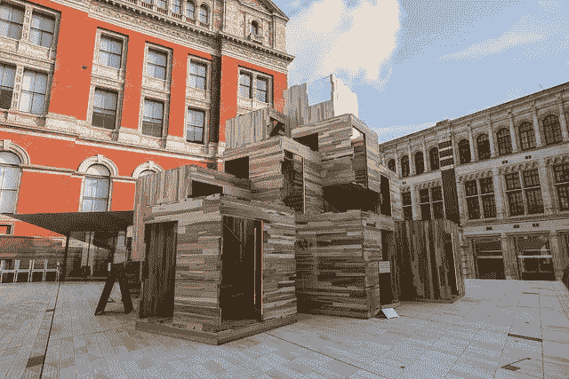

# 解析 2018 伦敦设计节(上)

> 原文：<https://towardsdatascience.com/analyzing-the-london-design-festival-2018-part-1-7edac3bfb165?source=collection_archive---------16----------------------->

## 第 1 部分:对 11，000 条推文的探索性数据分析

“世界设计之都”是伦敦设计节的组织者自豪地宣传伦敦的方式。鉴于上个月在 9 月 15 日(周六)至 9 月 23 日(周日)为期七天的设计节期间，估计有超过 50 万人参观了这座城市，这种说法可能是正确的。

伦敦设计节 2018 (LDF18)有一个非常活跃的活动计划，横跨伦敦 11 个不同的“设计区”、5 个“设计目的地”和 3 条“设计路线”。这是伦敦作为一个建筑环境的灵活性的另一个极好的例子，作为一个画布来展示创造性的想法。

Image of Es Devlin’s *Please Feed the Lions*, taken by David Holt and [downloaded from Flick](https://www.flickr.com/photos/zongo/30916193648/in/photolist-2ba7p8K-28pcodC-29YiDie-29LPTC8-29LPT7P-29VfGwb-28ZDaUi-NLU4dW-2ba7pai-29LPT28-2aEcbur-N2iZBo-2aQezdq-29P7LxQ-NLVEks-P6Xzgw-2ba7p22-29LPTqK-2ba7p1k-29LPS8e-MpcTXp-MpcU9M-P2qP1b-2ba7p3p-M9AfuH-2aUz5ED-289Huxm-29waYxZ-28pcoqS-NLSKYY-NLSKW3-29wbZgv-289LWDJ-289FSYs-29wbZyp-NLSL2o-M9AfzT-2ba7p6a-29waYun-2aWXaCS)

本文的目的是通过分析 11，000 条推文，展示一些关于音乐节的社交媒体数据的**探索性数据分析**，从而更好地理解 LDF18。请向下滚动，通过交互式数据可视化查看我的分析！

## 数据和方法

组织者推广的官方标签是# ldf 18——在电影节期间，我使用 Twitter API 收集了 11000 条包含该标签的推文。值得注意的是，我只收集了包含标签# LDF18 的推文。当然，有许多关于 2018 年伦敦设计节的推文不包含该标签。

在我收集了数据之后，我在一个 python 笔记本中对这些推文进行了预处理和分析。你可以在这里查看我的 Kaggle 内核[对这篇文章的分析。](https://www.kaggle.com/vishalkumarlondon/london-design-festival-2018-eda?scriptVersionId=6721313)

【本文不解释如何获取数据；这是我的发现的介绍。关于如何使用 API 从 Twitter 获取数据的更多信息，请阅读[这篇文章](https://medium.com/@GalarnykMichael/accessing-data-from-twitter-api-using-r-part1-b387a1c7d3e)作者 [Michael Galarnyk](https://medium.com/u/c07aac64b6e1?source=post_page-----7edac3bfb165--------------------------------)

Picture of Waugh Thistleton Architects: MultiPly taken by the US Embassy in the UK and [downloaded from Flickr](https://www.flickr.com/photos/usembassylondon/43826816435/in/photolist-2ba7p8K-28pcodC-29YiDie-29LPTC8-29LPT7P-29VfGwb-28ZDaUi-NLU4dW-2ba7pai-29LPT28-2aEcbur-N2iZBo-2aQezdq-29P7LxQ-NLVEks-P6Xzgw-2ba7p22-29LPTqK-2ba7p1k-29LPS8e-MpcTXp-MpcU9M-P2qP1b-2ba7p3p-M9AfuH-2aUz5ED-289Huxm-29waYxZ-28pcoqS-NLSKYY-NLSKW3-29wbZgv-289LWDJ-289FSYs-29wbZyp-NLSL2o-M9AfzT-2ba7p6a-29waYun-2aWXaCS)

## 分析推文

我分析的主要内容来自我通过 Twitter API 收集的 11000 条推文。下面，我报告对以下四个指标的一些初步分析:

1.  每天的推文数量；
2.  每小时的推文数量(一周的平均值)；
3.  前 10 名 tweeters(按关注人数)；
4.  前 10 名推文(按推文频率)。

## 每天的推文数量

下面的条形图显示，在 LDF18 上最受欢迎的一天是 9 月 20 日星期四，有 1491 条使用#LDF18 的推文。令人惊讶的是，节日前后的周末都不是最忙的；也许周四有一个特别的活动——我会在第二部分的推文中看得更深入一些——或者，也许这最终证实了周四是伦敦的新周五。

Figure 1: Bar chart showing the number of tweets by day during the festival

## 每小时的推文数量

伦敦人早早起床去看 LDF18 的比赛！上午和下午是最忙的时候，从上午 10 点到下午 1 点活动量几乎是一致的，然后到下午 3 点活动量有所下降。

Figure 2: Bar chart showing the average tweets per hour

## 前 10 名推特用户

近 5000 名不同的 Twitter 用户使用#LDF18 发布了关于这个节日的推文。如果我们按照关注者数量来看前 10 名推特用户，只有三个用户占据主导地位——T2、金融时报、设计博物馆和伦敦 NMH，如下表所示。但是，这不是一个有用的衡量标准，所以，我们来看看前 10 名用户使用#LDF18 发微博的次数。

Table 1: Top 10 tweets by the number of followers

## 按推文频率排名的前 10 名推文者

下面的条形图显示了前 10 名推特用户发出的推文数量，包括转发和不转发，分别为左图和右图。

官方推特账号@L_D_F 使用#LDF18 发了近 295 条推文，其中 70 条被转发。而且，虽然“@designledreview”发出了 193 条推文，但几乎都是 RTs。有趣的是，维多利亚阿尔伯特博物馆的高级设计策展人奥利维亚·霍斯福尔·特纳( [**@** 霍斯福尔·特纳](https://twitter.com/HorsfallTurner))疯狂地用#LDF18 发了 83 条推特！

Figure 3: Top 10 tweeters by the frequency of tweets

A tweet from the official @L_D_F twitter account

## 结论

所以你有它！我在 11000 条关于伦敦设计节 2018 的推文中展示了一些 EDA。如果你有任何想法或建议，请在下面留下你的评论，或者，在我的 [Kaggle 内核](https://www.kaggle.com/vishalkumarlondon/london-design-festival-2018-eda?scriptVersionId=6721313)上——对 Kaggle 投赞成票将不胜感激:)。

## 下次…

在我的下一篇文章(第 2 部分)中，我将展示我的自然语言处理(NLP)分析的发现。期待看到推文的文本分析和情感分析。敬请关注。

感谢阅读！

Vishal

# 在你离开之前…

如果你觉得这篇文章有帮助或有趣，请按住👏请在推特、脸书或 LinkedIn 上分享这篇文章，这样每个人都能从中受益。

Vishal 是一名文化数据科学家，也是伦敦 UCL 学院**的研究生。他对城市文化的经济和社会影响感兴趣。你可以在*[*Twitter*](https://twitter.com/vishalkumarldn)*或者*[*LinkedIn*](https://www.linkedin.com/in/vishalkumarlondon/)*上与他取得联系。在*[*insta gram*](https://www.instagram.com/vishalkumar.london/)*或他的* [*网站*](https://vishalkumar.london/) *上看到更多 Vishal 的作品。**