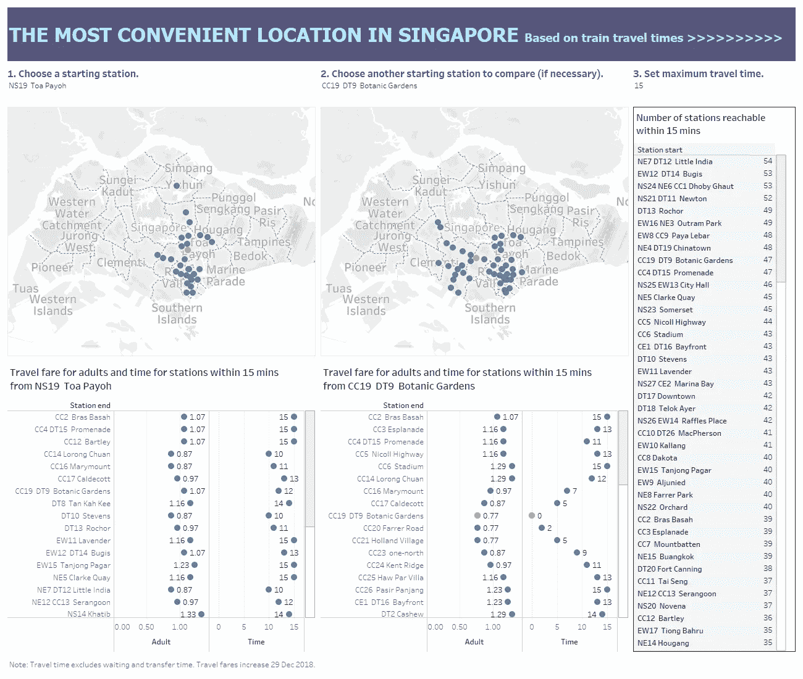
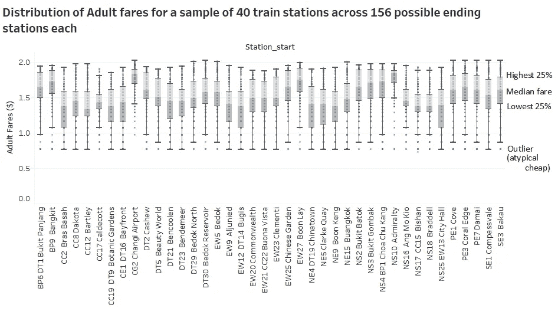

# 分析新加坡的火车旅行时间和票价

> 原文：<https://towardsdatascience.com/analyzing-train-travel-times-and-fares-in-singapore-d8afea68d14c?source=collection_archive---------17----------------------->

我试图了解新加坡不同火车站的可达性，以及不同车站的旅行时间和票价是如何变化的。分析的目的是在火车作为唯一运输方式的基础上，确定更方便的地区。有许多方法可以进行分析:

-查看 X 分钟内可到达的站点数量

-查看行程时间的范围/分布

-查看旅行费用的范围/分布

我对每个站都给予了同等的重视，即每个站都与另一个站一样重要。这可能不太现实，因为有些位置的访问频率不如其他位置。然而，这是一个很好的起点，也是一种通用的方法。我还更加关注使用旅行时间而不是旅行费用作为比较的基础，因为票价将于 2018 年 12 月 29 日发生变化。还需要注意的是，这里的行程时间不包括等待和换乘时间，也不包括延误时间。这可能不是微不足道的，但我假设每个站发生的概率相等，这可能不是真的。在我们建立这个先验之前，需要分析延迟事件的概率，目前我没有这个数据。我如何收集旅行时间和费用数据可以在之前的[帖子](https://projectosyo.wixsite.com/datadoubleconfirm/single-post/2018/10/09/Web-scraping-using-selenium---Process---Python)中找到。

因此，我为用户设计了一个仪表板，让他们在一定时间内比较某个特定站点与另一个站点的覆盖范围，以帮助他们建议重叠区域内可能的会合点。有趣的是，小印度拥有最多 15 分钟内可到达的车站。对于在 8 到 18 分钟内可到达的大多数车站，前 3 名车站是 Dhoby Ghaut、Bugis 和小印度。Serangoon 成为 19 分钟内可到达车站最多的车站。这有助于房产购买的计划，因为便利是一个主要的考虑因素。将这种可及性与房地产价格联系起来也很有意思。

The interactive dashboard can be accessed [here.](https://t.co/ooOZrle040)

我做了第二个仪表板来呈现旅行时间和费用分布的宏观和微观视图。似乎有一种向花哨的可视化发展的趋势，我不太赞同这一点。大多数情况下，简单的图表，如条形图、线形图或散点图，能够有效地展示调查结果。尽管如此，我还是决定尝试一下辐射图。如果你看它，它真的只有在我们有兴趣看大局，而不是依赖它的统计数据或数字时才有用。我们可以看到不同火车线路的旅行时间的总体分布，用不同的颜色表示(我将一些组合在一起，例如 SW 和 SE，PW 和 PE，CE 和 CG)。此外，我们可以看出 BP 线(用灰色表示)的站点数量最少，紧随其后的是 ne 线(用紫色表示)。此外，西南/东南线(由粉红色表示)和 PW/ PE 线(由蓝绿色表示)上的站点具有非常相似的行程时间分布，而东西线(由绿色表示)具有最大的差异，其分布看起来像一个心形图形。更均匀的分布类似于三角形，更类似于 BP 线(用灰色表示)。通过调整最大旅行时间，我发现 CC 线上的所有车站(用黄色表示)都能够在 62 分钟内到达所有其他车站。同样，这样的图表也有很多局限性。不清楚 15 分钟内有多少(或多少比例)的电台可以到达，也很难筛选出一个特定的电台来查看。因此，这真的取决于一个人在设计可视化时要达到的目标。

从径向图开始，旁边的两个图表提供了逐站旅行时间和票价的细分。更容易看到每条线路和每个站的分布。旅行费用的分布非常有趣。每一种都有独特的形状，尤其是不同的线条。票价肯定不是正态分布的，因此计算某个人从特定车站出发的平均票价可能没有意义。研究每个地区的人在火车旅行上的花费是有益的，这可能会更好地影响不同层次的福利包的设计，以补充运输成本。当然，有很多方法可以做到这一点，无论是通过上限或每次乘坐的百分比折扣；就实施而言，这可能必须与一张可识别的卡联系在一起。

The interactive dashboard can be found [here](https://t.co/3Yt76H1yT8).

另外，在我收集完所有 157 个站点的数据之前，我决定在收集了 40 个站点的数据之后对分布进行初步分析。箱线图在评估范围/分布时非常有用，在这种情况下，中值对异常值更稳健，从而使比较更有意义。也很容易看出哪些车站的平均旅行时间和票价比其他车站低。同样，这是基于每个站同等重要的假设。如果我们给某些电台更高的权重，分布将会改变。

另一方面，散点图有助于我们理解总体趋势，也有助于识别异常值(和可能的数据输入错误？).我们可以看到具有平台效应的对数关系。研究不同定价策略对收入的影响肯定是有潜力的，例如阶梯式增长或基于时间而不是基于距离的费用结构。这将使票价估算更容易，但我也认为这将转化为通勤者更高的成本。

*原载于 2018 年 11 月 5 日*[*【projectosyo.wixsite.com】*](https://projectosyo.wixsite.com/datadoubleconfirm/single-post/2018/11/05/Analyzing-train-travel-times-and-fares-in-Singapore)*。*