# 又一次机器学习演练和挑战

> 原文：<https://towardsdatascience.com/another-machine-learning-walk-through-and-a-challenge-8fae1e187a64?source=collection_archive---------3----------------------->


## 不要只是阅读机器学习——实践它！

在花费大量时间和金钱学习课程、书籍和视频后，我得出了一个结论:学习数据科学最有效的方法是做数据科学项目。阅读、倾听和记笔记是有价值的，但是直到你解决了一个问题，概念才从抽象固化为你有信心使用的工具。

在本文中，我将介绍 Python 中的另一个机器学习演练，并留给您一个挑战:尝试开发一个更好的解决方案(包括一些有用的技巧)！这个项目完整的 [Jupyter 笔记本可以在 Kaggle](https://www.kaggle.com/willkoehrsen/a-walkthrough-and-a-challenge) 上运行——不需要下载——或者在 GitHub 上访问[。](https://github.com/WillKoehrsen/taxi-fare/blob/master/A%20Walkthrough%20and%20a%20Challenge.ipynb)

# 问题陈述

目前正在 Kaggle 上运行的[纽约市出租车费用预测挑战赛](https://www.kaggle.com/c/new-york-city-taxi-fare-prediction)，是一项*监督回归*机器学习任务。给定上下车地点、上下车时间戳和乘客数量，目标是预测出租车的费用。像大多数 [Kaggle 竞赛](https://www.kaggle.com/c/)一样，这个问题并不能 100%反映行业中的问题，但它确实提供了一个现实的数据集和任务，我们可以在其上磨练我们的机器学习技能。

为了解决这个问题，我们将遵循一个标准的数据科学管道攻击计划:

1.  **了解问题和数据**
2.  **数据探索/数据清理**
3.  **特征工程/特征选择**
4.  **模型评估和选择**
5.  **模型优化**
6.  **结果和预测的解释**

这个大纲似乎从头到尾呈现了一个线性路径，但数据科学是一个高度非线性的过程，其中的步骤是重复的或无序完成的。随着我们对数据越来越熟悉，我们经常想回去重新审视我们过去的决定或采取新的方法。

> 虽然最终的 Jupyter 笔记本可能会呈现一个有凝聚力的故事，但开发过程非常混乱，包括重写代码和更改早期的决定。

在整篇文章中，我会指出一些我认为有进取心的数据科学家——您——可以改进我的解决方案的地方。我将这些潜在的改进标记为*因为作为一个主要的经验领域，机器学习没有保证。*


New York City Taxi Fare Prediction Challenge ([Link](https://www.kaggle.com/c/new-york-city-taxi-fare-prediction))

## 入门指南

[出租车费用数据集](https://www.kaggle.com/c/new-york-city-taxi-fare-prediction/data)相对较大，有 5500 万个训练行，但易于理解，只有 6 个特征。`fare_amount`是目标值，我们将训练一个模型来预测的连续值:


Training Data

在整个笔记本中，我只使用了 5，000，000 行样本来加快计算速度。因此，我的第一个建议是:

*   **潜在改进 1:使用更多数据训练模型**

不确定大量的数据是否会有所帮助，但是[经验研究发现，一般来说](https://research.google.com/pubs/archive/35179.pdf)，随着用于训练模型的数据量增加，性能也会提高。根据更多数据训练的模型可以更好地学习实际信号，特别是在具有大量特征的高维问题中(这不是高维数据集，因此使用更多数据的回报可能有限)。

尽管数据集的庞大规模可能令人生畏，但是像 Dask 这样的框架允许你在个人笔记本电脑上处理甚至是海量的数据集。此外，一旦数据超出了你的机器的能力，学习如何设置和使用云计算，比如 Amazon ECS，是一项至关重要的技能。

幸运的是，理解这些数据并不需要太多的研究:我们大多数人以前都乘坐过出租车，我们知道出租车是根据行驶里程收费的。因此，对于特征工程来说，我们需要找到一种方法，根据给定的信息来表示行进的距离。我们也可以阅读其他数据科学家的笔记本或竞赛讨论来寻找解决问题的方法。

## 数据探索和清理

尽管 Kaggle 数据通常比真实世界的数据更干净，但该数据集仍存在一些问题，即多个要素中存在异常。我喜欢将数据清理作为探索过程的一部分，纠正我发现的异常或数据错误。对于这个问题，我们可以通过使用`df.describe()`查看数据的统计来发现异常值。

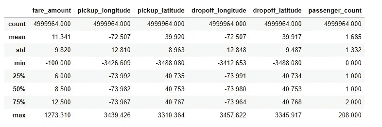

Statistical description of training data

通过结合领域知识和查看数据分布，解决了`passenger_count`、坐标和`fare_amount`中的异常。例如，阅读纽约市的[出租车费用，我们看到最低费用金额为 2.50 美元，这意味着我们应该根据费用排除一些乘坐。对于坐标，我们可以查看分布，并排除那些超出正常范围的值。一旦我们确定了异常值，我们就可以使用如下代码来删除它们:](http://home.nyc.gov/html/tlc/html/passenger/taxicab_rate.shtml)

```
*# Remove latitude and longtiude outliers*
data = data.loc[data['pickup_latitude'].between(40, 42)]
data = data.loc[data['pickup_longitude'].between(-75, -72)]
data = data.loc[data['dropoff_latitude'].between(40, 42)]
data = data.loc[data['dropoff_longitude'].between(-75, -72)]
```

一旦我们清理了数据，我们就可以进入有趣的部分:可视化。下面是纽约市上下客地点的图表，用装箱后的票价进行着色(宁滨是将连续变量转化为离散变量的一种方式)。

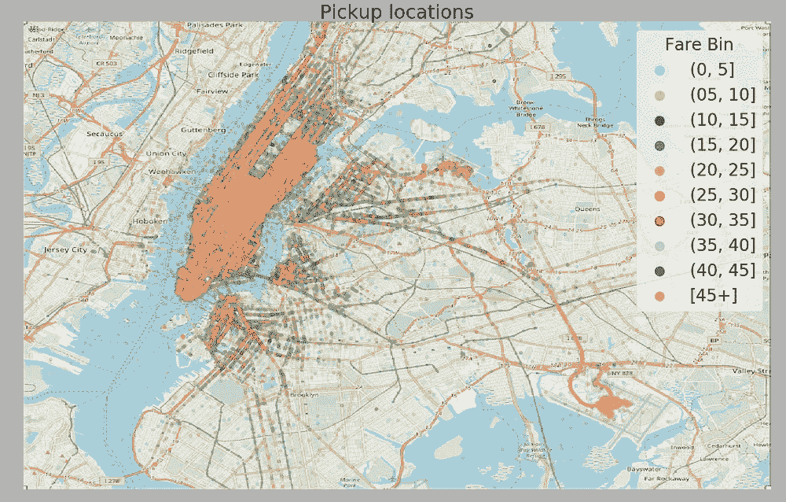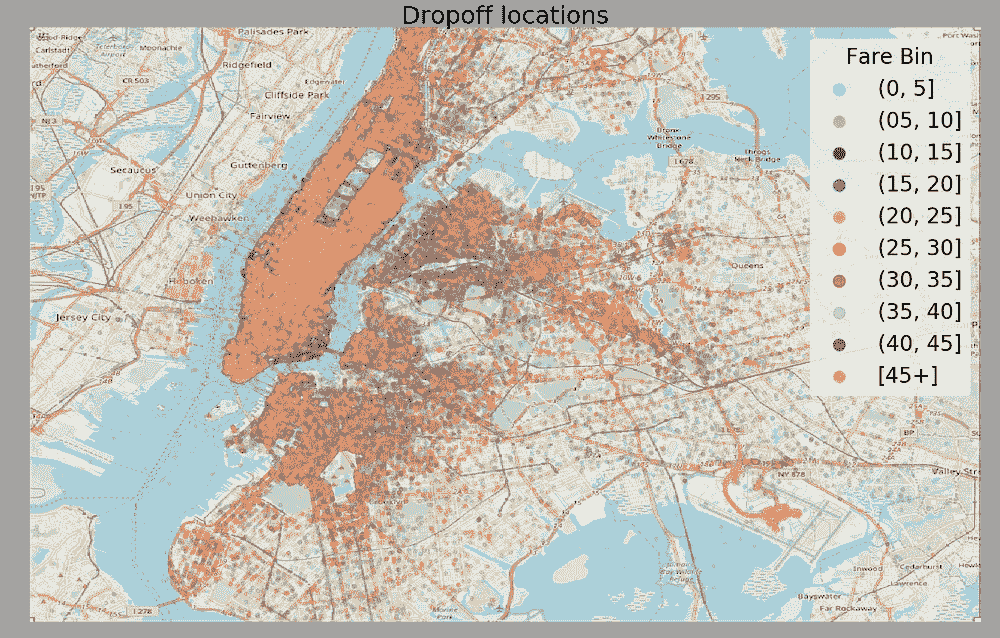

Pickups and Dropoffs plotted on New York City

我们还想看看目标变量。以下是目标变量票价金额的[经验累积分布函数(ECDF)](http://bjlkeng.github.io/posts/the-empirical-distribution-function/) 图。对于一个变量来说，ECDF 可能是比直方图更好的可视化选择，因为它没有来自宁滨的伪像。

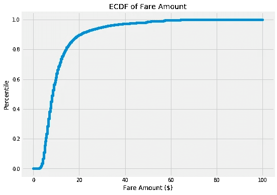

ECDF of Target

除了看起来有趣之外，图可以帮助我们识别异常、关系或新功能的想法。在地图中，颜色代表票价，我们可以看到从机场(右下角)开始或结束的票价往往是最贵的。回到领域知识，我们读到去 JFK 机场的标准费用是 45 美元，所以如果我们能找到识别机场乘车的方法，那么我们就能准确地知道费用。

虽然我在这本笔记本中没有谈到那么远，但是使用领域知识进行数据清理和特性工程是非常有价值的。我的第二个改进建议是:

*   **潜在改进 2:试验不同的离群点去除和数据清理方法。**

这可以通过领域知识(如地图)或统计方法(如 z 分数)来完成。解决这个问题的一个有趣的方法是在这个笔记本中，作者删除了在水中开始或结束的游乐设施。

包含/排除异常值会对模型性能产生重大影响。然而，像机器学习中的大多数问题一样，没有标准的方法(这里有一个 Python 中的[统计方法](https://www.kdnuggets.com/2017/02/removing-outliers-standard-deviation-python.html)你可以试试)。

## 特征工程

要素工程是从现有数据集中创建新要素(预测变量)的过程。因为一个机器学习模型只能从给定的特征中学习，这是机器学习流水线 中 [**最重要的一步。**](https://homes.cs.washington.edu/~pedrod/papers/cacm12.pdf)

对于有多个表和表之间关系的数据集，我们可能想要使用[自动化特征工程](https://medium.com/p/99baf11cc219?source=user_profile---------18------------------)，但是因为这个问题只有相对较少的列和一个表，我们可以手工构建一些高价值的特征。

例如，因为我们知道乘坐出租车的费用与距离成正比，所以我们想要使用起点和终点来尝试并找到行驶的距离。距离的一个粗略近似值是起点和终点纬度和经度之差的绝对值。

```
# Absolute difference in latitude and longitude
data['abs_lat_diff'] = (data['dropoff_latitude'] - data['pickup_latitude']).abs()data['abs_lon_diff'] = (data['dropoff_longitude'] - data['pickup_longitude']).abs()
```

功能不一定要复杂才有用！下面是这些新功能的图表，用装箱的费用来着色。

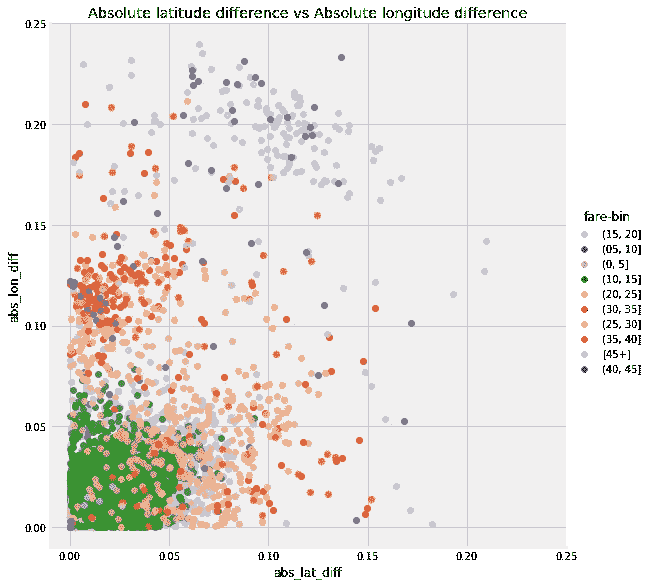

Absolute Longitude vs Absolute Latitude

这些特征给我们的是距离的相对度量，因为它们是根据纬度和经度计算的，而不是实际的度量。这些特征对于比较是有用的，但是如果我们想要以公里为单位进行测量，我们可以在旅行的开始和结束之间应用[哈弗辛公式](https://en.wikipedia.org/wiki/Haversine_formula)，该公式计算大圆距离。这仍然是一个近似值，因为它给出了沿着地球球形表面(我被告知地球是一个球体)上连接两点的直线的距离，显然，出租车不是沿着直线行驶的。(详见笔记本)。

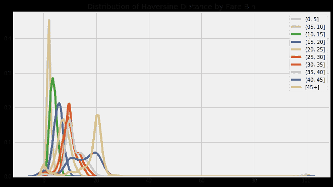

Haversine distance by Fare (binned)

这个问题的其他主要特征来源是基于时间的。给定一个日期和时间，我们可以提取许多新的变量。构建时间特性是一项常见的任务，我在笔记本中包含了一个有用的函数，它可以从一个时间戳构建十几个特性。


Fare amount colored by time of day

虽然我在这个项目中构建了将近 20 个特性，但是还有更多的特性有待发现。特征工程最难的部分是你永远不知道什么时候你已经用尽了所有的选择。我的下一个建议是:

*   **潜在的改进 3:构建更多的特征或将特征选择应用于现有的特征，以找到最优集合。**

特征工程还包括问题专家或应用自动为你构建特征的[算法](https://www.featuretools.com/demos)。在构建特征之后，你经常需要应用[特征选择](http://scikit-learn.org/stable/modules/feature_selection.html#feature-selection)来找到最相关的特征。

一旦有了干净的数据和一组特征，就可以开始测试模型了。尽管特征工程在大纲建模之前，我经常在项目过程中一次又一次地回到这一步。

## 模型评估和选择

建立回归任务基线的首选模型是简单的线性回归。此外，如果我们查看该问题中要素与票价金额的 Pearson 相关性，我们会发现如下所示的几个非常强的线性关系。

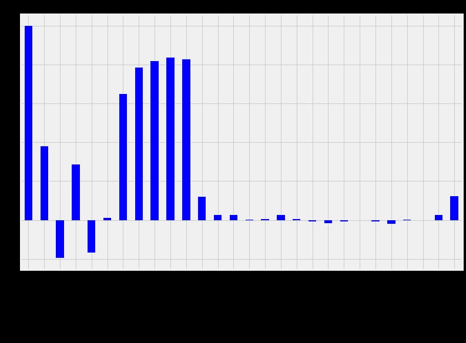

Pearson Correlations of Features with Target

基于一些特征和目标之间的线性关系的强度，我们可以期望线性模型做得相当好。虽然集成模型和深度神经网络得到了所有的关注，但如果一个简单、可解释的模型可以实现几乎相同的性能，那么就没有理由使用过于复杂的模型。尽管如此，尝试不同的模型仍然是有意义的，特别是因为它们很容易用 Scikit-Learn 来构建。

初始模型是一个只对三个特征(`abs`位置差异和`passenger_count`)进行训练的线性回归，其验证均方根误差(RMSE)为 5.32 美元，平均绝对百分比误差为 28.6%。简单线性回归的好处是，我们可以检查系数，例如，根据模型，一名乘客的增加会使票价增加 0.02 美元。

```
# Linear Regression learned parametersIntercept 5.0819
abs_lat_diff coef:  113.6661 	
abs_lon_diff coef: 163.8758
passenger_count coef: 0.0204
```

对于 Kaggle 竞赛，我们可以使用验证集(这里我使用了 1，000，000 个示例)和向竞赛提交测试预测来评估模型。这使我们能够将我们的模型与其他数据科学家进行比较-线性回归放置大约 600/800。理想情况下，我们希望只使用测试集一次，以评估我们的模型在新数据上的表现，并使用验证集(或交叉验证)执行任何优化。Kaggle 的问题是，排行榜可能会鼓励竞争对手建立对测试数据过度优化的复杂模型。

我们还希望将我们的模型与不使用机器学习的原始基线进行比较，在回归的情况下，原始基线可以猜测训练集上目标的平均值。这导致 9.35 美元的 RMSE，这使我们有信心机器学习适用于该问题。

即使在额外的特征上训练线性回归也不会产生很高的排行榜分数，下一步是尝试更复杂的模型。我的下一个选择通常是随机森林，这也是我上交这个问题的地方。与线性回归相比，随机森林是一种更灵活的模型，这意味着它具有更小的偏差，可以更好地拟合训练数据。随机森林通常也具有低方差，这意味着它可以推广到新数据。对于这个问题，随机森林优于线性回归，在相同的功能集上实现了 4.20 美元的验证 RMSE。

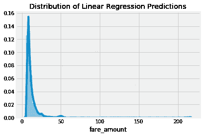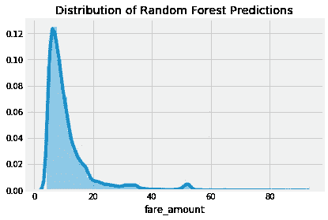

Test Set Prediction Distributions

[随机森林](https://www.stat.berkeley.edu/~breiman/RandomForests/cc_home.htm)通常优于线性回归的原因是因为它具有更大的灵活性——更低的偏差——并且它减少了方差，因为它将许多决策树的预测结合在一起。线性回归是一种简单的方法，因此具有较高的偏差，它假设数据是线性的。线性回归也可能受到异常值的高度[影响，因为它以最小的误差平方和来求解拟合。](https://stats.stackexchange.com/questions/350775/influential-observations-and-outliers-in-linear-regression-model)

模型(和超参数)的选择代表了机器学习中的[偏差-方差权衡](https://en.wikipedia.org/wiki/Bias%E2%80%93variance_tradeoff):具有高偏差的模型甚至无法准确地学习训练数据，而具有高方差的模型本质上是记忆训练数据，无法推广到新的例子。因为机器学习的目标是对新数据进行归纳，所以我们想要一个同时具有低偏差和低方差的模型。

一个问题上的最佳模型不一定是所有问题上的最佳模型，因此研究跨越复杂范围的几个模型是很重要的。应使用*验证数据*评估每个模型，然后在模型调整中优化表现最佳的模型。由于验证结果，我选择了随机森林，并且我鼓励您尝试一些其他模型(或者甚至[将模型组合在一起](http://blog.kaggle.com/2016/12/27/a-kagglers-guide-to-model-stacking-in-practice/))。

## 模型优化

在机器学习问题中，我们有几种提高性能的方法:

1.  **获取更多数据**
2.  **构建更多特征/执行特征选择**
3.  **优化选择的模型**
4.  **尝试更复杂的模型**

1 英镑仍有收益。第二。(这是挑战的一部分)，但我也想提供一个优化所选模型的框架。

模型优化是在给定数据集上为模型找到最佳超参数的过程。因为超参数的最佳值取决于数据，所以对于每个新问题，都必须再次这样做。

> 我喜欢将模型优化(也称为模型调整)视为寻找机器学习模型的理想设置。

优化的方法有很多种，从手动调整到[自动超参数调整](https://medium.com/p/dfda59b72f8a?source=user_profile---------13------------------)，但是[在实践中，随机搜索效果很好](http://www.jmlr.org/papers/volume13/bergstra12a/bergstra12a.pdf)，并且易于实现。在笔记本中，我提供了运行随机搜索进行模型优化的代码。为了使计算时间合理，我再次对数据进行采样，只运行了 50 次迭代。即使这样也需要相当长的时间，因为超参数是使用三重交叉验证来评估的。这意味着在每一次迭代中，模型都要用超参数的选定组合训练 3 次！

```
The best parameters were {'n_estimators': 41, 'min_samples_split': 2, 'max_leaf_nodes': 49, 'max_features': 0.5, 'max_depth': 22, 'bootstrap': True}with a negative mae of -2.0216735083205952
```

我还尝试了许多不同的功能，发现最好的模型只使用了 27 个功能中的 12 个。这是有意义的，因为许多特性是高度相关的，因此是不必要的。

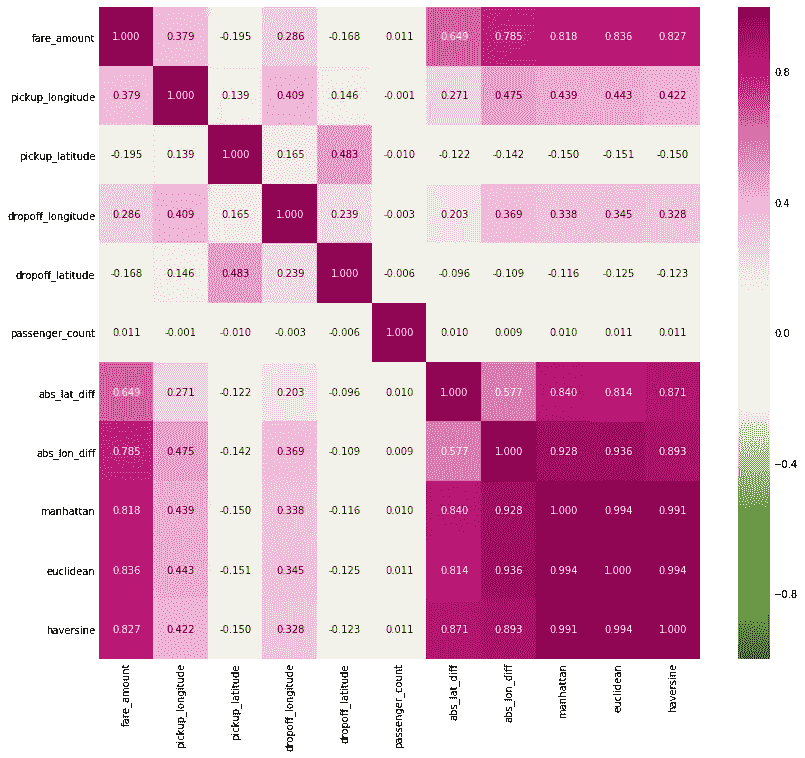

Heatmap of Correlation of Subset of Features

在运行随机搜索并选择特征之后，最终的随机森林模型实现了 3.38 的 RMSE，这表示 19.0%的百分比误差。这比原始基线的误差减少了 66%，比第一个线性模型的误差减少了 30%。这种表现说明了机器学习中的一个关键点:

> 特征工程的回报远远大于模型优化的回报。因此，在开始担心是否有最好的超参数之前，确保您有一组好的特征是至关重要的。

尽管我运行了 50 次随机搜索迭代，超参数值可能还没有完全优化。我的下一个建议是:

*   **潜在的改进 4:在更多的数据上运行更多迭代的模型调优。**

这样做的回报可能会比特性工程少，但是仍然有可能发现性能的提高。如果您觉得能够胜任这项任务，您也可以使用诸如 Hyperopt 之类的工具来尝试自动化模型调优(我写了一个指南，可以在这里找到)。)

## 解释模型并做出预测

虽然随机森林比线性回归更复杂，但它不是一个完整的黑箱。一个[随机森林由一群](https://medium.com/p/77bf308a9b76?source=user_profile---------3------------------)决策树组成，这些决策树本身就是非常直观的流程图模型。我们甚至可以[检查森林](https://medium.com/p/38ad2d75f21c?source=user_profile---------7------------------)中的每棵树，了解它们是如何做决定的。查看随机森林黑盒的另一种方法是检查特征的重要性。技术细节目前并不重要，但是我们可以使用相对值来确定哪些特性被认为与模型相关。


Feature Importances from training on all features

到目前为止，最重要的特征是乘坐出租车的欧几里德距离，其次是时间变量之一的`pickup_Elapsed`。鉴于我们制造了这两个特性，我们应该相信我们的特性工程得到了很好的利用！因为我们不需要保留所有的变量，所以我们也可以突出特征工程或选择的重要性。

最后，我们可以看看验证数据和测试数据上的模型预测。因为我们有了验证答案，我们可以计算预测的误差，并且我们可以检查极值的测试预测(在线性回归中有几个)。下面是最终模型的验证预测图。

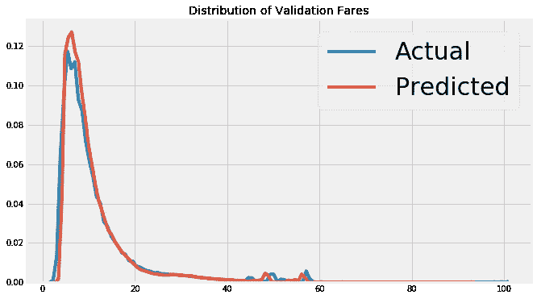

Random Forest validation predictions and true values.

模型解释仍然是一个相对较新的领域，但是有一些[有前途的方法](https://github.com/marcotcr/lime)来检查模型。虽然机器学习的主要目标是对新数据做出准确的预测，但同样重要的是要知道*为什么*模型是准确的，以及它是否能教会我们关于这个问题的任何东西。

## 后续步骤

尽管我们尝试了许多不同的技术并实现了一个完整的解决方案，但仍有一些步骤可以改进模型。我的下一个方法是尝试一个更复杂的模型，比如深度神经网络或梯度推进机器。我还没有在笔记本上实现这些，但是我正在努力实现它们。我让你先试试(我不能把所有答案都给你！).

*   **潜力提升 5:尝试更复杂的型号如** [**梯度增压机**](https://medium.com/mlreview/gradient-boosting-from-scratch-1e317ae4587d)

有了机器学习项目，总是有更多的方法可以尝试，如果你对现有的选项不满意，你甚至可以想出自己的方法！机器学习在很大程度上是一个经验领域，没有标准化的规则，知道某样东西是否有效的唯一方法是测试它。

在这一点上，我将留给您自己的设备来改进模型。我已经给了你五个不同的建议，应该可以让你打破我在笔记本上取得的最好的交叉验证分数。


Final Model Results

这当然是一个友好的挑战，所以不要沮丧，如果你需要帮助，不要犹豫。所有这些建议都是潜在的改进，因为我不能保证它们会提高分数。尽管如此，我知道构建一个更好的模型是可能的，我也会努力尝试并构建它！

如果你需要更多的灵感，这里有我做过的另外两个完整的机器学习项目，可以给你一些思路:

*   [Python 中的数据科学 for Good Machine Learning 项目演练](https://medium.com/p/1977dd701dbc?source=user_profile---------6------------------)(两部分)
*   [Python 中完整的机器学习演练](https://medium.com/p/c62152f39420?source=user_profile---------23------------------)(三部分)

接下来的步骤就看你的了！

# 结论

在这篇文章和附带的 [Jupyter 笔记本](https://github.com/WillKoehrsen/taxi-fare/blob/master/A%20Walkthrough%20and%20a%20Challenge.ipynb)中，我展示了一个真实数据集上的完整机器学习走查。我们用 Python 代码实现了该解决方案，并触及了机器学习中的许多关键概念。机器学习不是一门神奇的艺术，而是一门可以通过重复[磨练的手艺](http://projects.ict.usc.edu/itw/gel/EricssonDeliberatePracticePR93.PDF)。没有什么可以阻止任何人学习如何使用机器学习来解决现实世界的问题，而变得熟练的最有效的方法是完成项目。

本着边做边学的精神，我对你们的挑战是改进我在笔记本电脑中的最佳模型，我给你们留下了一些建议，我相信它们会提高性能。在数据科学中没有一个正确的答案，我期待看到每个人都可以提出什么！如果你接受挑战，请在评论中留下你笔记本的链接。希望这篇文章和笔记本已经给了你解决这个问题或其他问题所必需的开始。此外，当您确实需要帮助时，请不要犹豫，因为数据科学界总是支持您。

一如既往，我欢迎反馈、讨论和建设性的批评。可以通过 Twitter [@koehrsen_will](http://twitter.com/@koehrsen_will) 或者评论这篇文章找到我。