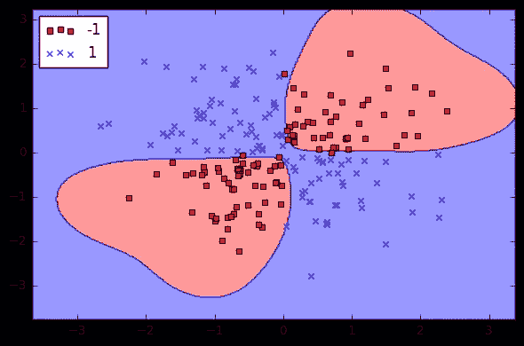

# 又一次尝试内核技巧(为什么？)

> 原文：<https://towardsdatascience.com/another-stab-at-the-kernel-trick-why-f73c70ce98dd?source=collection_archive---------16----------------------->

Photo by [Markos Mant](https://unsplash.com/@markos_mant?utm_source=medium&utm_medium=referral) on [Unsplash](https://unsplash.com/?utm_source=medium&utm_medium=referral)

有很多很棒的关于支持向量机的教程，以及如何在二分类中应用([这里有一个](/i-support-vector-machines-and-so-should-you-7af122b6748)、[还有一个](/support-vector-machine-vs-logistic-regression-94cc2975433f))。但是我想更深入地探究内核技巧以及为什么使用它。

支持向量机依赖于将特征空间扩大到允许两个类别可由线性超平面分开的维度。实现这一点的第一种方法更简单，就是转换输入数据。这意味着将输入要素转换为方形、立方体或其他形式，以生成新的附加要素。另一种方法是使用内核。

核是一个函数，它在一个期望的维度上表示两个观察值之间的相似性(数学上由 Mercer 定理定义，有谷歌)。具有相同坐标的两个观测值之间的相似性是 1，并且随着它们之间的欧几里德距离的增加而趋向于 0。

不用太数学化，解决 SVM 优化问题以找到超平面位置所需的计算是观测值之间的[内积](https://en.wikipedia.org/wiki/Inner_product_space)。内积的输出是一个标量，这意味着我们感兴趣的输出存在于一个维度中，而不是我们为了分离数据而访问的任何疯狂的维度空间。内积计算等价于线性核函数，并在线性空间中表示相似性。

这很重要的原因是，这意味着在更高维度中的观察值与我们无关，我们只关心内积结果。这个内积可以通过方法一的两个步骤来计算，转换输入数据，然后计算内积。或者对输入数据应用内核。方法二的好处是计算效率。

计算效率源于以下事实:核计算比将输入数据变换到线性分离数据所需的更高维度所需的计算更快。

您可以直观地思考为什么这样会更快，因为不需要首先执行数据转换，然后执行内积计算，您只需在一个步骤中应用一个核函数，就可以得到内积结果，瞧！

当问题非常简单，并且只对输入数据进行二次或三次变换就足以允许数据是线性可分的时，使用核技巧没有什么好处。

但是假设你有一个两个类之间的径向边界，如下图所示。要弄清楚如何转换输入数据，以便能够线性地分离下面的类，这是令人难以置信的，因为它的计算成本很高。这就是内核(在这种情况下为[径向/高斯](https://en.wikipedia.org/wiki/Radial_basis_function_kernel))真正发挥作用的地方，观察值之间的相似性计算在转换输入数据时得到了极大的改进。

Image credit: [https://chrisalbon.com/machine_learning/support_vector_machines/svc_parameters_using_rbf_kernel/](https://chrisalbon.com/machine_learning/support_vector_machines/svc_parameters_using_rbf_kernel/)

这只是一个简短的故事(也是我的第一个),关于为什么内核技巧在困难的二进制分类问题中被广泛使用，我希望很快就能在参数调整等方面使用内核技巧。

*原载于 2018 年 11 月 17 日*[*【medium.com*](https://medium.com/@benvozza/another-stab-at-the-kernel-trick-part-1-why-29ff35eb9082)*。*