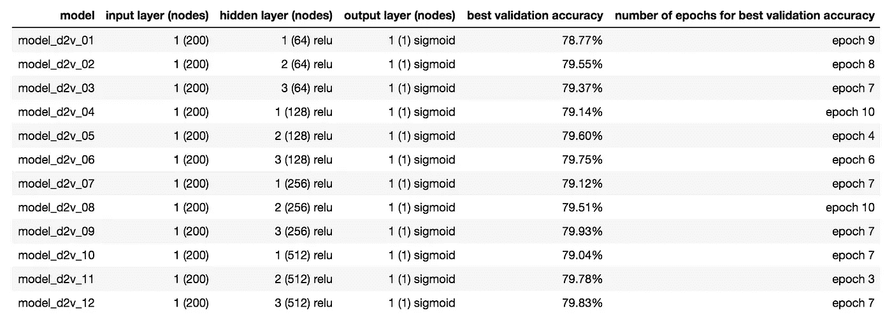
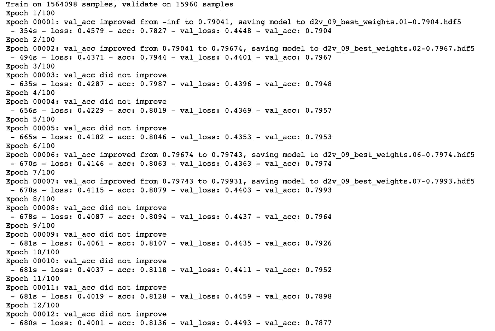
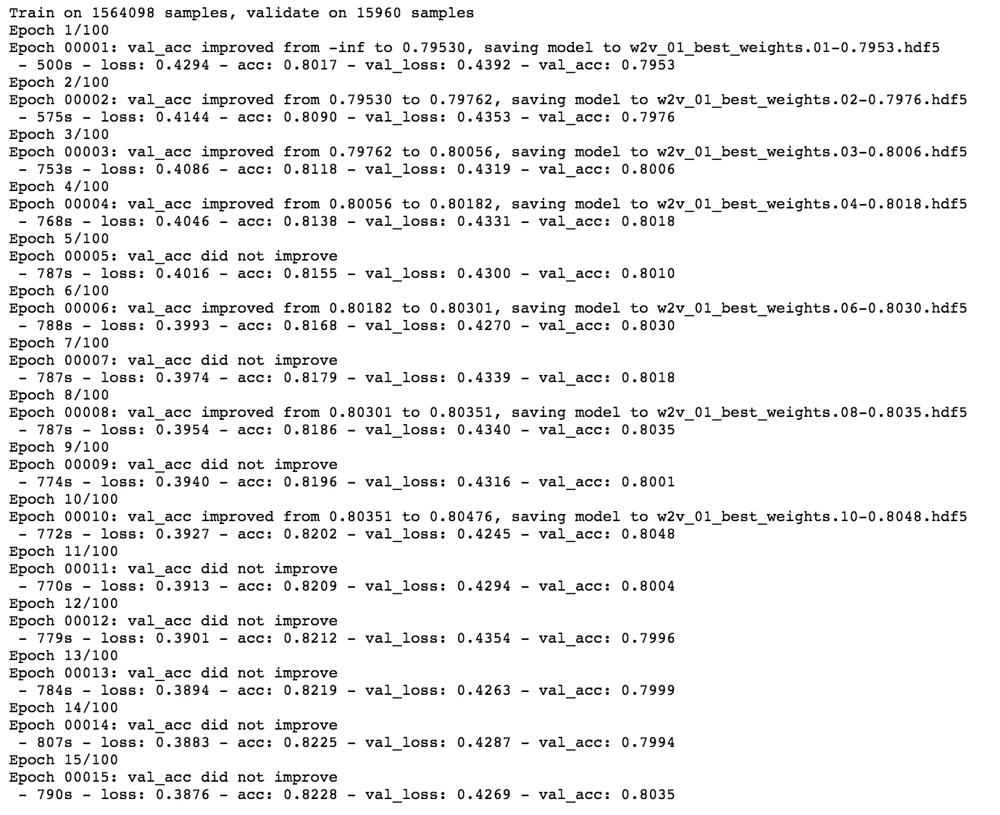

# 使用 Python 的另一个 Twitter 情感分析—第 10 部分(使用 Doc2Vec/Word2Vec/GloVe 的神经网络)

> 原文：<https://towardsdatascience.com/another-twitter-sentiment-analysis-with-python-part-10-neural-network-with-a6441269aa3c?source=collection_archive---------3----------------------->


Photo by [Brett Jordan](https://unsplash.com/@brett_jordan?utm_source=medium&utm_medium=referral) on [Unsplash](https://unsplash.com?utm_source=medium&utm_medium=referral)

这是我正在进行的推特情感分析项目的第十部分。你可以从下面的链接找到以前的帖子。

*   [第一部分:数据清理](/another-twitter-sentiment-analysis-bb5b01ebad90)
*   [第二部分:EDA，数据可视化](/another-twitter-sentiment-analysis-with-python-part-2-333514854913)
*   [第三部分:齐夫定律，数据可视化](/another-twitter-sentiment-analysis-with-python-part-3-zipfs-law-data-visualisation-fc9eadda71e7)
*   [第四部分:特征提取(计数矢量器)、N-gram、混淆矩阵](/another-twitter-sentiment-analysis-with-python-part-4-count-vectorizer-b3f4944e51b5)
*   [第 5 部分:特征提取(Tfidf 矢量器)、机器学习模型比较、词法方法](/another-twitter-sentiment-analysis-with-python-part-5-50b4e87d9bdd)
*   [第 6 部分:Doc2Vec](/another-twitter-sentiment-analysis-with-python-part-6-doc2vec-603f11832504)
*   [第七部分:短语建模+ Doc2Vec](/another-twitter-sentiment-analysis-with-python-part-7-phrase-modeling-doc2vec-592a8a996867)
*   [第八部分:降维(Chi2，PCA)](/another-twitter-sentiment-analysis-with-python-part-8-dimensionality-reduction-chi2-pca-c6d06fb3fcf3)
*   [第 9 部分:具有 Tfidf 向量的神经网络](/another-twitter-sentiment-analysis-with-python-part-9-neural-networks-with-tfidf-vectors-using-d0b4af6be6d7)

在上一篇文章中，我用 Tf-idf 向量实现了神经网络建模，但发现对于高维稀疏数据，神经网络的性能并不好。在这篇文章中，我将看看从 Doc2Vec 模型或单词向量中输入文档向量与 Tf-idf 向量有什么不同。

*除了我将附上的简短代码块，你可以在这篇文章的末尾找到整个 Jupyter 笔记本的链接。

# 具有 Doc2Vec 的神经网络

在我使用从 Doc2Vec 获得的向量进行神经网络建模之前，我想向您介绍一下我是如何获得这些文档向量的背景。在本系列的第六部分中，我已经使用 Gensim 库实现了 Doc2Vec。

有三种不同的方法用于训练 Doc2Vec。分布式单词包，分布式记忆(Mean)，分布式记忆(Concatenation)。这些模型通过 30 个时期的 150 万条推文进行训练，模型的输出是每条推文的 100 个维度向量。在我从每个模型中获得文档向量之后，我尝试将这些向量连接起来(因此连接起来的文档向量有 200 个维度): DBOW + DMM、DBOW + DMC，与使用任何单一纯方法的模型相比，我看到了性能的提高。 [Le 和 Mikolov (2014)](https://cs.stanford.edu/~quocle/paragraph_vector.pdf) 在他们的研究论文中已经展示了使用不同的训练方法并将其连接起来以提高性能。

最后，作为 Doc2Vec 训练的前一步，我应用短语建模来检测二元短语和三元短语，并尝试了跨 n-grams 的不同组合。当使用逻辑回归模型进行测试时，我从“unigram DBOW + trigram DMM”文档向量中获得了最佳性能结果。

我将首先从加载 Gensim 的 Doc2Vec 开始，并定义一个提取文档向量的函数，然后加载我训练的 doc2vec 模型。

当馈送到简单的逻辑回归时，连接的文档向量(unigram DBOW + trigram DMM)产生 75.90%的训练集准确度和 75.76%的验证集准确度。

我将尝试不同数量的隐藏层、隐藏节点来比较性能。在下面的代码块中，您会看到我首先将种子定义为“7”，但没有设置随机种子，“np.random.seed()”将在每个模型的开始处定义。这是为了再现不同模型结构的各种结果。

*旁注(再现性):老实说，这花了我一段时间才弄明白。我首先尝试在导入 Keras 之前设置随机种子，并一个接一个地运行模型。然而，如果我在模型运行后定义相同的模型结构，我不能得到相同的结果。但我也意识到，如果我重启内核，并从头开始重新运行代码块，它会给我与上一个内核相同的结果。所以我想，在运行一个模型后，随机种子发生了变化，这就是为什么我不能用相同的结构得到相同的结果，如果我在相同的内核中连续运行它们。无论如何，这就是为什么我每次尝试不同的模型时都设置随机种子。供您参考，我运行 Keras 与 Theano 后端，只使用 CPU 而不是 GPU。如果你在同样的设置下，这应该可以。通过在命令行中启动 Jupyter Notebook，我显式地将 backend 指定为 Theano，如下所示:“KERAS _ back end = the ano Jupyter Notebook”

请注意，并不是下面单元格中加载的所有依赖项都用于这篇文章，而是为了以后使用而导入的。

定义不同的模型结构会是相当重复的代码，所以我只给你两个例子，这样你就可以理解如何用 Keras 定义模型结构。

在尝试了 12 种不同的模型和一系列的隐藏层(从 1 到 3)以及每个隐藏层的一系列隐藏节点(64，128，256，512)之后，下面是我得到的结果。最佳验证准确度(79.93%)来自于第 7 时段的“model_d2v_09”，其具有 3 个隐藏层，每个隐藏层具有 256 个隐藏节点。



现在我知道哪个模型给我的结果最好，我将运行“model_d2v_09”的最终模型，但这次是用 Keras 中的回调函数。在我收到上一篇帖子的评论之前，我对 Keras 中的回调函数还不太熟悉。得到评论后，我做了一些挖掘，找到了 Keras 回调中所有有用的函数。感谢 [@rcshubha](http://twitter.com/rcshubha) 的评论。下面是我的 Doc2Vec 最终模型，我用了“checkpoint”和“earlystop”。您可以使用选项设置“检查点”功能，通过以下参数设置，“检查点”将保存最佳执行模型，直到运行点，只有当新的纪元优于保存的模型时，它才会将其保存为新的模型。而“early_stop”我把它定义为监控验证精度，如果 5 个纪元没有超过目前最好的验证精度，它就停止。



如果我评估我刚刚运行的模型，它会给我与上一个时期相同的结果。

```
model_d2v_09_es.evaluate(x=validation_vecs_ugdbow_tgdmm, y=y_validation)
```


但是如果我在最佳时期加载保存的模型，那么这个模型将在那个时期给我结果。

```
from keras.models import load_model
loaded_model = load_model('d2v_09_best_weights.07-0.7993.hdf5')
loaded_model.evaluate(x=validation_vecs_ugdbow_tgdmm, y=y_validation)
```


如果你记得用逻辑回归模型用相同的向量表示推文的验证准确性(75.76%)，你可以看到将相同的信息输入神经网络会产生明显更好的结果。看到神经网络如何提振密集向量的性能令人惊叹，但最好的验证精度仍然低于 Tfidf 向量+ logistic 回归模型，该模型给了我 82.92%的验证精度。

如果你读过我在 Doc2Vec 上的帖子，或者熟悉 Doc2Vec，你可能知道还可以从训练好的 Doc2Vec 模型中提取每个单词的单词向量。我将继续使用 Word2Vec，并尝试不同的方法，看看是否有任何方法可以优于 Doc2Vec 的结果(79.93%)，最终优于 Tfidf + logistic 回归模型(82.92%)。

# Word2Vec

为了利用从 Doc2Vec 模型中提取的单词向量，我不能再使用不同 n 元语法的连接向量，因为它们不会包含相同的词汇。因此，在下面，我加载了 unigram DMM 的模型，并为词汇表中的每个单词创建了具有 200 维 unigram DBOW 的连接向量。

在我尝试使用从单词向量计算的文档表示的神经网络之前，我首先要做的是，我将使用各种文档表示方法来拟合逻辑回归，并使用给我最佳验证准确性的方法，我将最终定义一个神经网络模型。

我还会以表格的形式给出所有符合逻辑回归的不同词向量的结果汇总。

## 从 Doc2Vec 模型中提取的词向量(平均值/总和)

可以有许多不同的方法来用单独的单词向量来提出文档表示向量。一个显而易见的选择是平均它们。对于 tweet 中的每个单词，查看经过训练的 Doc2Vec 是否具有该单词的单词向量表示，如果是，则对整个文档中的单词向量进行求和，同时计算有多少单词被检测为具有单词向量，最后通过将求和的向量除以计数，可以获得整个文档的平均单词向量，该向量与各个单词向量具有相同的维数(在本例中为 200)。

另一种方法是只对单词向量求和，而不对它们进行平均。如果一些 tweet 只有 Doc2Vec 词汇表中的几个单词，而一些 tweet 有 Doc2Vec 词汇表中的大部分单词，这可能会扭曲文档的向量表示。但我会尝试求和与平均，并比较结果。

使用 unigram DBOW + unigram DMM 的平均单词向量的验证准确率为 71.74%，这显著低于从 unigram DBOW + trigram DMM 提取的文档向量(75.76%)，并且从本系列的第 6 部分得到的结果中，我知道从 unigram DBOW + unigram DMM 提取的文档向量将给出 75.51%的验证准确率。

我还尝试使用 ScikitLearn 的 scale 函数缩放向量，并看到计算时间的显著改善和精确度的轻微提高。

让我们看看相加的词向量与平均的词向量相比表现如何。

与平均方法相比，求和方法在没有缩放的情况下给了我更高的精度。但是用向量相加的简单逻辑回归需要 3 个多小时来运行。所以我再次尝试缩放这些向量。

令人惊讶！通过缩放，逻辑回归拟合只需 3 分钟！那是相当不同的。使用定标字向量的验证准确度在平均情况下为 72.42%，在求和情况下为 72.51%。

## 使用 TFIDF 加权(平均值/总和)从 Doc2Vec 模型中提取的词向量

在本系列的[第 5 部](/another-twitter-sentiment-analysis-with-python-part-5-50b4e87d9bdd)中，我已经解释了什么是 TF-IDF。TF-IDF 是一种通过计算相对词频率和逆文档频率的乘积来加权每个词的方法。因为它为词汇表中的每个单词给出一个标量值，所以这也可以用作每个单词向量的加权因子。Correa Jr .等人(2017 年)在他们的论文“[NILC-南太平洋大学在 SemEval-2017 任务 Twitter 情感分析的多视角集成](http://www.aclweb.org/anthology/S17-2100)”中实施了这种 Tf-idf 加权

为了获得每个单词的 Tfidf 值，我首先用 tfidf 矢量器拟合和转换训练集，并创建一个包含“单词”、“tfi df 值”对的字典。此外，我定义了一个函数“get_w2v_general ”,用给定的 Word2Vec 模型获得平均单词向量或总单词向量。最后，我计算单词向量与相应 Tfidf 值的乘积。从下面的代码来看，Tfidf 乘法部分花费了相当多的时间。老实说，我仍然不确定为什么要花这么长时间来计算单词向量的 Tfidf 权重，但 5 个小时后它终于完成了计算。稍后你也可以看到，我尝试了另一种称重方法，但用时不到 10 秒。如果你对此有答案，任何见解将不胜感激。

然后，我可以调用“get_w2v_general”函数，就像我对上述不带加权因子的单词向量所做的一样，然后拟合一个逻辑回归模型。平均值的验证准确率为 70.57%，总和的验证准确率为 70.32%。结果不是我预想的那样，尤其是等了 5 个小时。通过用 Tfidf 值对字向量进行加权，平均和求和的验证精度都下降了约 2%。

## 使用自定义权重(平均值/总和)从 Doc2Vec 模型中提取的单词向量

在本系列的[第三部分](/another-twitter-sentiment-analysis-with-python-part-3-zipfs-law-data-visualisation-fc9eadda71e7)中，我定义了一个名为“pos_normcdf_hmean”的自定义指标，这是从 [Jason Kessler 在 PyData 2017 Seattle](https://youtu.be/H7X9CA2pWKo) 的演示文稿中借用的指标。如果你想知道更多关于计算的细节，你可以查看[我之前的帖子](/another-twitter-sentiment-analysis-with-python-part-3-zipfs-law-data-visualisation-fc9eadda71e7)或者你也可以观看[杰森·凯斯勒的演讲](https://youtu.be/H7X9CA2pWKo)。为了给你一个高层次的直觉，通过计算 CDF(累积分布函数)转换值的调和平均值，在整个文档中的词频率和在一个类中的词频，你可以得到一个有意义的度量，显示每个词如何与某个类相关。

我在本系列的第三部分中使用了这个度量来可视化令牌，并且在第五部分[中再次使用它来创建用于分类目的的自定义词典。我将再次使用它作为单词向量的加权因子，看看它如何影响性能。](/another-twitter-sentiment-analysis-with-python-part-5-50b4e87d9bdd)

平均数的验证准确率为 73.27%，总和的验证准确率为 70.94%。与 Tfidf 加权不同，这次使用自定义加权，当使用平均方法时，它实际上给了我一些性能提升。但是对于求和，这种加权并不比没有加权的字向量表现得更好。

## 从预训练手套中提取的单词向量(平均值/总和)

GloVe 是由斯坦福 NLP 小组的 [Pennington 等人(2014)](https://nlp.stanford.edu/pubs/glove.pdf) 提出的另一种向量中的单词表示。

Word2Vec 和 Glove 的区别在于这两个模型如何计算单词向量。在 Word2Vec 中，你得到的单词向量是浅层神经网络的一种副产品，当它试图预测给定周围单词的中心单词或反之亦然。但是使用 GloVe，你得到的词向量是 GloVe 模型的对象矩阵，它使用术语共现矩阵和维度缩减来计算这个。

好消息是，由于最新更新(Gensim 3.2.0)，您现在可以轻松加载和使用 Gensim 的预训练手套向量。除了一些预先训练的单词向量，还添加了新的数据集，这也可以使用他们的下载器 API 轻松下载。如果你想了解更多这方面的信息，请查看稀有技术公司的这篇博文。

斯坦福大学 NLP 小组已经公开了他们预先训练的手套向量，其中，有专门用推文训练的手套向量。这听起来绝对值得一试。他们有四个不同版本的推文向量，每个向量都有不同的维度(25，50，100，200 ),对 20 亿条推文进行了训练。你可以在[他们的网站](https://nlp.stanford.edu/projects/glove/)上找到更多细节。

在这篇文章中，我将使用 200 维预训练手套向量。(如果您的 Gensim 版本低于 3.2.0，您可能需要更新 Gensim)

通过使用预先训练的手套向量，我可以看到验证准确性显著提高。到目前为止，最好的验证准确性来自具有自定义权重的平均单词向量，这给了我 73.27%的准确性，与此相比，手套向量分别产生 76.27%的平均值和 76.60%的总和。

## 从预先训练的谷歌新闻 Word2Vec 中提取的词向量(平均值/总和)

有了新更新的 Gensim，我还可以加载著名的预训练谷歌新闻词向量。这些词向量在谷歌新闻数据集(约 1000 亿词)上使用 Word2Vec 模型进行训练，并由谷歌发布。该模型包含 300 维向量，包含 300 万个单词和短语。你可以在[谷歌项目档案](https://code.google.com/archive/p/word2vec/)中找到更多细节。

平均数的验证准确率为 74.96%，总和的验证准确率为 74.92%。尽管它给我的结果比从定制训练的 Doc2Vec 模型中提取的单词向量更好，但它未能胜过手套向量。而谷歌新闻词向量中的向量维度更大。

但是，这是用谷歌新闻训练的，而我使用的手套向量是专门用推特训练的，因此很难直接相互比较。如果 Word2Vec 是专门用推文训练的呢？

## 单独训练的 Word2Vec(平均值/总和)

我知道我已经尝试了我从 Doc2Vec 模型中提取的单词向量，但是如果我训练单独的 Word2Vec 模型会怎么样？即使 Doc2Vec 模型给出了很好的文档级表示向量，如果我训练纯 Word2Vec，学习单词向量会更有效吗？

为了回答自己的问题，我用 CBOW(连续词袋)和 Skip Gram 模型训练了两个 Word2Vec 模型。在参数设置方面，我设置了与 Doc2Vec 相同的参数。

*   向量的大小:100 维
*   负采样:5
*   窗口:2
*   最小字数:2
*   alpha: 0.065(每个时期将 alpha 减少 0.002)
*   纪元数量:30

根据上面的设置，我通过传递“sg=0”定义了 CBOW 模型，通过传递“sg=1”定义了 Skip Gram 模型。

一旦我从两个模型中得到结果，我就把每个单词的两个模型的向量连接起来，这样连接起来的向量就有了每个单词的 200 维表示。

请注意，在第 6 部分，我训练 Doc2Vec 的地方，我使用了从 Gensim 导入的“LabeledSentence”函数。这已经被否决了，因此在这篇文章中我使用了“TaggedDocument”函数。用法是一样的。

单字 CBOW 和单字 Skip Gram 模型的连接向量使用平均和方法分别产生了 76.50%和 76.75%的验证准确率。这些结果甚至比我从手套向量得到的结果还要高。

但请不要将此混淆为一般声明。这是在这种特殊环境下的经验发现。

## 单独训练的 Word2Vec，带自定义权重(平均值/总和)

最后一步，我将应用我在上面实现的自定义权重，看看这是否会影响性能。

最后，我得到了表现最好的词向量。使用自定义指标加权的平均单词向量(单独训练的 Word2Vec 模型)产生了 77.97%的最佳验证准确率！下面是我在上面尝试的所有结果的表格。


# Word2Vec 神经网络

选择具有逻辑回归的最佳表现的单词向量来馈送给神经网络模型。这一次我没有尝试各种不同的架构。根据我在使用 Doc2Vec 文档向量的不同架构的试验中观察到的情况，性能最好的架构是具有 3 个隐藏层的架构，每个隐藏层有 256 个隐藏节点。
我将最终拟合一个具有早期停止和检查点的神经网络，这样我可以保存验证准确性方面的最佳性能权重。



```
from keras.models import load_model
loaded_w2v_model = load_model('w2v_01_best_weights.10-0.8048.hdf5')
loaded_w2v_model.evaluate(x=validation_w2v_final, y=y_validation)
```


最佳验证准确率为 80.48%。令人惊讶的是，这甚至比我在上面通过将文档向量输入到神经网络模型中所获得的最佳准确度还要高。

我花了相当长的时间来尝试不同的设置，不同的计算，但我通过所有的尝试和错误学到了一些宝贵的经验。经过专门训练的 Word2Vec，通过精心设计的权重，甚至可以在分类任务中胜过 Doc2Vec。

在下一篇文章中，我将尝试更复杂的神经网络模型，卷积神经网络。我再次希望这能给我的表现带来一些提升。

感谢您的阅读，您可以通过下面的链接找到 Jupyter 笔记本。

[https://github . com/tthustle sa/Twitter _ 情操 _ 分析 _ part 10/blob/master/Capstone _ part 10 . ipynb](https://github.com/tthustla/twitter_sentiment_analysis_part10/blob/master/Capstone_part10.ipynb)