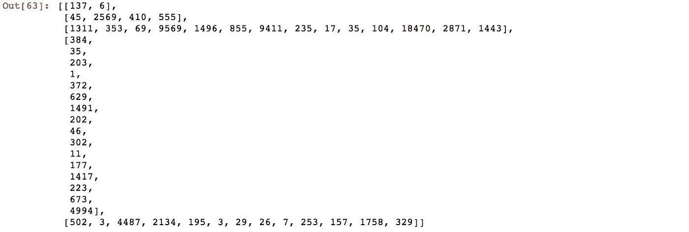
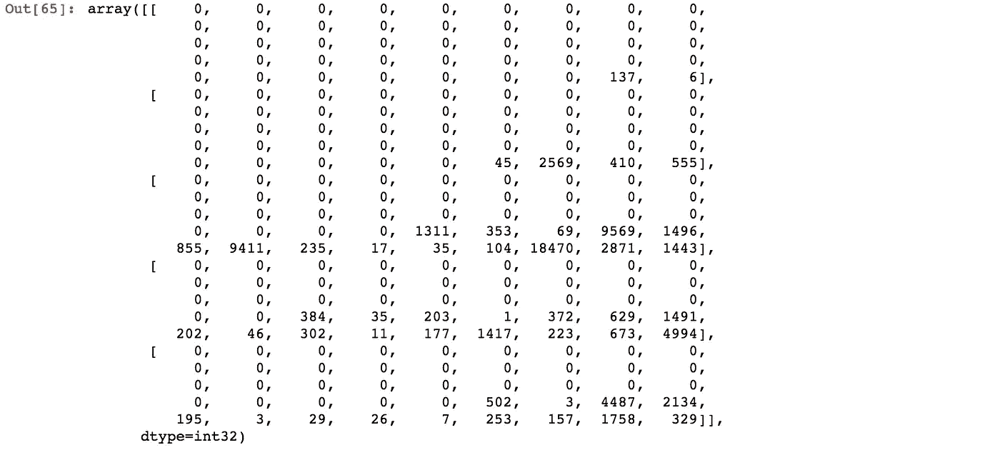
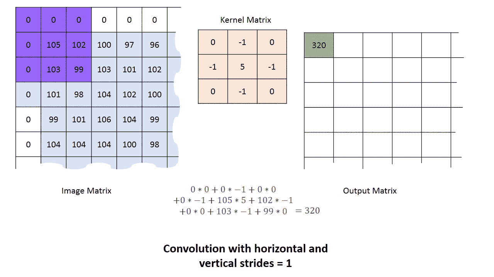
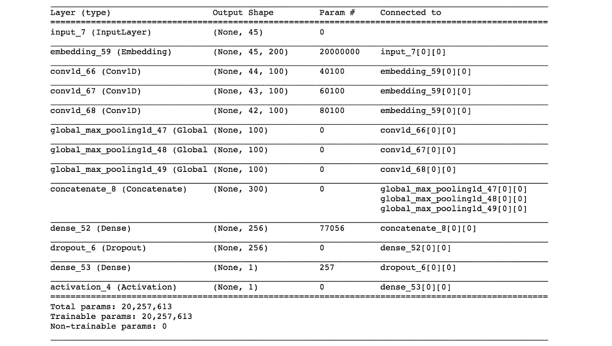
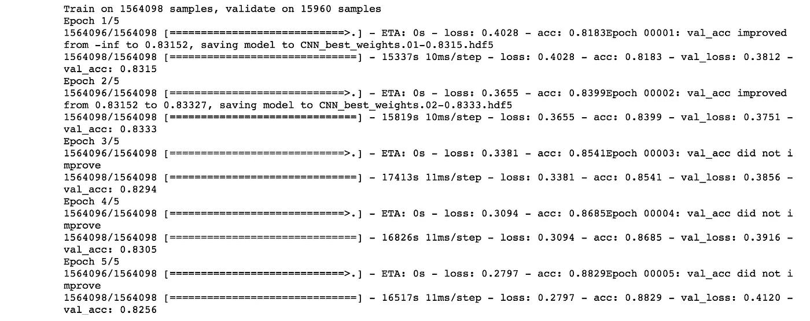
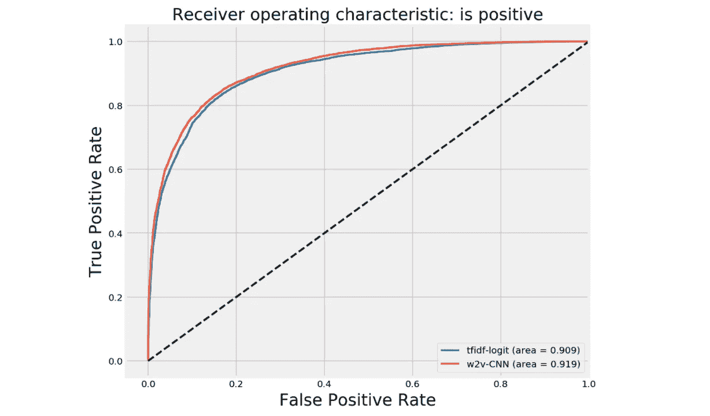

# 使用 Python 的另一个 Twitter 情感分析—第 11 部分(CNN + Word2Vec)

> 原文：<https://towardsdatascience.com/another-twitter-sentiment-analysis-with-python-part-11-cnn-word2vec-41f5e28eda74?source=collection_archive---------0----------------------->


Photo by [Mahdi Bafande](https://unsplash.com/@mahdibafande?utm_source=medium&utm_medium=referral) on [Unsplash](https://unsplash.com?utm_source=medium&utm_medium=referral)

这是我的推特情感分析项目的第 11 部分，也是最后一部分。这是一个漫长的旅程，通过一路上的许多尝试和错误，我学到了无数宝贵的经验教训。我还没有决定我的下一个项目。但我一定会腾出时间开始一个新项目。你可以从下面的链接找到以前的帖子。

*   [第一部分:数据清理](/another-twitter-sentiment-analysis-bb5b01ebad90)
*   [第二部分:EDA，数据可视化](/another-twitter-sentiment-analysis-with-python-part-2-333514854913)
*   [第三部分:齐夫定律，数据可视化](/another-twitter-sentiment-analysis-with-python-part-3-zipfs-law-data-visualisation-fc9eadda71e7)
*   [第四部分:特征提取(计数矢量器)、N-gram、混淆矩阵](/another-twitter-sentiment-analysis-with-python-part-4-count-vectorizer-b3f4944e51b5)
*   [第 5 部分:特征提取(Tfidf 矢量器)、机器学习模型比较、词法方法](/another-twitter-sentiment-analysis-with-python-part-5-50b4e87d9bdd)
*   [第 6 部分:Doc2Vec](/another-twitter-sentiment-analysis-with-python-part-6-doc2vec-603f11832504)
*   [第七部分:短语建模+ Doc2Vec](/another-twitter-sentiment-analysis-with-python-part-7-phrase-modeling-doc2vec-592a8a996867)
*   [第八部分:降维(Chi2，PCA)](/another-twitter-sentiment-analysis-with-python-part-8-dimensionality-reduction-chi2-pca-c6d06fb3fcf3)
*   [第 9 部分:具有 Tfidf 向量的神经网络](/another-twitter-sentiment-analysis-with-python-part-9-neural-networks-with-tfidf-vectors-using-d0b4af6be6d7)
*   [第 10 部分:使用 Doc2Vec/Word2Vec/GloVe 的神经网络](/another-twitter-sentiment-analysis-with-python-part-10-neural-network-with-a6441269aa3c)

*除了我将附上的简短代码块，你可以在这篇文章的末尾找到整个 Jupyter 笔记本的链接。

# 卷积神经网络的准备

在上一篇文章中，我汇总了一条推文中每个单词的单词向量，通过求和或计算平均值来获得每条推文的一个向量表示。然而，为了馈送给 CNN，我们不仅要将每个词向量馈送给模型，还要按照与原始 tweet 相匹配的顺序。

例如，假设我们有一个如下的句子。

“我喜欢猫”

假设我们有每个单词的二维向量表示，如下所示:

我:[0.3，0.5]爱:[1.2，0.8]猫:[0.4，1.3]

有了上面的句子，我们对于整个句子所拥有的向量的维数是 3×2(3:字数，2:向量维数)。

但是还有一件事我们需要考虑。神经网络模型将期望所有数据具有相同的维度，但是在不同句子的情况下，它们将具有不同的长度。这可以用填充来处理。

假设我们有下面的第二句话。

“我也喜欢狗”

用下面的向量表示每个单词:

我:[0.3，0.5]，爱:[1.2，0.8]，狗:[0.8，1.2]，太:[0.1，0.1]

第一句话有 3X2 维向量，但第二句话有 4X2 维向量。我们的神经网络不会接受这些作为输入。通过填充输入，我们决定一个句子中单词的最大长度，如果输入长度短于指定长度，则用零填充剩余的单词。在超过最大长度的情况下，它也会从开头或结尾截断。例如，假设我们决定我们的最大长度为 5。

然后，通过填充，第一个句子将在开头或结尾多 2 个全零的二维向量(您可以通过传递参数来决定)，第二个句子将在开头或结尾多 1 个全零的二维向量。现在我们每个句子有 2 个相同维度(5X2)的向量，我们最终可以将它输入到一个模型中。

让我们首先加载 Word2Vec 模型，从中提取单词向量。我已经保存了我在上一篇文章中训练的 Word2Vec 模型，可以很容易地用 Gensim 中的“KeyedVectors”函数加载。我有两个不同的 Word2Vec 模型，一个是 CBOW(连续词包)模型，另一个是 skip-gram 模型。我不会详细说明 CBOW 和 skip-gram 有什么不同，但是如果你想知道更多细节，你可以参考我之前的文章。

```
from gensim.models import KeyedVectors
model_ug_cbow = KeyedVectors.load('w2v_model_ug_cbow.word2vec')
model_ug_sg = KeyedVectors.load('w2v_model_ug_sg.word2vec')
```

通过运行下面的代码块，我正在构建一种字典，我可以从中提取单词向量。由于我有两个不同的 Word2Vec 模型，下面的“embedding_index”将有两个模型的连接向量。对于每个模型，我有 100 维的单词向量表示，通过连接，每个单词将有 200 维的向量表示。

```
embeddings_index = {}
for w in model_ug_cbow.wv.vocab.keys():
    embeddings_index[w] = np.append(model_ug_cbow.wv[w],model_ug_sg.wv[w])
```

现在我们已经准备好了词向量的参考，但是我们仍然没有准备好我在文章开始解释的格式的数据。Keras 的“Tokenizer”将拆分句子中的每个单词，然后我们可以调用“texts_to_sequences”方法来获得每个句子的顺序表示。我们还需要传递“num_words ”,它是您要使用的词汇的数量，这将在您调用“texts_to_sequences”方法时应用。这可能有点违背直觉。因为如果你检查所有单词索引的长度，它将不是你定义的单词数，而是实际的筛选过程发生在你调用' texts_to_sequences '方法的时候。

```
from keras.preprocessing.text import Tokenizer
from keras.preprocessing.sequence import pad_sequencestokenizer = Tokenizer(num_words=100000)
tokenizer.fit_on_texts(x_train)
sequences = tokenizer.texts_to_sequences(x_train)
```

以下是原始列车数据的前五个条目。

```
for x in x_train[:5]:
    print x
```


并且作为顺序数据准备的相同数据如下。

```
sequences[:5]
```



每个单词都表示为一个数字，我们可以看到每个句子中的单词数与“序列”中数字的长度相匹配。我们以后可以把每个数字代表的单词联系起来。但是我们仍然没有填充我们的数据，所以每个句子都有不同的长度。让我们来处理这个。

```
length = []
for x in x_train:
    length.append(len(x.split()))
max(length)
```


训练数据中一个句子的最大字数是 40。让我们决定最大长度比这个长一点，比如说 45。

```
x_train_seq = pad_sequences(sequences, maxlen=45)
x_train_seq[:5]
```



正如您从填充序列中看到的，所有数据现在都转换为具有相同的长度 45，默认情况下，如果句子长度小于最大长度，则在开头使用零填充。如果你想知道更多细节，请查阅 Keras 文档中关于[序列预处理](https://keras.io/preprocessing/sequence/)的内容。

```
sequences_val = tokenizer.texts_to_sequences(x_validation)
x_val_seq = pad_sequences(sequences_val, maxlen=45)
```

在我们将顺序文本数据输入模型之前，还有一件事要做。当我们把一个句子转换成一个序列时，每个单词都用一个整数来表示。实际上，这些数字是每个单词在分词器的单词索引中的存储位置。记住这一点，让我们构建这些单词向量的矩阵，但这次我们将使用单词索引号，以便我们的模型在输入整数序列时可以引用相应的向量。

下面，我在定义字数为 10 万。这意味着我将只关心训练集中最频繁出现的 100，000 个单词。如果我不限制字数，总词汇量也就 20 多万。

```
num_words = 100000
embedding_matrix = np.zeros((num_words, 200))
for word, i in tokenizer.word_index.items():
    if i >= num_words:
        continue
    embedding_vector = embeddings_index.get(word)
    if embedding_vector is not None:
        embedding_matrix[i] = embedding_vector
```

作为健全性检查，如果嵌入矩阵已经正确生成。在上面，当我看到训练集的前五个条目时，第一个条目是“恨你”，这个的顺序表示是[137，6]。让我们看看第 6 个嵌入矩阵是否与单词“you”的向量相同。

```
np.array_equal(embedding_matrix[6] ,embeddings_index.get('you'))
```


现在我们完成了数据准备。在我们进入 CNN 之前，我想再测试一件事(抱歉耽搁了)。当我们提供这种数据的顺序向量表示时，我们将在 Keras 中使用嵌入层。使用嵌入层，我可以通过预定义的嵌入，我在上面准备了‘Embedding _ matrix ’,或者嵌入层本身可以在整个模型训练时学习单词嵌入。另一种可能性是，我们仍然可以提供预定义的嵌入，但使其可训练，以便它将在模型训练时更新向量的值。

为了检查哪种方法执行得更好，我定义了一个简单的具有一个隐藏层的浅层神经网络。对于这个模型结构，我不会试图通过调整参数来优化模型，因为这篇文章的主要目的是实现 CNN。

```
from keras.models import Sequential
from keras.layers import Dense, Dropout
from keras.layers import Flatten
from keras.layers.embeddings import Embedding
```


结果，最好的验证准确度来自第三种方法(微调预训练的 Word2Vec ),为 82.22%。训练准确率最好的是第二种方法(从零开始学习单词嵌入)，为 90.52%。使用预先训练的 Word2Vec 而不更新其向量值在训练和验证中显示出最低的准确性。然而，有趣的是，在训练集准确性方面，微调预训练的词向量不能胜过通过嵌入层从头学习的词嵌入。在我尝试以上三种方法之前，我的第一个猜测是，如果我微调预先训练的词向量，它会给我最好的训练精度。

将预训练的单词向量馈送给嵌入层以进行更新，就像向嵌入层提供第一初始化准则，以便它可以更有效地学习特定于任务的单词向量。但结果有些违反直觉，在这种情况下，事实证明，最好强制嵌入层从头开始学习。

但是过早的概括可能是危险的。为此，我将在 CNN 的背景下再次比较三种方法。

# 卷积神经网络

您可能已经看到了卷积神经网络(CNN)如何处理图像数据。有很多好的资源可以让你学习 CNN 的基础知识。就我而言，Adit Deshpande 的博客文章“[理解卷积神经网络](https://adeshpande3.github.io/adeshpande3.github.io/A-Beginner's-Guide-To-Understanding-Convolutional-Neural-Networks/)的初学者指南”确实对我理解这个概念有很大帮助。如果你不熟悉 CNN，我强烈推荐他的文章，这样你会对 CNN 有一个坚定的认识。

现在我假设你对 CNN 的图像数据有所了解。那么，这如何应用于文本数据呢？假设我们有一个如下的句子:

“我喜欢猫和狗”

有了词向量(假设我们每个词有 200 维的词向量)，上面的句子可以用 5X200 的矩阵来表示，每个词一行。你还记得我们在上面的句子中添加了零来填充，在那里我们准备了数据以提供给嵌入层吗？如果我们决定的字长是 45，那么上面的句子将有 45X200 的矩阵，但是前 40 行全是零。记住这一点，让我们看看 CNN 是如何处理图像数据的。



Image courtesy of [machinelearninguru.com](http://machinelearninguru.com/computer_vision/basics/convolution/convolution_layer.html)

在上面的 GIF 中，我们有一个 3X3 维的过滤器(核矩阵),对数据(图像矩阵)进行卷积，计算元素相乘结果的总和，并将结果记录在特征图上(输出矩阵)。如果我们想象每一行数据都是一个句子中的一个单词，那么它将不会有效地学习，因为过滤器一次只查看单词向量的一部分。上述 CNN 是所谓的 2D 卷积神经网络，因为滤波器在 2 维空间中移动。

我们对用词向量表示的文本数据所做的是利用 1D 卷积神经网络。如果过滤器的列宽与数据列宽相同，那么它没有空间横向跨越，只能纵向跨越。比如我们的句子用 45X200 矩阵表示，那么一个过滤器列宽也会有 200 列，行的长度(高度)就类似于 n-gram 的概念。如果过滤器高度为 2，过滤器将遍历文档，使用所有二元模型计算上述计算，如果过滤器高度为 3，它将遍历文档中的所有三元模型，依此类推。

如果应用步长为 1 到 45X200 矩阵的 2X200 滤波器，我们将得到 44X1 维的输出。在 1D 卷积的情况下，输出宽度在这种情况下将仅为 1(滤波器数量=1)。使用下面的公式可以很容易地计算出输出高度(假设您的数据已经被填充)。


在哪里

h:输入数据高度

Fh:过滤器高度

学生:步幅大小

现在让我们尝试添加更多的过滤器到我们的 1D 卷积层。如果我们将 100 个步长为 1 的 2X200 滤镜应用于 45X200 矩阵，你能猜出输出维度吗？

正如我在上面已经提到的，现在输出宽度将反映我们应用的过滤器的数量，所以答案是我们将有 44X100 维输出。定义结构后，还可以通过查看模型摘要来检查每个输出层的尺寸。

```
from keras.layers import Conv1D, GlobalMaxPooling1D
structure_test = Sequential()
e = Embedding(100000, 200, input_length=45)
structure_test.add(e)
structure_test.add(Conv1D(filters=100, kernel_size=2, padding='valid', activation='relu', strides=1))
structure_test.summary()
```


现在，如果我们添加全局最大池层，那么池层将从每个过滤器中提取最大值，输出维度将是一个一维向量，长度与我们应用的过滤器数量相同。这可以直接传递到一个致密层上，无需展平。

```
structure_test = Sequential()
e = Embedding(100000, 200, input_length=45)
structure_test.add(e)
structure_test.add(Conv1D(filters=100, kernel_size=2, padding='valid', activation='relu', strides=1))
structure_test.add(GlobalMaxPooling1D())
structure_test.summary()
```


现在，让我们定义一个简单的 CNN 在一条 tweet 上遍历二元模型。来自全局最大池层的输出将被馈送到完全连接的层，最后是输出层。我将再次尝试三种不同的输入，从 Word2Vec 提取的静态单词向量，使用嵌入层从头开始学习单词嵌入，通过训练更新 Word2Vec 单词向量。


最佳验证准确度来自通过训练更新的词向量，在第 3 时段，验证准确度为 83.25%。通过观察训练损失和准确度，似乎从零开始学习的单词嵌入倾向于过度适应训练数据，并且通过馈送预训练的单词向量作为权重初始化，它稍微更一般化并且最终具有更高的验证准确度。

但是终于！我有一个比 Tf-Idf + logistic 回归模型更好的结果！我已经用 Doc2Vec、Word2Vec 尝试了各种不同的方法，希望胜过使用 Tf-Idf 输入的简单逻辑回归模型。具体可以看看之前的帖子。Tf-Idf + logistic 回归模型的验证准确率为 82.91%。现在我终于开始看到 Word2Vec +神经网络优于这个简单模型的可能性。

让我们看看是否可以通过定义一个更精细的模型结构来做得更好。我将在下面实现的 CNN 架构的灵感来自于 Zhang，y .，& Wallace，b .(2015)[“用于句子分类的卷积神经网络的灵敏度分析(和从业者指南](https://arxiv.org/pdf/1510.03820.pdf)”。


Image courtesy of Zhang, Y., & Wallace, B. (2015) “[A Sensitivity Analysis of (and Practitioners’ Guide to) Convolutional Neural Networks for Sentence Classification](https://arxiv.org/pdf/1510.03820.pdf)”

基本上，上面的结构实现了我们上面用二元模型过滤器所做的事情，但不仅仅是二元模型，还有三元模型和四元模型。然而，这不是线性堆叠的层，而是平行的层。在卷积层和最大池层之后，它简单地连接来自 bigram、trigram 和 fourgram 的最大池结果，然后在它们之上构建一个输出层。

我下面定义的模型基本上和上面的图片一样，但是不同的是，我在输出层之前添加了一个完全连接的隐藏层，并且我的输出层将只有一个 Sigmoid 激活的输出节点，而不是两个。

还有 Y. Kim(2014)的另一篇著名论文《用于句子分类的卷积神经网络》。https://arxiv.org/pdf/1408.5882.pdf

在这篇论文中，他利用“通道”概念实现了更复杂的方法。该模型不仅经历不同的 n 元语法，他的模型具有多通道(例如，一个通道用于静态输入单词向量，另一个通道用于单词向量输入，但是将它们设置为在训练期间更新)。但在这篇文章中，我不会通过多渠道的方法。

到目前为止，我只使用了 Keras 的顺序模型 API，这与我上面定义的所有以前的模型都很好，因为模型的结构只是线性堆叠的。但是正如你从上面的图片中看到的，我将要定义的模型有平行的层，这些层接受相同的输入，但是做它们自己的计算，然后结果将被合并。在这种神经网络结构中，我们可以使用 [Keras functional API](https://keras.io/getting-started/functional-api-guide/) 。

Keras functional API 可以处理多输入多输出、共享层、共享输入等。用顺序 API 定义这些类型的模型不是不可以，但是当你想保存训练好的模型时，函数式 API 可以让你简单的保存模型并加载，但是用顺序 API 就很难了。



```
from keras.callbacks import ModelCheckpointfilepath="CNN_best_weights.{epoch:02d}-{val_acc:.4f}.hdf5"
checkpoint = ModelCheckpoint(filepath, monitor='val_acc', verbose=1, save_best_only=True, mode='max')model.fit(x_train_seq, y_train, batch_size=32, epochs=5,
                     validation_data=(x_val_seq, y_validation), callbacks = [checkpoint])
```



```
from keras.models import load_model
loaded_CNN_model = load_model('CNN_best_weights.02-0.8333.hdf5')
loaded_CNN_model.evaluate(x=x_val_seq, y=y_validation)
```


最佳验证准确率为 83.33%，略好于使用二元模型过滤器的简单 CNN 模型，后者产生 83.25%的验证准确率。我甚至可以定义一个具有更多隐藏层的更深结构，或者甚至利用 Yoon Kim(2014)实施的多通道方法，或者尝试不同的池大小以查看性能差异，但我现在就说到这里。然而，如果你碰巧尝试了更复杂的 CNN 结构，并得到了结果，我很乐意听到它。

# 使用测试集的最终模型评估

到目前为止，我已经在验证集上测试了模型，以决定特征提取调整和模型比较。现在我将最终用测试集检查最终结果。我将比较两种不同的模型:1 .Tf-Idf + logistic 回归，2。Word2Vec + CNN。作为比较的另一个衡量标准，我还将绘制两个模型的 ROC 曲线。

```
from sklearn.feature_extraction.text import TfidfVectorizer
tvec = TfidfVectorizer(max_features=100000,ngram_range=(1, 3))
tvec.fit(x_train)
x_train_tfidf = tvec.transform(x_train)
x_test_tfidf = tvec.transform(x_test)
lr_with_tfidf = LogisticRegression()
lr_with_tfidf.fit(x_train_tfidf,y_train)
yhat_lr = lr_with_tfidf.predict_proba(x_test_tfidf)
lr_with_tfidf.score(x_test_tfidf,y_test)
```


```
sequences_test = tokenizer.texts_to_sequences(x_test)
x_test_seq = pad_sequences(sequences_test, maxlen=45)
yhat_cnn = loaded_CNN_model.predict(x_test_seq)
loaded_CNN_model.evaluate(x=x_test_seq, y=y_test)
```



最后的结果如下。


感谢您的阅读。你可以从下面的链接找到 Jupyter 笔记本。

[https://github . com/tthustle sa/Twitter _ 情操 _ 分析 _ part 11/blob/master/Capstone _ part 11 . ipynb](https://github.com/tthustla/twitter_sentiment_analysis_part11/blob/master/Capstone_part11.ipynb)