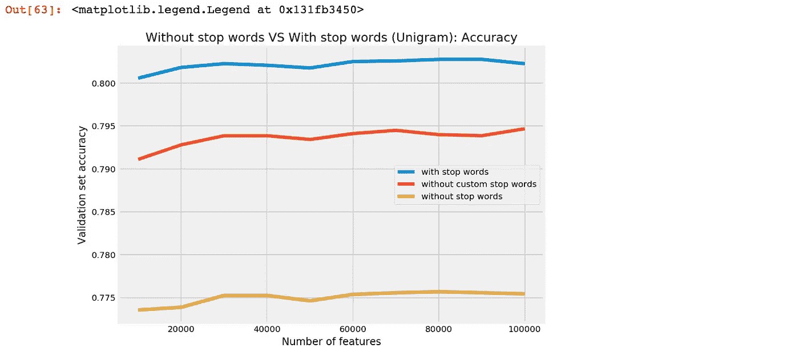
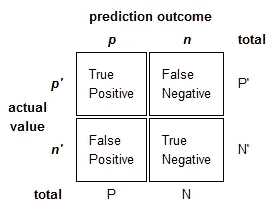
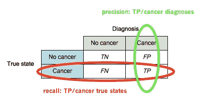
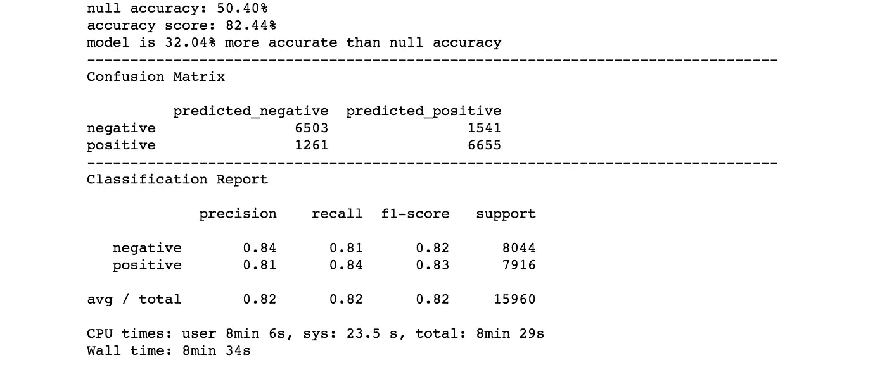

# 使用 Python 的另一个 Twitter 情感分析—第 4 部分(计数矢量器、混淆矩阵)

> 原文：<https://towardsdatascience.com/another-twitter-sentiment-analysis-with-python-part-4-count-vectorizer-b3f4944e51b5?source=collection_archive---------1----------------------->


Photo by [Souvik Banerjee](https://unsplash.com/@rswebsols?utm_source=medium&utm_medium=referral) on [Unsplash](https://unsplash.com?utm_source=medium&utm_medium=referral)

这是我正在进行的 Twitter 情绪分析项目的第 4 部分。你可以从下面的链接找到以前的帖子。

[](/another-twitter-sentiment-analysis-with-python-part-3-zipfs-law-data-visualisation-fc9eadda71e7) [## 另一个使用 Python 的 Twitter 情感分析——第 3 部分(Zipf 定律，数据可视化)

### 这是我目前正在做的 Twitter 情绪分析项目的第三部分，作为通用…

towardsdatascience.com](/another-twitter-sentiment-analysis-with-python-part-3-zipfs-law-data-visualisation-fc9eadda71e7) [](/another-twitter-sentiment-analysis-with-python-part-2-333514854913) [## 另一个使用 Python 的 Twitter 情感分析——第 2 部分

### 这篇博文是我目前正在为我的顶点计划做的 Twitter 情绪分析项目的第二部分…

towardsdatascience.com](/another-twitter-sentiment-analysis-with-python-part-2-333514854913) [](/another-twitter-sentiment-analysis-bb5b01ebad90) [## 另一个使用 Python 的 Twitter 情感分析—第 1 部分

### 距离我上次发帖已经有一段时间了。我不在灵媒期间，我的生活发生了很多事情。我终于收集了我的…

towardsdatascience.com](/another-twitter-sentiment-analysis-bb5b01ebad90) 

在第 3 部分，我主要关注 EDA 和数据可视化，现在是时候为模型构建做准备了！

# 培训/开发/测试分割

在我们可以训练任何模型之前，我们首先考虑如何拆分数据。这里我选择将数据分成三个部分:训练、开发、测试。我参考了吴恩达关于如何拆分数据的“ [deeplearning.ai](https://www.coursera.org/learn/machine-learning-projects) ”课程。

*   训练集:用于学习的数据样本
*   开发集(保留交叉验证集):用于调整分类器参数的数据样本，并提供模型的无偏评估。
*   测试集:仅用于评估最终模型性能的数据样本。

我决定分割数据的比例是 98/1/1，98%的数据作为训练集，1%用于开发集，最后 1%用于测试集。这个比率背后的基本原理来自于我的整个数据集的大小。该数据集有超过 150 万个条目。在这种情况下，整个数据中只有 1%给了我 15000 多个条目。这对于评估模型和优化参数来说绰绰有余。

另一种方法是将数据分为训练集和测试集，并在训练集上运行 k-fold 交叉验证，这样就可以对模型进行无偏见的评估。但是考虑到数据的大小，我决定只使用训练集来训练一个模型，并在 dev 集上进行评估，这样我就可以快速测试不同的算法，并迭代地运行这个过程。

如果你想更详细地了解用于建模的数据分割，我推荐[一篇来自“机器学习大师”的博客文章](https://machinelearningmastery.com/difference-test-validation-datasets/)。该博客有大量关于数据科学广泛主题的文章，强烈推荐。

一旦我加载了清理过的 tweets 数据集，我运行如下的数据分割。注意，我已经将数据拆分了两次，第一次拆分了 train 和 dev+test，第二次拆分了 dev 和 test。

```
x = my_df.text
y = my_df.target
from sklearn.cross_validation import train_test_split
SEED = 2000x_train, x_validation_and_test, y_train, y_validation_and_test = train_test_split(x, y, test_size=.02, random_state=SEED)x_validation, x_test, y_validation, y_test = train_test_split(x_validation_and_test, y_validation_and_test, test_size=.5, random_state=SEED)print "Train set has total {0} entries with {1:.2f}% negative, {2:.2f}% positive".format(len(x_train),                                                                     (len(x_train[y_train == 0]) / (len(x_train)*1.))*100,                                                                           (len(x_train[y_train == 1]) / (len(x_train)*1.))*100)print "Validation set has total {0} entries with {1:.2f}% negative, {2:.2f}% positive".format(len(x_validation),                                                                          (len(x_validation[y_validation == 0]) / (len(x_validation)*1.))*100,                                                                       (len(x_validation[y_validation == 1]) / (len(x_validation)*1.))*100)print "Test set has total {0} entries with {1:.2f}% negative, {2:.2f}% positive".format(len(x_test),                                                          (len(x_test[y_test == 0]) / (len(x_test)*1.))*100,                                                           (len(x_test[y_test == 1]) / (len(x_test)*1.))*100)
```


# 基线

在比较各种机器学习算法时，baseline 提供了一个比较的参考点。最流行的基线是[零规则(ZeroR)](https://machinelearningmastery.com/estimate-baseline-performance-machine-learning-models-weka/) 。ZeroR 分类器简单地预测多数类别(类)。尽管在 ZeroR 中没有可预测性，但它对于确定基线性能作为其他分类方法的基准是有用的。从上面的验证集类划分可以看出，多数类为负，为 50.40%，这意味着如果一个分类器对每个验证数据都预测为负，那么它将获得 50.40%的准确率。

我想比较验证结果的另一个基线是 T [extBlob](http://textblob.readthedocs.io/en/dev/) 。TextBlob 是一个用于处理文本数据的 python 库。除了其他有用的工具，如词性标注，n-gram，该软件包内置了情感分类。这是一个所谓的开箱即用的情感分析工具，除了零精度之外，我还会记住我从 TextBlob 情感分析中获得的精度，以查看我的模型表现如何。

```
from textblob import TextBlob
from sklearn.metrics import accuracy_score
from sklearn.metrics import classification_report, confusion_matrixtbresult = [TextBlob(i).sentiment.polarity for i in x_validation]
tbpred = [0 if n < 0 else 1 for n in tbresult]conmat = np.array(confusion_matrix(y_validation, tbpred, labels=[1,0]))confusion = pd.DataFrame(conmat, index=['positive', 'negative'],
                         columns=['predicted_positive','predicted_negative'])print "Accuracy Score: {0:.2f}%".format(accuracy_score(y_validation, tbpred)*100)
print "-"*80
print "Confusion Matrix\n"
print confusion
print "-"*80
print "Classification Report\n"
print classification_report(y_validation, tbpred)
```


TextBlob 情感分析在验证集上产生 60.65%的准确度，这比空准确度(50.40%)高 10.25%。

# 特征抽出

如果我们想在机器学习算法中使用文本，我们必须将它们转换成数字表示。其中一种方法叫做单词袋法。单词袋模型忽略了语法和单词的顺序。一旦我们有了一个语料库(文本数据)，那么首先，基于整个语料库创建一个词汇表。然后，基于从语料库建立的词汇，每个文档或数据条目被表示为数字向量。

## 计数矢量器

使用计数矢量器，我们仅仅计算每个文本中单词的出现次数。例如，假设我们在一个语料库中有 3 个文档:“我爱狗”、“我讨厌狗和编织”、“编织是我的爱好和激情”。如果我们从这三个句子中构建词汇，并将每个文档表示为计数向量，它将如下图所示。


但是如果语料库的规模变大，词汇的数量就会变得太大而无法处理。以我的 150 万条推文，如果不限制词汇量的话，我的词汇量将超过 26 万。这意味着训练数据的形状将在 1，500，000 x 260，000 左右，这听起来太大了，无法训练各种不同的模型。所以我决定限制词汇表的数量，但是我也想看看性能如何随着词汇表数量的不同而变化。

我想探索的另一件事是停用词。停用词是不包含重要意义的词，如“the”、“of”等。人们通常认为，删除停用词是一个必要的步骤，将提高模型性能。但是我想亲眼看看这是不是真的。所以我在有和没有停用词的情况下做了同样的测试，并比较了结果。此外，我还定义了自己的自定义停用词表，其中包含了语料库中最常用的 10 个词:" to "、" the "、" my "、" it "、" and "、" you "、" not "、" is "、" In "、" for "。

我选择的评估不同计数向量的模型是逻辑回归。与 KNN 或随机森林等模型相比，它是一种线性模型，因此在计算上可扩展到大数据。一旦我有了最佳数量的特征，并决定是否删除停用词，那么我将使用所选数量的词汇计数向量尝试不同的模型。

```
from sklearn.feature_extraction.text import CountVectorizer
from sklearn.linear_model import LogisticRegression
from sklearn.pipeline import Pipeline
from time import time
```

下面我定义了两个函数来迭代训练不同数量的特征，然后检查验证集上逻辑回归的准确性。

```
def accuracy_summary(pipeline, x_train, y_train, x_test, y_test):
    if len(x_test[y_test == 0]) / (len(x_test)*1.) > 0.5:
        null_accuracy = len(x_test[y_test == 0]) / (len(x_test)*1.)
    else:
        null_accuracy = 1\. - (len(x_test[y_test == 0]) / (len(x_test)*1.))
    t0 = time()
    sentiment_fit = pipeline.fit(x_train, y_train)
    y_pred = sentiment_fit.predict(x_test)
    train_test_time = time() - t0
    accuracy = accuracy_score(y_test, y_pred)
    print "null accuracy: {0:.2f}%".format(null_accuracy*100)
    print "accuracy score: {0:.2f}%".format(accuracy*100)
    if accuracy > null_accuracy:
        print "model is {0:.2f}% more accurate than null accuracy".format((accuracy-null_accuracy)*100)
    elif accuracy == null_accuracy:
        print "model has the same accuracy with the null accuracy"
    else:
        print "model is {0:.2f}% less accurate than null accuracy".format((null_accuracy-accuracy)*100)
    print "train and test time: {0:.2f}s".format(train_test_time)
    print "-"*80
    return accuracy, train_test_timecvec = CountVectorizer()
lr = LogisticRegression()
n_features = np.arange(10000,100001,10000)def nfeature_accuracy_checker(vectorizer=cvec, n_features=n_features, stop_words=None, ngram_range=(1, 1), classifier=lr):
    result = []
    print (classifier)
    print "\n"
    for n in n_features:
        vectorizer.set_params(stop_words=stop_words, max_features=n, ngram_range=ngram_range)
        checker_pipeline = Pipeline([
            ('vectorizer', vectorizer),
            ('classifier', classifier)
        ])
        print "Validation result for {} features".format(n)
        nfeature_accuracy,tt_time = accuracy_summary(checker_pipeline, x_train, y_train, x_validation, y_validation)
        result.append((n,nfeature_accuracy,tt_time))
    return result
```

然后，我通过调用上面定义的“nfeature_accuracy_checker”来检查不同数量的特性的有效性。此外，我定义了前 10 个常用术语的自定义停用词来比较结果。注意,‘term _ freq _ df . CSV’是我用语料库从项目的前一部分创建的文件。

```
csv = 'term_freq_df.csv'
term_freq_df = pd.read_csv(csv,index_col=0)
term_freq_df.sort_values(by='total', ascending=False).iloc[:10]
```


只是为了仔细检查这 10 个单词是否真的包含在 SKLearn 的停用单词列表中，我运行了如下的小代码，看到所有的 10 个单词也在 SKLearn 的停用单词列表中。

```
from sklearn.feature_extraction import texta = frozenset(list(term_freq_df.sort_values(by='total', ascending=False).iloc[:10].index))
b = text.ENGLISH_STOP_WORDS
set(a).issubset(set(b))
```


```
my_stop_words = frozenset(list(term_freq_df.sort_values(by='total', ascending=False).iloc[:10].index))
```

现在，我可以在三种不同的条件下运行“nfeature_accuracy_checker”。第一个带停用词删除，第二个带自定义停用词删除，第三个不带停用词删除。

```
print "RESULT FOR UNIGRAM WITHOUT STOP WORDS\n"
feature_result_wosw = nfeature_accuracy_checker(stop_words='english')print "RESULT FOR UNIGRAM WITH STOP WORDS\n"
feature_result_ug = nfeature_accuracy_checker()print "RESULT FOR UNIGRAM WITHOUT CUSTOM STOP WORDS (Top 10 frequent words)\n"
feature_result_wocsw = nfeature_accuracy_checker(stop_words=my_stop_words)
```

我会用一个图表来显示上述准确性检查的结果。

```
nfeatures_plot_ug = pd.DataFrame(feature_result_ug,columns=['nfeatures','validation_accuracy','train_test_time'])
nfeatures_plot_ug_wocsw = pd.DataFrame(feature_result_wocsw,columns=['nfeatures','validation_accuracy','train_test_time'])
nfeatures_plot_ug_wosw = pd.DataFrame(feature_result_wosw,columns=['nfeatures','validation_accuracy','train_test_time'])plt.figure(figsize=(8,6))
plt.plot(nfeatures_plot_ug.nfeatures, nfeatures_plot_ug.validation_accuracy, label='with stop words')
plt.plot(nfeatures_plot_ug_wocsw.nfeatures, nfeatures_plot_ug_wocsw.validation_accuracy,label='without custom stop words')
plt.plot(nfeatures_plot_ug_wosw.nfeatures, nfeatures_plot_ug_wosw.validation_accuracy,label='without stop words')
plt.title("Without stop words VS With stop words (Unigram): Accuracy")
plt.xlabel("Number of features")
plt.ylabel("Validation set accuracy")
plt.legend()
```



通过查看评估结果，删除停用词不会提高模型性能，但保留停用词会产生更好的性能。我不会说删除停用词不能每次都帮助模型性能，但是根据经验发现，在这个特定的设置中，保留停用词可以提高模型性能。

## **二元模型**

根据[维基百科](https://en.wikipedia.org/wiki/N-gram)，“n-gram 是来自给定文本或语音序列的 n 个项目的连续序列”。换句话说，n-grams 就是你能在源文本中找到的所有长度为 n 的相邻单词或字母的组合。下图很好地展示了 n 元语法是如何从源文本中构建出来的。


在这个项目中，我将把单词包扩展到三元模型，看看它如何影响性能。

```
print "RESULT FOR BIGRAM WITH STOP WORDS\n"
feature_result_bg = nfeature_accuracy_checker(ngram_range=(1, 2))print "RESULT FOR TRIGRAM WITH STOP WORDS\n"
feature_result_tg = nfeature_accuracy_checker(ngram_range=(1, 3))
```

运行上述代码后，我将 unigram、bigram 和 trigram 的结果一起绘制在一个图表上，如下所示。

```
nfeatures_plot_tg = pd.DataFrame(feature_result_tg,columns=['nfeatures','validation_accuracy','train_test_time'])
nfeatures_plot_bg = pd.DataFrame(feature_result_bg,columns=['nfeatures','validation_accuracy','train_test_time'])
nfeatures_plot_ug = pd.DataFrame(feature_result_ug,columns=['nfeatures','validation_accuracy','train_test_time'])plt.figure(figsize=(8,6))
plt.plot(nfeatures_plot_tg.nfeatures, nfeatures_plot_tg.validation_accuracy,label='trigram')
plt.plot(nfeatures_plot_bg.nfeatures, nfeatures_plot_bg.validation_accuracy,label='bigram')
plt.plot(nfeatures_plot_ug.nfeatures, nfeatures_plot_ug.validation_accuracy, label='unigram')
plt.title("N-gram(1~3) test result : Accuracy")
plt.xlabel("Number of features")
plt.ylabel("Validation set accuracy")
plt.legend()
```


每个 n 元语法的最佳验证集精度如下。

*   unigram: 80，000 和 90，000 个特征，验证准确率 80.28%
*   bigram: 70，000 个特征，验证准确率 82.25%
*   三元模型:80，000 个特征，验证准确率 82.44%

下面我定义了另一个函数来更仔细地观察每个 n-gram 的最佳性能特征。下面的函数不仅报告准确性，而且给出混淆矩阵和分类报告。

```
def train_test_and_evaluate(pipeline, x_train, y_train, x_test, y_test):
    if len(x_test[y_test == 0]) / (len(x_test)*1.) > 0.5:
        null_accuracy = len(x_test[y_test == 0]) / (len(x_test)*1.)
    else:
        null_accuracy = 1\. - (len(x_test[y_test == 0]) / (len(x_test)*1.))
    sentiment_fit = pipeline.fit(x_train, y_train)
    y_pred = sentiment_fit.predict(x_test)
    accuracy = accuracy_score(y_test, y_pred)
    conmat = np.array(confusion_matrix(y_test, y_pred, labels=[0,1]))
    confusion = pd.DataFrame(conmat, index=['negative', 'positive'],
                         columns=['predicted_negative','predicted_positive'])
    print "null accuracy: {0:.2f}%".format(null_accuracy*100)
    print "accuracy score: {0:.2f}%".format(accuracy*100)
    if accuracy > null_accuracy:
        print "model is {0:.2f}% more accurate than null accuracy".format((accuracy-null_accuracy)*100)
    elif accuracy == null_accuracy:
        print "model has the same accuracy with the null accuracy"
    else:
        print "model is {0:.2f}% less accurate than null accuracy".format((null_accuracy-accuracy)*100)
    print "-"*80
    print "Confusion Matrix\n"
    print confusion
    print "-"*80
    print "Classification Report\n"
    print classification_report(y_test, y_pred, target_names=['negative','positive'])
```

在运行定义的函数之前，让我简单解释一下[混淆矩阵](https://en.wikipedia.org/wiki/Confusion_matrix)和[分类报告](http://scikit-learn.org/stable/modules/generated/sklearn.metrics.classification_report.html)。为了评估模型的性能，可以使用许多不同的指标。下面我将讨论二元分类的情况，其中目标变量只有两类要预测。在这个项目中，类别要么是“负的”，要么是“正的”。

一个显而易见的绩效衡量标准是准确性。它是模型在整个数据集的数量上对该类进行正确预测的次数。但是在分类的情况下，这可以进一步分解。下面是混淆矩阵的表示。



在上面的矩阵中，每一行表示实际类中的实例，而每一列表示预测类中的实例，并且它也可以通过交换行和列来表示(实际类的列，预测类的行)。所以我上面说的精度(ACC)可以表达如下。


当数据中类的分布非常均衡时，准确性可以让您很好地了解模型的执行情况。但是，当您有倾斜的数据时，例如，其中一个类在您的数据集中占主导地位，那么准确性可能不足以评估您的模型。假设你有一个包含 80%正类和 20%负类的数据集。这意味着，通过预测每个数据进入正类，模型将获得 80%的准确性。在这种情况下，您可能希望进一步探究混淆矩阵，并尝试不同的评估指标。

可以有 9 个不同的指标，只是来自混淆矩阵的数字组合，但我将特别讨论其中的两个，以及结合这两个的另一个指标。

“”(也叫阳性预测值)告诉你预测为阳性的数据实际上有多大比例是阳性的。换句话说，在所有阳性预测数据集中，真阳性的比例。


"[回忆](https://en.wikipedia.org/wiki/Information_retrieval#Recall)(也称为敏感度、命中率、真阳性率)告诉您实际为阳性的数据被预测为阳性的比例。换句话说，所有实际阳性数据中真正阳性的比例。


下图是癌症诊断的混淆矩阵。如果你认为“癌症”是阳性类别，“非癌症”是阴性类别，这个图像很好地解释了如何根据混淆矩阵来考虑精确度和召回率。



最后，F1 分数是精确度和召回率的调和平均值。调和平均值是一种特殊类型的平均值，用于处理单位平均值，如比率和比率。因此，通过计算这两个指标的调和平均值，您可以很好地了解模型在精确度和召回率方面的表现。公式如下。


```
%%time
tg_cvec = CountVectorizer(max_features=80000,ngram_range=(1, 3))
tg_pipeline = Pipeline([
        ('vectorizer', tg_cvec),
        ('classifier', lr)
    ])
train_test_and_evaluate(tg_pipeline, x_train, y_train, x_validation, y_validation)
```



从上面的分类报告中，我们可以看到，模型在否定类中的准确率略高，在肯定类中的召回率也较高。但是这是通过计算 F1 分数得出的平均值，对于这两个类，我们得到了正类和负类几乎相同的 F1 分数。还有一种通过绘制 ROC 曲线来可视化模型性能的方法，但我将在后面更详细地解释。

在这篇文章中，我研究了基于用计数矢量器提取的特征的逻辑回归是如何执行的。在下一篇文章中，我将试验 Tfidf 矢量器，看看结果有什么不同。

感谢您阅读这篇长文！你可以从下面的链接找到上面代码的 Jupyter 笔记本。

[https://github . com/tthustle sa/Twitter _ 情操 _ 分析 _ part 4/blob/master/Capstone _ part 4-copy 2 . ipynb](https://github.com/tthustla/twitter_sentiment_analysis_part4/blob/master/Capstone_part4-Copy2.ipynb)