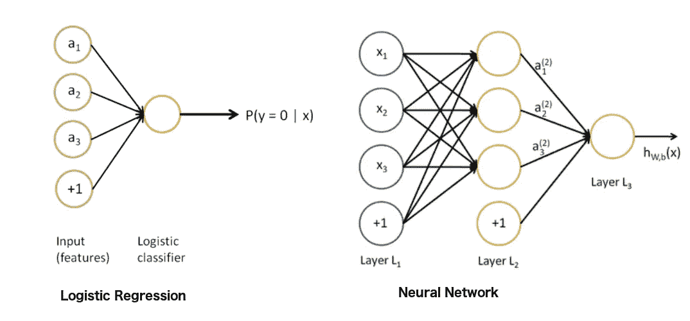

# 另一个使用 Python 的 Twitter 情感分析——第 9 部分(使用 Keras 的 Tfidf 向量的神经网络)

> 原文：<https://towardsdatascience.com/another-twitter-sentiment-analysis-with-python-part-9-neural-networks-with-tfidf-vectors-using-d0b4af6be6d7?source=collection_archive---------3----------------------->

Photo by [Alina Grubnyak](https://unsplash.com/@alinnnaaaa?utm_source=medium&utm_medium=referral) on [Unsplash](https://unsplash.com?utm_source=medium&utm_medium=referral)

这是我正在进行的推特情感分析项目的第 9 部分。你可以从下面的链接找到以前的帖子。

*   [第一部分:数据清理](/another-twitter-sentiment-analysis-bb5b01ebad90)
*   [第二部分:EDA，数据可视化](/another-twitter-sentiment-analysis-with-python-part-2-333514854913)
*   [第三部分:齐夫定律，数据可视化](/another-twitter-sentiment-analysis-with-python-part-3-zipfs-law-data-visualisation-fc9eadda71e7)
*   [第四部分:特征提取(计数矢量器)、N-gram、混淆矩阵](/another-twitter-sentiment-analysis-with-python-part-4-count-vectorizer-b3f4944e51b5)
*   [第 5 部分:特征提取(Tfidf 矢量器)、机器学习模型比较、词法方法](/another-twitter-sentiment-analysis-with-python-part-5-50b4e87d9bdd)
*   [第 6 部分:Doc2Vec](/another-twitter-sentiment-analysis-with-python-part-6-doc2vec-603f11832504)
*   [第七部分:短语建模+ Doc2Vec](/another-twitter-sentiment-analysis-with-python-part-7-phrase-modeling-doc2vec-592a8a996867)
*   [第八部分:降维(Chi2，PCA)](/another-twitter-sentiment-analysis-with-python-part-8-dimensionality-reduction-chi2-pca-c6d06fb3fcf3)

在前一篇文章中，在尝试神经网络建模之前，我走了一条实现降维的弯路。在这篇文章中，我将首先用 100，000 个特征的 Tfidf 向量实现神经网络，包括高达三元模型。

*除了我将附上的简短代码块，你可以在这篇文章的末尾找到整个 Jupyter 笔记本的链接。

# 人工神经网络

我的第一个想法是，如果逻辑回归是表现最好的分类器，那么这个想法可以扩展到神经网络。就其结构而言，逻辑回归可以被认为是一个没有隐含层，只有一个输出节点的神经网络。从下面的图片可以更清楚的看到这种关系。

我不会详细讲述神经网络是如何工作的，但是如果你想知道更多的细节，你可以看看我之前写的关于用 Python 从零开始实现神经网络的文章。但是对于这篇文章，我不会从头开始实现它，而是使用一个名为 Keras 的库。Keras 更像是一个包装器，可以运行在其他库之上，比如 Theano 或 TensorFlow。它是最易于使用的库之一，具有直观的语法和强大的功能。如果你像我一样是神经网络建模的新手，我认为 Keras 是一个很好的起点。

# 带 Tfidf 矢量器的人工神经网络

我得到的性能最好的 Tfidf 向量有 100，000 个特征，包括多达逻辑回归三元模型。验证准确率为 82.91%，而训练集准确率为 84.19%。我想看看神经网络是否能提高我现有的 Tfidf 向量的性能。

我将首先从加载所需的依赖项开始。为了使用 TensorFlow 后端运行 Keras，您需要安装 TensorFlow 和 Keras。

以下 NN 模型的结构在输入层中有 100，000 个节点，然后在应用了 Relu 激活函数的隐藏层中有 64 个节点，最后是应用了 sigmoid 激活函数的一个输出层。神经网络有不同类型的优化技术，您可以使用模型定义不同的损失函数。下面的模型使用 ADAM 优化，和二进制交叉熵损失。

ADAM 是一种优化算法，用于更新参数和最小化神经网络的成本，这被证明是非常有效的。它结合了两种优化方法:RMSProp 和 Momentum。同样，我将重点分享我从实现中获得的结果，但如果你想正确理解亚当是如何工作的，我强烈推荐吴恩达的“ [deeplearning.ai](https://www.coursera.org/specializations/deep-learning) ”课程。他用非常直观的方式解释了神经网络的复杂概念。如果您想要更多关于该主题的深入材料，还可以看看 Kingma & Ba (2014)的研究论文“ [ADAM:一种随机优化的方法](https://arxiv.org/pdf/1412.6980.pdf)”。

在输入数据和训练模型之前，我还需要处理一件事。Keras NN 模型不能直接处理稀疏矩阵。数据必须是密集阵列或矩阵，但将 150 万个 Tfidf 向量的整个训练数据转换为密集阵列将无法容纳在我的 RAM 中。所以我必须定义一个函数，它生成 iterable generator 对象，这样它就可以输入到 NN 模型中。注意，输出应该是一个生成器类对象，而不是直接返回数组，这可以通过使用“yield”而不是“return”来实现。

看起来该模型在 2 个时期后具有最佳验证准确性，并且在此之后，它不能一般化，因此验证准确性缓慢降低，而训练准确性增加。但如果你还记得我从逻辑回归得到的结果(训练准确率:84.19%，验证准确率:82.91%)，你可以看到，上述神经网络在验证方面未能跑赢逻辑回归。

让我们看看归一化输入是否对性能有任何影响。

然后我重新定义了模型，用我从上面规格化器得到的“x_train_tfidf_norm”重新改装了模型。

结果几乎和没有标准化时一样。在这一点上，我意识到 Tfidf 已经通过它的计算方法归一化了。Tfidf 中的 TF(词频)不是绝对频率而是相对频率，通过将 idf(逆文档频率)乘以相对词频值，以跨文档的方式进一步归一化该值。

## 拒绝传统社会的人

如果模型的问题是一个糟糕的概括，那么我可以在模型中添加另一个东西。尽管神经网络是一个非常强大的模型，但有时过度适应训练数据可能是一个问题。辍学是一种解决这个问题的技术。如果你熟悉机器学习中的系综模型概念，辍学也可以看出一脉相承。根据 Hinton 等人(2012 年)的研究论文“[通过防止特征检测器](https://arxiv.org/pdf/1207.0580.pdf)的共同适应来改善神经网络”“*减少测试集误差的一个好方法是对大量不同网络产生的预测进行平均。做到这一点的标准方法是训练许多单独的网络，然后将这些网络中的每一个应用于测试数据，但是这在训练和测试期间都是计算昂贵的。随机退出使得在合理的时间内训练大量不同的网络成为可能。*

Dropout 是模拟好像我们训练许多不同的网络，并通过在整个训练过程中以一定的概率随机省略隐藏节点来平均它们。使用 Keras，只需在模型架构中添加一行就可以轻松实现。让我们看看 20%的辍学率下模型性能如何变化。(*我将收集所有结果，并在最后以表格形式呈现。)

通过 5 个历元，训练集精度没有达到没有丢失的模型的精度，但是验证精度没有下降到与之前的模型一样低。尽管退出给模型增加了一些概括性，但与逻辑回归结果相比，验证准确性仍然表现不佳。

## 洗牌

我可以尝试另一种方法来防止过度拟合。通过为每个时期以相同的顺序呈现数据，模型有可能学习到也包括训练数据的噪声的参数，这最终导致过度拟合。这可以通过改变我们提供给模型的数据的顺序来改善。下面，我在批处理生成器函数中添加了洗牌功能，并尝试使用相同的模型结构，比较了结果。

具有非混洗训练数据的同一模型的训练准确率为 87.36%，验证准确率为 79.78%。改组后，训练准确率下降到 84.80%，但 5 个时期后的验证准确率增加到 82.61%。看起来洗牌确实提高了模型在验证集上的表现。我注意到的另一件事是，无论有无洗牌，无论有无掉线，验证准确性往往在 2 个时期后达到峰值，之后逐渐下降。

我还尝试了同样的模型，其中有 20%的数据丢失，这次只有 2 个时期，我将在最后分享结果。

## 学习率

当我在学习吴恩达的“ [deeplearning.ai](https://www.coursera.org/specializations/deep-learning) ”课程时，他表示，他试图改进神经网络模型的第一件事是调整学习速率。我决定听从他的建议，用这个模型尝试不同的学习速度。请注意，除了学习率之外，“β_ 1”、“β_ 2”和“ε”的参数设置为原始论文“[ADAM:A Method for random Optimization](https://arxiv.org/pdf/1412.6980.pdf)”中的默认值，作者为 Kingma 和 Ba (2015)。

在尝试了四种不同的学习率(0.0005，0.005，0.01，0.1)之后，没有一个比默认的学习率 0.001 表现得更好。

## 增加节点数量

也许我可以尝试增加隐藏节点的数量，看看它对性能有什么影响。下面的模型在隐藏层有 128 个节点。

在 128 个隐节点的情况下，验证精度接近逻辑回归的性能。我可以通过增加隐藏层的数量做进一步的实验，但是要运行上面的 2 个时期，需要 5 个小时。考虑到逻辑回归用了不到一分钟的时间来拟合，即使神经网络可以进一步改进，这看起来也不是一种有效的方法。

下面是一个表格，列出了我从上面尝试不同模型得到的所有结果。请注意，我比较了 2 个时期的性能，因为有些模型只运行了 2 个时期。

除 ANN_8(学习率为 0.1)外，模型性能仅在小数部分有变化，最佳模型为 ANN_9(一个隐层 128 个节点)，验证准确率为 82.84%。

因此，在这种特殊情况下，神经网络模型未能胜过逻辑回归。这可能是由于文本数据的高维度和稀疏特性。我还找到一篇研究论文，比较了模型性能和高维数据。根据 Caruana 等人(2008 年)的“[高维监督学习的经验评估](http://icml2008.cs.helsinki.fi/papers/632.pdf)”，逻辑回归显示出与神经网络一样好的性能，在某些情况下甚至优于神经网络。

通过以上所有的尝试，我学到了一些宝贵的经验。实现和调整神经网络是一个高度迭代的过程，包括许多试验和错误。尽管神经网络是逻辑回归的更复杂版本，但它并不总是优于逻辑回归，有时对于高维稀疏数据，逻辑回归可以以比神经网络少得多的计算时间提供良好的性能。

在下一篇文章中，我将使用从上一篇文章中获得的 Doc2Vec 向量实现一个神经网络。希望使用像 Doc2Vec 这样的密集向量，神经网络可能会有所提高。手指交叉。

一如既往的感谢您的阅读。你可以从下面的链接找到整个 Jupyter 笔记本。

[https://github . com/tthustle sa/Twitter _ 情操 _ 分析 _ part 9/blob/master/Capstone _ part 4-copy 7 . ipynb](https://github.com/tthustla/twitter_sentiment_analysis_part9/blob/master/Capstone_part4-Copy7.ipynb)