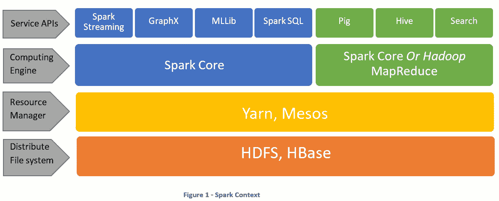
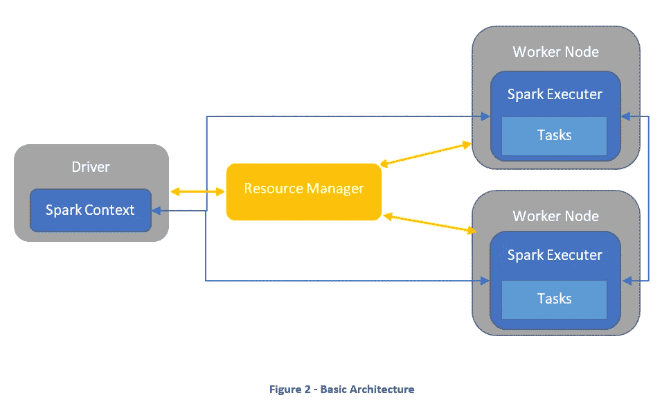
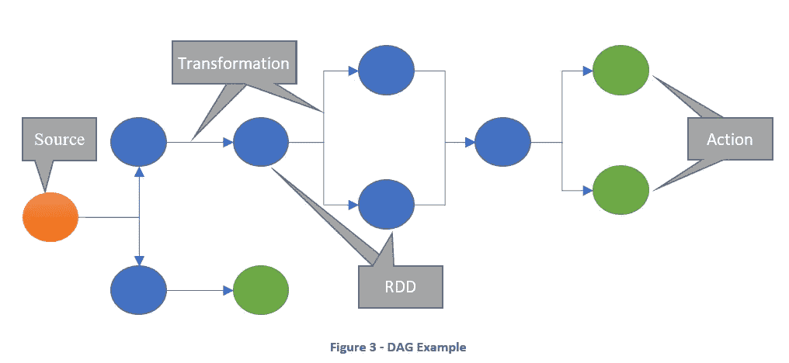
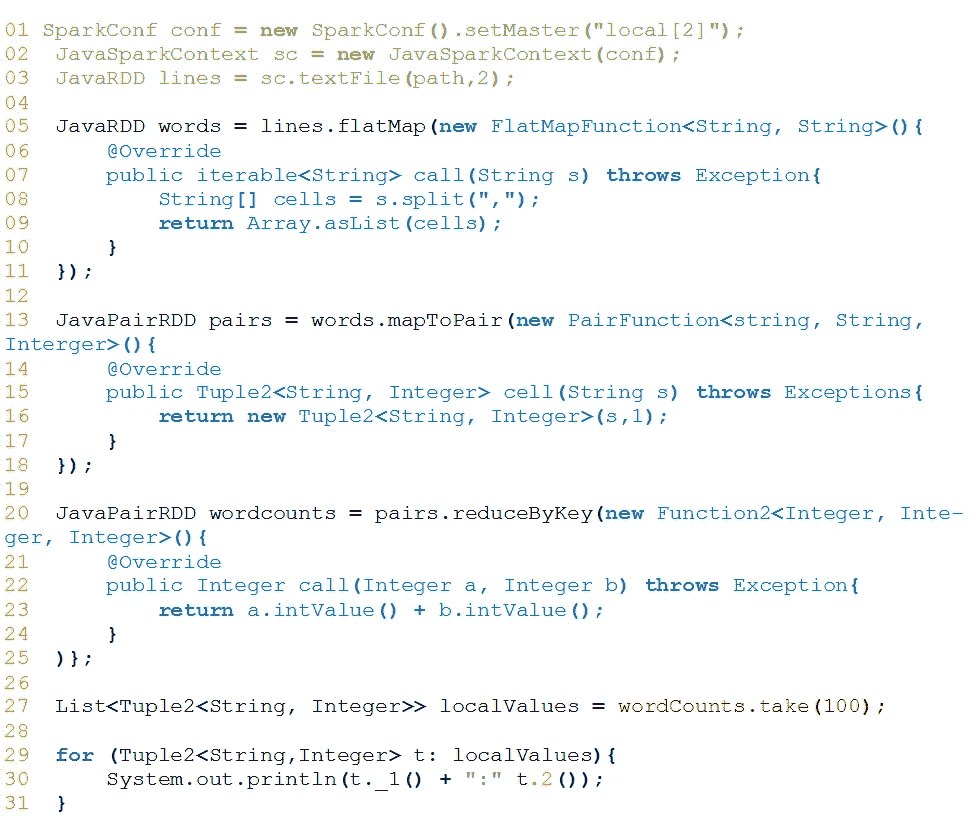

# Apache Spark 的 n00bs 指南

> 原文：<https://towardsdatascience.com/apache-spark-101-3f961c89b8c5?source=collection_archive---------1----------------------->

我写这篇指南是为了帮助我理解 Spark 的基本底层功能，它在 Hadoop 生态系统中的位置，以及它如何在 Java 和 Scala 中工作。我希望它能像帮助我一样帮助你。

# 什么是火花？

Spark 是一个通用计算引擎，在内存框架中。它允许您以脚本方式在各种语言中执行实时和批处理工作，具有强大的容错能力。你为什么要关心火花是什么？坦率地说，它解决了 Hadoop MapReduce 的许多缺点，比 Hadoop MapReduce 快 10 到 100 倍。 Spark 是数据科学的大事；使用 Spark 的一些著名组织有:亚马逊、NASA 喷气推进实验室、IBM 和日立。这篇文章的目标是给你一个关于 Spark 提供的功能，它的基本内部工作的快速概述，并让你对 Spark 有多棒有所了解。

# 激发大数据环境中的背景

Spark 被设计为与外部集群管理器或它自己的独立管理器一起工作。Spark 也依赖于分布式存储系统来运行，它从该系统中调用它想要使用的数据。支持以下系统:

## 集群管理器:

*   Spark 独立管理器
*   Hadoop 纱线
*   阿帕奇 Mesos

## 分布式存储系统:

*   Hadoop 分布式文件系统(HDFS)
*   MapR 文件系统(MapR-FS)
*   卡桑德拉
*   OpenStack Swift
*   亚马逊 S3
*   条纹羚

出于健康的原因，我将只关注 Hadoop 生态系统环境中的 Spark。

Spark Core 提供了一个平台，解决了 Hadoop MapReduce 的许多缺点，因为它允许我们不再需要将任务分解为小的 atom 作业，也不再需要与在分布式系统开发上构建解决方案的复杂性进行争论。

***赛门铁克注:*** 术语 *Hadoop* 可互换使用，指 *Hadoop 生态系统*或 *Hadoop MapReduce* 或 *Hadoop HDFS* 。在网上看到“Spark 取代 Hadoop”或“Spark 是新的 Hadoop”的说法是很常见的，然后倾向于相信他们的意思是 Spark 正在取代所有的 Hadoop 服务，但是！他们真正的意思是，Spark 正在许多用例中扮演 Hadoop MapReduce 功能的角色。

Spark Core 非常通用，在设计时就考虑到了 Hadoop 生态系统；它可以与 MapReduce 一起工作，或者为 PIG、HIVE 和 SEARCH 提供一个替代平台。参见图 1

## Spark Core 还带来了自己的一套有用的 API:

**Spark Streaming:** 管理来自各种来源的实时数据。它允许通过在实时流上实现 ML Lib 和 Graphx 来计算实时结果。

GraphX: 一个非常强大的处理图形并行计算的库。不要把这个和“Power Point graphs”混淆，这个库是关于数学中的一个领域，叫做图论和对象间成对关系的建模。

**ML Lib:** 在原生分布式环境中对大型数据集运行机器学习算法的库。与 Python 或 Matlab 中更强大的机器学习库相比，该库仍处于起步阶段。

**Spark SQL:** 允许使用 SQL 采石场来挖掘非关系分布式数据库。

Spark Steaming、GraphX、MLLib 和 Spark SQL 都将在适当的时候获得自己的文章，但与此同时，请不要犹豫，去查阅官方文档[【1】](http://spark.apache.org/docs/latest/streaming-programming-guide.html)[【2】](http://spark.apache.org/docs/latest/graphx-programming-guide.html)[【3】](http://spark.apache.org/docs/latest/ml-guide.html)[【4】](http://spark.apache.org/docs/latest/sql-programming-guide.html)。

# 什么会产生火花，火花？

在最高的抽象层次上，Spark 由三个组件组成，这三个组件使它成为唯一的 Spark；司机、执行者和 DAG。

# 司机和执行者

Spark 采用主从架构。驱动程序协调许多分布式工作器，以便以分布式方式执行任务，而资源管理器处理资源分配以完成任务。

## 驾驶员

把它想象成“管弦乐队”。驱动程序是主方法运行的地方。它将程序转换成任务，然后将任务调度给执行器。司机有三种不同的方式与执行者沟通；Broadcast、Take、DAG——这些稍后会详细说明。

## 执行者——“工人”

执行器在 JVM 实例中执行驱动程序委派的任务。执行器在 Spark 应用程序开始时启动，通常在应用程序的整个生命周期内运行。这种方法允许在应用程序的整个生命周期中，当不同的任务被载入和执行时，数据被持久化在内存中。

与此形成鲜明对比的是，Hadoop MapReduce 中的 JVM 工作环境会针对每个任务关闭和打开。其结果是，Hadoop 必须在每个任务的开始和结束时对磁盘执行读写操作。

## 驱动程序与执行器的通信

驱动程序可以通过几种方法与执行器通信。作为开发人员或数据科学家，了解不同类型的通信及其用例非常重要。

1.  广播动作:驱动程序将必要的数据传输给每个执行器。此操作最适用于一百万条记录以下的数据集，即+/-1gb 的数据。这项行动可能会成为一项非常昂贵的任务。
2.  采取行动:驱动程序从所有执行者那里获取数据。这个动作可能是非常昂贵和危险的动作，因为驱动程序可能耗尽存储器，并且网络可能变得不堪重负。
3.  DAG 动作:这是三个动作中花费最少的一个。它将控制流逻辑从驱动程序传输到执行器。

## 系统要求

Spark 比 Hadoop MapReduce 有相当大的性能增益，但它也有较高的操作成本，因为它在内存中操作，并需要高带宽网络环境(建议+10Gb/s)。建议 Spark 集群中的内存至少应与您需要处理的数据量一样大。如果没有足够的内存来完成一项任务，Spark 有几种方法可以将数据溢出到磁盘上。[了解更多硬件要求和建议。](https://spark.apache.org/docs/0.9.1/hardware-provisioning.html)

# 达格

DAG 是一个有向无环图，它概括了从 A 点到 b 点所需的一系列步骤。Hadoop MapReduce 与大多数其他计算引擎一样，独立于 DAG 工作。这些独立于 DAG 的计算引擎依赖于 HIVE 或 PIG 等脚本平台将作业链接在一起，以实现所需的结果。Spark 在比较中的强大之处在于它能够识别 DAG 并主动管理 DAG。这使得 Spark 能够优化作业流以获得最佳性能，并允许回滚和作业冗余功能。

请看图 3。我将通过讨论 DAG 的组件来详细说明它是如何工作的。

## 1)来源

数据源可以是 Spark 支持的任何数据源。其中包括:HDFS、关系数据库、CSV 文件等。稍后您将看到，我们在环境上下文设置中对此进行了定义。

## 2) RDD

弹性分布式数据集本质上是不能改变的数据集。这些实体存在于记忆中，并且本质上是不可改变的。由于这种不变性；在现有 RDD 上执行每次转换后，都会创建一个新的 RDD。这种设计的结果是冗余；如果在 DAGs 执行中的任何一点出现故障，则可以回滚到正常工作状态，并重新尝试失败的操作/转换。

原始形式的 rdd 没有模式，但是可以使用一种叫做 DataFrames 的东西来扩展。DataFrames 向其中包含的数据集添加模式功能；这在处理关系数据集时非常有用。

## 3)转型

转变把一个 RDD 变成了另一个 RDD。一些示例转换包括:

1.  地图
2.  reduceByKey
3.  GroupByKey
4.  JoinByKey
5.  SparkSQL

## 4)行动

动作是检索数据以回答问题的任何东西。一些例子是:数一数，各取所需。

执行 DAG
Spark 做了一件叫做懒惰评估的事情。DAG 本身是由转换构建的，但是在调用动作之前什么也不会发生。当一个动作被执行时，Spark 将查看 DAG，然后在它需要执行什么工作来达到它被要求做的动作步骤的上下文中优化它。当 DAG 最终被执行时，驱动程序向集群上的执行器发出转换命令。

# 阿帕奇水槽 API

Apache Flume 的开发理念是允许开发人员使用适用于非分布式编程的相同代码创建可以在分布式系统上运行的程序。换句话说，Apache Flume 允许我们编写可以在单线程和多线程机器上运行的代码，没有任何问题。Apache Flume 的含义是，我们现在可以在本地机器上运行代码并进行调试，同时确保它可以在我们的 Spark Hadoop 集群上运行。更进一步的含义是，您可以从集群中提取数据，并在本地机器上运行它，以进行测试和开发。

*支持以下语言:*

*   斯卡拉
*   Java 语言(一种计算机语言，尤用于创建网站)
*   计算机编程语言
*   稀有

为了演示 Spark 的一些内部工作方式，我将在 ScalaFlume 和 JavaFlume 中运行一个字数统计示例。

## 在 Scala 中

第 1 到 2 行初始化我们的 Spark 上下文并定义我们的源。在第 3 行，我们定义了初始 RDD。在第 4 到 6 行中，我们定义了我们的 RDD 的转换，并定义了一些新的 RDDS。注意第 7 行，没有代码被执行；只有我们的达格人建立起来了。在第 7 行，我们终于有了一个执行转换的动作。值得注意的是，分布在集群中的唯一工作是蓝色的，因为那些 lambda 表达式是由执行程序运行的转换！其他一切都在驱动程序上执行。

***Scala 宣传侧记:*** Scala 是一种构建在 JVM 编译器之上的令人惊叹的语言。它为具有 OOP 背景的开发人员提供了一个环境，使他们能够轻松地适应函数式编程思维，这是分布式计算编程的最佳选择。Scala 通过同时支持面向对象和函数式编程范例来做到这一点。你为什么要在乎？Spark 是使用 Scala 构建的，因此 Spark 中的最新特性将总是首先在 Scala 中实现。与其他语言相比，Scala 在处理大型数据集时也提供了最好的性能——举个例子:Scala 大约比 Python 快 10 到 225 倍，这取决于用例。Scala 也被数据科学和分布式计算领域的一些大公司使用，比如亚马逊和谷歌。我希望这段宣传已经说服了你，至少给 Scala 一个好奇的眼神。

## 在 JAVA 中

蓝色突出显示的代码是转换并构建 DAG。更重要的是，注意本质上每个转换都是一个对象，然后被发送到所有的分布式执行器。这也发生在 Scala 示例中，但是 lambda 表达式隐藏了这一层交互。在驱动程序执行第 27 行中的动作代码(用红色突出显示)之前，集群中的执行器不会执行转换对象。

# 结论

最后，我希望这篇文章能够帮助您理解 Spark 成为如此有趣和强大的数据科学和数据工程平台的基础。

这篇文章的要点应该是:

*   Spark Core 可以与 Hadoop MapReduce 并行工作，或者取代它。
*   Spark 比其他计算引擎快！火花速度来自于这样一个事实，即认知的 DAG，并可以优化它；它通过在整个作业中保持 JVM 状态，将数据保存在内存中，最终目标是最小化对磁盘的 I/O。
*   Spark 有一些很棒的数据科学和数据工程 API，用于机器学习、图论、数据流和 SQL。
*   Spark 中需要认知的主要组件是驱动程序和执行程序。这两个组件通过由 Spark 直接管理的 DAG 进行操作。有一种称为转换的东西，它构建 DAG 并从现有的 RDD 生成新的 RDD。RDD 是一个不可变的数据实体，它提供:借助 DAG 实现冗余和回滚功能。DAG 仅在动作被执行后才被执行。
*   Apache Flume 允许您在本地机器上用少数几种成熟的编程语言编写程序，用于开发和调试目的。同样的 Apache Flume 代码可以部署到一个分布式系统中，不需要任何修改。Scala 太棒了。

# 文献学

*   [面向 Java 和 Scala 开发人员的 Apache Spark 简介— Ted Malaska (Cloudera)](https://www.youtube.com/watch?v=x8xXXqvhZq8&t=1251s)
*   [什么是阿帕奇 Spark？](https://www.youtube.com/watch?v=SxAxAhn-BDU)
*   [官方文件](http://spark.apache.org/docs/latest/index.html)