# 应用深度学习-第 2 部分:真实世界案例研究

> 原文：<https://towardsdatascience.com/applied-deep-learning-part-2-real-world-case-studies-1bb4b142a585?source=collection_archive---------0----------------------->

# 概观

欢迎来到应用深度学习系列的第 2 部分。第 1 部分是对人工神经网络的实际介绍，包括理论和应用，有很多代码示例和可视化。现在是最酷的部分，深度学习对真实世界数据集的端到端应用。我们将涵盖 3 个最常见的问题作为案例研究:二元分类，多类分类和回归。

1.  [案例分析:二元分类](#581e) 1.1)数据可视化&预处理
    1.2) Logistic 回归模型
    1.3) ANN 模型
    1.4)深层 ANN 可视化
2.  [案例分析:多类分类](#3b7d) 2.1)数据可视化&预处理
    2.2) Softmax 回归模型
    2.3) ANN 模型
    2.4)交叉验证
3.  [案例分析:回归](#cf02) 3.1)数据可视化&预处理
    3.2)线性回归模型
    3.3) ANN 模型
4.  [结论](#af92)

这篇文章的代码可以从[这里得到](https://github.com/ardendertat/Applied-Deep-Learning-with-Keras/blob/master/notebooks/Part%202%20-%20Case%20Studies.ipynb)作为一个 Jupyter 笔记本，你可以随意下载并亲自试用。

# 1.案例研究:二元分类

我们将在 Kaggle 上使用人力资源分析数据集。我们试图根据各种特征来预测员工是否会离开，例如他们参与的项目数量、在公司呆的时间、上次绩效评估、工资等。数据集大约有 15，000 行和 9 列。我们试图预测的列称为“左”。这是一个具有 0/1 值的二进制列。标签 1 表示该员工已经离职。

## 1.1)数据可视化和预处理

首先，让我们在直接构建模型之前执行一些数据可视化和预处理。这一部分是至关重要的，因为我们需要知道我们正在处理什么类型的特性。对于每个 ML 任务，我们至少需要回答以下问题:

*   我们有什么类型的特征:实值的，分类的，还是两者都有？
*   是否有任何功能需要规范化？
*   我们有空值吗？
*   标签分布是怎样的，阶层不平衡吗？
*   特征之间有关联吗？

朱庇特笔记本包含了详细的分析。综上所述，既有真实特征，也有分类特征。没有空值，但有些要素需要规范化。76%的例子被标为 0，意味着员工没有离开。

让我们检查特征与标签的相关性(名为“left”的列)。我们将使用 *seaborn* 包来绘制相关图。

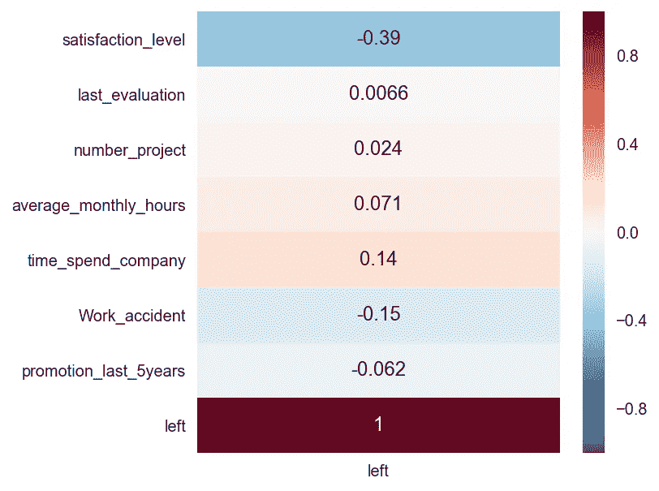

在该图中，正值表示与标签的相关性，负值表示与标签的反向相关性。当然“左”和它本身有很好的相关性，你可以忽略它。除此之外，只有一个特征有很强的信号，那就是“满意度”,与员工是否已经离职成反比。这很有道理。

现在，让我们来看看所有特性之间的成对相关性。

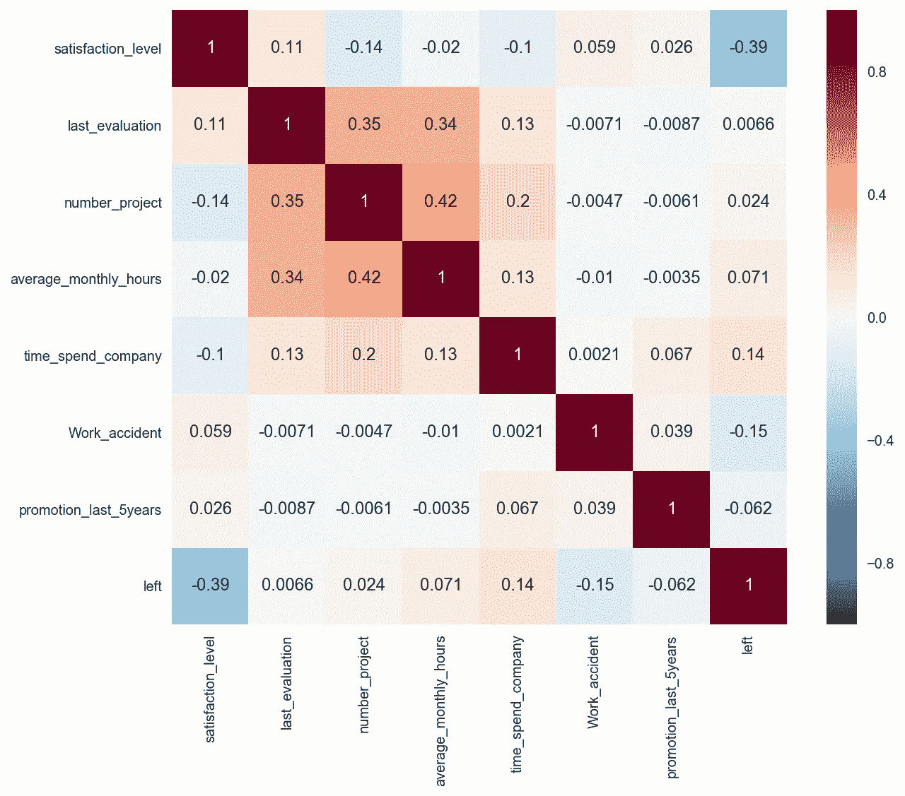

我们看到“平均 _ 月 _ 小时”与“数字 _ 项目”正相关，这也是有道理的。一个人参与的项目越多，需要投入的工作时间就越多。

现在我们来看看特征值的分布。通过检查特征的直方图，我们可以看到哪些特征需要归一化。这背后的动机是什么？规范化是什么意思，为什么需要规范化？如果实值特征被缩放到预定义的范围内，例如[0，1]，大多数 ML 算法执行得更好。这对深度神经网络尤为重要。如果输入特征由大值组成，深度网络真的很难学习。原因在于，随着数据流经各层，伴随着所有的乘法和加法运算，数据会很快变大，这会使非线性饱和，从而对优化过程产生负面影响。我们将在另一篇文章中看到这方面的详细演示，因为现在我们需要注意特征值是小数字。

查看特征直方图，我们需要对其中的 3 个特征进行归一化:average_monthly_hours、number_project 和 time_spend_company。所有其他特征都在[0，1]内，所以我们可以不去管它们。

Scikit-learn 有几种归一化方法，我们将使用的是*标准缩放器*。它单独缩放要素，使其具有零均值和单位方差，因此它们都属于标准的*正态(0，1)* 分布。请注意，这不会改变特征值的顺序，只是改变了比例。这是一个简单却极其重要的技巧。

我们加载的数据在一个*熊猫数据帧中。Pandas 是一个非常流行的处理表格数据的软件包，尤其是在像 jupyter 笔记本这样的交互式环境中。DataFrame 是 pandas 最常用的数据结构，它充当了我们数据的容器，并公开了几个内置函数，使我们的生活更加轻松(查看笔记本了解更多详细信息)。在下面的代码片段中，df 是我们数据的数据帧。*

Scikit-learn API 设计得非常好，包含 4 个非常常用的方法。预测器是像逻辑回归这样的 ML 模型，转换器是像标准定标器这样的数据操纵器。

*   *fit* : For 预测器对给定输入进行训练。For transformers 计算统计数据，如稍后要使用的输入的平均值和标准偏差。
*   *transform*:For transformers 使用 fit 函数学习到的统计数据处理输入数据。我们在 fit 之后运行 transform 方法，因为存在依赖关系。预测者不支持这种方法。
*   *fit_transform* :在一次调用中高效地执行 fit + transform。对于转换器，计算输入的统计信息并执行转换。这是变压器常用的方法。对于预测器，训练模型并对给定输入执行预测。
*   *预测:*顾名思义，for predictors 使用用 fit 方法训练的模型来执行预测任务。非常常用于预测。变形金刚不支持这种方法。

既然我们已经将实值特征调整到了理想的范围内，那么让我们来处理分类特征。我们需要将分类数据转换成*独热*表示。例如，薪金列包含 3 个唯一的字符串值:低、中、高。一键转换后，我们将有 3 个新的二进制列:薪水 _ 低，薪水 _ 中和薪水 _ 高。对于给定的示例，它们中只有一个具有值 1，其他的都是 0。然后我们将删除原来的薪水栏，因为我们不再需要它了。

一键转换由熊猫的 *get_dummies* 执行。我们也可以在 scikit-learn 中使用*onehotencode*，它们都可以完成工作。因为我们的数据已经在熊猫的数据框架中，所以得到虚拟模型更容易。它还自动执行特征的重命名。

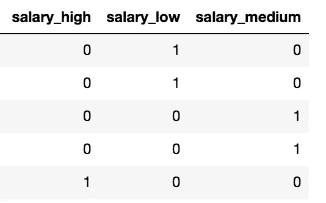

现在是创建训练和测试数据的最后一部分。该模型将在训练集上执行学习，并在保留的测试集上进行评估。Scikit-learn 有一个方便的 *train_test_split* 函数。我们只需要指定测试集的一部分，在我们的例子中是 30%。但是首先我们使用数据帧的 *values* 属性将数据从 pandas 数据帧转换为 numpy 数组。

## 1.2)逻辑回归模型

既然我们已经完成了数据预处理和训练/测试集生成，那么有趣的部分来了，训练模型。我们首先从一个简单的模型开始，逻辑回归(LR)。然后，我们将训练深度人工神经网络，并将结果与 LR 进行比较。

看完第一篇文章，构建模型应该很熟悉了。

我们得到了 79%的训练准确率。这实际上很糟糕，因为上面我们看到 76%的标签是 0。所以不管输入是什么，最简单的分类器总是输出 0，它能得到 76%的准确率，我们也没有比这更好的了。这意味着我们的数据不是线性可分的，就像我们在第一篇文章中看到的例子一样，我们需要一个更复杂的模型。

上图描述了训练损失和准确性。但更重要的是，我们对测试集的指标感兴趣。训练集中的度量标准可能会产生误导，因为模型已经在其上进行了训练，我们希望检查模型在保留的测试集上的表现。测试准确率为 78%，略低于训练准确率。ML 模型的测试精度几乎总是低于训练精度，因为在训练过程中测试数据对模型是不可见的。查看分类报告，我们看到属于类别 1 的示例中只有 60%被正确分类。相当糟糕的表现。混淆矩阵显示了许多错误分类的例子，看起来也不乐观。

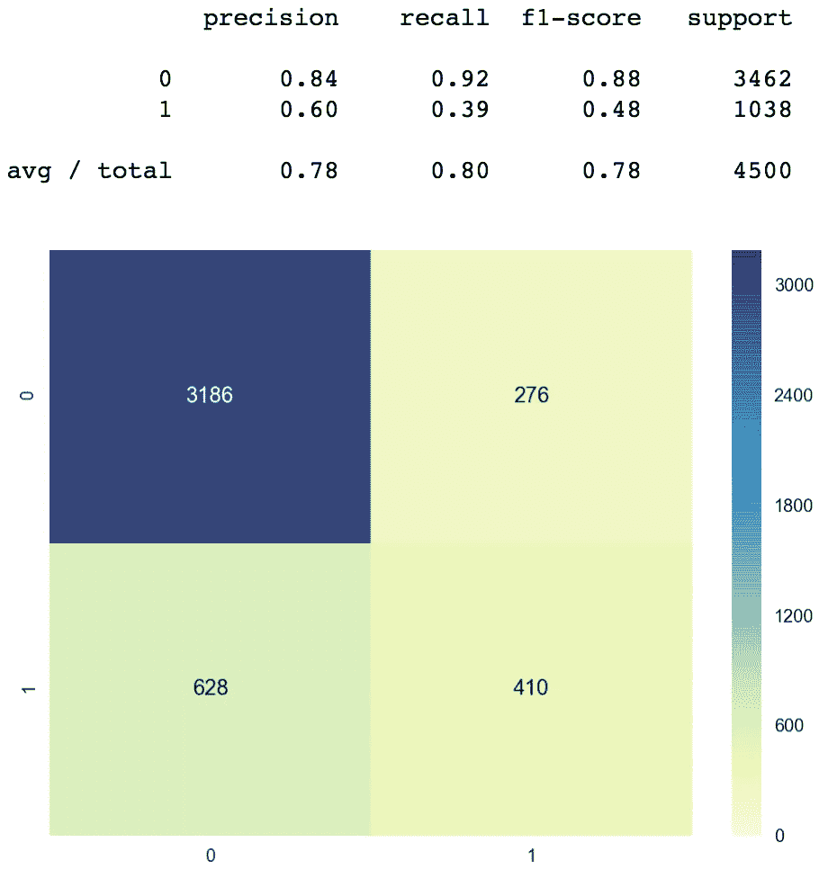

## 1.3)人工神经网络模型

现在让我们建立一个深度神经网络进行二分类。这个模型将更加强大，能够模拟非线性关系。

模型构建过程也是非常熟悉的。我们有 2 个 64 和 16 节点的隐藏层，带有双曲正切函数。输出层使用 sigmoid 激活，因为这是一个二元分类问题。我们使用 Adam 优化器，学习率设置为 0.01。

这次我们达到了 97.7%的训练准确率，相当不错。

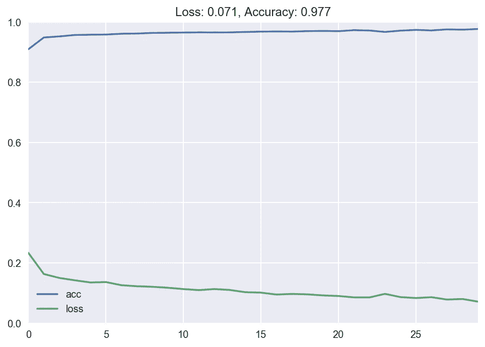

让我们比较一下 LR 和 ANN 模型。人工神经网络模型更优越，具有更低的损耗和更高的精度。

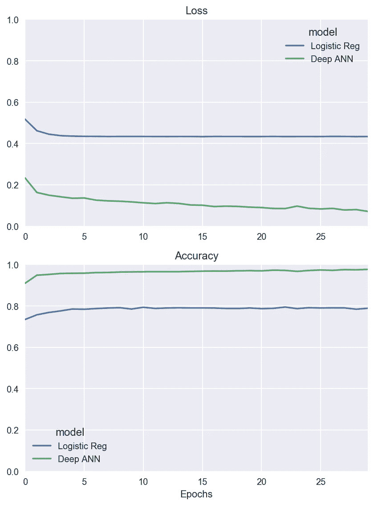

为了完整起见，这是测试集上人工神经网络模型的分类报告和混淆矩阵。与 LR 模型的 78%相比，我们实现了 97%的准确率。我们仍然对 4500 个例子中的 147 个进行了错误分类。

我们可以通过以下方法进一步提高人工神经网络的性能:

*   为模型定型更长时间(增加历元数)。
*   超参数调优:改变学习率，使用不同于 Adam 的优化器(比如 RMSprop)，使用不同于 tanh 的另一个激活函数(可以是 relu)。
*   增加每层的节点数量:我们可以增加到 128–64–1，而不是 64–16–1。
*   增加层数:我们可以做 128–64–32–16–1 层。

不过，一个重要的警告是，随着我们使模型更强大，训练损失可能会减少，准确性会增加。但是我们会遇到过度拟合的风险。这意味着与简单模型相比，复杂模型在测试集上的表现更差，即使复杂模型的训练指标更好。我们将在另一篇文章中更多地讨论过度拟合，但记住这一点非常重要。这就是为什么我们不会为层数和每层节点数而疯狂。完成工作的最简单的模型就足够了。

## 1.4)深层人工神经网络的可视化

在上一篇文章中，我们了解到人工神经网络的每一层都执行输入从一个向量空间到另一个向量空间的非线性转换。通过这样做，我们将输入数据投射到一个新的空间，在这个空间中，类可以通过一个复杂的决策边界相互分离。

让我们直观地演示一下。我们在上面做的初始数据预处理之后的输入数据是 20 维的。为了形象化，让我们把它投射到 2D。请记住，一个层中有 k 个节点意味着该层转换其输入，从而输出是一个 k 维向量。我们上面训练的 ANN 有两个隐藏层，分别是 64 和 16 个节点。然后，我们需要一个有两个节点的新层，以便将我们的数据投影到 2D 空间。因此，我们在输出节点之前添加了这个新层。其余的完全没动过。

这是我们的输入数据从 20D 到 2D 空间的投影结果。决策边界对应于 ANN 的最后一层。人工神经网络能够很好地区分这些类别，尽管有一些分类错误。在 2D，许多数据点重叠，因此我们无法看到所有数据点，作为参考，该模型在 4500 个数据点中错误分类了约 160 个点(96%的准确率)。我们不关心这个模型的准确性，我们感兴趣的是高维输入到 2D 的投影。这是一个巧妙的小技巧，直观地展示了人工神经网络执行的投影的结果。

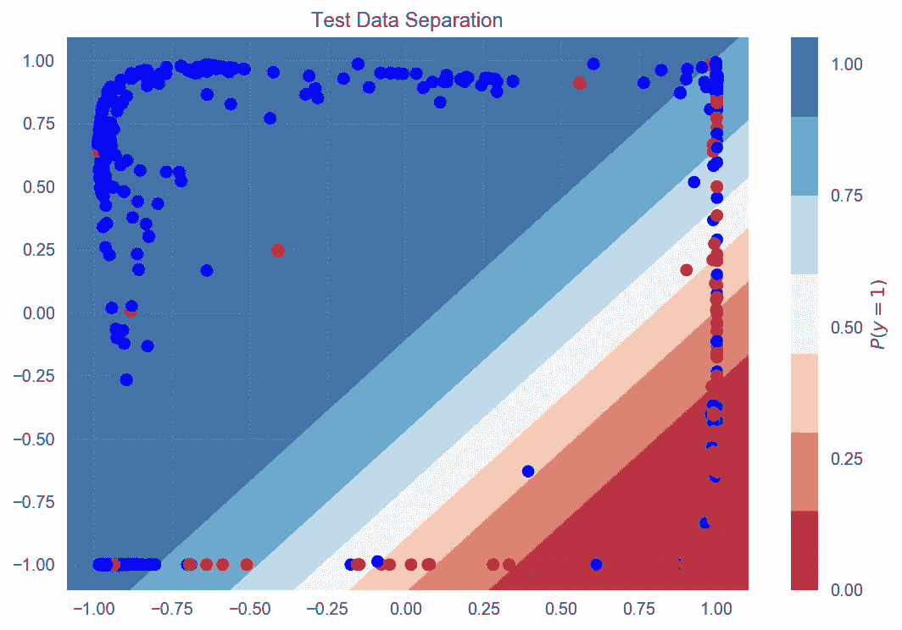

一种更有原则的可视化方法是使用 *t-SNE* ，这是一种用于可视化高维数据的降维技术。详情请点击[这里](https://lvdmaaten.github.io/tsne/)。

# 2.案例研究:多类分类

我们现在将在著名的[虹膜数据集](https://archive.ics.uci.edu/ml/datasets/iris)上执行多类分类。它包含 3 类花，每类 50 个例子。总共有 4 个功能。所以它很小，但是很受欢迎。数据如下所示。

## 2.1)数据可视化和预处理

这部分现在更容易了，因为我们只有 4 个实值特征。同样，我们将特征归一化到[0，1]之间。特征值很小，我们可以不进行任何规范化，但是这样做是一个好习惯，而且这样做也没有坏处。

如果我们有少量的特征，Pairplot 是一个很酷的可视化技术。我们可以看到按类(数据集中的“标签”列)着色的要素的成对分布。我们使用 *seaborn* 包，对于一个信息丰富的情节来说非常简单。

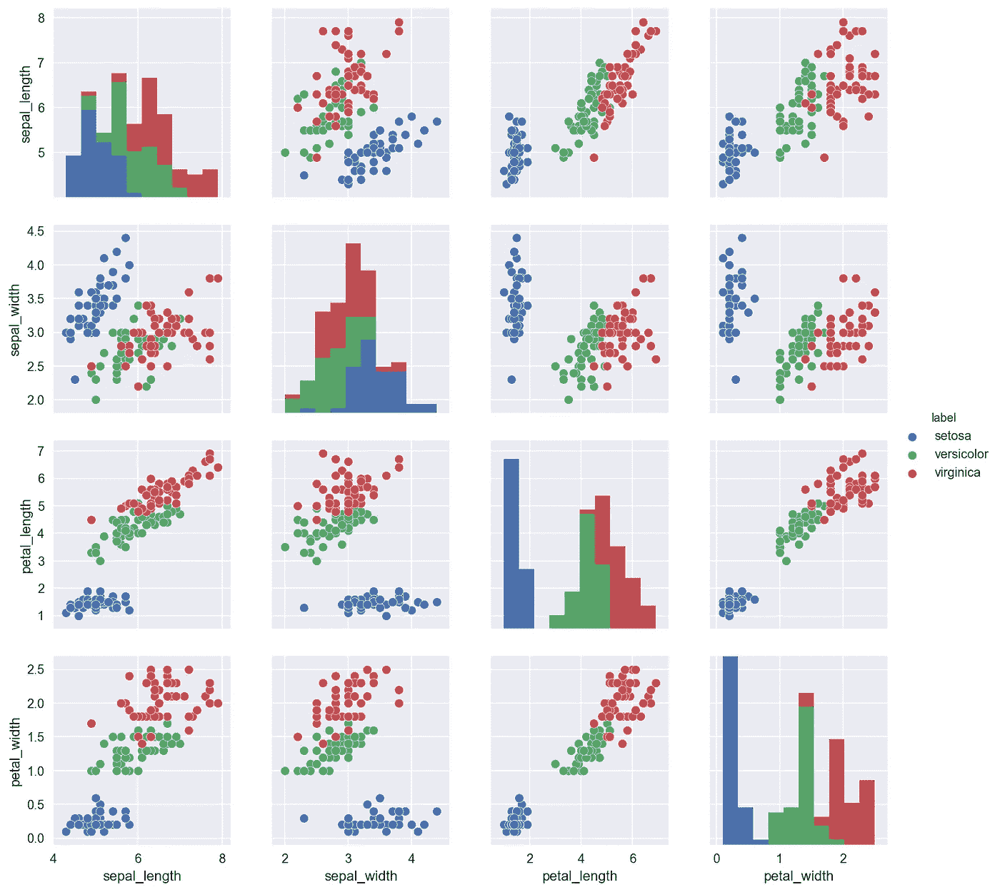

我们可以看到“setosa”类很容易分开，但“versicolor”和“virginica”更容易混合。

## 2.2) Softmax 回归模型

我们现在将训练 Softmax 回归(SR)模型来预测标签。前一篇文章包含了详细的解释，构建模型也与上面非常相似。主要区别在于，我们使用 *softmax* 激活和*分类 _ 交叉熵*作为损失。

SR 模型已经达到了 97%的训练准确率和最小的损失，已经很不错了。

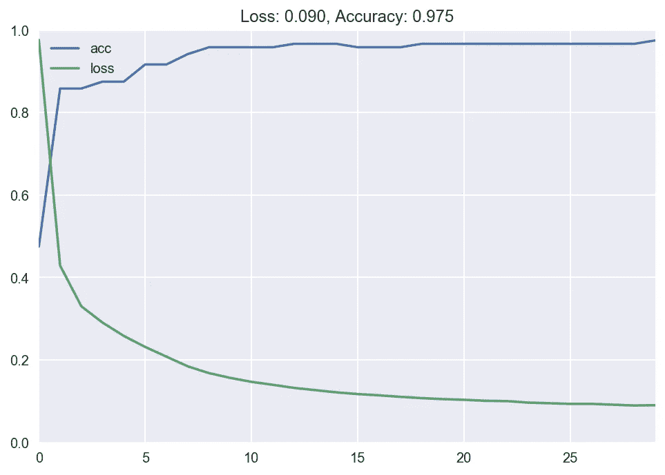

## 2.3)人工神经网络模型

现在让我们建立我们的人工神经网络模型。我们添加 2 个隐藏层，分别有 32 个和 16 个节点。注意我们也改变了这些层的激活函数为 *relu* 而不是 tanh。我们将在另一个教程中探讨各种激活函数及其差异，但 relu 可以说是最受欢迎的一个。那为什么我们没有使用它？嗯，只是因为 tanh 激活后决策边界图看起来更漂亮。说真的，没别的原因。

这次我们获得了 100%的训练准确率。

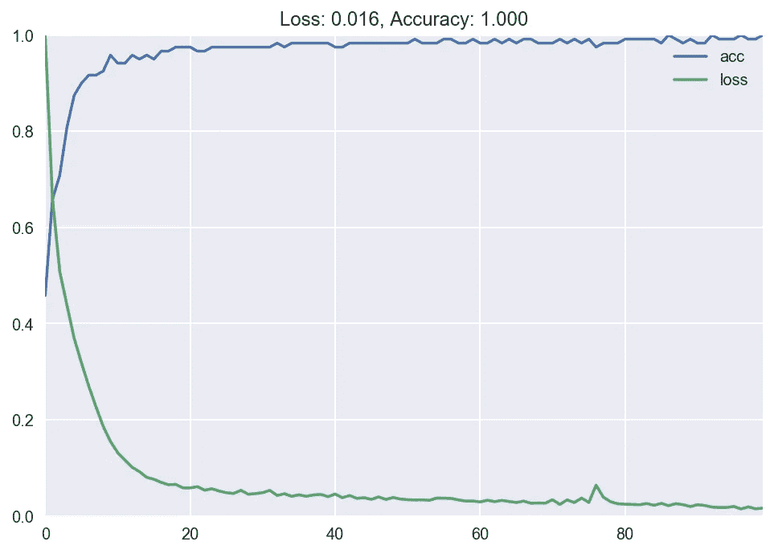

另外，随机共振和人工神经网络模型的测试准确率都是 100%。这是一个非常小的数据集，所以这些结果并不奇怪。不是所有的问题都需要深度神经网络才能得到好的结果。对于这个问题来说，这可能有点过了，因为线性模型也能很好地工作。

## 2.4)交叉验证

对于像我们目前这样的小样本情况，进行交叉验证以获得更好的准确性估计尤为重要。通过 *k 折交叉验证*，我们将数据集分成 k 个不相交的部分，使用 k-1 个部分进行训练，另一个部分进行测试。这样，每个例子都会出现在训练集和测试集中。然后，我们对所有 k 次运行中的模型性能进行平均，并获得模型准确性的更好的低方差估计。

通常在训练深度学习模型时，我们不会执行 k-fold 交叉验证。因为训练需要很长时间，而且从头开始训练模型 k 次是不可行的。但由于我们的数据集很小，所以它是一个很好的候选对象。

这是两个模型的 5 倍交叉验证准确度的曲线图。深度模型表现稍好，具有更高的准确性和更低的方差。在图中，精度有时似乎超过 100%，但这是平滑曲线的人工产物。我们得到的最大准确度是 100%。

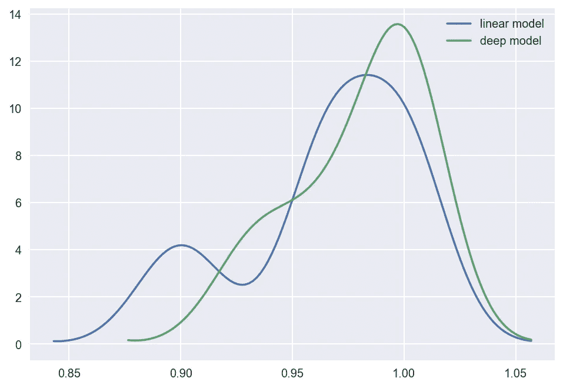

# 3.案例研究:回归

我们现在将研究一个回归问题，预测一个实值输出而不是离散的类成员。我们将使用华盛顿州卡格尔市金县的[房屋销售数据集](https://www.kaggle.com/harlfoxem/housesalesprediction)。大约有 21，000 行 20 个特征。我们试图预测的值是一个标记为“价格”的浮点数。

## 3.1)数据可视化和预处理

首先让我们看看特性分布

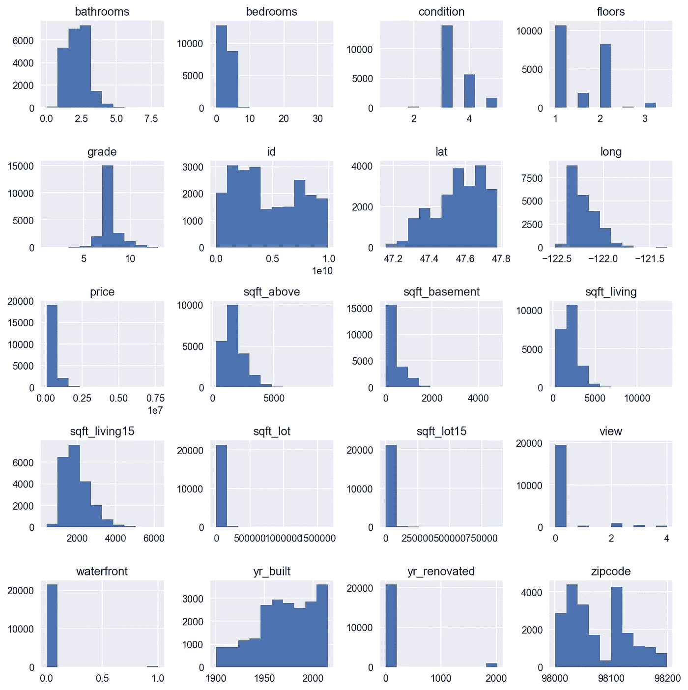

现在你知道该怎么做了，我们需要做特征标准化和分类。例如，与 squarefoot 相关的要素肯定需要进行规范化，因为值的范围以千计，并且像 zipcode 这样的要素需要进行分类。

我们还需要做一种新的预处理， *bucketization* 。例如，包含房屋建造年份(yr _ built)的要素的范围从 1900 年到 2015 年。我们当然可以把它分类，每一年都属于一个不同的类别，但这样的话，它会相当稀疏。如果我们在不丢失太多信息的情况下取消这个特性，我们会得到更多的信号。例如，如果我们使用 10 年时段，则[1950，1959]之间的年份将折叠在一起。知道这栋房子建于 20 世纪 50 年代而不是 1958 年就足够了。

受益于分桶的其他特征是房屋的纬度和经度。确切的坐标没那么重要，我们可以把坐标四舍五入到最近的公里。这样，特征值将更加密集和信息丰富。在存储桶化中使用哪个范围没有硬性规定，它们主要是通过反复试验来决定的。

我们需要做的最后一个转换是关于房子的价格，我们试图预测的价值。目前，它的价值在 7.5 万美元到 770 万美元之间。试图在如此大的规模和变化范围内进行预测的模型将非常不稳定。所以我们也把它标准化了。有关详细信息，请随时查看代码。

在所有的转换之后，我们从 20 个特性增加到 165 个。让我们检查一下每个特性与价格的相关性。

最相关的特征是平方英尺，这是意料之中的，越大的房子通常越贵。看看这个列表，这些特性是有意义的。一些邮政编码与价格高度相关，例如 98039 对应于麦地那，那是比尔盖茨居住的地方，也是美国最昂贵的社区之一。还有另一个邮政编码 98004，它与贝尔维尤更相关。那里有许多高层建筑和技术办公室，这使得价格最近大幅上涨。我以前住在那个街区，但后来它变得太无聊和昂贵，所以我搬家了:)

## 3.2)线性回归模型

这是我们第一次建立回归模型。就像逻辑回归是我们在分类问题中首先尝试的最简单的模型一样，线性回归是我们在回归问题中开始的模型。

记住逻辑回归的方程式是 *y=f(xW)* 其中 *f* 是 sigmoid 函数。线性回归简单地说就是 *y=xW，*没有激活函数。为了简单起见，我再次省略了偏差项。随着偏差的增加，它们分别变为 *y=f(xW+b)* 和 *y=xW+b* 。

这里提醒一下我们如何建立逻辑回归(LR)模型

这是线性回归模型(LinR)的代码

有 3 个主要区别:

*   LR 使用 sigmoid 激活函数，而 LinR 没有激活。
*   LR 使用 binary_crossentropy 损失函数，LinR 使用 mean_squared_error。
*   LR 也报告精度，但是精度不是回归问题的适用度量，因为输出是浮点数而不是类成员。

最重要的变化是损失函数*均方误差* (MSE)。MSE 是用于回归的标准损失函数。公式很简单:

其中 *y* 为真值， *ŷ* 为预测值， *n* 为样本数。

我们还向 fit 函数传递了一个新的 *validation_split* 参数。它指定了在训练过程中用作保留验证集的训练数据部分，在我们的例子中是 20%。使用验证集，我们可以看到我们是否在训练中过度适应。但是不要混淆验证集和测试集。测试集是完全独立的，在训练过程中根本不会暴露给模型。

损失在最初几个时期减少，然后稳定下来。我们可能*配置不足*意味着我们的型号没有足够的容量，我们需要一个更复杂的型号。

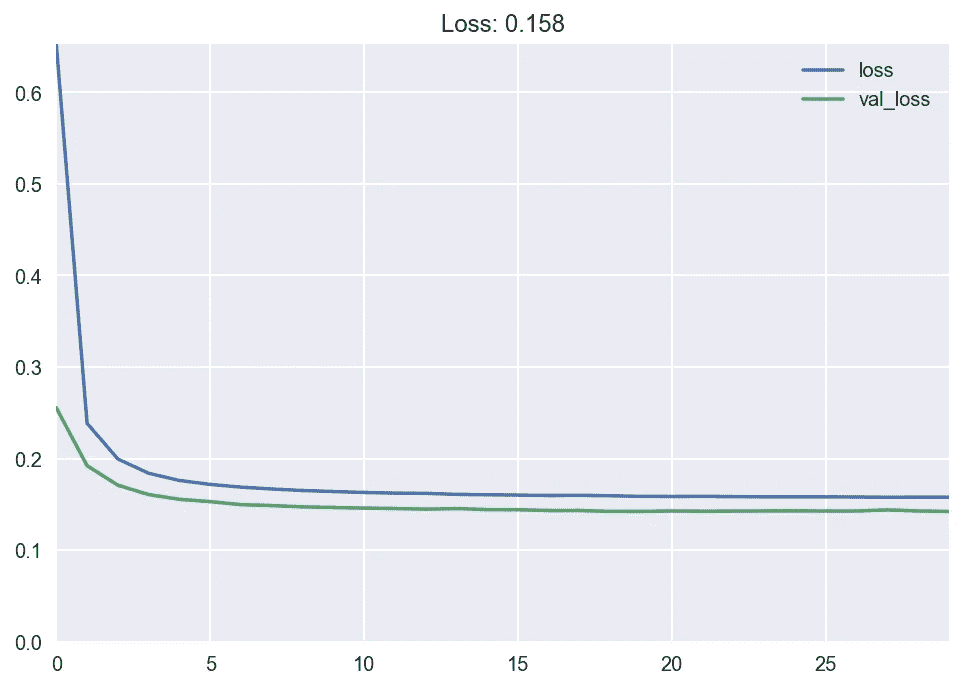

这些是权重最高的前 10 个特征。分类邮政编码特征占主导地位。

## 3.3)人工神经网络模型

最后，让我们为回归建立一个人工神经网络。在前面的例子中，从线性模型到深度模型只涉及添加具有非线性激活函数的新层。这次也一样。

我们添加了 relu 激活的新层。损失图现在看起来很有趣。训练误差损失似乎仍在减少，但是验证误差在第 5 个时期之后开始增加。我们显然*过度适应*。人工神经网络正在记忆训练数据，这降低了它对验证集进行归纳的能力。

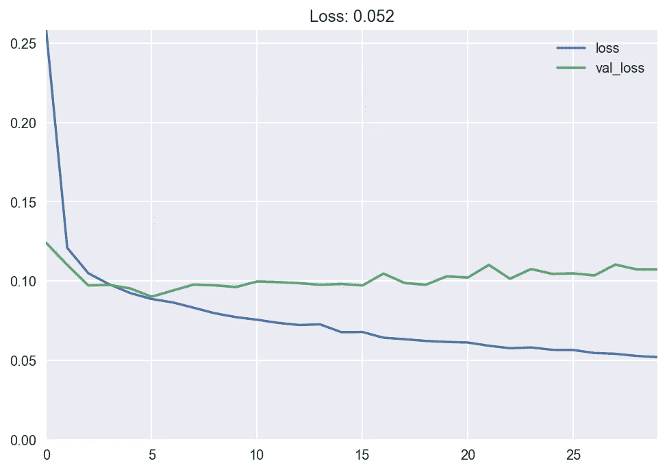

解决办法？有几种方法可以解决深度神经网络中的过拟合问题。大多数方法依赖于约束模型的容量。这可以通过例如限制重量、分享重量或者甚至在训练损耗达到稳定水平之前停止训练来实现。为了简洁起见，我们将使用最后一个，其余的将在另一篇文章中讨论。这意味着一旦确认损失停止改善，我们将简单地停止训练。这叫做*提前停止*，用 Keras 很容易实现。我们只需要修改对 fit 函数的调用，如下所示。如果两个时期的确认损失没有改善，我们停止训练。

验证损失在第 5 个时期停止改善，模型再等待 2 个时期，并在第 7 个时期完成训练。

LinR 模型的训练损失是 0.158，ANN 的损失是 0.086。我们比线性模型提高了 83%，相当不错。并且比较在测试集上的损失，LinR 模型得到 0.191，相比于 ANN 的 0.127，提高了 32%。下图比较了 LinR 与 ANN 的训练损失。

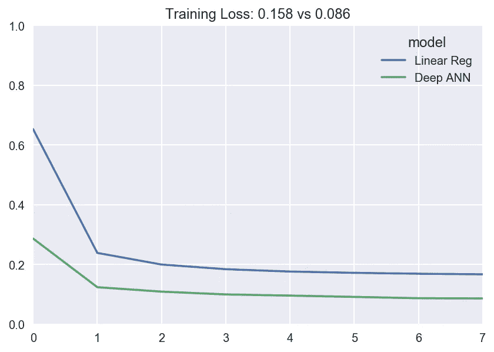

让我们做一个最后的比较，模型预测价格和实际价格之间的美元价值差异。最天真的模型总是预测训练集的平均价格(540，000 美元)，在测试集上相差 229，000 美元，非常糟糕。线性回归模型的误差为 87K，而深度人工神经网络的误差为 68K。人工神经网络比线性神经网络好 21%。

# 4)结论

我希望这是一篇信息丰富的文章。我试图用现实生活中的数据集演示深度学习在 3 个常见机器学习问题上的一步一步的应用。

详细讨论了数据预处理和可视化。尽管它们不是解决一个 ML 问题的有趣部分，并且经常被忽视，但是它们是极其重要的。就像第 1 部分一样，我们首先用一个简单的模型解决问题，然后使用深度神经网络来获得更好的结果。

如果你想自己动手，这篇文章的全部代码可以在这里找到。如果你有任何反馈，请随时通过[推特](https://twitter.com/ardendertat)联系我。