# 应用深度学习-第 4 部分:卷积神经网络

> 原文：<https://towardsdatascience.com/applied-deep-learning-part-4-convolutional-neural-networks-584bc134c1e2?source=collection_archive---------0----------------------->

# 概观

欢迎来到应用深度学习系列的第 4 部分。第 1 部分是对人工神经网络的实际介绍，包括理论和应用，有很多代码示例和可视化。在[第二部分](https://medium.com/towards-data-science/applied-deep-learning-part-2-real-world-case-studies-1bb4b142a585)中，我们将深度学习应用于真实世界的数据集，涵盖了 3 个最常见的问题作为案例研究:二分类、多类分类和回归。[第三部分](https://medium.com/towards-data-science/applied-deep-learning-part-3-autoencoders-1c083af4d798)探索了一种特定的深度学习架构:自动编码器。

现在我们将讨论最流行的深度学习模型:卷积神经网络。

1.  [简介](#a86a)
2.  [建筑](#7d8a)
3.  [直觉](#9a7a)
4.  [实施](#5777)
5.  [VGG 模式](#e865)
6.  [可视化](#9722)
7.  [结论](#5c12)
8.  [参考文献](#8efa)

这篇文章的代码可以在[这里获得](https://github.com/ardendertat/Applied-Deep-Learning-with-Keras/blob/master/notebooks/Part%204%20(GPU)%20-%20Convolutional%20Neural%20Networks.ipynb)作为一个 Jupyter 笔记本，请随意下载并亲自试用。

# 1.介绍

卷积神经网络(CNN)无处不在。它可以说是最流行的深度学习架构。最近对深度学习的兴趣激增是由于 convnets 的巨大普及和有效性。人们对 CNN 的兴趣始于 2012 年的 AlexNet，此后一直呈指数级增长。仅仅三年时间，研究人员就从 8 层 AlexNet 发展到了 152 层 ResNet。

CNN 现在是所有与图像相关问题的首选模式。就准确性而言，他们将竞争对手打得落花流水。它还成功地应用于推荐系统、自然语言处理等等。与它的前辈相比，CNN 的主要优势在于它自动检测重要特征，而无需任何人工监督。例如，给定许多猫和狗的图片，它自己学习每一类的不同特征。

CNN 的计算效率也很高。它使用特殊的卷积和池操作，并执行参数共享。这使得 CNN 模型可以在任何设备上运行，使它们具有普遍的吸引力。

总之，这听起来像是纯粹的魔术。我们正在处理一个非常强大和有效的模型，该模型执行自动特征提取以实现超人的准确性(是的，CNN 模型现在比人类更好地进行图像分类)。希望这篇文章能帮助我们揭开这项非凡技术的秘密。

# 2.体系结构

所有 CNN 模型都遵循类似的架构，如下图所示。

我们正在处理一个输入图像。我们执行一系列卷积+池操作，然后是一些完全连接的层。如果我们执行多类分类，输出是 softmax。我们现在将深入研究每个组件。

## 2.1)卷积

CNN 的主要构件是卷积层。卷积是一种合并两组信息的数学运算。在我们的例子中，使用*卷积滤波器*将卷积应用于输入数据，以产生*特征图*。使用了很多术语，所以让我们一个一个地形象化它们。

左侧是卷积层的输入，例如输入图像。右边是卷积*滤波器*，也称为*内核*，我们将互换使用这些术语。由于滤波器的形状，这被称为 *3x3 卷积*。

我们通过在输入上滑动该滤波器来执行卷积运算。在每个位置，我们做逐元素矩阵乘法，并将结果相加。这个总和进入特征图。发生卷积运算的绿色区域被称为*感受野*。由于滤光器的大小，感受野也是 3×3。

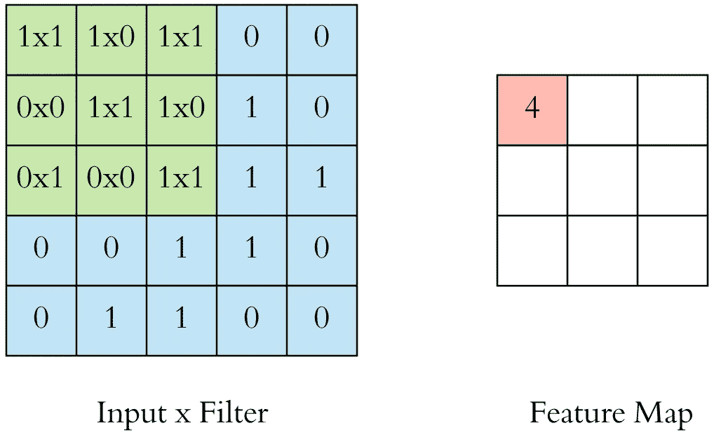

这里，过滤器位于左上角，卷积运算“4”的输出显示在生成的特征图中。然后，我们向右滑动过滤器，执行相同的操作，将结果添加到特征映射中。

我们继续这样做，并在特征图中聚集卷积结果。下面的动画展示了整个卷积运算。

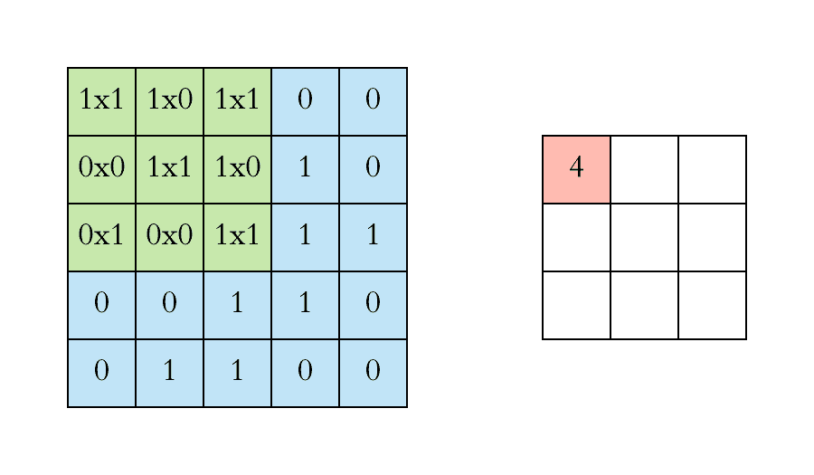

这是 2D 使用 3×3 滤波器显示的卷积运算的一个例子。但实际上这些卷积是在 3D 中进行的。实际上，图像被表示为具有高度、宽度和深度维度的 3D 矩阵，其中深度对应于颜色通道(RGB)。卷积滤波器具有特定的高度和宽度，如 3x3 或 5x5，并且根据设计，它覆盖其输入的整个深度，因此它也需要是 3D 的。

在我们想象实际的卷积运算之前，还有一点很重要。我们对一个输入执行多次卷积，每次使用不同的过滤器，产生不同的特征图。然后，我们将所有这些特征图堆叠在一起，这就成为卷积层的最终输出。但首先让我们从简单开始，用一个滤波器来想象一个卷积。

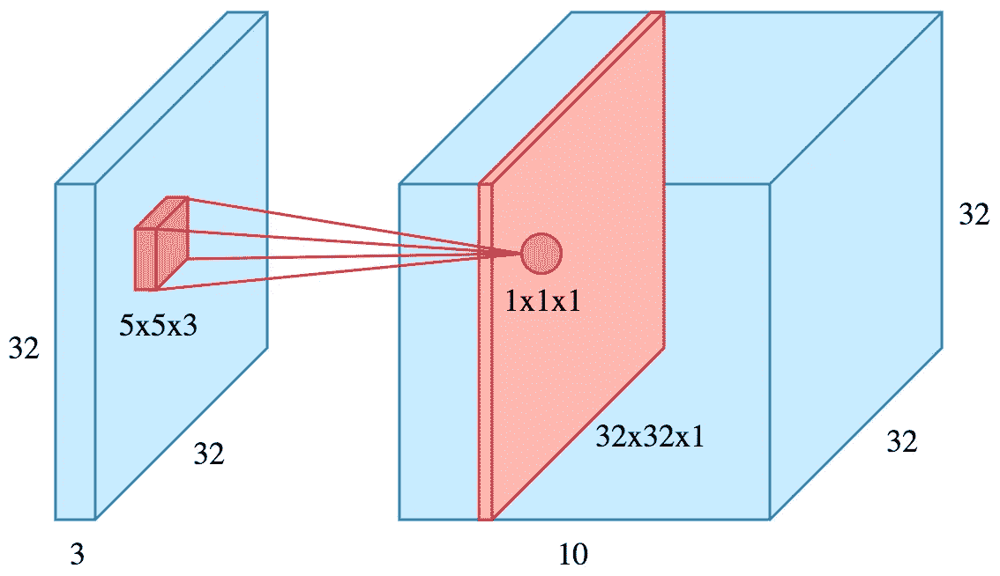

假设我们有一个 32x32x3 的图像，我们使用大小为 5x5x3 的滤镜(请注意，卷积滤镜的深度与图像的深度匹配，都是 3)。当滤波器位于特定位置时，它覆盖一小部分输入，我们执行上述卷积运算。唯一的区别是这次我们在 3D 中做矩阵乘法的和，而不是 2D，但是结果仍然是标量。我们像上面一样在输入上滑动过滤器，并在每个位置执行卷积，将结果聚集在特征图中。该特征地图的大小为 32x32x1，如右边的红色切片所示。

如果我们使用 10 个不同的过滤器，我们将有 10 个大小为 32x32x1 的特征图，并将它们沿深度方向堆叠将得到卷积层的最终输出:大小为 32x32x10 的体积，如右侧的蓝色大框所示。请注意，特征图的高度和宽度没有改变，仍然是 32，这是由于填充造成的，我们稍后将对此进行详细说明。

为了有助于可视化，我们在输入上滑动过滤器，如下所示。在每个位置，我们得到一个标量，并在特征图中收集它们。动画显示了 4 个位置的滑动操作，但实际上是在整个输入中执行的。

下面我们可以看到两个特征图是如何沿着深度方向堆叠的。每个滤波器的卷积操作是独立执行的，并且所得到的特征图是不相交的。

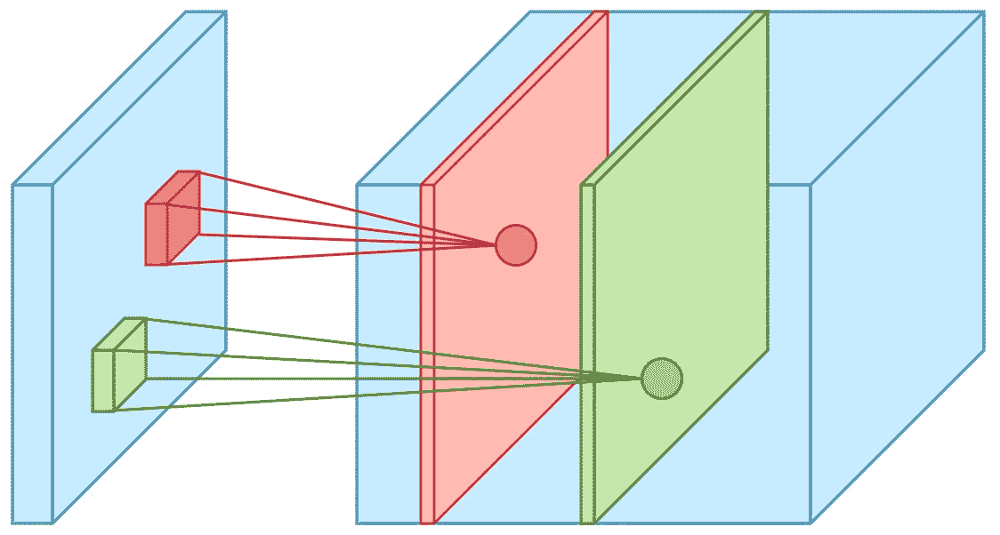

## 2.2)非线性

对于任何一种强大的神经网络，它都需要包含非线性。我们之前看到的 ANN 和 autoencoder 都是通过激活函数传递其输入的加权和来实现这一点的，CNN 也不例外。我们再次通过 *relu* 激活函数传递卷积运算的结果。因此，最终特征图中的值实际上不是总和，而是应用于它们的 relu 函数。为了简单起见，我们在上面的图中省略了这一点。但是请记住，任何类型的卷积都包含一个 relu 运算，没有它，网络就不能实现其真正的潜力。

## 2.3)步幅和衬垫

*步幅*指定我们在每一步移动卷积滤波器的程度。默认情况下，该值为 1，如下图所示。

如果我们想减少感受野之间的重叠，我们可以有更大的进展。这也使得生成的特征地图更小，因为我们跳过了潜在的位置。下图演示了步幅为 2。请注意，特征图变小了。

我们看到特征映射的大小小于输入，因为卷积滤波器需要包含在输入中。如果我们想保持相同的维度，我们可以使用*填充*用零包围输入。查看下面的动画。

输入周围的灰色区域是填充。我们要么用零填充，要么用边上的值填充。现在，特征图的维度与输入相匹配。CNN 通常使用填充来保持特征图的大小，否则它们会在每一层收缩，这是不希望的。我们上面看到的 3D 卷积图使用了填充，这就是为什么特征图的高度和宽度与输入相同(都是 32x32)，只有深度发生了变化。

## 2.4)联营

在卷积运算之后，我们通常执行*池*来减少维度。这使我们能够减少参数的数量，这既缩短了训练时间，又防止了过度拟合。池化图层对每个要素地图单独进行缩减采样，减少高度和宽度，保持深度不变。

最常见的池类型是*最大池*，它只取池窗口中的最大值。与卷积运算相反，池化没有参数。它在其输入上滑动一个窗口，并简单地取窗口中的最大值。类似于卷积，我们指定窗口大小和步幅。

这是使用 2x2 窗口和步幅 2 的最大池的结果。每种颜色代表一个不同的窗口。因为窗口大小和跨度都是 2，所以窗口不重叠。

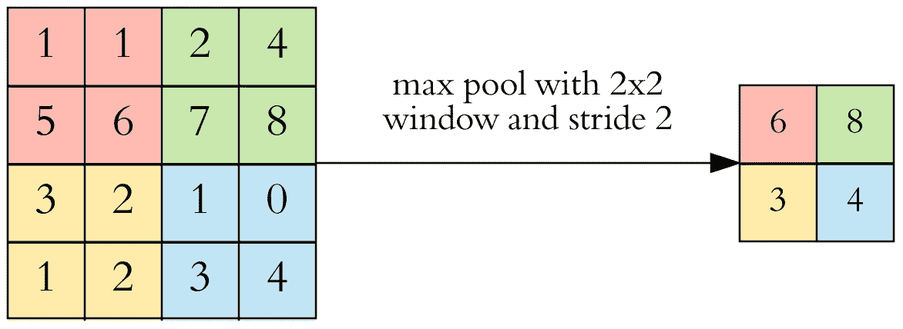

注意，该窗口和步幅配置将特征图的大小减半。这是池化的主要用例，在保留重要信息的同时对要素地图进行缩减采样。

现在让我们算出合并前后的特征图尺寸。如果池化图层的输入维度为 32x32x10，使用上述相同的池化参数，结果将是 16x16x10 的要素地图。要素地图的高度和宽度减半，但深度不变，因为池化在输入的每个深度切片上独立工作。

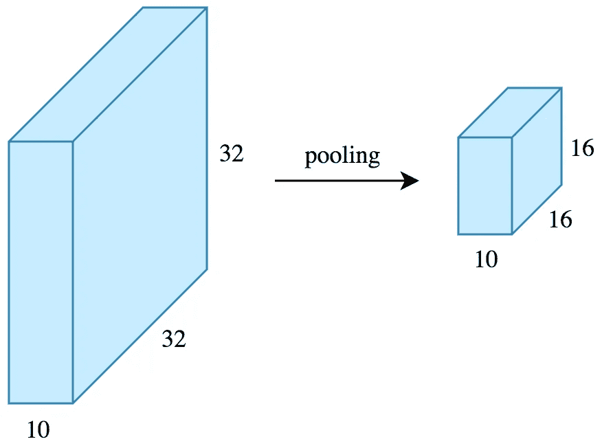

通过将高度和宽度减半，我们将重量的数量减少到输入的 1/4。考虑到我们通常在 CNN 架构中处理数百万的权重，这种减少是相当大的。

在 CNN 架构中，通常使用 2x2 窗口、跨距 2 和无填充来执行池化。卷积是用 3×3 窗口、步长 1 和填充完成的。

## 2.5)超参数

现在，让我们只考虑忽略池化的卷积层，并检查我们需要做出的超参数选择。我们需要决定 4 个重要的超参数:

*   滤波器尺寸:我们通常使用 3x3 滤波器，但根据具体应用，也可以使用 5x5 或 7x7 滤波器。还有 1x1 滤波器，我们将在另一篇文章中探讨，乍一看可能很奇怪，但它们有有趣的应用。请记住，这些过滤器是 3D 的，也有深度维度，但由于过滤器在给定层的深度等于其输入的深度，我们忽略了这一点。
*   过滤器数量:这是最易变的参数，它是 2 的幂，介于 32 和 1024 之间。使用更多的过滤器会产生更强大的模型，但是由于参数数量的增加，我们有过度拟合的风险。通常，我们从初始层的少量过滤器开始，随着网络的深入，数量会逐渐增加。
*   Stride:我们保持默认值 1。
*   填充:我们通常使用填充。

## 2.6)完全连接

在卷积+合并层之后，我们添加几个完全连接的层来包装 CNN 架构。这就是我们在第一部分中谈到的全连接人工神经网络架构。

请记住，卷积图层和池化图层的输出都是 3D 体积，但完全连接的图层需要数字的 1D 矢量。所以我们*将最终池层的输出扁平化*为一个矢量，它成为全连接层的输入。扁平化就是简单地将三维的数字排列成一个 1D 向量，这里没有任何奇特的事情发生。

## 2.7)培训

CNN 的训练方式和 ANN 一样，梯度下降反向传播。由于卷积运算涉及到更多的数学问题，这超出了本文的范围。如果你对细节感兴趣，请点击[这里](http://www.jefkine.com/general/2016/09/05/backpropagation-in-convolutional-neural-networks/)。

# 3.直觉

CNN 模型可以被认为是两个部分的组合:特征提取部分和分类部分。卷积+池层执行特征提取。例如，给定一幅图像，卷积层检测诸如两只眼睛、长耳朵、四条腿、一条短尾巴等特征。然后，完全连接的图层在这些特征之上充当分类器，并为输入图像分配成为狗的概率。

卷积层是 CNN 模型的主要动力。给定一幅图像和一个标签，自动检测有意义的特征并不是一件容易的事情。卷积层通过在彼此之上构建来学习如此复杂的特征。第一层检测边缘，接下来的层将它们合并以检测形状，随后的层将这些信息合并以推断这是一个鼻子。明确一点，CNN 不知道鼻子是什么。通过在图像中看到大量这样的东西，它学会了把它作为一种特征来检测。完全连接的层学习如何使用由卷积产生的这些特征，以便正确地分类图像。

所有这些现在听起来可能很模糊，但希望可视化部分会让一切变得更清楚。

# 4.履行

在这个冗长的解释之后，让我们编码我们的 CNN。我们将使用 Kaggle 的狗对猫数据集来区分狗和猫的照片。

我们将使用以下架构:4 个卷积+池层，然后是 2 个全连接层。输入是猫或狗的图像，输出是二进制的。

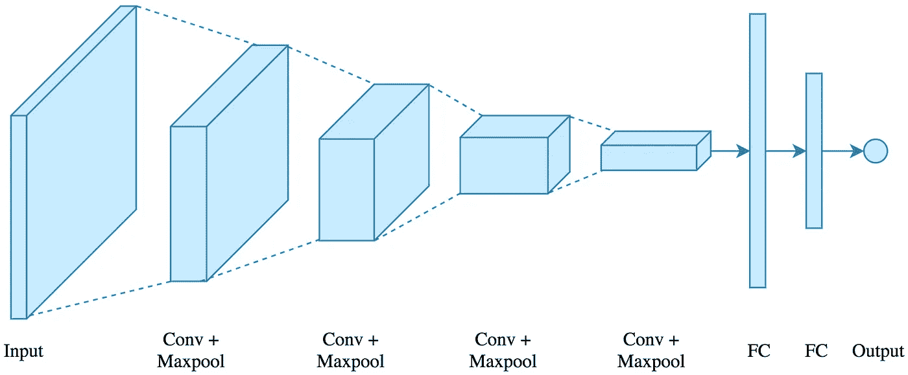

CNN 的代码如下:

在结构上，代码看起来类似于我们一直在工作的人工神经网络。有 4 种新方法我们以前没有见过:

*   *Conv2D* :这个方法创建一个卷积层。第一个参数是过滤器数量，第二个参数是过滤器尺寸。例如，在第一个卷积层中，我们创建了 32 个大小为 3×3 的过滤器。我们使用 *relu* 非线性作为激活。我们还启用填充。在 Keras 中，填充有两种选择:*相同*或*有效*。相同意味着我们在边缘填充数字，有效意味着没有填充。默认情况下，卷积层的步幅为 1，因此我们不做更改。这一层可以用附加参数进一步定制，你可以查看文档[这里](https://keras.io/layers/convolutional/)。
*   *MaxPooling2D* :创建一个 MaxPooling 层，唯一的参数是窗口大小。我们使用 2x2 的窗口，因为这是最常见的。默认情况下，步长等于窗口大小，在我们的例子中是 2，所以我们不改变它。
*   *展平*:在卷积+合并层之后，我们展平它们的输出，以馈入我们上面讨论过的完全连接的层。
*   *辍学*:我们将在下一节解释这一点。

## 4.1)辍学

对于深度神经网络，丢弃是迄今为止最流行的正则化技术。即使最先进的模型具有 95%的精度，仅通过增加压差也能获得 2%的精度提升，这在该水平上是一个相当大的增益。

辍学是用来防止过度拟合和想法非常简单。在训练期间，在每次迭代中，神经元以概率 *p* 被暂时“丢弃”或禁用。这意味着该神经元的所有输入和输出将在当前迭代中被禁用。在每个训练步骤中，被丢弃的神经元以概率 p 被重新采样，因此在一个步骤中被丢弃的神经元可以在下一个步骤中被激活。超参数 *p* 被称为*辍学率*，它通常是一个 0.5 左右的数字，对应于 50%的神经元被剔除。

令人惊讶的是，退学竟然行得通。我们故意禁用神经元，网络实际上表现更好。原因是 dropout 防止网络过于依赖少数神经元，并迫使每个神经元都能够独立运行。这听起来可能很熟悉，因为在第 3 部分中[限制了自动编码器的代码大小，以便学习更智能的表示。](https://medium.com/towards-data-science/applied-deep-learning-part-3-autoencoders-1c083af4d798)

让我们把辍学形象化，这样会容易理解得多。

丢弃可以应用于输入或隐藏层节点，但不能应用于输出节点。已删除节点的内外边被禁用。请记住，在每个训练步骤中，被遗漏的节点会发生变化。此外，我们不会在网络训练后的测试时间内应用退出，我们只在训练中这样做。

现实生活中对辍学的类比如下:假设你是公司里唯一懂财务的人。如果保证你每天都在工作，你的同事就没有动力去学习金融技能。但是如果每天早上你都抛硬币来决定是否去上班，那么你的同事就需要适应了。有些日子你可能不在工作，但财务任务仍然需要完成，所以他们不能只依靠你。你的同事需要学习金融知识，这种专业知识需要在不同的人之间传播。工人需要与其他几个雇员合作，而不是与一组固定的人合作。这使得公司整体上更有弹性，提高了员工的素质和技能。

几乎所有最先进的深度网络现在都包含了 dropout。还有另一种非常流行的正则化技术叫做*批处理正则化*，我们将在另一篇文章中介绍它。

**4.2)型号性能**

现在让我们来分析我们模型的性能。我们将看看损失和准确性曲线，将训练集性能与验证集进行比较。

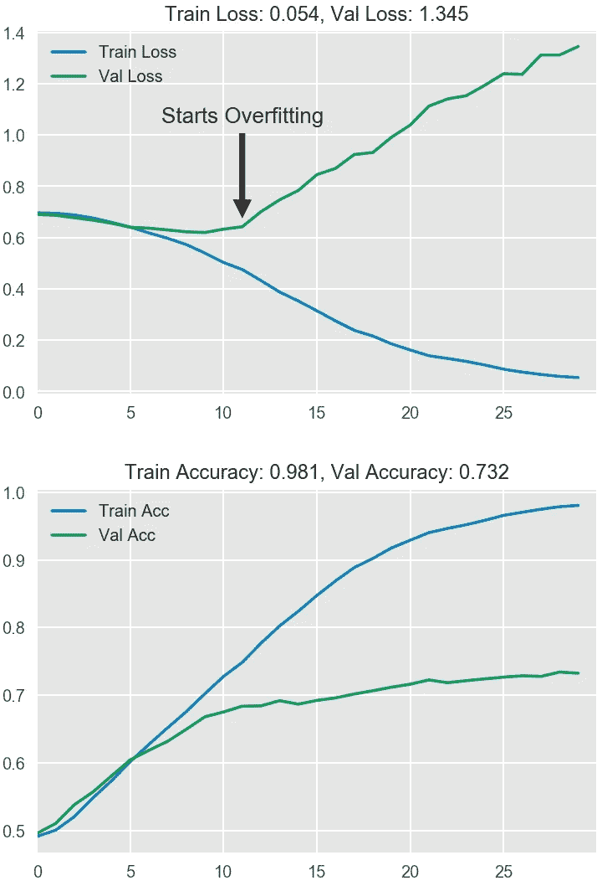

训练损失持续下降，但是验证损失在大约第 10 个时期之后开始增加。这是教科书上对过度拟合的定义。该模型正在记忆训练数据，但它无法推广到新的实例，这就是验证性能变差的原因。

尽管我们在使用辍学，我们还是过度适应了。原因是我们正在训练很少的例子，每个类别 1000 张图片。通常我们至少需要 100K 个训练样本才能开始思考深度学习。无论我们使用哪种正则化技术，我们都会在如此小的数据集上过度拟合。但幸运的是，这个问题有一个解决方案，它使我们能够在小数据集上训练深度模型，它被称为*数据增强*。

## 4.3)数据扩充

过度拟合是因为训练的样本太少，导致模型的泛化性能很差。如果我们有无限的训练数据，我们不会过度拟合，因为我们会看到每一个可能的实例。

在大多数机器学习应用中，尤其是在图像分类任务中，常见的情况是获得新的训练数据并不容易。因此，我们需要用手头的训练集来凑合。数据扩充是从当前数据集生成更多训练数据的一种方式。它通过对现有样本进行随机转换来生成新的样本，从而丰富或“增加”训练数据。通过这种方式，我们人为地增加了训练集的规模，减少了过度拟合。因此，数据扩充也可以被认为是一种正则化技术。

数据扩充是在训练期间动态完成的。我们需要生成真实的图像，转换应该是可以学习的，简单地添加噪声是没有帮助的。常见的变换有:旋转、移动、调整大小、曝光调整、对比度改变等。这样，我们可以从单个训练示例中生成大量新样本。此外，数据扩充只在训练数据上执行，我们不涉及验证或测试集。

可视化将有助于理解这个概念。假设这是我们最初的形象。

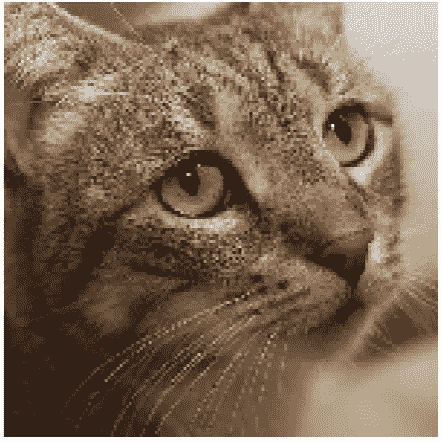

使用数据增强，我们生成这些人工训练实例。这些是新的训练实例，在原始图像上应用变换不会改变这仍然是猫图像的事实。我们可以推断它是人类，所以模型也应该能够学习。

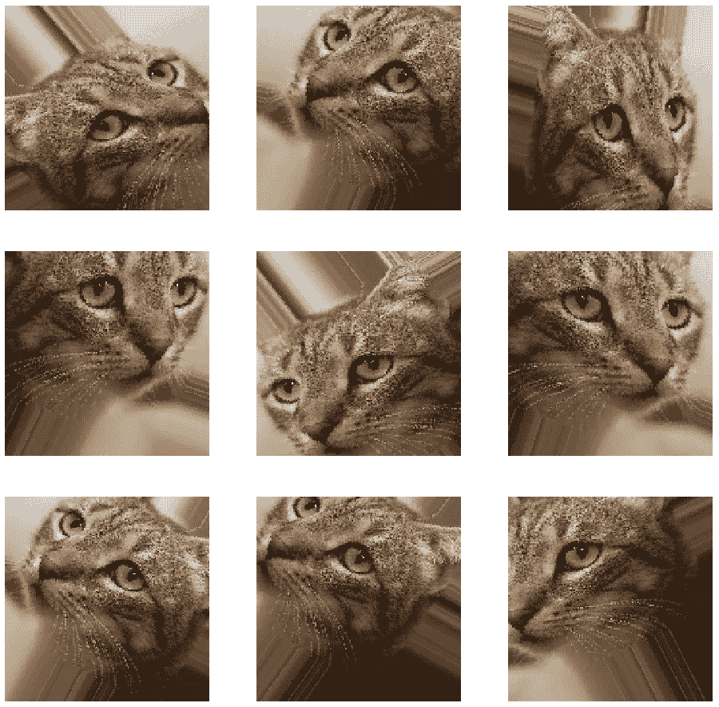

数据扩充甚至可以将训练集的规模提高 50 倍。这是一种非常强大的技术，用于每一个基于图像的深度学习模型，没有例外。

有一些我们通常在图像上使用的数据清理技巧，主要是*白化*和*意味着归一化*。更多关于他们的信息可以在[这里](http://ufldl.stanford.edu/tutorial/unsupervised/PCAWhitening/)找到。

## 4.4)更新型号

现在让我们在 CNN 模型中使用数据增强。模型定义的代码根本不会改变，因为我们不会改变模型的架构。唯一的变化是我们如何输入数据，你可以查看 jupyter 笔记本[这里](https://github.com/ardendertat/Applied-Deep-Learning-with-Keras/blob/master/notebooks/Part%204%20(GPU)%20-%20Convolutional%20Neural%20Networks.ipynb)。

用 Keras 做数据扩充很容易，它提供了一个类来为我们做所有的工作，我们只需要指定一些参数。文档可在[这里](https://keras.io/preprocessing/image/)获得。

使用数据扩充，损失和精度曲线如下所示。

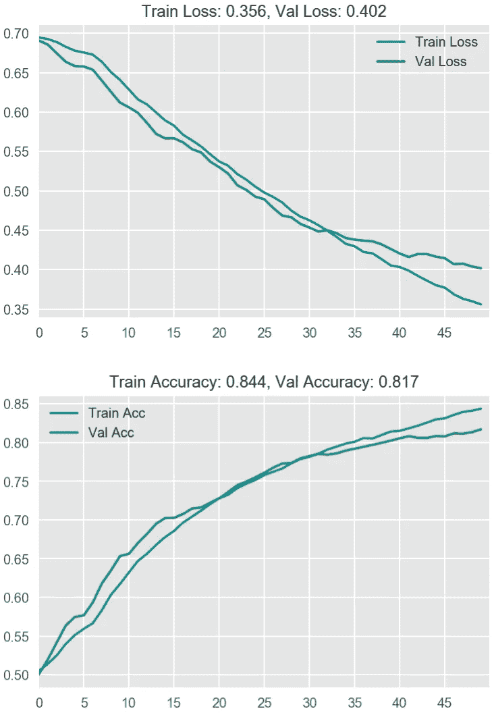

这次没有明显的过度拟合。验证准确率从无数据扩充时的 73%跃升至有数据扩充时的 81%，提高了 11%。这是一件大事。准确度提高的主要原因有两个。首先，我们在更多不同的图像上进行训练。第二，我们使模型变换不变，这意味着模型看到了许多移动/旋转/缩放的图像，因此它能够更好地识别它们。

# 5.VGG 模型

现在让我们来看一个 2014 年的 CNN 模型的例子。VGG 是来自牛津视觉几何小组研究人员的卷积神经网络，因此得名 VGG。它以 7.3%的错误率获得了 ImageNet 分类挑战的亚军。 [ImageNet](http://www.image-net.org/) 是最全面的手绘视觉数据集，他们每年都举办比赛，来自世界各地的研究人员参加比赛。所有著名的 CNN 建筑都在那次比赛中首次亮相。

在表现最好的 CNN 模型中，VGG 因其简单而引人注目。我们来看看它的架构。

VGG 是一个 16 层的神经网络，不包括最大池层和最末端的 softmax。它也被称为 VGG16。该架构是我们在上面工作过的架构。堆叠卷积+池层，然后是完全连接的人工神经网络。关于架构的一些观察:

*   它在整个网络中仅使用 3×3 卷积。注意，两个背靠背的 3×3 回旋具有单个 5×5 回旋的有效感受野。并且三个堆叠的 3×3 回旋具有单个 7×7 回旋的感受野。这是两个堆叠的 3x3 卷积形成 5x5 的可视化效果。

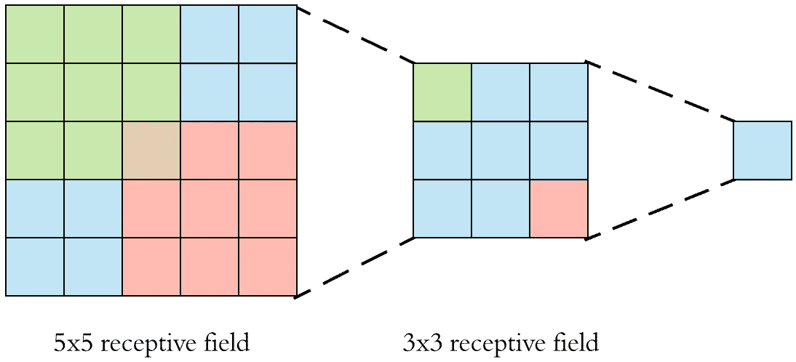

*   堆叠两个卷积而不是一个卷积的另一个优点是，我们使用两个 relu 运算，并且更多的非线性赋予模型更多的能力。
*   随着我们深入网络，过滤器的数量会增加。由于我们进行了汇集，特征地图的空间大小减小了，但是随着我们使用更多的过滤器，体积的深度增加了。
*   在 4 个 GPU 上训练了 3 周。

VGG 是一个非常基本的 CNN 模型。如果您需要为某个特定任务使用现成的模型，这是第一个想到的。这篇论文也写得很好，可以在这里找到。还有更复杂的模型表现更好，例如微软的 ResNet 模型以 3.6%的错误率赢得了 2015 年 ImageNet 挑战赛，但该模型有 152 层！详情可在[报上](https://arxiv.org/pdf/1512.03385.pdf)这里。我们将在另一篇文章中深入讨论所有这些 CNN 架构，但是如果你想跳过[这里](https://adeshpande3.github.io/The-9-Deep-Learning-Papers-You-Need-To-Know-About.html)是一个很棒的帖子。

# 6.形象化

现在是最有趣的部分，卷积神经网络的可视化。众所周知，深度学习模型非常难以解释，这就是为什么它们通常被视为黑盒。但是 CNN 模型其实是相反的，我们可以把各种成分可视化。这将使我们深入了解它们的内部工作方式，并帮助我们更好地理解它们。

我们将设想 VGG 模式的 3 个最重要的组成部分:

*   特征地图
*   Convnet 滤波器
*   类输出

## 6.1)可视化要素地图

让我们快速回顾一下卷积架构作为提示。convnet 滤波器对输入执行卷积运算，结果得到一个特征图。我们使用多个过滤器，并将得到的特征图堆叠在一起，以获得输出体积。首先，我们将直观显示特性图，在下一节中，我们将探讨 convnet 滤波器。

我们将可视化特征地图，以查看输入如何通过卷积层进行转换。特征图也被称为*中间激活*，因为层的输出被称为激活。

请记住，卷积层的输出是 3D 体积。如上所述，高度和宽度对应于特征图的维度，并且每个深度通道是编码独立特征的不同特征图。因此，我们将通过将每个通道绘制为 2D 图像来可视化各个特征地图。

如何可视化特征地图实际上非常简单。我们通过 CNN 传递一个输入图像并记录中间激活。然后，我们随机选择一些特征地图，并绘制它们。

VGG 卷积层的命名如下:blockX_convY。例如，第三个卷积模块中的第二个滤波器称为 block3_conv2。在上面的架构图中，它对应于第二个紫色滤镜。

例如，第一层(block1_conv1)输出的一个特征图如下所示。

明亮的区域是“激活”的区域，这意味着过滤器检测到了它正在寻找的模式。这个过滤器似乎编码了一个眼睛和鼻子探测器。

与查看单个要素地图相比，从卷积图层中可视化多个要素地图会更有意思。那么让我们来可视化对应于每个块的第一个卷积的特征图，下图中的红色箭头。

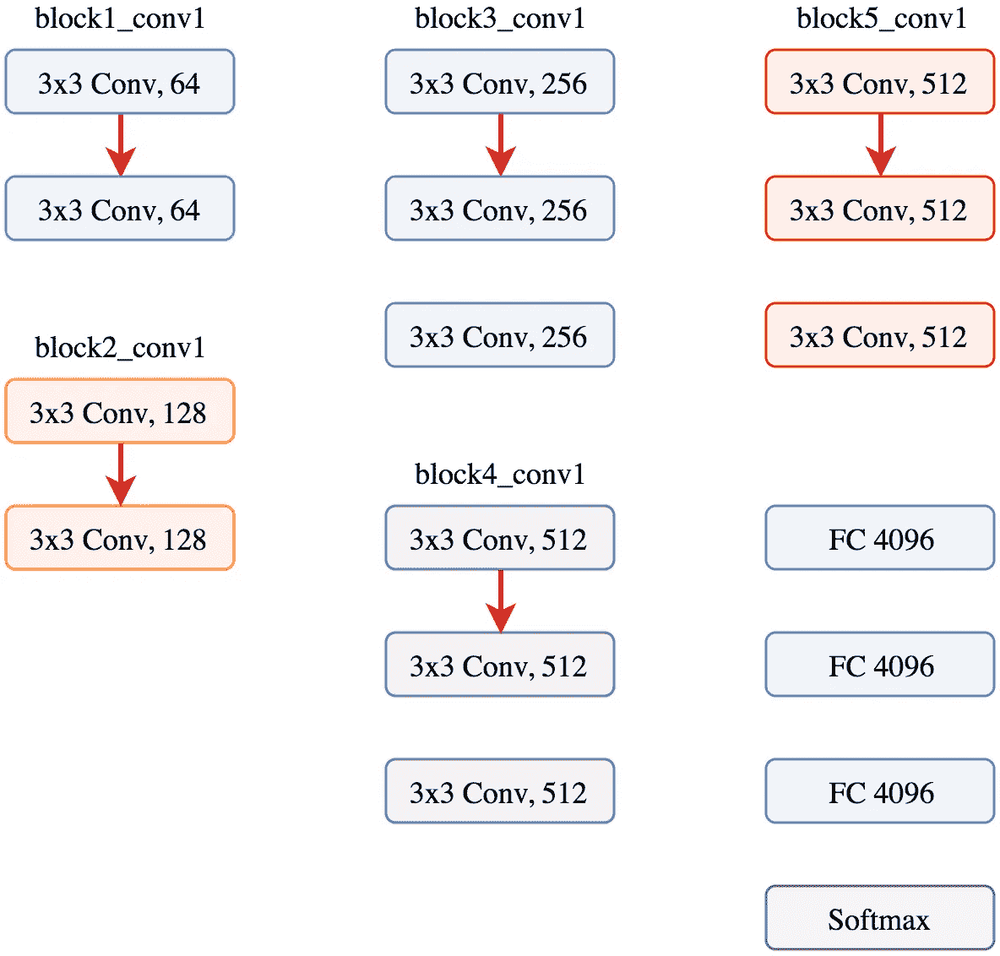

下图显示了每个图层的 8 个要素地图。Block1_conv1 实际上包含 64 个特征图，因为该层中有 64 个滤波器。但是在这个图中，我们只可视化了每层的前 8 个。

随着我们对图层的深入了解，我们对特征地图有一些有趣的观察。让我们看一下每个图层的一个要素地图，以使它更明显。

*   第一层要素地图(block1_conv1)保留了图像中的大部分信息。在 CNN 架构中，第一层通常充当边缘检测器。
*   随着我们深入网络，特征地图看起来不太像原始图像，而更像它的抽象表示。正如您在 block3_conv1 中看到的，这只猫在某种程度上是可见的，但在此之后，它就变得不可识别了。原因在于，较深的特征地图编码像“猫鼻子”或“狗耳朵”这样的高级概念，而较低级别的特征地图检测简单的边缘和形状。这就是为什么更深的特征地图包含更少的关于图像的信息，而包含更多的关于图像类别的信息。它们仍然编码有用的特征，但是它们不太容易被我们从视觉上理解。
*   随着我们深入，特征图变得越来越稀疏，这意味着过滤器检测到的特征越来越少。这是有意义的，因为第一层中的过滤器检测简单的形状，并且每个图像都包含这些形状。但随着我们深入，我们开始寻找更复杂的东西，如“狗尾巴”，它们不会出现在每张图片中。这就是为什么在第一张图中，每层有 8 个过滤器，随着我们深入，我们会看到更多的功能图为空白(block4_conv1 和 block5_conv1)。

## 6.2)可视化 Convnet 滤波器

现在我们将想象 CNN 的主要组成部分，过滤器。不过，有一个问题，我们不会真正可视化过滤器本身，而是显示每个过滤器最大程度响应的模式。请记住，过滤器的大小为 3x3，这意味着它们的高度和宽度为 3 个像素，非常小。因此，作为可视化过滤器的代理，我们将在过滤器最活跃的地方生成输入图像。

如何做到这一点的全部细节有些技术性，你可以在 jupyter [笔记本](https://github.com/ardendertat/Applied-Deep-Learning-with-Keras/blob/master/notebooks/Part%204%20(GPU)%20-%20Convolutional%20Neural%20Networks.ipynb)中查看实际代码。但作为一个快速总结，它的工作原理如下:

*   选择一个损耗函数，使 convnet 滤波器的值最大化。
*   从空白输入图像开始。
*   在输入空间做*梯度上升*。这意味着修改输入值，使过滤器激活更多。
*   循环重复这个动作。

这个过程的结果是滤波器非常活跃的输入图像。请记住，每个过滤器都充当特定功能的检测器。我们生成的输入图像将包含许多这些特征。

我们将在每个卷积块的最后一层可视化滤波器。为了消除任何混淆，在上一节中，我们可视化了卷积运算的输出，即特征图。现在我们正在可视化滤波器，卷积运算中使用的主要结构。

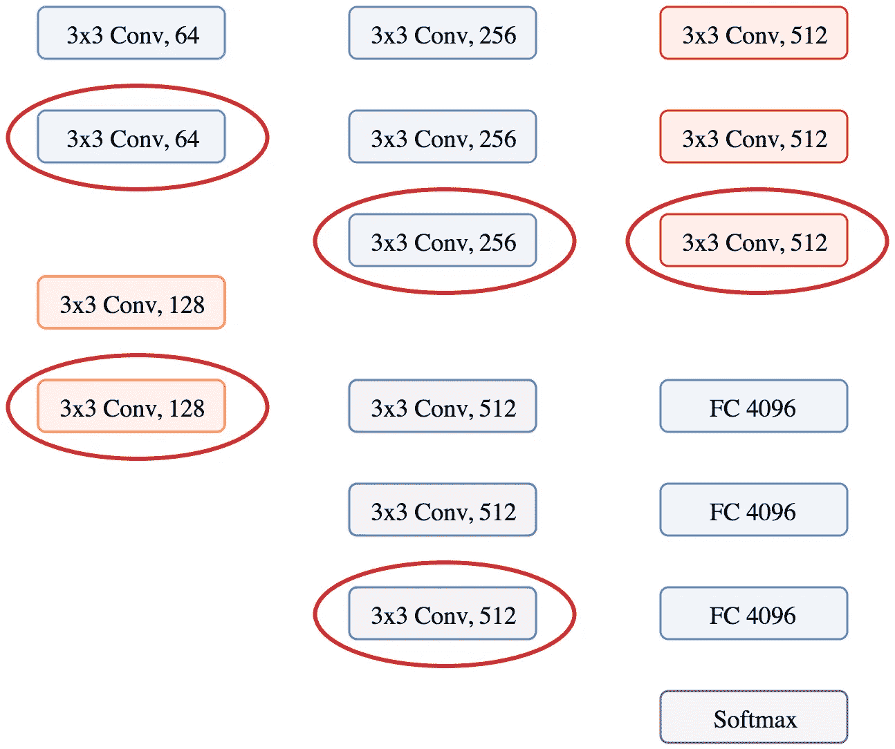

我们将设想每层 8 个过滤器。

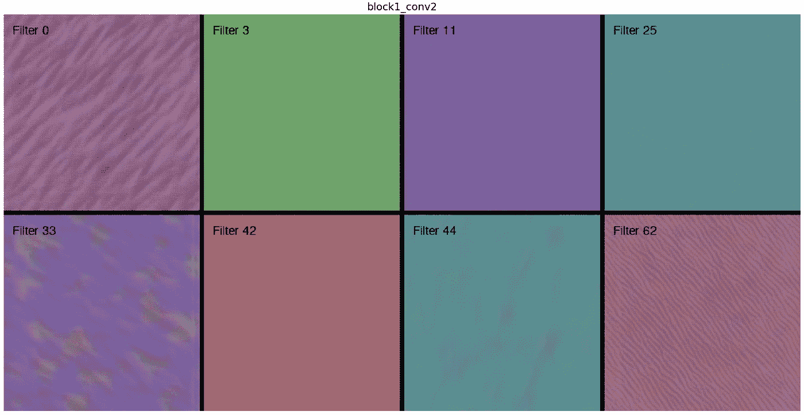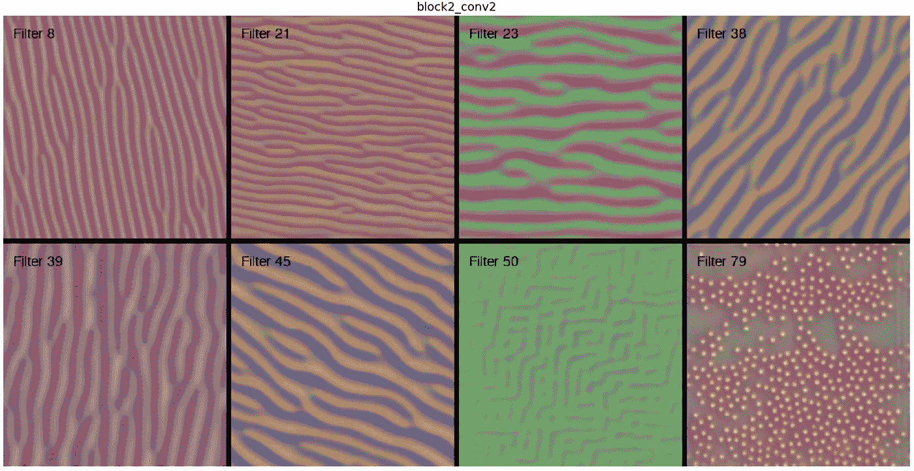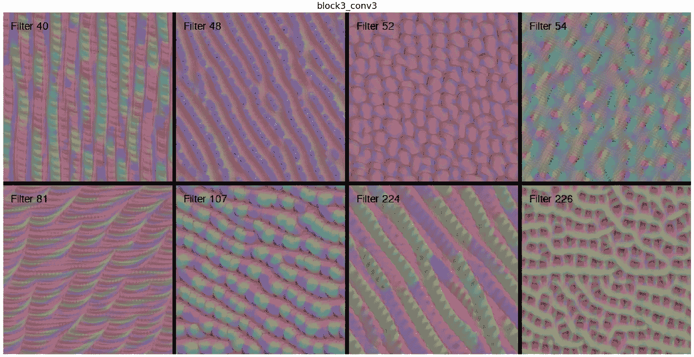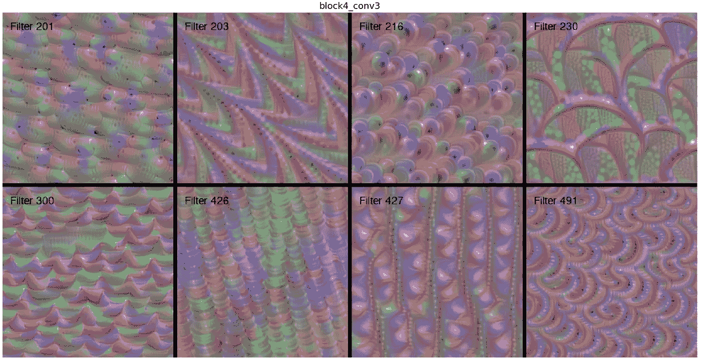

它们看起来很不真实！尤其是最后几层。以下是对过滤器的一些观察:

*   第一层过滤器(block1_conv2 和 block2_conv2)主要检测颜色、边缘和简单形状。
*   随着我们深入网络，过滤器在彼此之上构建，并学习编码更复杂的模式。例如，block5_conv3 中的滤波器 41 似乎是一个鸟类检波器。您可以看到不同方向的多个头部，因为鸟在图像中的特定位置并不重要，只要它出现在过滤器将激活的某个位置。这就是为什么过滤器试图通过在过滤器中的多个位置编码来检测几个位置的鸟头。

这些观察结果类似于我们在特征映射部分讨论的内容。较低层编码/检测简单的结构，随着我们深入，各层在彼此之上构建，并学习编码更复杂的模式。这也是我们人类在婴儿时期开始发现世界的方式。首先，我们学习简单的结构，通过实践，我们擅长理解更复杂的东西，建立在我们现有知识的基础上。

## 6.3)可视化类输出

让我们做最后一个可视化，它将类似于 convnet 过滤器。现在我们将在最终的 softmax 层可视化。给定一个特定的类别，如锤子或灯，我们将要求 CNN 生成一个最大限度地代表该类别的图像。基本上 CNN 会给我们画一幅它认为锤子的样子。

该过程类似于 convnet 滤波器步骤。我们从空白图像开始并进行修改，使得分配给特定类别的概率增加。该代码再次出现在[笔记本](https://github.com/ardendertat/Applied-Deep-Learning-with-Keras/blob/master/notebooks/Part%204%20(GPU)%20-%20Convolutional%20Neural%20Networks.ipynb)中。

让我们形象化一些类别。

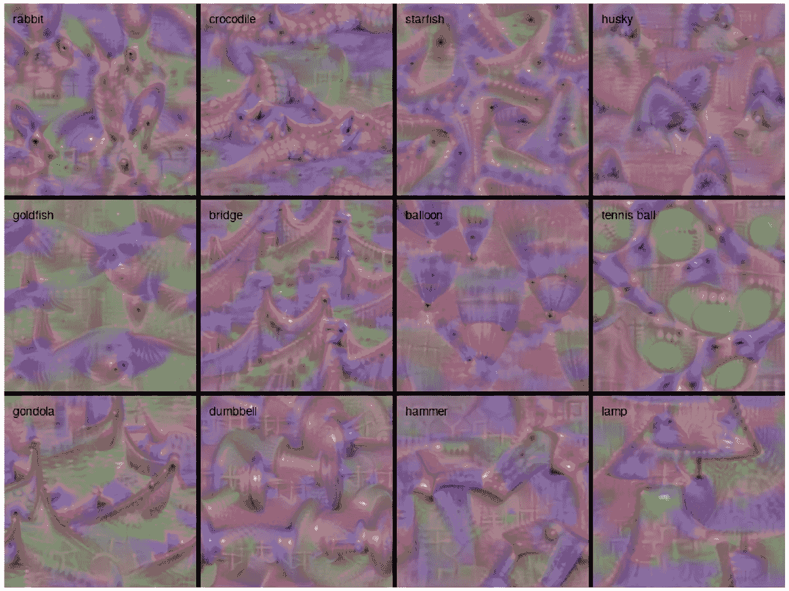

他们看起来很有说服力。一个对象在图像中出现多次，因为这样分类概率变得更高。图像中的多个网球比单个网球更好。

所有这些可视化都是使用库 [keras-vis](https://raghakot.github.io/keras-vis/) 执行的。

# 7.结论

CNN 是一种非常基础的深度学习技术。我们涵盖了广泛的主题，在我看来可视化部分是最有趣的。网上很少有资源对卷积滤波器和特征图进行全面的视觉探索。我希望它有帮助。

如果你想自己动手，这篇文章的全部代码可以在[这里](https://github.com/ardendertat/Applied-Deep-Learning-with-Keras/blob/master/notebooks/Part%204%20(GPU)%20-%20Convolutional%20Neural%20Networks.ipynb)找到。如果你有任何反馈，请随时通过[推特](https://twitter.com/ardendertat)联系我。

# 8.参考

网上有大量的 CNN 教程，但最全面的是 Andrej Karpathy 的斯坦福 CS231N 课程。阅读资料在[这里](http://cs231n.github.io/)，视频讲座在[这里](https://www.youtube.com/playlist?list=PLkt2uSq6rBVctENoVBg1TpCC7OQi31AlC)。极好的信息来源，强烈推荐。

如果你想深入了解可视化，Deepvis 是一个很好的资源[在这里](http://yosinski.com/deepvis)。有一个交互工具，开源代码，论文和一篇详细的文章。

Keras 的作者提供了一个很棒的图像分类教程[这里](https://blog.keras.io/building-powerful-image-classification-models-using-very-little-data.html)。这篇文章深受那篇教程的影响。它涵盖了我们详细讨论过的许多材料。

关于深度学习的非常全面的在线免费书籍可以在[这里](http://neuralnetworksanddeeplearning.com/)找到，CNN 部分可以在[这里](http://neuralnetworksanddeeplearning.com/chap6.html)找到。

如果你对将 CNN 应用于自然语言处理感兴趣，[这篇文章](http://www.wildml.com/2015/11/understanding-convolutional-neural-networks-for-nlp/)非常棒。另一个非常详细的是[这里](https://medium.com/@TalPerry/convolutional-methods-for-text-d5260fd5675f)。

一个由 3 部分组成的系列文章，涵盖了 CNN 论文的现状，可以在这里找到。

Chris Olah 的所有文章都充满了丰富的信息和可视化效果。CNN 的相关帖子可以在这里和[这里](http://colah.github.io/posts/2014-07-Understanding-Convolutions/)找到。

另一个受欢迎的 CNN 介绍文章是这里的。

这里有一个非常容易理解的关于 CNN 的三集系列。