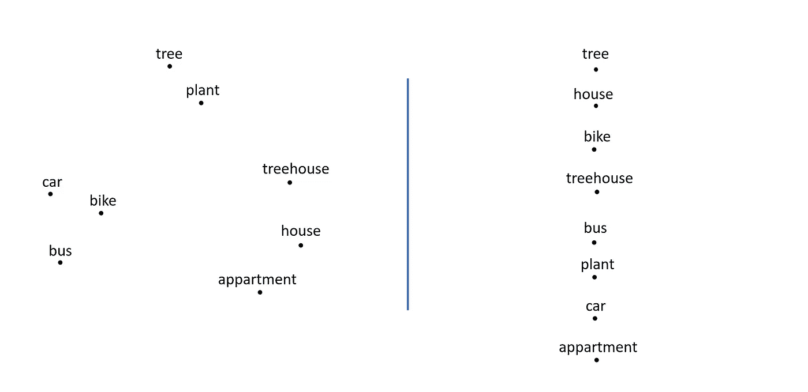
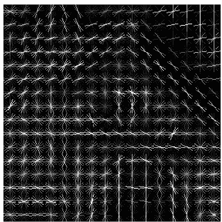

# 迁移学习在自然语言处理和计算机视觉中的应用

> 原文：<https://towardsdatascience.com/applying-transfer-learning-in-nlp-and-cv-d4aaddd7ca90?source=collection_archive---------0----------------------->

在这篇博文中，我将讨论迁移学习的两个应用。我将概述自然语言处理和计算机视觉领域的例子。

这篇博文是迁移学习系列的第二篇。可以找第一篇博文，里面解释了迁移学习的基本概念，[这里](https://medium.com/@lars.hulstaert/transfer-learning-leveraging-insights-from-large-data-sets-d5435071ec5a)。

## 自然语言处理

[我之前的一篇博文](https://www.datacamp.com/community/tutorials/lda2vec-topic-model)讨论了现在很多 NLP 管道是如何使用单词嵌入的。与一次性编码相比，这些单词嵌入是一种更具信息性的单词表示方式。它们被广泛使用，并且存在不同的变体。典型地，这些变体在它们所源自的语料库中是不同的，例如维基百科、新闻文章等。，以及嵌入模型的差异。了解这些模型和语料库的背景对于了解单词嵌入的迁移学习是否合理是很重要的。人们通常不会把单词嵌入的使用称为迁移学习，但我不同意，因为它与计算机视觉中的迁移学习有相似之处。本质上，使用单词嵌入意味着您正在使用特征或嵌入网络将单词转换为信息向量。

Different approaches exist to represent words in NLP (a word embedding like representation on the left and a BoW like representation on the right). With word embeddings a machine learning model can leverage the relationships that exist between different words.

即使 word2vec 已经 4 岁了，但它仍然是一种非常有影响力的单词嵌入方法。另一方面，最近的方法如 [FastText](https://research.fb.com/fasttext/) 已经使单词嵌入在许多语言中可用。与单词包方法相比，来自 word2vec 或 FastText 的嵌入是一个重大进步。然而，它们的有用性通常是由问题域决定的。

假设您正在为销售人员构建一个新闻推荐服务。销售人员希望收到对他们销售的产品感兴趣的公司的消息。新闻文章中使用的词汇通常是相当通用的，这意味着所使用的词汇受到大多数单词嵌入的支持(取决于它们被训练的语料库)。此外，如果你让销售人员收集他们连续几周阅读的新闻文章，那么你马上就会有一个大的带标签的语料库。通过能够重用单词嵌入，推荐引擎的性能可能会比简单的 BoW 模型好得多。

另一方面，设想你要对法律合同进行话题分类。不是任何类型的法律合同，而是竞争法背景下的法国法律合同。这些类型的数据集通常没有标记，或者只有有限的一组标记文档可用。下一节将描述为什么开箱即用的迁移学习在这种情况下只能让您到此为止:

*   词汇外(OOV)单词是在训练期间没有见过的单词。虽然 word2vec 和 FastText 是在例如 Wikipedia 或其他 copora 上训练的，但是使用的词汇是有限的。在训练中，不经常出现的单词经常被忽略。这意味着竞争法法律合同中的特定领域词语可能因此得不到支持。当使用预先训练的单词嵌入时，通常检查 OOV 单词并用 UNK 记号(未知单词记号)替换它们，并且所有这些单词被分配相同的向量。如果语料库是特定于领域的，这是非常无效的，因为特定于领域的单词通常具有很多含义。如果大部分(有意义的)单词被 UNK 代币代替，那么模型将不能学到很多东西。
*   标准预训练单词嵌入的替代方法是在大型无监督文档集上微调嵌入。请注意，这只是在有大量文档可用时的一个选项。这意味着，如果你有一个大的竞争法语料库，你可以从其他更一般的单词的预训练单词嵌入开始，训练特定领域单词的单词嵌入。通常，从预先训练的单词嵌入开始会加快整个过程，并且会使训练你自己的单词嵌入更容易。注意，使用开箱即用的单词嵌入仍然比较困难，并且需要一些关于如何为单词嵌入训练准备语料库的知识。

我强烈建议你阅读[这篇关于单词嵌入现状的优秀博文](http://ruder.io/word-embeddings-2017/)。在处理有限数量的数据时，考虑这篇博客中提到的问题和解决方案是创建健壮的 NLP 系统和单词嵌入的关键。

Gensim、spacy 和 FastText 是三个很好的框架，允许您在机器学习应用程序中快速使用单词嵌入。此外，它们还支持自定义单词嵌入的训练。查看这个 [gensim](https://radimrehurek.com/gensim/tut1.html) ，这个 [spacy](https://spacy.io/usage/vectors-similarity#section-custom) 或者这个 [FastText 教程](https://github.com/facebookresearch/fastText#obtaining-word-vectors-for-out-of-vocabulary-words)了解更多！

# 计算机视觉中的迁移学习

深度学习方法已经在计算机视觉领域取得了重大成功。而不是必须手动定义特定于问题的特征，例如，梯度方向直方图(HoG)特征、颜色特征等。，深度学习允许从业者训练以原始图像作为输入的模型。

Based on the type of problem, different types of HOG features need to be defined. These are one class of visual features that can be used in computer vision. Note the similarity with the features that extracted by convolutional networks below.

要素定义的原始复杂性现在已经转向定义网络的复杂性。虽然体系结构经常被重用，但是在构建网络体系结构时没有单一的策略。通常，深度学习技术已经被发明并应用于对巨大数据集的研究设置中(如 [Imagenet](http://www.image-net.org/) 或 [MS Coco](http://cocodataset.org/#home) )。为了提高这些大型数据集的性能，研究人员提出了深度和复杂性不断增加的网络架构。这些架构导致具有数百万参数的模型(通常)不可扩展到小型图像数据集。在少于 5000 个图像的数据集上训练诸如 ResNet 或 VGG 网的架构只会导致显著的过度拟合。最近的深度学习趋势带来了重大进步，但似乎只有小数据集的数据科学家被冷落了。

事实证明，深度学习网络学习分层的特征表示(见[这篇博文](https://distill.pub/2017/feature-visualization/)by distilt)。这意味着较低级别的层学习较低级别的特征，例如边缘，而较高级别的层学习较高级别的、但不可解释的概念，例如形状。当在不同的数据集上训练网络时，也会出现这种等级要素表示的想法，这表明它们可以在不同的问题域中重复使用。

Being able to distinguish lines and shapes (left) from an image makes it easier to determine if something is a ‘car’ than having to start from the raw pixel values. Transfer learning allows you to leverage learned patterns from other computer vision models.

当在计算机视觉问题上使用迁移学习时，使用两种方法。

*   首先，如果有相当数量的图片(每类超过 1，000 张图片)，您可以使用在不同数据集上训练的模型的权重来初始化新模型。在训练过程中，您将保持一定数量的层(通常是第一个卷积层)不变，并优化更高层的参数。目标是减少需要优化的参数数量，同时重用较低级别的层。无论问题领域如何，较低级别的层最有可能是相似的，并且模型必须能够自由地将较高级别的层组合在一起，具体到问题。
*   第二，如果只有很少的图片可用，Keras 的 API 允许你加载预训练的网络，并在训练期间保持几个层不变。在下一节中，我将再次讨论两个用例，分别是迁移学习有用的情况和无用的情况。

想象一下，在野生动物保护领域工作，您想要对出现在实时摄像机画面上的不同动物进行分类。尤其是如果你正在尝试监测濒临灭绝的物种，你可能无法收集大量的标记数据。假设预训练的网络通常在广泛的概念领域(从食物到动物和物体)上被训练，使用预训练的网络作为特征或初始化器肯定是一个选项。

另一方面，假设您需要为肿瘤学家分析放射图像。这些图像不是典型的猫狗图像，因为它们是对病人进行扫描的输出。这些图像虽然被转换为 RGB 图像，但通常以灰色阴影显示扫描结果。虽然预训练的网络能够从 RGB 图像中检测形状和边缘，但是它们很可能很难检测射线照相图像上的形状和边缘，因为这些形状和边缘不在预训练模型的训练数据中。此外，在医疗场景中，标记的数据量通常很低。有几种技术可以利用(潜在丰富的)未标记数据，但它们通常需要更多的工作和微调。通常，这些技术试图通过迭代训练每一层来重建图像(使用卷积和反卷积层)，从而预先训练分类网络的权重。这些技术和预训练网络的组合通常用于改善收敛。

上面提到的计算机视觉中的两种方法都依赖于一个重要的假设:在原始数据集中提取的模式在新数据集的上下文中是有用的。这种有用性很难量化，但它是一个需要考虑的重要假设。地震、超光谱甚至医学图像与 ImageNet 中的图像相似度有限。然而，确定图像包含哪个交通标志依赖于相当相似的模式。理解计算机视觉问题域对于成功应用计算机视觉至关重要。通过了解模型的背景(数据集、技术等。)用于迁移学习，您可以避免在实验中浪费时间，并专注于微调那些可能产生影响的模型。

如果你有任何问题，我很乐意在评论中阅读。如果你想收到我博客上的更新，请在 [Medium](https://medium.com/@lars.hulstaert) 或 [Twitter](https://twitter.com/LarsHulstaert) 上关注我！

If you have any questions, I’ll be happy to read them in the comments. Follow me on [Medium](https://medium.com/@lars.hulstaert) or [Twitter](https://twitter.com/LarsHulstaert) if you want to receive updates on my blog posts!