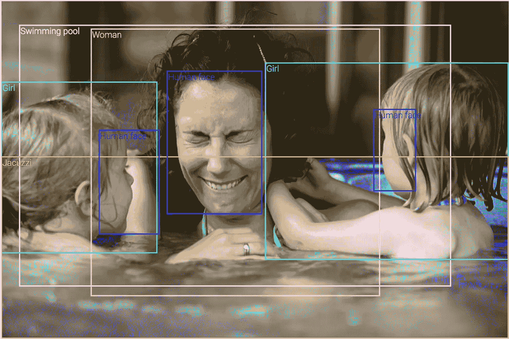
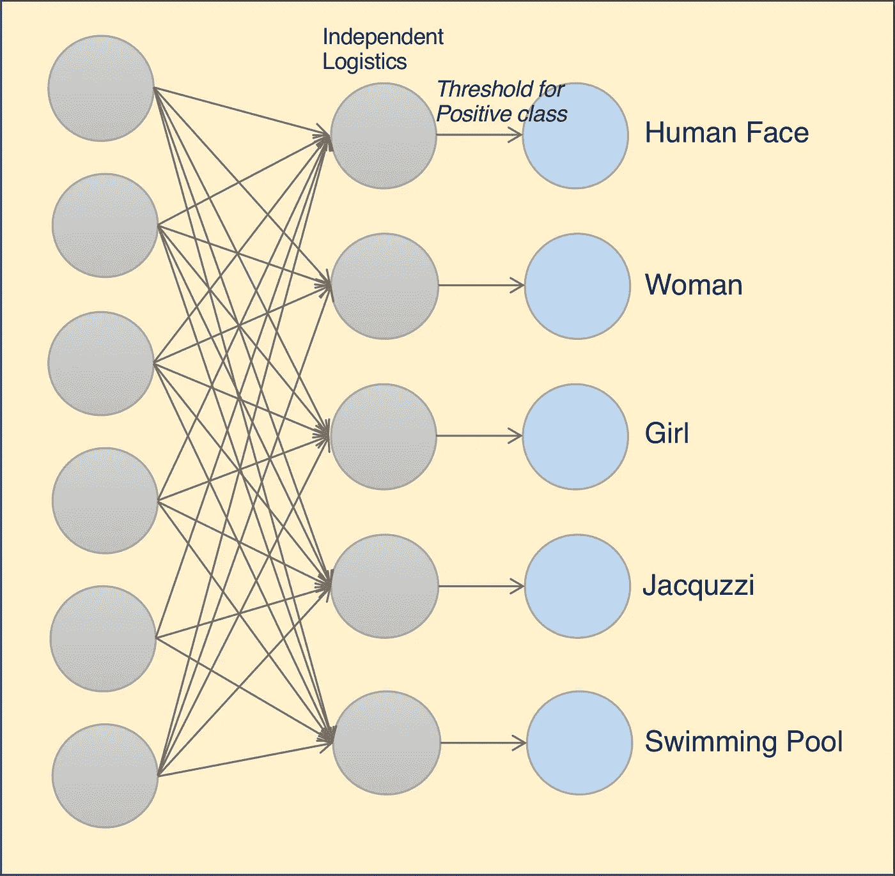

# 多标签分类方法

> 原文：<https://towardsdatascience.com/approaches-to-multi-label-classification-1cf981ff2108?source=collection_archive---------7----------------------->

图像的多标签分类处理图像可能属于一个以上类别的情况。例如，下图在同一张照片中有一列火车、一个女人、一个女孩和一个按摩浴缸。

Photo Credit: Open Image Dataset V4 ([License](https://creativecommons.org/licenses/by/2.0/))

有多种方法可以解决这个问题。第一种方法是二元分类法。在这种方法中，我们可以使用“k”个独立的二元分类器，对应于我们数据中的 k 个类。

这种方法的最后一层是由 k 个独立的 sigmoid(后勤)激活。类别预测基于物流层的阈值。

这种方法易于理解和训练。然而，这种方法有一个缺点。我们忽略了标签之间的语义关系。例如“人脸”和女人是相关的。人面和少女也是。

## 标签关系编码的多标签分类

有多种方法来编码标签之间的语义关系。在这篇笔记中，我描述了 3 个不同的想法。

**第一种方法**是使用图表来创建标签关系。这种标签关系可以是先验知识(参见参考文献[1]、[3])。例如，基于先验知识的分层图可以对“人脸”是“女人”和“女孩”的双亲这一事实进行编码。这种方法可以扩展到创建复杂的结构。例如，我们可以对排斥的概念进行编码——人脸不能是猴子，或者重叠——女人可以既是母亲又是孩子。这种方法的主要问题是处理图形的复杂性，经过一段时间后，它变得专用于特定的域，而不能扩展到其他域。

**第二种方法**是独立地从数据中学习标签关系。参考文献[2]中有一个早期的例子。标签关系由贝叶斯网络或马尔可夫网络捕获。贝叶斯网络也是一个图形。它可以是无环图形模型，其中每个节点代表一个标签，有向边代表一个标签对另一个标签的概率依赖性。这种图的参数通常可以通过最大似然估计来学习。使用这些图形模型的一个大挑战是理解模型结构的问题。众所周知，贝叶斯网络的精确推理和结构估计都是 NP 难问题。参见参考[此处](https://en.wikipedia.org/wiki/Bayesian_network#Inference_complexity_and_approximation_algorithms)。

我们将考虑的最后一种方法是用于多标签图像分类的统一 CNN-RNN 框架，它有效地学习标签之间的语义关系。这种方法的一个很好的参考是王江和团队的论文[4]。在这种方法中，RNN 模型学习联合低维图像-标签嵌入来建模图像和标签之间的语义相关性。图像嵌入向量由深度 CNN 生成。

在这种联合嵌入中，多个标签的概率作为所有标签上的有序预测路径被顺序计算。参考文献[4]中的一张图片给出了关于该架构的良好直觉。

RNN-CNN architecture from reference [4]

# 结论

图像分类问题的最终解决方案取决于问题的性质和标签相互依赖的性质。对于标签的相互依赖性很复杂的领域，RNN 和 CNN 的联合方法似乎很有希望。当我开始进行多标签分类的实验时，我将报告这里描述的方法的性能度量。

[1]魏碧，James T. Kwok Mandatory:层次多标签分类中的叶节点预测([链接](http://papers.nips.cc/paper/4520-mandatory-leaf-node-prediction-in-hierarchical-multilabel-classification.pdf)

[2]郭玉红，顾穗成:使用条件依赖网络的多标签分类([链接](https://www.researchgate.net/publication/220813738_Multi-Label_Classification_Using_Conditional_Dependency_Networks))

[3]贾登等。艾尔。:使用标签关系图的大规模对象分类([链接](https://www.cs.ubc.ca/~murphyk/Papers/eccv2014.pdf)

[4]王江等人艾尔。:CNN-RNN:多标签图像分类的统一框架([链接](https://arxiv.org/ftp/arxiv/papers/1604/1604.04573.pdf))