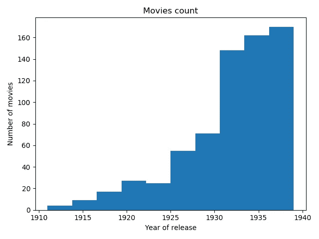
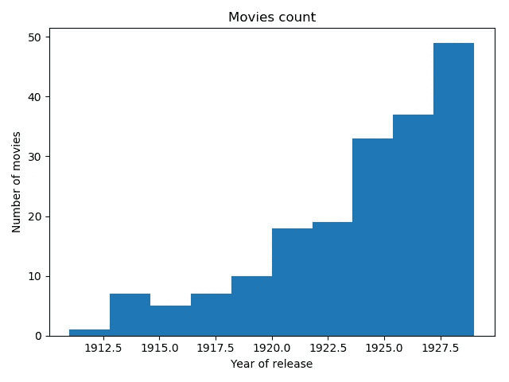

# 新电影比 10 年前、20 年前、50 年前更长吗？

> 原文：<https://towardsdatascience.com/are-new-movies-longer-than-they-were-10hh20-50-year-ago-a35356b2ca5b?source=collection_archive---------4----------------------->

## 处理来自 IMDb.com 的数据

如果你喜欢看电影，我指的是*很多*的电影，你可能已经注意到如今电影变得越来越长。你上一次去电影院看短于 120 分钟的大片是什么时候？越来越多的电影(谢谢漫威鼓励这种趋势！)字幕后还有场景，所以你会一直耐心等待，直到结束，即使你的膀胱已经让你痛不欲生一段时间了。

**这是你可能会想“天哪，最近电影变得长得可笑”的时候。是吗？我也问过自己同样的问题。我和一些电影爱好者讨论了这个问题。他们有相似的感觉。这对我来说还不够。我决定用我的数据分析技能来调查这个问题。在这篇文章中你可以读到我的发现。**

# 资料组

没有比 IMDb.com 更好的地方去寻找关于电影的数据了。这是世界上最大的电影网站。从 1990 年开始研发(原文如此！)，其数据库包括大约 530 万个标题和 930 万个人物。这令人难以置信，但它始于一份拥有美丽眼睛的女演员名单(说真的，在维基百科上查看 [IMDb 历史](https://en.wikipedia.org/wiki/IMDb#History_before_website))。

个人可在 [IMDb 数据集页面](https://datasets.imdbws.com/)获取 IMDb 数据。我们的研究不需要详细的数据库。在我们的最终数据集中，每部电影只需要三列:

1.  发布年份
2.  运行时间
3.  投票数(过滤掉小众电影)

不幸的是，我们需要下载两个数据集，稍后再加入它们。在 title.basics.tsv.gz，数据库里有很多关于每部电影、电视节目和剧集的数据。在*title.ratings.tsv.gz*有来自数据库的关于投票数和项目平均评级的信息。

让我们开始编写我们的 *movies_data.py* 脚本，处理这些大量的数据，并为进一步的调查做准备。

```
import pandas as pd

 # Download data from IMDB website
 # Data description [https://www.imdb.com/interfaces/](https://www.imdb.com/interfaces/)
 movies = pd.read_csv(‘https://datasets.imdbws.com/title.basics.tsv.gz', compression=’gzip’, sep=’\t’)
 print(‘“title.basics.tsv.gz” downloaded’)
 ratings = pd.read_csv(‘https://datasets.imdbws.com/title.ratings.tsv.gz', compression=’gzip’, sep=’\t’)
 print(‘“title.ratings.tsv.gz” downloaded’)
 print(movies.shape)
 print(ratings.shape)>>>“title.basics.tsv.gz” downloaded
>>>“title.ratings.tsv.gz” downloaded
>>>(5504894, 9)
>>>(900802, 3)
```

目前看来还不错。我们有两个数据集。一个有 90 万行 3 列，另一个有 550 万个条目 11 列。两个数据集都有 *tconst* 变量，这是每个标题的唯一 id。我们可以合并该列中的现有数据。

```
# Merge data on ‘tconst’, which is unique id for any title in IMDB database.
 movies = pd.merge(movies, ratings, on=’tconst’)
 print(movies.shape)>>>(900802, 11)
```

总共有 90 万个独特的标题。

# 去除不必要的数据

现在我们可以进一步调查我们的数据。有一个名为*标题类型*的栏目，标明标题是电影、电视剧、剧集、短片等。

```
print(movies[‘titleType’].unique())>>>[‘short’ ‘movie’ ‘tvMovie’ ‘tvSeries’ ‘tvEpisode’ ‘tvShort’ ‘tvMiniSeries’ ‘tvSpecial’ ‘video’ ‘videoGame’]
```

有 11 种类型的标题。我们只对电影感兴趣，所以我们将在数据集中留下标记为 *movie* 和 *tvMovie* 的行。我们可以争论是否应该考虑电视电影，但在最终的数据集中，它们只占所有标题的 5%，并且它们不会改变结果，我检查了这一点。

```
movies = movies[movies[‘titleType’].isin([‘movie’, ‘tvMovie’])]
print(movies.shape)>>>(271427, 11)
```

书名数量下降到 271k。

我们应该考虑的另一件事是电影的可能类型。我们需要确保我们只考虑故事片，而不是纪录片等。我们可以查看一下*流派*一栏。

```
genres = movies[‘genres’].unique()
len(genres)>>>1313
```

有 1313 个独特的流派！IMDb 建立数据库的方式很奇怪，因为这个流派只有一个专栏。如果一部电影同时是剧情、喜剧、奇幻，那就写成*喜剧、剧情、奇幻。*浏览完数组后，我可以找到例如:

*   纪录片、新闻、体育
*   传记、戏剧、历史
*   纪录片，战争
*   动画、音乐剧、科幻
*   犯罪、纪录片、体育

这个专栏很乱。从这篇文章的第一稿到发表，增加了 4 个新的类型。幸运的是，我们不需要处理这个。我们只想过滤掉纪录片。Pandas 有一个很好的工具来过滤包含字符串的行。

```
movies = movies[movies[‘genres’].str.contains(‘Documentary’) == False]
```

最后，我们的数据中只有我们需要的电影。现在我们可以删除所有不必要的列。如前所述，我们只需要三列:

1.  *startYear* —代表一个标题的发布年份
2.  *运行时间分钟* —标题的主要运行时间，以分钟为单位
3.  *票数* —该标题获得的票数

```
movies = movies[[‘startYear’, ‘runtimeMinutes’, ‘numVotes’]]
```

最后，我们需要将这些列的数据类型更改为 numeric，并删除缺少值的行。

```
for column in movies.columns.values.tolist():
    movies[column] = pd.to_numeric(movies[column], errors='coerce')

movies = movies.dropna()
print(movies.shape)>>>(197552, 3)
```

经过这一步，我们的电影数量下降到 197.5k。

在我们继续进一步分析之前，最好检查一下数据集的描述性统计数据，以确定一切看起来是否正常。

```
print(movies.describe())>>>startYear runtimeMinutes numVotes
>>>count 197552.000000 197552.000000 1.975520e+05
>>>mean 1988.940932 94.929492 3.643819e+03
>>>std 24.758088 29.967162 3.173653e+04
>>>min 1894.000000 1.000000 5.000000e+00
>>>25% 1973.000000 83.000000 1.700000e+01
>>>50% 1996.000000 92.000000 6.500000e+01
>>>75% 2010.000000 103.000000 3.390000e+02
>>>max 2019.000000 5760.000000 2.029673e+06
```

我们可以注意到，至少有一部电影只有 1 分钟长，看起来不太对劲。数据库里可能有些错误。

根据美国电影艺术与科学学院的规定，一部原创电影需要 [40 分钟或更少才有资格成为短片](https://www.oscars.org/sites/oscars/files/91aa_short_films.pdf)，而故事片则需要超过 40 分钟。放弃太短的电影是一个很好的规则。

```
movies = movies[movies[‘runtimeMinutes’] > 40]
```

更重要的是，我们只对流行电影感兴趣。IMDb 数据库里有几千部电影，只有几十票。他们会歪曲我们的结果。假设一部受欢迎的电影是收视率超过 1000 的电影。我们放弃所有不符合这条规则的电影(再见，成千上万的电视电影和车库制作！).

```
movies = movies[movies[‘numVotes’] >= 1000]
print(movies.describe())>>>startYear runtimeMinutes numVotes
>>>count 27951.000000 27951.000000 2.795100e+04
>>>mean 1995.441165 104.993167 2.494047e+04
>>>std 21.236780 22.305108 8.118090e+04
>>>min 1911.000000 43.000000 1.000000e+03
>>>25% 1986.000000 91.000000 1.679000e+03
>>>50% 2003.000000 100.000000 3.440000e+03
>>>75% 2011.000000 114.000000 1.195000e+04
>>>max 2018.000000 450.000000 2.029673e+06
```

在我们最终的数据集中，有 27，951 部电影。最短的 43 分钟最长的 450 分钟(铁膀胱的价格去了任何一个不用上厕所就能看的人！).最古老的电影是 1911 年的。

平均而言，我们数据集中的每部电影都有近 25k 张选票，但标准偏差为 81k，这可能意味着分布是向右倾斜的，平均值被少数拥有大量选票的电影高估了(至少有一部电影的收视率超过 200 万！).中位数看起来更接近现实，50%的电影有 3440 票或更少。

现在，我们可以将数据保存到 CSV 文件中，并转移到新的脚本中。这个需要很长时间来执行。Python 需要下载总共超过 100MB 的数据，并处理几次。如果我们用一个新的脚本和更小的数据集重新开始，我们的工作流程会快得多。

```
movies.to_csv(‘movies.csv’, index=False)
print(‘Success!’)>>>Success!
```

新数据集的大小为 515 KB，不到原来的 1%!你就是这样剔除无关数据的！

# 寻找研究中使用的第一年

让我们创建一个名为 *movies.py.* 的新脚本

```
import pandas as pd, \
    matplotlib.pyplot as plt, \
    matplotlib.patches as mpatches, \
    matplotlib.lines as mlines, \
    seaborn as snsmovies = pd.read_csv('movies.csv')
```

我们应该从思考第一年的学习开始。20 世纪初的电影摄影仍处于起步阶段。那时创作的电影并不多，大多数只是新技术和实验的简短展示。让我们用这些早期电影历史的数据集中的一些标题制作一个直方图。

```
plt.hist(movies['startYear'][movies['startYear'] < 1940])
plt.title('Movies count')
plt.xlabel('Year of release')
plt.ylabel('Number of movies')
plt.show()
```



好的，大约在 1930 年早期，电影的数量开始增加。让我们仔细看看 1930 年之前的几年:

```
plt.hist(movies['startYear'][movies['startYear'] < 1930])
plt.title('Movies count')
plt.xlabel('Year of release')
plt.ylabel('Number of movies')
plt.show()
```



这些只是直方图，具有默认的箱数(10)，我们只是用它来快速可视化我们的数据。如果我们想知道数据集中电影的确切数量，我们应该查看表格(或创建包含更多条块的直方图)。

```
print(movies['startYear'][movies['startYear'] < 1940].value_counts().sort_index())>>>1911.0     1
>>>1913.0     3
>>>1914.0     4
>>>1915.0     3
>>>1916.0     2
>>>1917.0     2
>>>1918.0     5
>>>1919.0    10
>>>1920.0     9
>>>1921.0     9
>>>1922.0     9
>>>1923.0    10
>>>1924.0    15
>>>1925.0    18
>>>1926.0    15
>>>1927.0    22
>>>1928.0    27
>>>1929.0    22
>>>1930.0    22
>>>1931.0    49
>>>1932.0    48
>>>1933.0    51
>>>1934.0    42
>>>1935.0    52
>>>1936.0    68
>>>1937.0    52
>>>1938.0    45
>>>1939.0    73
```

在我们的数据集中只有一部 1911 年的电影，1924 年是标题数量超过 10 的第一年。这些数据不足以得出可靠的结果。我们需要决定从哪一年开始。我决定使用与流行的正态分布方法相同的经验法则。据此，创建它的最小样本量是 30。现在我们可以计算数据的起始年份。

```
start_year = 0  # This will be starting year of the data.
# Create data frame with year as first column and movie count as second.
movies_per_year = movies['startYear'].value_counts().sort_index()  # The year is an index, we need it as a column.
movies_per_year_df = pd.DataFrame({'year': movies_per_year.index, 'movie_count': movies_per_year.values})

for i in range(0, len(movies_per_year_df)):
    year = movies_per_year_df.iloc[i, 0]
    movie_count = movies_per_year_df.iloc[i, 1]
    # Check if in a given year there were more than 30 movies.
    if movie_count > 30:
        movies_per_year_df = movies_per_year_df.iloc[i:, :]  # Drop years before current one in the loop
        # Check whether the rest of years have movie count above 30, if not, the loop continues.
        # If every year left has movie count above 30, the loop breaks and we have the answer.
        if sum(movies_per_year_df['movie_count'] < 30) == 0:
            start_year = year
            break

print(start_year)>>>Name: startYear, dtype: int64
>>>1931.0
```

我们的数据集将从 1931 年开始。当然，我们可以快速浏览一下上表来确定它，但是我们的目标是练习循环和条件，以便在更复杂的数据的情况下自动化这个过程。

```
movies = movies[movies['startYear'] >= 1931]
print(movies.describe())>>>startYear runtimeMinutes numVotes
>>>count 27743.000000 27743.000000 2.774300e+04
>>>mean 1995.971380 105.048156 2.507714e+04
>>>std 20.407283 22.103663 8.145749e+04
>>>min 1931.000000 43.000000 1.000000e+03
>>>25% 1986.000000 91.000000 1.684000e+03
>>>50% 2003.000000 100.000000 3.459000e+03
>>>75% 2011.000000 114.000000 1.205400e+04
>>>max 2018.000000 450.000000 2.029673e+06
```

我们最终的数据集包含 27，743 个标题。有趣的是，中间的发行年份是 2003 年，这意味着我们数据集中所有电影的 50%是在 2003 年或更晚发行的。这意味着人们大多观看和评价新电影。运行时间的中间值是 100 分钟，平均值是 105 分钟，这看起来是正确的。

# 说到点子上

让我们画出运行时的分布图。我们将其限制在 40-200 分钟的范围内，以提高可读性。超过 200 分钟的标题并不多，40 分钟是我们数据的下限。每个仓位对应 10 分钟范围。

```
plt.hist(movies['runtimeMinutes'], range=(40, 200), bins=16, ec='black')
plt.title('Movies length')
plt.xlabel('Minutes')
plt.ylabel('Number of movies')
plt.show()
```


最受欢迎的运行时间是 90-100 分钟。绝大多数电影都有 80-120 分钟长。这和我们的观影直觉是一致的。

让我们按年份找出一个平均的电影放映时间。我们按年份对数据集进行分组，并获得每个子集的描述性统计数据。

```
statistics_grouped = movies[‘runtimeMinutes’].groupby(movies[‘startYear’]).describe()
```

我们可以绘制出这些数据的图表。除了平均电影运行时间，我们还可以根据标准偏差创建置信区间。我们将使用简单的公式:

```
avg_runtime_by_year = statistics_grouped['mean']  # Mean
avg_runtime_lower_band = statistics_grouped['mean'] - statistics_grouped['std']  # Lower band of data created using standard deviation.
avg_runtime_upper_band = statistics_grouped['mean'] + statistics_grouped['std']  # Upper band of data.
```

让我们来创造情节:

```
fig, ax1 = plt.subplots(figsize=(10, 5))
ax1.plot(avg_runtime_by_year, color="blue")
ax1.plot(avg_runtime_lower_band, color="aqua")
ax1.plot(avg_runtime_upper_band, color="aqua")
ax1.fill_between(statistics_grouped.index, avg_runtime_lower_band, avg_runtime_upper_band, facecolor='aqua')  # Fill space between bands to create confidence interval.
ax1.set_title('Movies runtime by year')
ax1.set_ylabel('Minutes')
ax1.set_xlabel('Release year')
ax1.set_xlim(1931, 2018)
legend_sd = mpatches.Patch(color='aqua', label='Mean +/- standard deviation')  # Used mpatches to create rectangular for a legend.
legend_line = mlines.Line2D([], [], color='blue', label='Mean runtime')
ax1.legend(handles=[legend_line, legend_sd])  # Nice legend with rectangular and line.
plt.show()```
```


看来我们关于电影越来越长的直觉思维是错误的。的确，在电影的最初几十年里，电影更短，在 20 世纪 30 年代早期，平均长度为 90 分钟，在 50 年代中期达到 100-110 分钟。从那以后，我们的数据就没有趋势了。此外，置信区间与 80-130 分钟的运行时间相当一致。

然而，看起来 2018 年可能是新上升趋势的开始，因为这是电影史上平均运行时间超过 110 分钟的两年之一。现在猜测还为时过早，特别是因为 2018 年还没有结束，即使在 2019 年初，获得至少 1000 票的电影数量也将比其他年份增长得更快(我们的数据集中有 597 部来自 2018 年，955 部来自 2017 年)。

我们可能想知道在创建置信区间时考虑了数据集的哪一部分。这很容易检查。我们需要找到一些比置信区间的下(上)带更长(更短)的电影，然后用它除以给定年份所有电影的数量。

```
percentage_of_included_movies = []
for year in statistics_grouped.index:
    movies_from_year = movies[movies['startYear'] == year]
    avg_runtime_low = avg_runtime_lower_band[int(year)]
    avg_runtime_up = avg_runtime_upper_band[int(year)]
    movies_included = movies_from_year[movies_from_year['runtimeMinutes'] > avg_runtime_low][movies_from_year['runtimeMinutes'] < avg_runtime_up]
    percentage_of_included_movies.append(len(movies_included)/len(movies_from_year))
```

现在我们可以向我们的*统计 _ 分组*数据框添加新列:

```
statistics_grouped['included_movies_perc'] = percentage_of_included_movies
print(statistics_grouped['included_movies_perc'].describe())>>>count 88.000000
>>>mean 0.782741
>>>std 0.058665
>>>min 0.619718
>>>25% 0.745369
>>>50% 0.786273
>>>75% 0.817378
>>>max 0.928571
>>>Name: included_movies_perc, dtype: float64
```

每年平均有 78%的电影符合这个置信区间。我们可以在之前的图表上添加额外的线条来显示每年的比例。

```
# Main plot
fig, ax1 = plt.subplots(figsize=(10, 5))
ax1.plot(avg_runtime_by_year, color="blue")
ax1.plot(avg_runtime_lower_band, color="aqua")
ax1.plot(avg_runtime_upper_band, color="aqua")
ax1.fill_between(statistics_grouped.index, avg_runtime_lower_band, avg_runtime_upper_band, facecolor='aqua')
ax1.set_title('Movies runtime by year')
ax1.set_ylabel('Minutes')
ax1.set_xlabel('Release year')
ax1.set_xlim(1931, 2018)
# Plot with proportions
ax2 = ax1.twinx()
ax2.plot(statistics_grouped['included_movies_perc'], color='olive')
ax2.set_ylabel('Proportion')
plt.axhline(y=0.70, color='red', linestyle='dashed')  # Add line at 0.70
legend_sd = mpatches.Patch(color='aqua', label='Mean +/- standard deviation')
legend_line = mlines.Line2D([], [], color='blue', label='Mean runtime')
legend_line_2 = mlines.Line2D([], [], color='olive', label='Proportion included in CI')
dashed_line = mlines.Line2D([], [], color='red', label='Proportion = 0.7', linestyle='dashed')
ax1.legend(handles=[legend_line, legend_sd, legend_line_2, dashed_line])
plt.show()
```


剧情看起来有点乱，但传达的信息很明确。自 40 年代末以来，我们的置信区间每年包含 70%以上的图书。

让我们创建另一个图，这一次使用中位数和四分位数范围，并检查结果。我们最感兴趣的是置信区间，它现在将包含 50%的电影。25%的最短标题和 25%的最长标题将位于蓝色区域之外。

```
# Data
avg_runtime_by_year = statistics_grouped['50%']
avg_runtime_lower_band = statistics_grouped['25%']
avg_runtime_upper_band = statistics_grouped['75%']

# Plot
fig, ax1 = plt.subplots(figsize=(10, 5))
ax1.plot(avg_runtime_by_year, color="blue")
ax1.plot(avg_runtime_lower_band, color="aqua")
ax1.plot(avg_runtime_upper_band, color="aqua")
ax1.fill_between(statistics_grouped.index, avg_runtime_lower_band, avg_runtime_upper_band, facecolor='aqua')
ax1.set_title('Movies runtime by year')
ax1.set_ylabel('Minutes')
ax1.set_xlabel('Release year')
ax1.set_xlim(1931, 2018)
legend_sd = mpatches.Patch(color='aqua', label='Interquartile range')
legend_line = mlines.Line2D([], [], color='blue', label='Median runtime')
ax1.legend(handles=[legend_line, legend_sd])
plt.show()
```


在这里我们也看不到任何清晰的模式。然而，最近 2-3 年的增长相当快。尽管如此，这并不意味着这是新趋势的开始，但我们应该在未来检查这种情绪。我们还可以注意到，中位数平均低于平均值。100 分钟左右波动，比均值短 5 分钟左右。这是有道理的，因为 mean 受一小部分长电影的影响，median 只是每年的中心值。

好了，现在我们知道电影《T4》总体来说并没有变长。也许我们的直觉没有错，它只发生在最受欢迎的电影，最大的大片中。我们可以创造更多的情节，每次考虑每年最受欢迎的电影的小样本。

让我们只看一下 1960 年以来的电影，这样我们就可以更仔细地看看对我们来说最有趣的数据。也许如果我们每年只取 50 部最受欢迎的电影，会有一些趋势可见。

```
movies_since_1960 = movies[movies[‘startYear’] >= 1960]
```

因为我们想要检查几个不同的值，所以我们可以创建一个函数来返回关于每年最受欢迎的电影的统计数据。我们以后可以用它。

```
def top_n_movies(data, n):
    top_n_movies_per_year = data.groupby('startYear').head(n)
    stats = top_n_movies_per_year['runtimeMinutes'].groupby(
        top_n_movies_per_year['startYear']).describe()
    return stats
```

现在，我们可以获得所需的数据，并创建我们的阴谋。

```
statistics_grouped_50 = top_n_movies(movies_since_1960, 50)
# Data
avg_runtime_by_year = statistics_grouped_50['mean']
avg_runtime_lower_band = statistics_grouped_50['mean'] - statistics_grouped_50['std']
avg_runtime_upper_band = statistics_grouped_50['mean'] + statistics_grouped_50['std']

# Plot
fig, ax1 = plt.subplots(figsize=(10, 5))
ax1.plot(avg_runtime_by_year, color="blue")
ax1.plot(avg_runtime_lower_band, color="aqua")
ax1.plot(avg_runtime_upper_band, color="aqua")
ax1.fill_between(statistics_grouped_50.index, avg_runtime_lower_band, avg_runtime_upper_band, facecolor='aqua')
ax1.set_title('Runtime of 50 most popular movies by year')
ax1.set_ylabel('Minutes')
ax1.set_xlabel('Release year')
ax1.set_xlim(1960, 2018)
legend_sd = mpatches.Patch(color='aqua', label='Mean +/- standard deviation')
legend_line = mlines.Line2D([], [], color='blue', label='Mean runtime')
ax1.legend(handles=[legend_line, legend_sd])
plt.show()
```


仍然没有明显的趋势。此外，当我们考虑少量更受欢迎的电影时，即使是 2017-2018 年的峰值也消失了。

如果我们看一下 30 部最受欢迎的电影会怎么样？还是 10？我们可以用不同的价值观创造新的情节。这一次我们将放弃置信区间。我们的 *top_n_movies* 函数将有助于做到这一点。

```
mean_10 = top_n_movies(movies_since_1960, 10)['mean']
mean_30 = top_n_movies(movies_since_1960, 30)['mean']
mean_50 = top_n_movies(movies_since_1960, 50)['mean']
mean_100 = top_n_movies(movies_since_1960, 100)['mean']
mean_all = top_n_movies(movies_since_1960, len(movies_since_1960))['mean']# Chart
fig, ax = plt.subplots(figsize=(10, 5))
ax.plot(mean_10, color='black')
ax.plot(mean_30, color='blue')
ax.plot(mean_50, color='red')
ax.plot(mean_100, color='green')
ax.plot(mean_all, color='purple')
ax.set_title('Movies runtime by year')
ax.set_ylabel('Minutes')
ax.set_xlabel('Release year')
ax.set_xlim(1960, 2018)
ax.legend(labels=['10 most popular movies',
                  '30 most popular movies',
                  '50 most popular movies',
                  '100 most popular movies',
                  'All popular movies'])
plt.show()
```


无论我们拍多少部最受欢迎的电影，都没有趋势的迹象。当我们每年考虑的电影越少，图表上的波动性就越大，这与我们的统计直觉相符——样本越小，波动性就越大。

为了确保更受欢迎的电影不会更长，让我们创建一个表，其中包含今年所有 n 部最受欢迎的电影的平均值——平均值。

```
total_mean = pd.Series()
mean_list = [mean_10, mean_30, mean_50, mean_100, mean_all]
index_list = ['top_10', 'top_30', 'top_50', 'top_100', 'all']
for i in range(0, 5):
    mean_n = pd.Series([mean_list[i].mean()], index=[index_list[i]])
    total_mean = total_mean.append(mean_n)

print(total_mean)>>>top_10 103.716949
>>>top_30 106.461017
>>>top_50 106.330508
>>>top_100 106.327119
>>>all 105.893473
>>>dtype: float64
```

平均运行时间之间的差异是微不足道的，它们在 106 分钟左右波动，只有一个例外，即每年排名前 10 位的电影，其平均值为 103.7 分钟。正如我们之前所说的，这里的样本很小而且不稳定，所以这并不意味着大多数受欢迎的电影实际上比平均时间短。

我们年复一年地看着电影《时空》。让我们创造最后一个情节。这一次我们将用电影上映的十年而不是一年来概括和创建一个新的数据集。由于这一点，我们将有更少的组，我们可以为他们创建一个箱线图。

```
movies_by_decade = movies.copy()
movies_by_decade['startYear'] = ((movies_by_decade['startYear'] // 10) * 10).astype('int64')
sns.boxplot(x="startYear", y="runtimeMinutes", data=movies_by_decade, color='lightskyblue', showfliers=False)
plt.ylim(40,180)
plt.title('Movies runtime by decade')
plt.xlabel('Decade')
plt.ylabel('Minutes')
plt.show()
```


在 20 世纪 30 年代和 40 年代之间有一个大的飞跃，然后在 20 世纪 50 年代之后有一个小的飞跃，从那以后差别就很小了。

**总之，我们的直觉错了。电影运行时没有趋势。这些差异太小了，不会被注意到。我们可以说，在过去的 60 年里，电影的平均长度是一样的。无论我们考虑什么标准，结果都是一样的。感谢你的阅读！现在我们可以回去看电影了！**