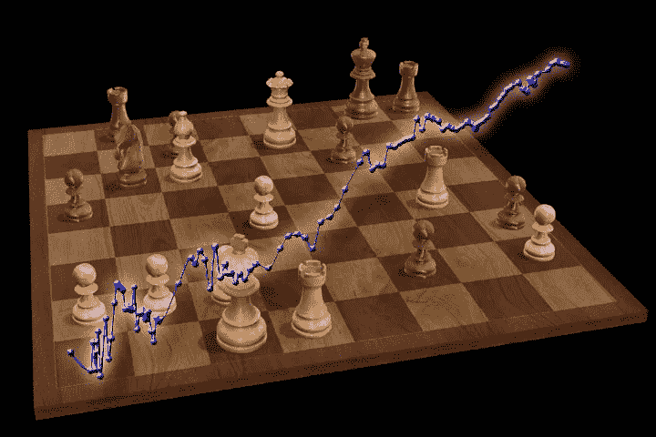

# 自学的游戏玩家真的聪明吗？

> 原文：<https://towardsdatascience.com/are-self-learning-game-players-truly-intelligent-d8e705da993f?source=collection_archive---------16----------------------->

## 对于非专家来说，我们如何理解这个问题？

自学程序，比如 [Alpha Zero](https://deepmind.com/blog/alphazero-shedding-new-light-grand-games-chess-shogi-and-go/) 和它的开源兄弟 [Leela Zero](http://lczero.org/) ，是智能的吗？这种智能与传统的国际象棋引擎，如世界上最强的国际象棋选手 [Stockfish](https://stockfishchess.org/) 的智能有任何有意义的区别吗？

人工智能领域背负着对智能的主观定义:如果你能解释它，那么它就不是智能的。为了避免这种神秘主义，我们试图提出一个更客观的定义。使用[马尔可夫决策过程](https://en.wikipedia.org/wiki/Markov_decision_process)的形式主义，“智能是一个能够感知和操纵其环境以实现其目标的代理”。这在“它”的定义上是有问题的；但是为了玩游戏的目的，我们可以把一个玩家(代理人，“自我”)和游戏(环境)区别开来。

根据这个定义，我们能说 Leela(自我学习的棋手)比 Stockfish(人类编码的棋手)更聪明吗？根据我们的定义，我认为它们同样聪明:它们都由一个评估函数、一个树形搜索和一些时间控制逻辑组成。两者的目标完全相同(将死；或者，如果不行，就抽签)。截至目前，Stockfish 在实现这一目标方面略胜一筹；但这种差异是微不足道的。

在这两个程序中，树搜索和时间控制逻辑都是由人来编码的。对于库存鱼来说，评估功能是通过人类的作用进化而来的。对 Leela 来说，它是通过一个自我游戏的过程进化而来的(这个过程本身是由人类编写的)。

如果我们认为 Leela 和 Stockfish 只是下棋的代理人，那么他们都是聪明的；或者都不是。没有什么有意义的区别。但是，如果我们扩大作为主体的“它”的范围，把创造玩家的过程包括进来，那么我们也许可以开始梳理出是什么使一个人聪明，而另一个人不聪明。

所以考虑一下，作为我们的两个代理人，创造 Stockfish 的系统和创造 Leela 的系统。他们的环境是怎样的；我们如何描述他们的机构？环境不再是一盘棋；但是它却变成了一系列的游戏和玩家。我们的“代理”通过观察和更新它的玩家(或多个玩家)进行交互，而不是通过玩游戏本身。

当 Stockfish 下棋时——特别是当它输了的时候——人类会分析哪里出错了；并建议对其源代码中包含的规则进行更改。因此，下棋是一种感官行为，它允许更新代理人的状态。

相比之下，莉拉只能通过自娱自乐来学习。与外部对手玩游戏并不是导致玩家代理更新的感官行为。显而易见的结论是，在这个更广泛的环境中，莉拉不是一个有意义的代理人。Leela 的自我学习可能是一个非常成功的自我关注练习，即机器学习，但作为一个系统，它没有表现出任何能动性，因为它没有感觉到周围的环境。

当然，我们可以进一步扩展我们的范围，把自学系统的程序员也包括进来；但是那样我们就会失去 Leela 作为自学代理的概念。

那么，怎样才能证明自学的 Leela 实际上是一种智能，在某种意义上是一种操纵环境实现目标的智能体呢？如果环境是迭代游戏，那么我们的代理需要感知环境，并使用这些观察来实现培养赢得更多游戏的玩家的目标。理想情况下，它还会从该环境中感知游戏规则；但我不会说这是必要的。

到今天为止，我的结论是，Stockfish 展示了塞尔的[中国房间](https://en.wikipedia.org/wiki/Chinese_room)的超人智慧(内部人类对它正在解决的问题确实有一些有限的理解)；但是莉拉(和阿尔法零)没有。

然而，我很乐观。AI 研究人员正在积极研究这些问题:例如，使用逆向强化学习。如果在 2019 年看到一个真正智能的游戏代理，我一点也不会感到惊讶:一个不仅从与硬编码模型的自我游戏中学习的代理；而且与其他这样的代理交互(合作或竞争)以探索规则。如果我们的唯一目标是创造世界上最强的棋手，就不需要这样的智力；但是，随着我们越来越多地将这些人工智能嵌入到我们的日常生活中，我们将需要能够学习并适应我们称之为“现实”的不断变化的游戏规则的系统。