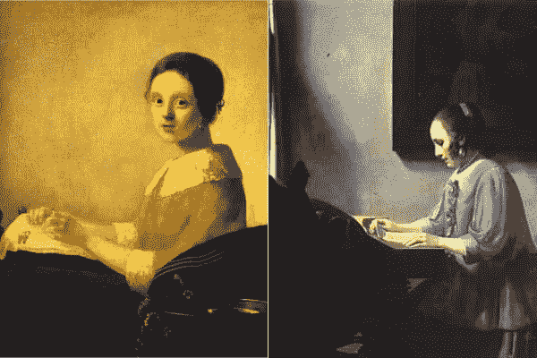
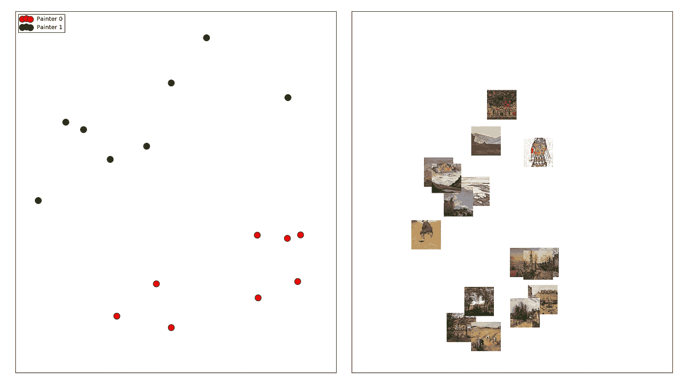
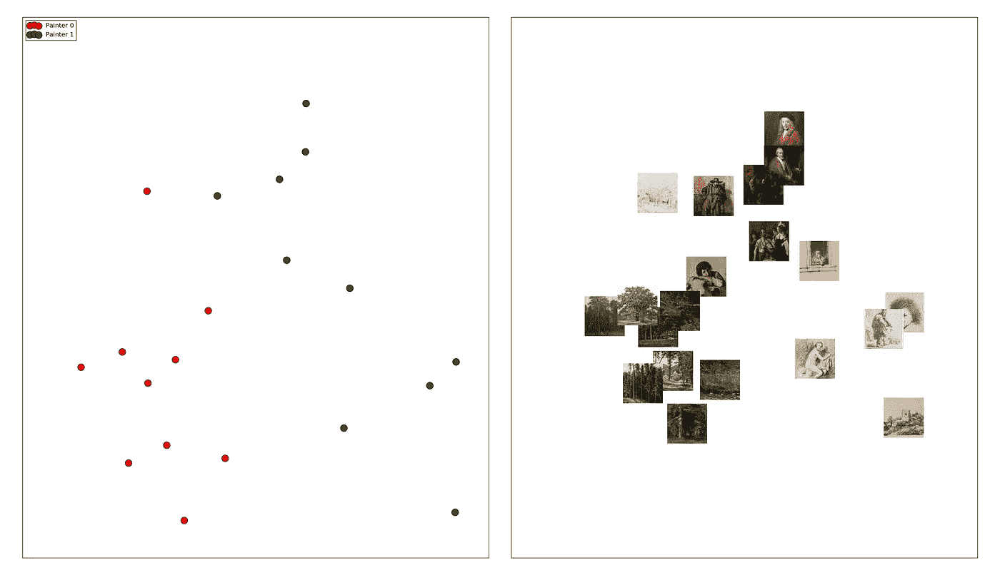
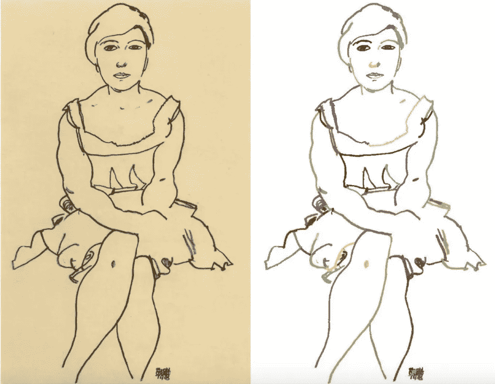
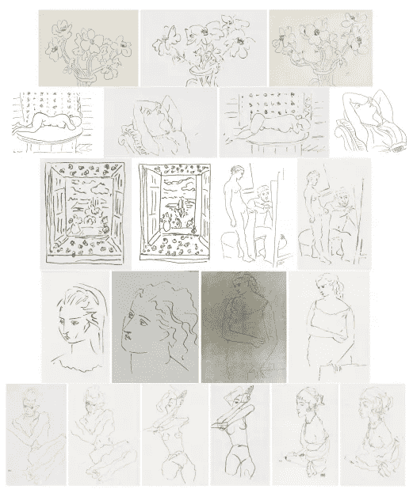

# 机器学习时代的艺术鉴赏

> 原文：<https://towardsdatascience.com/art-connoisseurship-in-the-age-of-machine-learning-d72e8a3716df?source=collection_archive---------5----------------------->

作为一名数据科学新手，我对真正的数据科学家如何解决现实世界的问题很感兴趣。阅读了许多张贴在 [Kaggles](https://www.kaggle.com/datasets?utm_medium=paid&utm_source=google.com&utm_campaign=datasets+houseads&gclid=CjwKCAjw14rbBRB3EiwAKeoG_xw3LTSbvufEcN4dPvWdhi3g_rtLGW8AiQGrGgaZC5QOHHmxu7dg5xoCehMQAvD_BwE&dclid=CNmNwp_HztwCFcQNNwode5IIdA) 上的挑战，我在寻找这些专家如何应对有趣比赛的见解。一个让我吃惊的挑战是[“数字画家”](https://www.kaggle.com/c/painter-by-numbers)挑战。它要求参赛者开发一个程序，可以识别同一位艺术家的画作。

Left: “The Lacemaker”, van Meegeren, 1925, courtesy of the [National Gallery of Art](http://www.nga.gov/), Washington D.C.. Right: “Lady Reading Music”, van Meegeren, 1936, courtesy of the [Rijksmuseum](http://www.rijksmuseum.nl/), Amsterdam.

几行代码怎么能开发出和专家一样的‘眼力’呢？作为一个自称艺术史爱好者，我对此表示怀疑！如果我很难通过一个关于赝品的 [Buzzfeed 测试](https://www.buzzfeed.com/jamiejones/can-you-spot-the-real-artwork-from-the-fake?utm_term=.oeJqq9dor#.xenppzYxa)，那么计算机如何能在识别赝品方面做得更好？

专家们训练了多年来寻找艺术家的手留下的唯一标识符。这些专家用他们的眼睛，他们的直觉，通常还有大量的科学来鉴定艺术品和赝品。那么，计算机能代替他们的专业知识吗？一个算法能告诉我们两幅画是不是同一个笔刷画的吗？

首先也是最重要的一点是，为什么电脑能区分两幅画很重要？艺术品市场不受监管、不透明且不正规，这使得它容易受到各种层面的操纵，尤其是伪造。2017 年的总销售额不到 640 亿英镑，艺术品的买卖是一项大生意。艺术市场总是依赖专家和可疑的鉴赏科学来确认作品的真实性。艺术品伪造诉讼价格昂贵，伪造艺术品多年来一直是困扰博物馆和收藏家的问题，随着人工智能的进步，检测赝品变得更加可扩展和负担得起。

回到[“数字画师”](http://blog.kaggle.com/2016/11/17/painter-by-numbers-competition-1st-place-winners-interview-nejc-ilenic/)，挑战包括 79，433 个实例，训练集中有 1，584 个独特的画师，需要对大约 2200 万对测试集进行预测。这项挑战的获胜者 [Nejc Ilenic](http://blog.kaggle.com/2016/11/17/painter-by-numbers-competition-1st-place-winners-interview-nejc-ilenic/) 首先通过清理他的数据集来完成这项任务，在这种情况下，是艺术品图像，然后他创建了一个模型，提取画家的独特风格，并教会机器学习与艺术家类别相关的这些特征。最后，为了测试他的模型，他使用了一种算法来可视化数据，以比较这些测试集对的输入实例有多相似。

[下图所示的两个散点图](https://github.com/inejc/painters)，提供了 Nejc 的程序如何能够区分不同的艺术风格和同一艺术家的群体作品的可视化，即使模型在训练阶段没有看到这些作品的例子。

就个人而言，挑战中最有趣的部分是机器能够多好地识别约翰内斯·维米尔和韩·范·米格伦作品之间的差异。如下图所示，这两位艺术家作品的相似之处，外行人几乎难以分辨。韩·范·米格伦伪造弗米尔的画作是最富传奇色彩的艺术仿冒故事之一，他出售二战前荷兰画作的仿制品，赚了 3000 万美元(经通货膨胀调整后)。尽管范·米格伦用这位 17 世纪荷兰大师的赝品骗过了许多专家，但他没能骗过电脑。因为维梅尔的画与他的其他作品更相似，而范·米格伦从几个不同的艺术家那里复制了他的风格，所以 Nejc 的程序能够识别范·米格伦数据集中的不一致，并从范·米格伦的作品中识别维梅尔的作品。

Left: Woman reading a letter, Johannes Vermeer, 1662–1663, courtesy of the [Rijksmuseum](http://www.rijksmuseum.nl/), Amsterdam. Right: Woman Reading Music, by Han van Meegeren, 1935–1936, [Rijksmuseum](http://www.rijksmuseum.nl/), Amsterdam

在阅读了《数字画家》(Painter by Numbers)之后，我对技术如何能够识别赝品产生了兴趣，于是我扩大了研究范围，看看是否有任何创新的方法可以在艺术领域利用数据科学。谢天谢地，谷歌没有让人失望。我发现了一篇由罗格斯大学和荷兰绘画修复与研究工作室的研究人员撰写的论文，题目是[“毕加索、马蒂斯还是赝品？
笔画级别的图纸自动分析，用于属性和认证](https://arxiv.org/pdf/1711.03536.pdf)这项研究发表了名为[递归神经网络](/an-introduction-to-recurrent-neural-networks-72c97bf0912) (RNN)的人工智能如何通过比较构成图像的笔画来发现伪造艺术品的发现。通过将画作分解成一行行的笔触，RNN 学会了这些笔触的特征，这些特征对于识别艺术家非常重要。同时，一个机器学习算法被训练来寻找这些特征，如每一笔的线条粗细，以识别艺术家。人工智能和机器学习的结合方法协同工作，使研究人员能够在 80%的情况下识别图像的艺术家。

Examples of segmentation results. Schiele ink drawing. — best seen in color

为了测试系统识别假货的能力，研究人员还委托艺术家创作与数据集中的作品风格相同的画作。该系统能够识别每一个实例中的伪造品，只需查看一个笔画，如下例所示。

From page 7 of ‘Picasso, Matisse, or a Fake? Automated Analysis of Drawings at the Stroke Level for Attribution and Authentication,’. Examples of fake dataset mixed with real drawings. Key: Fake, Fake, Matisse Matisse, Fake, Fake, Matisse Fake, Matisse, Picasso, Fake Fake, Picasso, Picasso, Fake Schiele, Fake, Fake, Schiele, Schiele, Fake

艺术史是一个有着几个世纪传统的领域；然而，[随着人工智能](https://www.artsy.net/article/artsy-editorial-these-four-technologies-may-finally-put-an-end-to-art-forgery)的许多令人兴奋的进步，我很兴奋地看到这项技术将如何在美术世界中实现。“这台机器比人眼有优势，因为它可以分析成千上万的单个中风，并从统计上描述它们的特征，”进行这项研究的科学家之一艾哈迈德·埃尔加马尔说。“如果我们训练机器根据艺术家有意或无意渲染的特征来识别风格，我们将能够检测出赝品。”

想一想这个:一个可以在线条和笔触中检测出艺术家潜意识的算法。祝你好运，范·米格伦先生！

能够向该领域的专家学习解决问题的过程是很有见地的。阅读数据科学家如何应对现实世界的挑战，让我看到了我每天学习的课程如何与数据科学和机器学习领域正在发生的事情的更大图景相关联。