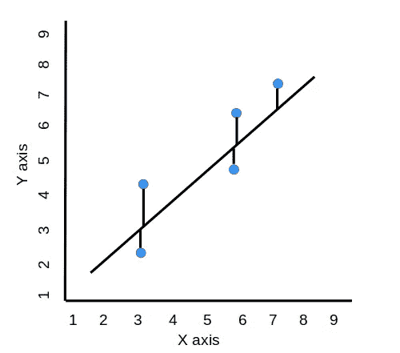

# 监督模型中选择指标的艺术第 1 部分

> 原文：<https://towardsdatascience.com/art-of-choosing-metrics-in-supervised-models-part-1-f960ae46902e?source=collection_archive---------5----------------------->

评估结果可能是每项研究中最重要的部分，因为它展示了你有多准确，你离你的目标有多近。因此，选择合适的性能指标对每个人来说都是一项具有挑战性的研究。

与其他科学领域相比，在机器学习问题中，选择正确的评估指标是一件棘手的事情。在这篇文章中，我将描述监督学习中常用的评估指标。

监督学习已经被广泛应用于机器学习问题中。当你有数据标签时，这是第一选择。就数据类型而言，监督学习分为两类:回归问题和分类问题。您的数据会直接影响您对一系列评估方法的选择。如果数据是离散的，那么预测方法应该从分类方法中选择；反之，如果数据是连续的，回归方法可能适合数据。因此，在监督模型中，无论数据是离散的还是连续的，我们的选择都变得不同；例如，在回归方法中，人们通常使用像平均绝对误差和均方根误差这样的指标。精确度、召回率、F1 值和准确度是分类中经常使用的一些度量。

在本文的剩余部分，我将描述和比较两个最常见的持续评估度量，然后将研究它们的应用。

# **1- MAE(平均绝对误差):**

MAE 是用于计算误差的最常见的指标之一。它衡量应用于连续变量的模型的性能。所以为了计算 MAE，我们首先应该知道这里的误差是什么意思。误差是模型的预测误差:

Residual or Prediction Error

我们应该为每一行数据计算这个值，然后取它们的绝对值，最后计算所有绝对预测误差的平均值。MAE 的公式是:

MAE Formula

如果我们画一个回归问题的散点图，MAE 就是预测值(回归线上的值)和实际值之间的垂直距离。

Scatter Plot of Samples and Errors

在上图中，垂直黑线表示误差值，MAE 是它们绝对值的平均值。因此，我们应该记住，MAE 不考虑数据的方向，也是线性得分，这意味着所有单个误差(垂直线)在平均值中的权重相等。

# **2- RMSE(均方根误差):**

除了 MAE 之外，均方根误差(RMSE)是另一种常用于回归问题的测量方法，它可以告诉您模型的表现如何。和梅一样，这里预测误差是 RMSE 公式的最重要部分。

RMSE Formula

该指标显示了误差项的合理大小，如果我们尝试用另一种方式来说，它就是预测误差或残差的标准偏差(它很好地显示了大量偏差)。显然，这种方法向我们展示了数据是如何集中在回归问题的最佳拟合线上的。

RMSE 和梅都关注预测误差，但都不考虑误差的方向。然而，它们之间存在一些差异；最显著的区别是，RMSE 在第一步中取残差的平方，然后取它们的平均值。这意味着它为较大的预测误差分配更多的权重，尽管 MAE 认为所有残差的权重相同；所以我们可以看到 RMSE 证明了预测误差的标准差，换句话说，RMSE 与误差频率分布的方差直接相关。

## 所以我知道每一个的定义，但是当选择哪个的时候呢？

嗯，你想听我的意见，我会说我们可以很容易地回答这个问题，让我们用一个例子来深入探讨。

Table of Example

正如你在上面的表格中看到的，有三个案例，我们的目的是调查梅和 RMSE。在第一行中，一切看起来正常，并且已经计算出了 MAE 和 RMSE 的值，然而，在第二行中，最后一个误差离其他误差太远(这可能意味着最后一个样本是异常值),并且如给定表格中所示，RMSE 的值比 MAE 大得多。最后在最后一行，我们发现所有的误差都相等，当然 RMSE 的值不会大于平均误差。

## 那么在前面的例子中发生了什么呢？

正如我们之前提到的，RMSE 认为更大的错误有更大的权重，这意味着它对更大的错误的惩罚比 MAE 更多，正如我们在表中可以发现的那样，当我们比较表中前两行的这两个指标的值时，我们清楚地看到 RMSE 比 MAE 对大错误有更严格的行为，也就是说，它告诉我们 RMSE 对样本的错误分布很敏感。如果我们比较最后两列，我们会看到 RMSE 的值总是大于或等于梅的值，只有当所有残差都相等(或为零)时，这些值才相等。

## 比较和对比:

这两个指标本质上是相同的。它们中的每一个都应用于连续数据，并且都使用预测误差，但是它们以不同的方式表现预测误差。RMSE 采用误差平方，这使得它对误差分布中的异常值敏感，并且也使得该度量成为误差分布的良好表示。我们可以说它是正态分布样本的合适度量。T. Chai 和 R. Draxler 在 2014 年的出色研究中证明，随着样本数量超过 100，RMSE 可以重建误差分布。RMSE 相对于 MAE 的首要优势可能是，RMSE 不使用绝对误差，这在我们旨在最小化成本函数或优化模型性能时是非常不可取的，因为 RMSE 使用平方误差，我们可以出于上述目的计算它们的梯度，但是，当我们使用 MAE 时，计算绝对误差的梯度变得很困难。因此，在计算模型误差敏感性或数据同化的情况下，RMSE 绝对优于 MAE。相反，当我们想要识别不同模型之间的区别或区分模型时，MAE 工作得更好，因为 MAE 不能被大量的错误充分地反映出来，相反，正如我们在前面说过的，RMSE 赋予它们更多的权重。

# 结论:

RMSE 和 MAE 是连续数据的评估指标，通常用于回归问题。这些指标各有利弊，通常没有一个是赢家，因为它很大程度上取决于你试图解决的问题和你的目标是什么。值得注意的是，有一件事我们应该记住:据我所知，仅使用一个评估指标可能无法完全衡量您的模型的性能，通常最好使用多个指标并将结果放在一起比较，以获得更好的洞察力。

嗯，我想这差不多就是这些度量标准的差异和相似之处，它们经常被用在回归问题中。我将感谢你花时间阅读这篇文章。在下一篇文章中，我将描述分类问题中常见的评估指标。同时，我期待着听到你的评论。

# 参考资料:

[https://www . researchgate . net/publication/272024186 _ Root _ mean _ square _ error _ RMSE _ or _ mean _ absolute _ error _ MAE-_ Arguments _ against _ avoiding _ RMSE _ in _ the _ literature](https://www.researchgate.net/publication/272024186_Root_mean_square_error_RMSE_or_mean_absolute_error_MAE-_Arguments_against_avoiding_RMSE_in_the_literature)

 [## 均方根误差

### 均方根误差

皇家 Errorstatweb.stanford.edu 号](http://statweb.stanford.edu/~susan/courses/s60/split/node60.html)  [## RMSE:均方根误差

### 回归分析> RMSE:均方根误差均方根误差(RMSE)是…

www.statisticshowto.com](http://www.statisticshowto.com/rmse/)  [## 绝对误差和平均绝对误差

### 测量误差>绝对误差绝对误差是测量中的误差量。这就是区别…

www.statisticshowto.com](http://www.statisticshowto.com/absolute-error/)  [## 平均绝对误差-维基百科

### 在统计学中，平均绝对误差(MAE)是两个连续变量之间差异的度量。假设 X 和 Y…

en.wikipedia.org](https://en.wikipedia.org/wiki/Mean_absolute_error)