# 生成对抗网络(GAN)-人工智能-“猫和老鼠的游戏”

> 原文：<https://towardsdatascience.com/art-of-generative-adversarial-networks-gan-62e96a21bc35?source=collection_archive---------9----------------------->

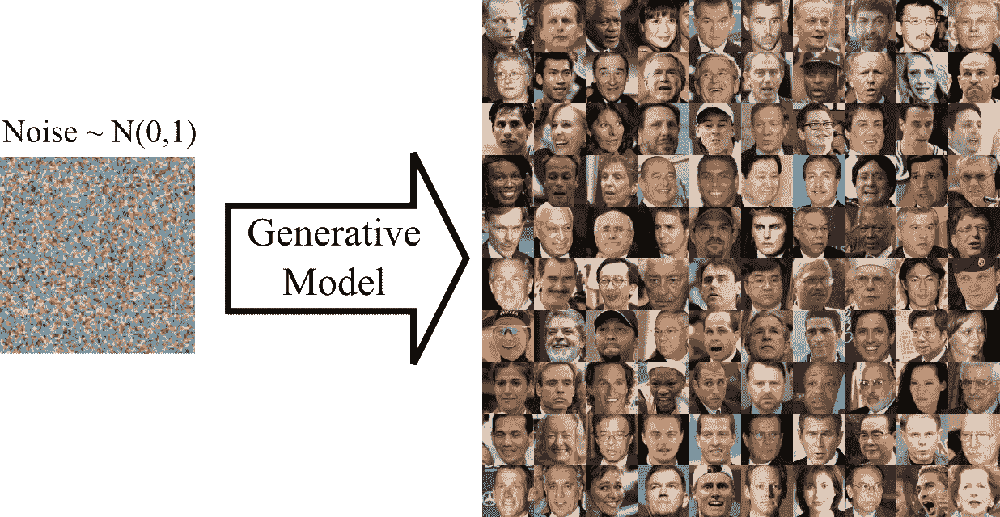

**Art of Generative Adversarial Networks**

帖子中提到的所有作品的代码链接:-

 [## pankajkishore/代码

### 在 GitHub 上创建一个帐户，为 pankajkishore/代码开发做出贡献。

github.com](https://github.com/pankajkishore/Code) 

我们有幸参与了商业数据科学课程的最终项目“生成对抗网络”项目。虽然我们可以选择任何其他主题作为我们的最终项目，但我们继续挑战训练 GAN 从由 880 张大小为 28*28 的 X 射线图像组成的数据集学习生成 X 射线图像。该项目由 Pankaj Kishore、Jitender 和 Karthik 完成。我们最初的想法是探索 GAN，并在此过程中使用 Tensorflow 编写我们自己的代码来训练 GAN 生成 X 射线图像。我将简要介绍一下我们项目的旅程。

# **数据收集**

第一步是为鉴别器收集足够数量的训练数据集来训练我们的神经网络。我们从下面提到的网站中提取数据:-

 [## 箱子

### 编辑描述

nihcc.app.box.com](https://nihcc.app.box.com/v/ChestXray-NIHCC/folder/37178474737) 

一旦我们有了足够数量的数据，我们就尝试使用 GAN 进行探索，并对现有数据集实施 GAN，以学习并在我们的数据集上应用相同的实施技术。

# **初学**

## 1.MNIST 数据集

我们首先通过 MNIST 数据集进行了探索，并找到了足够的在线资源来在 MNIST 数据集上训练我们的第一个 GAN 模型，这被认为是最容易训练的。事实证明，当我们探索代码并理解 GAN 背后的基本原理时，训练它确实非常容易，而且是一种很好的学习体验。我们在 MNIST 数据集上尝试了 GAN 的许多变体。我们尝试的各种变化如下:

> 香草甘
> 
> 条件 GAN
> 
> 瓦瑟斯坦·甘
> 
> DCGAN
> 
> VAE

我们获得的结果质量非常好，我们只需稍微调整一下代码就能达到这个结果。我们有趣地发现，为生成器添加更多的隐藏层对图像质量没有影响。我们也尝试了变分自动编码器(VAE)，从下面的链接引用 Ashish Bora 的代码，得到了足够好的结果。

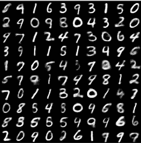

DCGAN

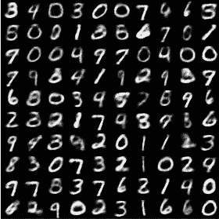

VAE generated Image

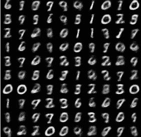

**MNIST at different Epochs through VAE**

 [## AshishBora/csgm

### 复制论文结果的代码:“使用生成模型的压缩感知”。- AshishBora/csgm

github.com](https://github.com/AshishBora/csgm) 

**2。时尚 MNIST**

我们在时尚 MNIST 数据集上尝试了 MNIST 的相同变化，并且成功地能够为不同的分类器项目生成图像。这导致我们的兴趣转向更大的魔鬼，那就是为 X 射线图像编写我们自己的代码，看看我们是否能为我们的图像编写同样的代码。我们从深入了解甘开始，并乐于分享在整个旅程中学到的几个关键概念。适合我们的架构如下

为时尚 MNIST 代码生成的图像:-

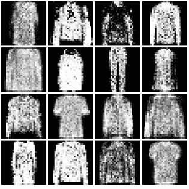

99000 epochs

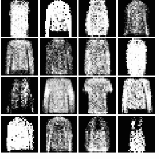

60000 epochs

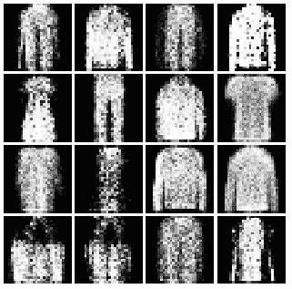

40000 epochs

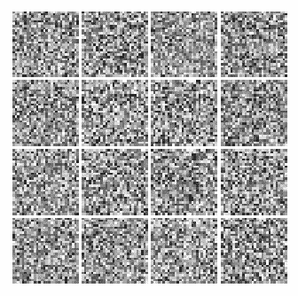

**Fashion MNIST GIF at different epochs**

# **生成性对抗网络概述**

除非你在过去一年左右的时间里一直住在小屋下，否则深度学习领域的每个人——甚至一些没有参与深度学习的人——都听过并谈论过 GANs。GANs 或生成对抗网络是深度神经网络，是数据的生成模型。这意味着，给定一组训练数据，GANs 可以学习估计数据的潜在概率分布。这非常有用，因为除了其他事情之外，我们现在可以从学习到的概率分布中生成样本，这些样本可能不存在于原始训练集中。

生成对抗网络实际上是两个相互竞争的深层网络。给定一个训练集*(比如几千张猫的图像)，生成器网络***【G(X)***，将一个随机向量作为输入，并尝试生成与训练集中的图像相似的图像。鉴别器网络 ***D(x)*** 是一个二元分类器，它试图根据训练集 ***X*** 来区分真正的猫图像和生成器生成的假猫图像。因此，生成器网络的工作是学习数据在 ***X*** 中的分布，以便它可以产生真实的猫图像，并确保鉴别器不能区分来自训练集的猫图像和来自生成器的猫图像。鉴别者需要学习跟上生成器，不断尝试新的技巧来生成假的猫图像并愚弄鉴别者。*

*最终，如果一切顺利，生成器(或多或少)会了解训练数据的真实分布，并变得非常擅长生成真实的猫图像。鉴别器不再能够区分训练集 cat 图像和生成的 cat 图像。*

*从这个意义上说，这两个网络不断地试图确保对方没有很好地完成他们的任务。那么，这到底是怎么回事呢？*

*另一种看待 GAN 设置的方式是，鉴别器试图通过告诉发生器真实的猫图像是什么样子来引导它。最终，生成器发现了它，并开始生成看起来真实的猫图像。训练 GANs 的方法类似于博弈论中的最小最大算法，两个网络试图实现所谓的相对于彼此的纳什均衡。*

*发生器和鉴别器之间发生的事情这里是一个 [*2 人零和游戏*](https://en.wikipedia.org/wiki/Zero-sum_game) *。*换句话说，在每一步中，生成器试图最大化鉴别器对图像进行错误分类的机会，而鉴别器反过来试图最大化其对输入图像进行正确分类的机会。*

**

*A simple flowchart of a GAN*

*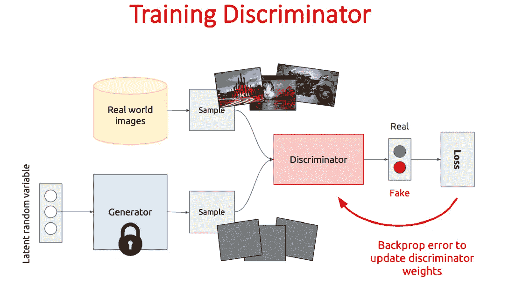*

*Discriminator*

**

*Generator*

*一旦我们学会了这些课程，我们就开始动手实践并写出我们自己对所学概念的实现。*

## *网络背后的数学*

*深度学习或机器学习都是关于[优化函数](https://en.wikipedia.org/wiki/Mathematical_optimization)或者特别是最小化算法的损失。我们用梯度下降来实现。*

*假设 X 是我们的真实数据集，Z 是正态分布噪声。设 *p(z)* 为来自潜在空间 z 的数据 *G* 和 *D* 分别为生成网络和判别网络的可微函数。 *D(x)* 表示数据来自真实数据集 x 的概率，我们训练 D 使概率 *log(D(x))* 最大化，训练 G 使 *log(1 — D(G(z))最小化。*简而言之，它们彼此进行如上所述的最小最大博弈，并获得全局最优。*

**

*GAN ( Loss function )*

*上述功能为我们的生成性对抗网络提供了损失功能。现在，需要注意的是*log(1-D(G(z))*会饱和，所以我们不会最小化它，而是最大化 *log(D(G(z))。**

*为了证明生成网络生成的样本与 X 完全相同，我们需要在数学上更深入，使用 [Kullback-Leibler 散度](https://en.wikipedia.org/wiki/Kullback–Leibler_divergence)定理和 [Jensen-Shannon 散度](https://en.wikipedia.org/wiki/Jensen–Shannon_divergence)。*

*使用的来源:-*

* [## 生成对抗网络-简单介绍。

### 现在人们对深度学习的研究如此热情。这样的结果，每天或每月都有一个新的…

medium.com](https://medium.com/@rajatgupta310198/generative-adversarial-networks-a-simple-introduction-4fd576ab14a) 

# **生成 X 射线图像:-**

**问题陈述:-**

重要特征的高质量描绘是用于疾病的精确诊断和/或评估的生物医学图像解释中的关键组成部分。通过利用大量的训练图像，基于卷积神经网络(CNN)的深度学习(DL)技术已经被证明在图像分类和分割任务中非常成功，在生物医学图像解释中潜在地承诺更高的吞吐量和更一致的结果。由 DL 增强的计算机化工具被迅速证明是提高生物医学图像解释准确性的最先进的解决方案。此外，研究人员已经报告了生成对抗网络(GAN)模型的成功训练，以生成合成训练图像，作为解决训练集稀缺的潜在解决方案。

下图显示了 GAN 网络的基本概念。在图片中，生成器试图产生合成图像来欺骗鉴别器，而鉴别器试图将合成图像与真实图像区分开来。

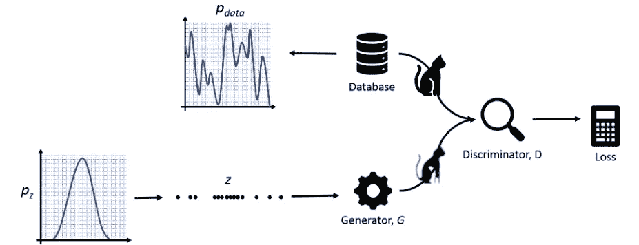

General GAN architecture

# 当前的挑战

为深度学习训练 CNN 通常需要大量标记的训练图像数据，由于专家标注的费用，这在生物医学领域仍然是一个挑战。虽然研究人员已经报告了生成对抗网络(GAN)模型的成功训练，以生成合成图像作为解决训练集瓶颈的潜在解决方案，但是及时训练 CNN 和 GAN 可能需要领域专家的编程经验和技能集。我们的目标是为最终用户提供一个简化的工作流程，以促进快速利用 GAN 网络为 DL 培训制作合成放射学图像

# **提出的解决方案**

我们尝试实现 GAN 来生成 X 射线图像，并开始为生成器和鉴别器创建简单的函数。我们最初为鉴别器和生成器设计了三层。使用的激活函数是发生器的泄漏 relu 和鉴别器的 relu。使用 glorot_init 函数将随机噪声也输入到真实图像中。我们通过使用批量标准化调整和缩放激活来标准化输入层。

鉴别器和发生器的损失函数如下

#损失函数

> disc _ loss = TF . reduce _ mean(TF . nn . sigmoid _ cross _ entropy _ with _ logits(logits = r _ logits，labels = TF . ones _ like(r _ logits))+TF . nn . sigmoid _ cross _ entropy _ with _ logits(logits = f _ logits，labels=tf.zeros_like(f_logits))
> 
> gen _ loss = TF . reduce _ mean(TF . nn . sigmoid _ cross _ entropy _ with _ logits(logits = f _ logits，labels=tf.ones_like(f_logits)))

鉴别器和生成器的步距和学习步骤如下

gen _ step = TF . train . rmspropoptimizer(learning _ rate = 0.001)。最小化(gen_loss，var_list=gen_vars) # G 训练步骤

disc _ step = TF . train . rmspropoptimizer(learning _ rate = 0.001)。最小化(disc_loss，var_list=disc_vars) # G 训练步骤

我们编写了一个简单的函数来产生随机噪声(假图像),并将其与真实图像一起提供给鉴别器。使用的时期是 1000，我们第一次训练神经网络的样本数是 851，下一次是 5000 个样本(下采样数据集)。我们得到的输出图像真的是噪音，我们意识到了错误，为什么我们没有得到正确的输出。来自我们代码的图像截图:-

Input Images to Discriminator

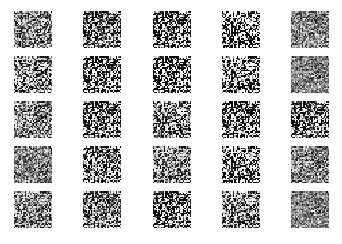

Output Image generated

导致发电机实际上什么也没学到的潜在原因有很多，仅举几个例子

> **输入鉴别器的低分辨率质量图像**
> 
> **将实际的 1240*1240 图像下采样为 28*28**
> 
> **没有足够的数据集供神经网络学习**
> 
> **梯度下降消失问题，因为鉴别器太成功了，以至于发生器梯度消失并且什么也没学到**
> 
> **模式崩溃:发生器崩溃，产生有限数量的样本**

我们尝试的越多，从上面的样本中产生的空白越多，输出就越好。即使经过无数次尝试，我们也无法从 GAN 中生成高质量的图像，因为我们拥有的数据集存在局限性。

# **口袋妖怪一代**

在尝试从 NIH 网站创建 X 射线图像失败后，我们想到尝试我们的代码来生成口袋妖怪，以确保这可能是一个数据集问题。不幸的是，我们取得了不错的成绩，但不是很好。下面是从我们的 X 射线代码生成的口袋妖怪

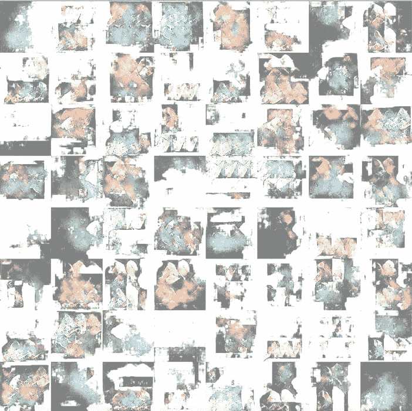

**Pokemon’s from X-ray code**

肯定比 x 光图像好。然后，我们试着运行由一个流行的机器学习程序 Youtuber Siraj Raval 创建的代码(这是他从 moxiegushi 借来的)。

 [## llSourcell/口袋妖怪 _GAN

### Pokemon _ GAN——这是 Siraj Raval 在 Youtube 上发布的“用一个生成对抗网络生成 Pokemon”的代码

github.com](https://github.com/llSourcell/Pokemon_GAN) 

代码需要稍微修改，以适应从 Kaggle 网站收集的 851 个口袋妖怪的更高级的数据集。代码被修改，以处理更高分辨率的口袋妖怪以及训练鉴别器。结果是惊人的，尽管它需要很多时间来运行。代码的架构如下

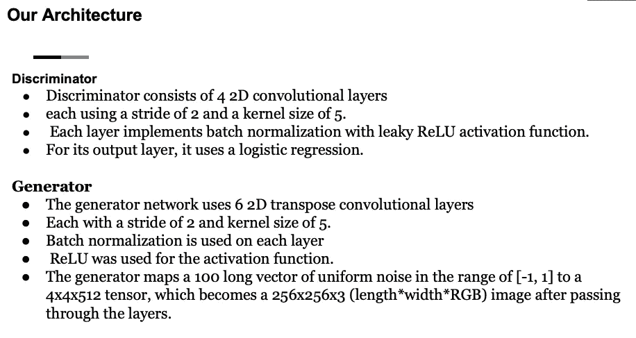

Architecture for Pokemon

# 关于鉴别器

在`DCGAN`架构中，鉴别器`D`是卷积神经网络(`CNN`)，它应用许多过滤器从图像中提取各种特征。鉴别器网络将被训练以区分原始图像和生成的图像。卷积的过程如下图所示:

# 关于发电机

被训练来生成图像以欺骗鉴别器的生成器 G 被训练来从随机输入生成图像。在 DCGAN 架构中，发生器由对输入进行上采样的卷积网络表示。目标是处理小的输入，并产生大于输入的输出。它的工作原理是将输入扩展到中间为零，然后在这个扩展区域上进行卷积处理。该区域上的卷积将导致下一层的更大输入。向上采样的过程如下所示:

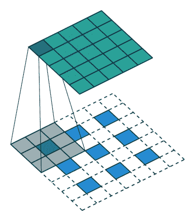

根据不同的来源，您可以找到上采样过程的各种注释。有时它们被称为全卷积、网络内上采样、分数步长卷积、反卷积等等。

# 发电机网络结构概述

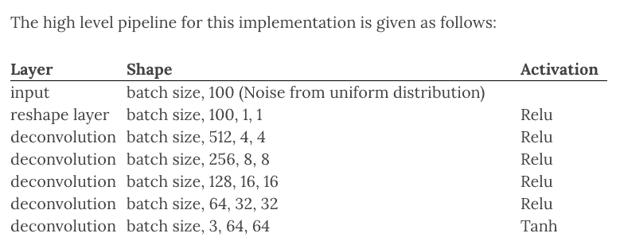

# DCGAN 超参数

每个人都注意到的一件事是，GANs 的计算成本非常高。人们通常忽略的是 GANs 相对于超参数是多么脆弱。gan 在某些参数下工作得非常好，但在其他参数下则不然。目前，调谐这些旋钮是网络架构设计艺术的一部分。我们决定采用的超参数如下:

# **超参数**

64 件的小批量

重量从标准= 0.02 升的正态分布初始化

Relu 斜率= 0.2

学习率= 0.0002 的 Adam 优化器

动量= 0.5

# **结果**

鉴于有限的时间和相关的成本，我们没有完全训练我们的模型，但口袋妖怪产生了 1300 个时代，我在下面附上:-

Pokemon after 1300 epochs

**Pokemon Generation for incremental Epochs**

# **项目的主要收获:-**

在这个项目上工作是一次很棒的经历，尽管它真的很有挑战性，但它打开了我们的视野，让我们看到了神奇神经网络可以提供的所有新的可能性。我们从错误中学到了很多，并意识到我们需要做的可能的修改，以使 GAN 为我们的 X 射线图像数据集工作。关键要点是

> **训练一只甘真的很难**
> 
> **为了获得更好的结果，我们需要结合其他因素进行批量标准化。**
> 
> **需要注意梯度下降和损失值，以确保没有发生器或鉴别器达到零值**
> 
> **Relu 激活功能是真正的朋友。**
> 
> **需要实施卷积网络，它们确实适用于大多数数据集，如果不是所有数据集的话**
> 
> 我们需要 GPU 来训练 GAN，除非你能等上几年，否则在 CPU 上训练是不可能的！！

# **未来前景:**

我们可以尝试很多事情，首先尝试生成质量为 64*64 的图像，而不是我们目前尝试生成的 256*256，看看这是否能提高图像质量。我们肯定会继续研究 X 射线图像，并尝试实现卷积神经网络，看看我们是否能生成更好的图像。收集大约 100，000 幅图像的训练数据可能有助于更好地训练 CNN 模型，并可能大大提高生成器图像的质量。虽然这可能会变得更加棘手和困难，但如果 CNN 工作得更好，我们会喜欢实现更高分辨率图像或彩色图像的解决方案，看看 GAN 的表现如何。我们甚至想尝试 X 射线图像的变化编码器，看看是否有所帮助。我们甚至想尝试我们在网上找到的东西，比如:-

> 迷你批次辨别:让生成器在一个“迷你批次”中对多个图像进行分类，而不是只对一个图像进行分类
> 
> 虚拟批次标准化:每个示例都基于参考批次的样本进行标准化

# **结论:**

这个项目确实为我们可以用神经网络尝试的许多实现提供了动力。它确实吸引了所有人的注意，很难不欣赏甘可能带来的无限可能性。在这个项目中，我们在使用 Tensorflow 或 cloud 方面确实学到了很多。我们意识到实际训练一个 GAN 是多么困难，即使事情可能在一个数据集上工作，也不一定意味着它在另一个给定的数据集上会以同样的方式工作。GANs 的概念并不难理解(即[理解生成性对抗网络](https://medium.com/@naokishibuya/understanding-generative-adversarial-networks-4dafc963f2ef))。但是实现它们以产生高质量的图像可能是棘手的。考虑到 GAN 的无限商机，我可以在未来陈述几个:-

GANS 可能用于:

> 监督学习:

*   根据{某些约束}尽可能准确地预测，例如公平性
*   不平衡分类中的数据扩充
*   离群点检测
*   向量-2-向量预测，例如具有任意损失的多标签预测，其不假设标签独立于特征的条件

> 半监督:

*   在现实生活的数据集中，经常会出现只有一小部分数据被标记的情况。

> 无人监督:

*   矩阵完成
*   嵌入

感谢大家的阅读！！希望你喜欢我们在 GAN 的天真尝试，我们真的希望继续工作，为任何数据集更新一些更棒的结果！！

**帖子引用的其他链接:**

[https://Phil Paradis . WordPress . com/2017/04/24/training-gans-better-understanding-and-other-improved-techniques/](https://philparadis.wordpress.com/2017/04/24/training-gans-better-understanding-and-other-improved-techniques/)

[NIPS 2016 GAN 教程](https://arxiv.org/abs/1701.00160)

[有条件的甘](https://arxiv.org/abs/1411.1784)*