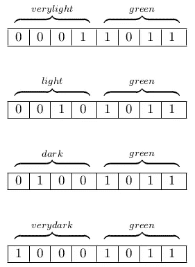
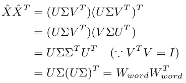
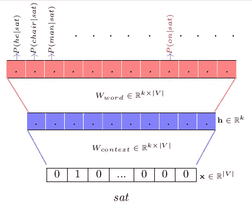
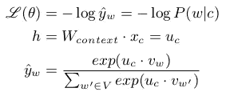
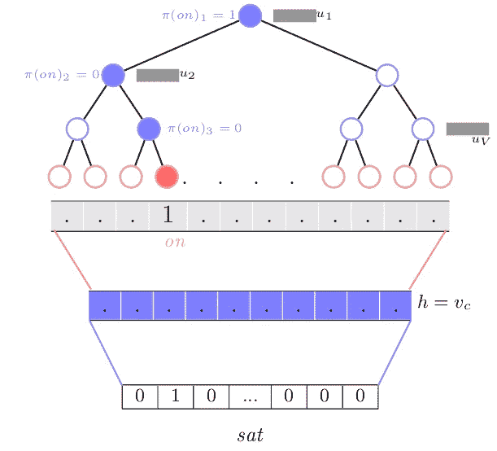
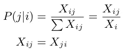
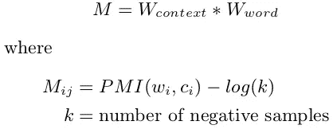

# 文字的矢量表现艺术

> 原文：<https://towardsdatascience.com/art-of-vector-representation-of-words-5e85c59fee5?source=collection_archive---------3----------------------->

用于表示语言词汇的符号的表达能力在语言学领域引起了极大的兴趣。实践中的语言都有语义歧义。

> 约翰吻了他的妻子，萨姆也吻了。

萨姆吻了约翰的妻子还是自己的妻子？为了以真实的形式表示信息，必须处理这些歧义。

那么，我们如何开发一个机器级别的语言建模任务的理解。经典的基于计数或基于相似性参数的方法在计算机科学中已经存在了相当长的时间。

但是，现在随着像 RNNs 这样的深度学习模型的出现，语言模型的这种表达能力对于创建有效的系统来存储信息和发现词汇术语之间的关系是非常有意义的。这将作为编码器-解码器模型(如序列到序列模型)中的基本块。

在这篇文章中，我们将探索不同的单词表示系统及其表达能力，从经典的 NLP 到现代的神经网络方法。最后，我们将以动手做编码练习和解释来结束。

对于读者来说，保持你的**标记在** &上标记重要的点。这是一个相当长的阅读与一些小的数学涉及概念解释从零开始。


The fundamental understanding of language will be different for machines.

机器更善于理解实际文本作为标记传递的数字。这个将文本转换成数字的过程被称为**矢量化**。向量然后组合形成向量空间，向量空间本质上是连续的，是一个代数模型，其中应用了向量加法和相似性度量的规则。存在不同的矢量化方法，让我们从最原始的到最先进的。

本文将讨论的表示模型有:

> 1.一键表达
> 
> 2.分布式表示
> 
> 3.奇异值分解
> 
> 4.连续词袋模型
> 
> 5.跳格模型
> 
> 6.手套表示

# 一个热门话题

为了定义一个系统的表征能力，我们首先要研究不同表征系统的工作方式。这些系统以向量的形式表示词汇表中的每个单词，并创建一个有限的向量空间。

让我们来看一个 ***一键式*** *表示单词的例子。每个单词用大小为|V|的大向量表示，即给定语料库的词汇大小。*


The representation of the i-th word will have a **1** in the i-th position and a **0** in the remaining |V | − 1 positions.

这是一种非常简单的表示形式，很容易实现。但是，即使从这样的小例子中，许多错误也会变得很明显。比如存储和处理这些向量需要巨大的内存。由于这些向量的稀疏性。比如|V|的大小就像 Google 1T 语料库的 3M 一样非常大。这种符号在由该系统的表示能力引起的计算开销方面将会失败。

此外，没有相似性的概念被捕获。余弦相似度 b/w 唯一字为零，欧几里德距离总是 sqrt(2)。意思是，没有语义信息被这个表达系统表达出来。

现在，很明显，我们应该转向一种既能节省空间又能保留一些语义能力来表达单词间关系的表示法。让我们看一个基于相似性的表示。

> 从一个人交的朋友，你就可以知道这个人说的话
> 
> —弗斯，J.R

# 单词的分布式表示

其思想是量化语料库中术语的共现。这种共现是用词周围的窗口大小“k”来测量的，这表示上下文以该窗口大小分布。考虑到这种方法，创建了一个 **术语×术语**的*共现矩阵，该矩阵捕获一个术语在另一个术语的上下文中出现的次数。此外，删除停用词也是一个很好的做法，因为这些是高频词，提供的有意义的信息最少。同样，我们可以为单词的 ***t*** 设置一个上限。*


现在，考虑以下语料库:

> 计算机应用的人机界面
> 
> 用户对计算机系统响应时间的看法
> 
> 用户界面管理系统
> 
> 改进响应时间的系统工程


Co-occurrence Matrix with window of size k=2\. Each row[column] of the co-occurrence matrix gives a vectorial representation of the corresponding word’s context.

这里，在上述情况下，如果停用词处理不当，它们将产生相对高频率的问题。因此，将使用被称为**正逐点互信息**的新数量，该数量考虑了相对和个体出现以及词汇的大小。


New transformed table with **PPMI** values

通过这种方法，我们能够对上下文有所了解，但这仍然不是一种理想的方法。考虑语料库中的示例“猫”和“狗”,但是它们不在窗口间隙内。很明显，猫和狗是有关系的，就像它们都是宠物和哺乳动物一样。这种方法不能提供任何关于它们之间关系的信息。

在上述情况下，{系统，机器}和{人，用户}之间的共现是不可见的。但是，它们在上述语料库的上下文中是相互关联的。

此外，随着词汇量的增加，高维度、矩阵的稀疏性和冗余性(*作为对称矩阵*)仍然存在。

# 奇异值分解

高维问题通过 PCA 或其广义形式 SVD 来解决。奇异值分解是将半正定正规矩阵的特征分解推广到任何矩阵，是对极分解的扩展。它给出了原始数据的最佳 k 阶近似。假设原始数据 **X** 的尺寸为 *m x n.* 奇异值分解将把它分解成最佳等级近似，从最相关到最不相关的信息中捕捉信息。


SVD theorem tells us that u1 ,v 1 and σ1 store the most important information in X. Subsequent terms stores less and less important information.

与此类似，颜色用 8 位表示。这些 8 位将为我们提供更高的分辨率。但是，现在我们只想将其压缩为 4 位。我们应该保留哪些位，低位的还是高位的？



当比特减少时，最重要的信息是识别颜色，而不是不同颜色的阴影。类似的分辨率将存在于不同的颜色，如红色、蓝色、黄色等。

就像只获取不同色调的信息一样，颜色没有任何意义，因为所有与颜色相关的信息都丢失了。因此，低位是最重要的。在这种情况下，SVD 会捕捉到这些低位。

有了 SVD，{系统、机器}和{人、用户}之间的潜在共现将变得可见。我们取 **X** 和 **X** *t、*的矩阵乘积，其第 I 项是单词 i (X[i :])的表示和单词 j (X[j :]) *的表示之间的点积。*第 ij 个条目 **X** ，**X**t*t*大致捕捉了单词 I，单词 j 之间的余弦相似度。


From product of **[XX***t] matrix a low rank matrix capturing important features is constructed.* the latent co-occurrence between {system, machine} and {human, user} has become visible. See, the **red** and **blue** parts in given figure.

我们希望*单词(I，j)* 的表示具有更小的维度，但是仍然具有与 **X** *hat 的对应行相同的相似性(点积)。因此，我们必须继续寻找更有力的表述。*

另外，请注意矩阵**w**t22】字=**uσ**的行之间的点积与 **X** ̂ *帽子的行之间的点积相同。*



**W***word* = **UΣ** ∈ **R** m×k is taken as the representation of the m words in the vocabulary and **W**context = **V** is taken as the representation of the context words.

# 连续的单词袋

我们看到的方法是基于计数的模型，如 SVD，因为它使用同现计数，该计数使用基于 NLP 原理的经典统计。现在，我们将转移到直接学习单词表示基于预测的模型。考虑一个**任务**，给定前一个 *(n-1)* 字，预测第 n 个*字。对于训练数据，可以使用训练语料库中的所有 n 词窗口，并且可以从任意网页抓取获得语料库。*

现在，如何对预测第 n 个字的任务建模呢？这项任务和学习单词表征有什么联系？为了模拟这个问题，我们将使用如下所示的前馈神经网络。



One-hot representation as input. |V| words possible as output classes.

我们的目标是预测这些|V|类的概率分布，作为一个多类分类问题。但是这看起来非常复杂，神经网络有非常多的参数。这是一种更简单的方法吗？

为此，我们需要稍微看看这个神经网络背后发生的向量乘法背后的数学。乘积 **W** *上下文* ***** x** 假设 **x** 是一个热向量。


Is simply, the i-th column of **W**context . A ont-to-one mapping exists b/w words & **W**context’s columns.

我们可以把 **W** *context* 的第 I 列作为 context*I .*For P*(on | sat)*与 **W** *context* 的*第 j 列*和*with**W***word 的* *列*之间的点积成正比。* P *(word = i|sat)* 因此取决于*与*
*列*的 **W** *字。*我们因此将**W**W*单词*的第*列*视为单词 *i.* 的表示。这清楚地显示了在神经网络架构中权重参数被表示为单词向量表示。

理解了参数背后的简单解释后，我们现在的目标是学习这些参数。对于多类分类问题，使用 **softmax** 作为输出激活函数，使用**交叉熵**作为损失函数。



**u**c is the column of **Wcontext** corresponding
to context word **c** and **v**wis the column of
**Wword** corresponding to the word **w.**

让我们看看我们能从上面的损失函数的更新规则中解释什么。将 *yhat* 的值放入损失函数中，并对其进行微分，以导出梯度更新规则。


When **yhat is 1**, already corrected word predicted. Hence, no update. & when it is **0,** **vw** gets updated by fraction of **uc** added**.**

这增加了 *vw* 和 *uc* 之间的余弦相似度。因为，训练目标确保单词 *(vw)* 和上下文单词 *(uc)* 之间的余弦相似度最大化。因此，相似性度量也由这种表示来捕获。此外，神经网络有助于学习更简单和抽象的单词矢量表示。

实际上，在窗口大小中使用了一个以上的词，通常根据使用情况使用“d”窗口大小。这将简单地意味着我们必须在底层堆叠 **Wcontext** 的副本，因为两个单热棒位将为高。


[W context , W context ] just means that we are
stacking 2 copies of W context matrix

这里，softmax 的计算瓶颈仍然存在，分母项涉及整个词汇表的求和。我们必须探索一些其他模式来缓解这一瓶颈。

# **跳格模型**

该模型预测关于给定输入单词的上下文单词。上下文和单词的作用已经变成了几乎相反的意义。现在，给定输入单词作为一种热门表示，我们目标是预测与之相关上下文单词。这种相反的关系 b/w CBOW 模型& Skip-Gram 模型将在下面变得更加清楚。

给定一个语料库，该模型循环每个句子的单词，或者试图使用当前单词 of 来预测其邻居*(其上下文)*，在这种情况下，该模型被称为“Skip-Gram”，或者它使用这些上下文中的每一个来预测当前单词，在这种情况下，该模型被称为“连续单词包”(CBOW)。


‘on’ as input word, probabilities of context words related to it are predicted by this network.

训练一个简单的具有单一隐藏层的神经网络来执行某项任务，但是我们实际上并不打算将该神经网络用于我们每次训练它的任务，而是用于建模的新任务！相反，我们的目标实际上只是学习隐藏层的权重，这将是上一节中数学描述的单词向量。

在只有一个上下文单词的简单情况下，我们将对
得出与之前对**大众**相同的对 **uc** 的更新规则。如果我们有多个上下文单词，损失函数将只是许多交叉熵误差的总和。


与 CBOW 同样的问题，softmax 的计算开销也存在于该模型中。

可以使用三种策略，即负采样、对比估计和分层 softmax 来消除对整个词汇求和的 softmax 问题。

*   **负采样:**我们对每个正(w，c)上下文对采样 k 个没有上下文的负(w，r)对。因此，D *破折号*的大小是 D 的 k 倍。在我们的神经网络中，我们将定义损失函数，并在这两个集合上进行训练。这些损坏的词对是从一个特别设计的分布中抽取的，这个分布有利于不太频繁的词被更频繁地抽取。


Summation over entire vocabulary get reduces as two different sets get created.

*   **对比估计:**基本思想是将多项分类问题(*因为是预测下一个单词的问题*)转化为二元分类问题。不是使用 softmax 来估计输出单词的真实概率分布，而是使用二元逻辑回归(*二元分类*)，即优化的分类器简单地预测一对单词是好还是坏。对于每个训练样本，增强的(优化的)分类器被馈送一个真对(*一个中心单词和在其上下文中出现的另一个单词*)和多个 **k 个**随机损坏的对(*包括中心单词和从词汇表中随机选择的单词*)。通过学习区分真实对和损坏对，分类器将最终学习单词向量。


maximize max(0, s − (s r + m))

*   在这种技术中，构建二叉树，使得有|V|个叶节点，每个对应于词汇表中的一个单词。从根节点到叶节点存在唯一的路径。实际上，任务被公式化为预测单词的概率与预测从根节点到该单词的正确唯一路径的概率相同。上述模型确保如果 **u** *i* 出现在路径上并且路径在**u***I*处向左(右)分支，则上下文单词 **v** *c* 的表示将与节点 **u** *i* 的表示具有高(低)相似性。



p(**w**|**v**c ) can now be computed using |π(w)| computations instead of |V| required by softmax. Also, random arrangement of the words on leaf nodes does well in practice

# 手套表示

**基于计数**的方法(SVD)依靠来自
语料库的全局共现计数来计算单词表示。基于预测的方法**使用共现信息学习**单词表示。为什么不结合两个**算**和**学**机构？

让我们用数学的方式表达这个想法，然后发展一种直觉。设 X *ij* 编码关于 *i* 和*j*之间共现的重要全局信息



我们的目标是学习符合整个语料库的计算概率的词向量。本质上，我们说我们希望字向量
vt36】I 和**v**t40】j 使得**v**t44】I^t**v**t48】j 忠实于全局计算的 P (j|i)。


Similar equation for **X**j will be there. Also, **X**ij = **X**ji.

分别为**X**I 和**X**j 添加两个方程。此外，log( **X** *i* )和 log( **X** *j* )仅依赖于单词 *i* & *j* ，我们可以将它们视为将要学习的单词特定偏差。用下面的方式表述这个问题。


现在，问题是所有同现的权重是相等的。权重应该以这样一种方式来定义，即不常用或常用的单词都不会被过度加权。


单词由密集向量表示，其中向量表示单词到连续向量空间的投影。这是对传统的单词袋模型编码方案的改进，在传统的单词袋模型编码方案中，使用大的稀疏向量来表示每个单词。这些表示是稀疏的，因为词汇表非常庞大，给定的单词或文档将由主要由零值组成的大向量来表示。

# 结论:选择什么？

考虑到最近流行的研究论文。 *Boroni 等人【2014】*表明，预测模型在所有任务中始终优于计数模型。 *Levy 等人【2015】*通过分析(IMO)做了更多的工作，并表明
的旧奇异值分解在相似性任务上比基于预测的模型做得更好，但在类比任务上没有
。Levy 表明 word2vec 也隐含地进行矩阵分解。事实证明，我们也可以证明



word2vec factorizes a matrix M which is related to the PMI based co-occurrence matrix. Very similar to what SVD does.

好的老 SVD 会做得很好。但是，目前在大型语料库上使用预训练的手套嵌入会产生更好的结果，并且一旦被训练，可以再次被重用。像 Keras、Gensim 这样的库确实提供了嵌入层，可以轻松地用于建模任务。此外，对于大量的 NLP 任务，使用[Stanford 的手套向量表示](https://nlp.stanford.edu/projects/glove/)数据集要好得多。让我们来看看这些表现模型的几个实例。

# 代码入门

让我们看看如何将字符编码为整数。这意味着每个唯一的字符将被赋予一个唯一的整数值，并且每个字符序列将被编码为这些唯一整数的序列。按照下面提到的脚本做上面提到的事情。

作为预处理步骤，首先创建一个包含所有序列的文件，并将其存储在一个新文件中。这个新文件将包含等长的字符序列。关于这个预处理步骤，请参考下面的 python 脚本。你也可以参考[库链接](http://github.com/ashishrana160796/ideal-starting-basic-deep-learning-mini-projects)直接复制完整的项目并在你的机器上运行。

```
# load doc into memory
def load_docx(filename):
 # open the file as read only
 file = open(filename, 'r')
 # read all text
 text = file.read()
 # close the file
 file.close()
 return text# save tokens to file, one dialog per line
def save_docx(lines, filename):
 data = '\n'.join(lines)
 file = open(filename, 'w')
 file.write(data)
 file.close()# load text data in your current directory
raw_text = load_docx('The-Road-Not-Taken.txt')
print(raw_text)# clean the text
tokens = raw_text.split()
raw_text = ' '.join(tokens)# organize into sequences of characters
length = 16
sequences = list()
for i in range(length, len(raw_text)):
 # select sequence of tokens
 seq = raw_text[i-length:i+1]
 # store
 sequences.append(seq)
print('Total Sequences: %d' % len(sequences))# save sequences to file
out_filename = 'char_sequences.txt'
save_docx(sequences, out_filename) 
```

为了对这些序列进行编码，我们将在给定原始输入数据中的一组唯一字符的情况下创建映射。映射将是一个从字符值到整数值的字典。

```
char = sorted(list(set(raw_text)))
map = dict((c, i) for i, c in enumerate(char))
```

接下来，我们一次处理一个字符序列，并使用字典映射来查找每个字符的整数值。结果是以整数格式表示字符序列的整数列表。

```
sequences = list()
for line in lines:
 # integer encoding line
 encoded_seq = [mapping[char] for char in line]
 # store in list of sequences
 sequences.append(encoded_seq)
```

接下来，步骤是将每个词汇大小的一个热向量编码到**中。将输入和输出列分成不同的字符序列。**

```
sequences = array(sequences)
X, Y = sequences[:,:-1], sequences[:,-1] # X containing all chars except at last position, Y containing only the last char# *to_categorical()* function in the Keras API to one hot encode the input and output sequences.sequences = [to_categorical(x, num_classes=vocab_size) for x in X]
X = array(sequences)
Y = to_categorical(y, num_classes=vocab_size)
```

经过预处理后，您可以将数据输入到模型中以学习参数。

# 简单易行:嵌入 Keras

单词嵌入提供了单词的密集表示，并随之传递一些语义信息。嵌入也可以和我们特定于数据集的模型一起学习。

> 单词在学习向量空间中的位置被称为其嵌入。

keras 提供的嵌入层需要对输入进行整数编码，它使用随机权重进行初始化，并将学习训练数据集中所有单词的嵌入。

```
e = Embedding(200, 32, input_length=50)
200: specifies the vocabulary size
32: specifies the output vector dimensions
input_length=50: length of input sequences in the document
```

*嵌入*层的输出是 2D 向量，对于单词输入序列中的每个单词有一个嵌入。

Keras 嵌入层也可以使用从其他地方学到的单词嵌入，如从斯坦福大学的预训练手套向量。将手套向量加载到内存的一个嵌入数组中。

```
# load the whole embedding into memory
embeddings_index = dict()
f = open('glove.6B.100d.txt')
for line in f:
 values = line.split()
 word = values[0]
 coefs = asarray(values[1:], dtype='float32')
 embeddings_index[word] = coefs
f.close()
print('Loaded %s word vectors.' % len(embeddings_index))
# for loading again it is better to store this as pickle object.
```

然后创建可以传递到 Keras 嵌入层的合成权重矩阵。最后，我们不希望在这个模型中更新所学习的单词权重，因此我们将为该模型设置*可训练*属性为*假*。

```
# Here, we are using 100 dim vectors version from downloaded file# create a weight matrix for words in training docs
embedding_matrix = zeros((vocab_size, 100))
for word, i in t.word_index.items():
 embedding_vector = embeddings_index.get(word)
 if embedding_vector is not None:
  embedding_matrix[i] = embedding_vectore = Embedding(vocab_size, 100, weights=[embedding_matrix], input_length=4, trainable=False)
```

根据所用模型的复杂性，上面的代码片段确实给出了开始矢量化任务的思路。对于复杂模型，一个热向量表示最不复杂，一个手套向量表示良好性能。

# 参考文献和致谢

感谢 [Mitesh M. Khapra](https://www.cse.iitm.ac.in/~miteshk/) 教授及其助教精彩的深度学习课程( [CS7015](https://www.cse.iitm.ac.in/~miteshk/CS7015.html) )。另外，来自 machinelearningmastery.com 的 Jason 提供了有用的代码片段和少量的堆栈溢出线程。