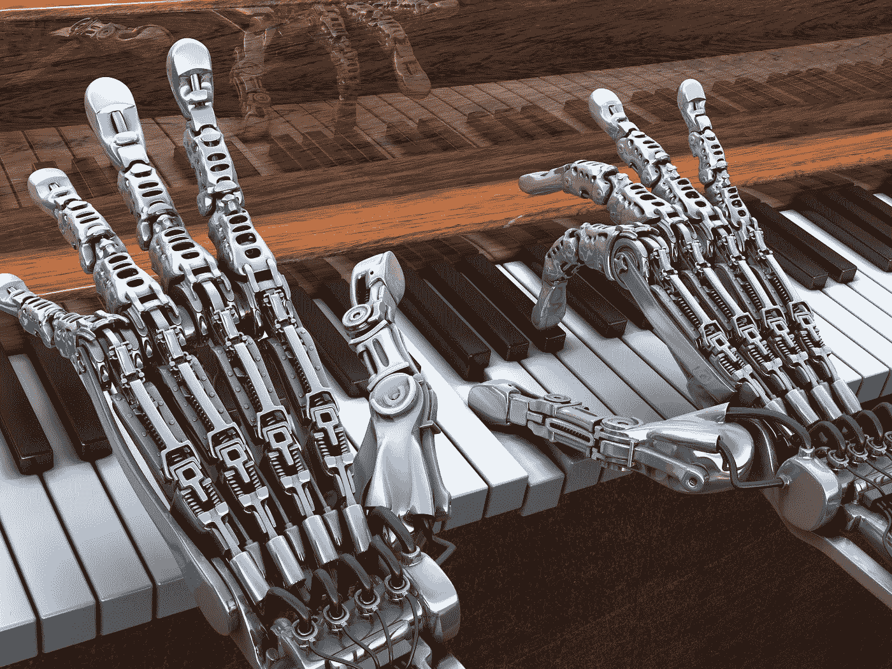

# 人工智能:一个更美好世界的催化剂…伴随着美妙的音乐

> 原文：<https://towardsdatascience.com/artificial-intelligence-a-catalyst-for-a-better-world-with-great-music-bebcbbe48646?source=collection_archive---------2----------------------->

> “我对此有很强烈的意见。我很乐观。我认为那些唱反调并试图鼓吹这些世界末日情景的人——我只是，我不明白。这真的是消极的，在某些方面，我实际上认为这是非常不负责任的。”——马克·扎克伯格(Mark Zuckerberg)在被问及对人工智能的看法以及它将如何影响世界时的回应。

**你认为人工智能**将会极大地改善我们的社会，还是你认为这项技术在未来会带来极大的危险？

科技巨头埃隆·马斯克(Elon Musk)和马克·扎克伯格(Mark Zuckerberg)最近一直在公开辩论这个问题，马斯克声称扎克伯格关于人工智能的知识“有限”。这位特斯拉首席执行官和直言不讳的创新者一直在推动对人工智能的积极监管，因为他认为该技术是“人类文明的根本生存风险”。另一方面，扎克伯格谴责了马斯克的警告，称他的声明“非常不负责任”。

尽管许多学者，如密歇根大学研究机器学习的教授佩德罗·多明戈斯(Pedro Domingos)，认为马斯克的噩梦场景最终可能会发生，但他的观点完全错误。总体而言，专家们似乎同意，最聪明的方法是关注当前的人工智能挑战，这将导致开发必要的监管架构，以防止未来出现不可预测和破坏性的人工智能场景。

人工智能有可能在短期内极大地改善我们的世界，从大量减少道路上的致命事故到以多种令人难以置信的方式扩大媒体和娱乐的艺术可能性范围。可以说，当科技亿万富翁们正在辩论他们关于人工智能对人类的威胁的存在差异时，我们其他人正在为该行业研究更谦逊的现实生活用途，以改善当前和未来的世界。

音乐产业已经在考虑人工智能的奇妙应用，例如计算机可以学习为电影、电视和游戏产业制作音乐。此外，尽管有人担心这对人类作曲家的影响，但人工智能最终可以用来补充这些作曲家的工作，让他们专注于更大的画面，而计算机则创建基本的音乐结构。一个很好的例子是受欢迎的 YouTube 艺术家塔瑞安·扫森，她与 Amper Music 和其他几个人工智能音乐服务合作，发布了她的专辑的第一首歌《Break Free》。当艺术家/作曲家创作歌词和旋律时，人工智能开发了和声、和弦和序列。Southern 并没有感到来自她新的作曲伙伴的威胁，她解释说，她仍然拥有自己的愿景，而 AI“使她比以往任何时候都更有创造力。”

这只是一系列激动人心的进展之一。音乐行业成功整合人工智能的另一个优秀例子来自谷歌研究人员道格拉斯·埃克(Douglas Eck)，他正与他的团队合作，通过分析数百个音符来教授神经网络学习乐器的音乐特征。一旦机器随后创建了特定乐器的数学表示，用户就可以简单地在屏幕上移动按钮来组合声音，从而创建一个全新的虚拟乐器，例如 74%是长号，26%是吉他。或者，仪器的任何其他组合。可能性真的是无穷无尽的，值得在人工智能的世界中强调这些令人兴奋且无威胁的创新。

随着越来越多的企业竞相将自己的软件升级，这一领域正在迅速扩大。这些公司包括英国的 [Jukedeck](https://www.jukedeck.com/) 和 [Amper Music](https://www.ampermusic.com/) ，三藩市的 [Humtap](https://www.humtap.com/) ，柏林的 [Melodrive](http://melodrive.com/) ， [Groov。AI](http://groov.ai/) 在加州山景城，索尼的计算机科学实验室(CSL)在巴黎进行一个名为 [Flow Machines](http://www.flow-machines.com/) 的项目。

人工智能在音乐生态系统中的应用不仅仅是翻唱、声音生成和歌曲创作。除了人工智能在创造性努力中日益增长的重要性，它还是在客户体验和与音乐粉丝的联系方面取得成功的主要关键之一。

人工智能已经被用于音乐行业，以改善消费者体验，例如根据情绪创建播放列表。虽然 [Gracenote](http://www.gracenote.com/) 多年来一直按照这一标准对音乐进行分类，但其员工并没有听完公司数据库中 1 亿首歌曲中的每一首来实现这一目标。相反，机器学习和人工智能已经被用来成功地教会计算机如何胜任地检测音乐中的情感，从而节省了大量的时间和人力资源。

从人工智能聊天机器人和智能语音界面到有效利用大数据，并通过有针对性的广告和高度个性化的歌曲推荐服务创造额外的收入流，人工智能在音乐行业的合作潜力巨大，仍有待实现。

人工智能的发展应该着眼于增强人类的能力，把我们从许多任务中解放出来，而不是完全取代人。与其试图通过辩论世界末日的长期可能性来减缓进步，不如用人工智能来解决当前的问题，让创新者在机器学习的帮助下推动信封走向更美好的世界，同时专注于为我们所有人创造最有成就、最强大和最安全的社会。

*由* [*谢尔盖·布多夫*](https://www.linkedin.com/in/sbludov/) *媒体与娱乐高级副总裁* [*数据艺术*](https://www.dataart.com/industry/media-and-entertainment?utm_source=towardsdatascience.com&utm_medium=referral&utm_campaign=m-regular&utm_content=da-sbludov-aicatalyst)