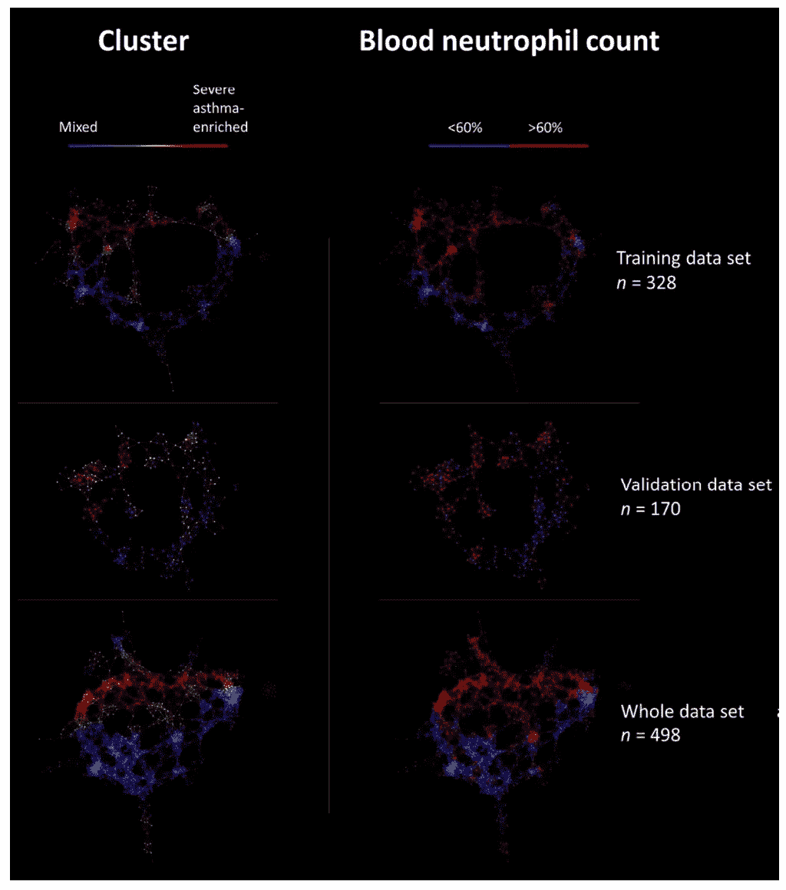
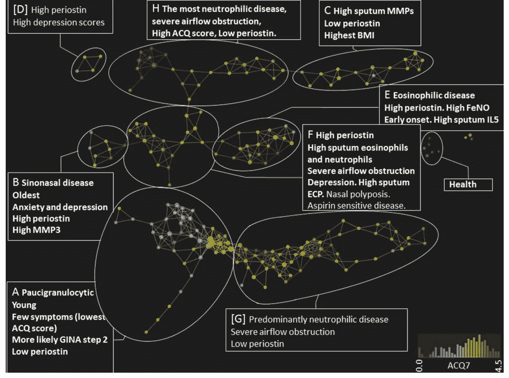

# 人工智能帮助医学研究人员发现严重哮喘的基因特征

> 原文：<https://towardsdatascience.com/artificial-intelligence-aids-medical-researchers-in-uncovering-genetic-signature-for-severe-asthma-f8125b926915?source=collection_archive---------7----------------------->

一个欧洲医学研究联盟使用一种人工智能形式发现了一个 1693 年的基因签名，以有意义地区分严重哮喘和非哮喘以及轻中度哮喘。通过对哮喘人群进行细分，研究人员希望为对治疗有反应的患者开发有针对性的治疗方法。这种疗法在治疗只涉及少量基因的疾病方面一直很有效。开发针对哮喘等涉及成百上千个基因的疾病的靶向药物更具挑战性。

这项研究发表在《美国呼吸重症监护医学杂志》上，包括 11 个欧洲国家 16 个地点的 610 名患者。这项研究由 U-BIOPRED(呼吸疾病结果预测中的无偏生物标志物)进行，这是一个研究项目，使用来自成人和儿童的信息和样本来了解更多关于不同类型哮喘的信息，以确保每个人都能获得更好的诊断和治疗。

哮喘影响着全球 1 . 5 亿至 3 亿人，其发病率还在上升。根据 T2 疾病控制中心的数据，每五个家庭中就有一个人患有哮喘。在美国，哮喘影响近 1900 万人，每年花费超过 600 亿美元，每个哮喘患者的医疗费用超过 3000 美元。

哮喘是一种慢性气道疾病的集体临床定义，其中炎症是潜在的病理生物学过程，但该过程的全部复杂性在分子水平上定义不清。还认识到哮喘不是单一疾病，而是包含几种表型的疾病。在过去的几年里，Ayasdi 与 U-BIOPRED 和南安普顿大学的研究人员合作，将机器智能应用于从 3 项大型研究中收集的数据，这些研究涉及哮喘患者和匹配的控制对象。从参与者处收集了几种生物流体，并应用多种研究方法来描述肺部和体循环内的复杂病理生物学。这些数据与用于定义疾病严重程度的标准临床结果相结合。

“成功开发针对哮喘等异质性疾病的有效精确治疗将需要新的强大统计模型，使研究人员能够过滤噪音，专注于患者群体之间有意义的差异。Ayasdi 实现了一种无偏见的方法来识别哮喘中复杂疾病的表型特征，此外，还为我们提供了一种无与伦比的能力来识别与这些表型相关的特征，从而为进一步探索创造了新的科学问题"[英国南安普顿大学医学院医学教授兼 NIHR 呼吸生物医学研究中心主任 Ratko Djukanovic](http://www.southampton.ac.uk/medicine/about/staff/rd1.page) 博士说。“Ayasdi 是拼凑这种基因特征的无价工具，”[Paul Skipp](http://www.southampton.ac.uk/biosci/about/staff/pjss.page)博士，这项研究的另一位首席研究员。

U-BIOPRED 的研究使用 Ayasdi 机器智能平台，结合传统的统计方法，在疾病的整个基因组上直观地绘制出患者群，并发现 1693 个基因的表达在严重哮喘患者和没有哮喘的患者之间存在明显差异。非哮喘患者和轻至中度哮喘患者之间的差异较小。这项研究为严重哮喘患者血液中的差异基因表达提供了令人信服的证据。

此前，南安普顿大学的研究人员使用 Ayasdi 进行无偏见的患者分层，从而改善了患者分类和预测模型。南安普顿利用 Ayasdi 的工作已经持续了几年，从合作中产生的见解将被用于造福科学、医学和患者。

哮喘中存在相当多的疾病异质性，这仍然是当前研究的热点。然而，许多试图定义内型的研究受到复制队列中缺乏可靠的统计学验证的限制，或者产生了其身份主要由临床参数支配的聚类，而没有给出对潜在病理生理学的重要见解。在之前发表在[过敏杂志&临床免疫学](http://www.jacionline.org/article/S0091-6749%2815%2903117-6/pdf) (JACI)的两项研究之一中，在两个不同的队列(194 名哮喘受试者和 21 名对照组)中，Ayasdi 确定了六个疾病群，这些疾病群由血液和诱导痰中的临床测量和病理学测量共同定义。Ayasdi 发现了临床测量和潜在炎症测量之间的脱节。

“这清楚地展示了我们作为临床医生在我们的严重哮喘诊所看到的不同哮喘组，并将有助于为未来的临床试验确定亚组，”Timothy Hinks 博士说[Timothy Hinks](http://www.southampton.ac.uk/medicine/about/staff/th1c06.page)，他是墨尔本大学多尔蒂研究所的惠康信托博士后研究员，是一名医生，也是南安普顿大学前两项研究的第一作者。这项研究由医学研究委员会和 Wellcome Trust 资助，利用了在以前的研究中试行的新方法和分析方法，但通过使用更大的样本量和使用地理上不同的推导和验证队列来扩展观察结果，以实现稳健的统计验证。此外，目前的研究证实了以前工作中确定的群集的性质，同时提供了对潜在病理生物学的额外见解。

在 [JACI](http://www.jacionline.org/article/S0091-6749%2815%2900104-9/pdf) 发表的另一项先前研究(60 名患者和 24 名对照)中，Ayasdi 被成功用于确定六个对哮喘靶向治疗发展至关重要的患者亚群体，其中两个是重度哮喘患者，尽管他们在是否存在对常见空气过敏原(如屋尘螨)的过敏反应方面存在临床差异，但在肥大细胞活化方面相似。这表明肥大细胞在各种形式的严重哮喘中起着重要作用，这是以前没有意识到的，这对于开发可以靶向这种共同机制的新药具有重要意义。

Timothy Hinks 博士说:“由于哮喘是一种病理学差异很大的疾病，并且仍然没有得到很好的理解，因此使用 Ayasdi 平台驱动无人监管的多维查询的能力对于加快我们的研究是不可或缺的。“这一进展使得我们的团队在生成关于数据的假设时不那么有偏见。这有助于我们专注于推动数据驱动的假设，从而节省时间，并使我们的工作适用于所有治疗哮喘和类似病理多样疾病的医护人员。使用 Ayasdi，以适当的分辨率生成一个网络，只需几个小时就能获得重要的见解。统计分析可以通过内置函数从 Ayasdi 中快速提取出来。因此，Ayasdi 既可用于快速浏览数据，也可如本文所述，用作决定性的分析框架。”

“几年前，我们开始与 Ayasdi 合作，结果非常显著。事实上，Ayasdi 非常易于使用，并允许以灵活的方式分析大型和非常复杂的数据，这使它成为我们的理想选择。现在，Ayasdi 已经可供联盟的主要成员使用，我期待着更多的突破，对欧洲和其他地区的严重哮喘患者产生直接和积极的影响。”Ratko Djukanovic 博士，南安普敦大学医学院医学教授，联合王国南安普敦 NIHR 呼吸生物医学研究所所长

这三项研究结合在一起，帮助研究人员开始建立严重哮喘患者的临床和基因组图谱。未来的研究可能有助于确定治疗这种复杂疾病的实验药物靶点。

要成为合作者，请发电子邮件给我们，姓名为[collaborations@ayasdi.com](mailto:collaborations@aysadi.com)。